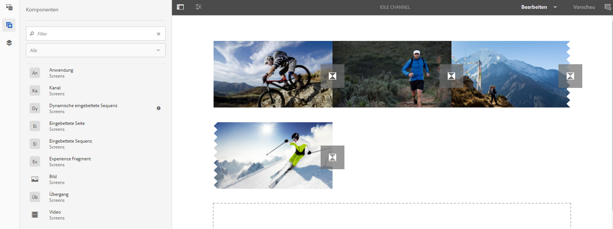
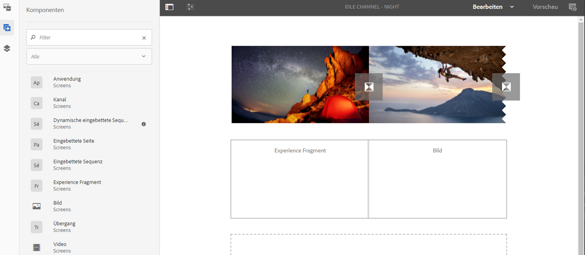

# Hinzufügen von Komponenten zu Kanälen{#adding-components-to-a-channel}

Komponenten sind die grundlegenden Elemente des AEM (Adobe Experience Manager)-Erlebnisses. Sie können mehrere Komponenten verwenden und sie Ihrem Kanal in einem AEM Screens-Projekt hinzufügen.

## Komponenten in AEM Screens {#components-in-aem-screens}

AEM Screens bietet verschiedene AEM-Komponenten, die sich in Screens-Projekten verwenden lassen.

### Anzeigen von AEM Screens-Komponenten {#viewing-aem-screens-components}

Jedes Mal, wenn Sie ein AEM Screens-Projekt erstellen, wird eine Liste der Standardkomponenten angezeigt, die zum Projekt hinzugefügt werden können.

Gehen Sie wie folgt vor, um die Standardkomponenten für Ihr Screens-Projekt anzuzeigen:

1. Klicken Sie auf den Kanal. Beispiel: **`We.Retail In Store`** > **Kanäle** > **Idle Channel**.

1. Klicks **Bearbeiten** in der Aktionsleiste aus.
1. Klicken Sie im AEM-Editor auf die **+** in der Seitenleiste.
1. Alle Komponenten, die standardmäßig in einem AEM Screens-Projekt enthalten sind, werden wie in der folgenden Abbildung dargestellt angezeigt.

### Hinzufügen neuer Komponenten {#adding-a-new-component}

AEM bietet mehrere weitere Komponenten. Sie können Ihrem Projekt jederzeit weitere (nicht standardmäßig enthaltene) Komponenten hinzufügen, sofern diese mit AEM Screens kompatibel sind.

Das folgende Beispiel zeigt das Hinzufügen einer Livefyre-Komponente zu einem AEM Screens-Projekt:

1. Klicken Sie auf den Kanal, dem Sie eine Komponente hinzufügen möchten. Beispiel: **`We.Retail In Store`** > **Kanäle** > **Idle Channel**.

1. Klicks **Bearbeiten** in der Aktionsleiste aus.
1. Klicks **Design** -Modus.
1. Klicken Sie auf der rechten Seite auf den gesamten Design-Editor und klicken Sie auf das Einstellungssymbol, damit Sie den **Parsys Design** Dialogfeld.
1. Sie können auf die Komponenten klicken, die Sie in Ihr AEM Screens-Projekt importieren möchten. Im folgenden Beispiel sehen Sie, wie einem AEM Screens-Projekt eine **Livefyre**-Komponente hinzugefügt wird.

>[!NOTE]
>
>Auf die gleiche Weise können Sie dem Projekt eine beliebige Anzahl anderer neuer Komponenten hinzufügen, die mit AEM Screens kompatibel sind.

## Grundlegendes zu AEM Screens-Komponenten {#understanding-aem-screen-components}

Im folgenden Abschnitt werden die AEM Screens-Komponenten beschrieben, die Sie für Projekte nutzen können.

>[!NOTE]
>
>Um die Eigenschaften einer Komponente anzuzeigen, klicken Sie auf die Komponente und dann auf das Hammersymbol, um Eigenschaften zu öffnen/anzuzeigen.

### Programm {#application}

Die **Anwendung** -Komponente können Sie Ihrem Kanal eine Anwendung hinzufügen.

Die Anwendungskomponente verfügt über die folgenden Eigenschaften:

| **Eigenschaft** | **Beschreibung** |
|---|---|
| ***Anwendungspfad*** | Klicken Sie auf den absoluten Pfad, in dem die Anwendung vorhanden ist. |
| ***Dauer (Millisekunden)*** | Klicken Sie auf die Dauer der Anwendung. Standardmäßig ist die Dauer auf den Wert „-1“ eingestellt. Dies bedeutet, dass das Element auf unbestimmte Zeit ausgeführt wird (bei einer Single Page Application). Wird unter „Dauer“ ein Wert über 0 festgelegt, wird das Element für die angegebene Dauer angezeigt. Anschließend wird zum nächsten Element gewechselt. |

Im folgenden Beispiel sehen Sie, wie die Komponente „Anwendung“ hinzugefügt wird, einschließlich einer Vorschau ihrer Eigenschaften:

>[!NOTE]
>
>Im obigen Beispiel sehen Sie, wie Sie die Eigenschaften der einzelnen Komponenten unten anzeigen können.

### Kanal {#channel}

Die **Kanal** -Komponente können Sie Ihrem Projekt einen ganzen Kanal hinzufügen.

Die Komponente Kanal verfügt über die folgenden Eigenschaften:

<table>
 <tbody>
  <tr>
   <td><strong>Eigenschaft</strong></td>
   <td><strong>Beschreibung</strong></td>
  </tr>
  <tr>
   <td><strong><em>Kanalpfad</em></strong></td>
   <td>Damit wird der absolute Pfad zur Anwendung festgelegt.  </td>
  </tr>
  <tr>
   <td><strong><em>Dauer (Millisekunden)</em></strong></td>
   <td>Damit wird die Gesamtdauer des Kanals festgelegt. Wird unter "Dauer"ein Wert von "-1"eingestellt, bedeutet dies, dass der eingebettete Kanal in einem bestimmten Kanal seine gesamte Länge ausführt.</td>
  </tr>
 </tbody>
</table>

### Eingebettete Seite {#embedded-page}

Ein **Eingebettete Seite** können Sie Ihrem Projekt eine eingebettete Seite hinzufügen. Beispiel: eine Webanwendung oder einen Produktkatalog.

Die Komponente „Eingebettete Seite“ verfügt über die folgenden Eigenschaften:

<table>
 <tbody>
  <tr>
   <td><strong>Eigenschaft</strong></td>
   <td><strong>Beschreibung</strong></td>
  </tr>
  <tr>
   <td><strong><em>Seitenpfad  </em></strong></td>
   <td>Damit wird der absolute Pfad zum Kanal festgelegt.  </td>
  </tr>
  <tr>
   <td><strong><em>Dauer (Millisekunden)</em></strong></td>
   <td>Damit wird die Gesamtdauer des Kanals festgelegt. Wird unter "Dauer"ein Wert von "-1"eingestellt, bedeutet dies, dass der eingebettete Kanal in einem bestimmten Kanal seine gesamte Länge ausführt.</td>
  </tr>
 </tbody>
</table>

### Eingebettete Sequenz {#embedded-sequence}

>[!NOTE]
>
>Ausführliche Informationen zu eingebetteten Sequenzen finden Sie unter [Eingebettete Sequenzen](embedded-sequences.md) unter &quot;Authoring Screens&quot;.

Mit einer eingebetteten Sequenz können Sie einen eingebetteten Sequenzkanal in Ihren vorhandenen Kanal hinzufügen (mit anderen Assets).

Die eingebettete Sequenz verfügt über die folgenden Seiteneigenschaften:

<table>
 <tbody>
  <tr>
   <td><strong>Eigenschaft</strong></td>
   <td><strong>Beschreibung</strong></td>
  </tr>
  <tr>
   <td>Kanalpfad</td>
   <td>Wählen Sie den absoluten Pfad der Sequenz aus, die Sie in Ihren Kanal aufnehmen möchten.  </td>
  </tr>
  <tr>
   <td><strong><em>Dauer (Millisekunden)</em></strong></td>
   <td>Damit wird die Gesamtdauer des Kanals festgelegt. Wird unter "Dauer"ein Wert von "-1"eingestellt, bedeutet dies, dass der eingebettete Kanal in einem bestimmten Kanal seine gesamte Länge ausführt.</td>
  </tr>
  <tr>
   <td><strong><em>Strategie</em></strong></td>
   <td>Für diese Eigenschaft kann <strong>original</strong> oder <strong>einzeln</strong> festgelegt werden. Festlegen des Werts auf <strong>original</strong> bedeutet, dass die Teilsequenz bei jedem Zyklus der übergeordneten Sequenz vollständig ausgeführt wird. Der andere mögliche Wert lautet <strong>single</strong>. Dieser Wert zeigt nur ein Element der Teilsequenz bei jeder Ausführung an. Beispielsweise das erste Element bei der ersten Schleife und das zweite Element bei der zweiten Schleife.</td>
  </tr>
 </tbody>
</table>

### Dynamische eingebettete Sequenz {#dynamic-embedded-sequence}

Mit einer dynamischen eingebetteten Sequenz können Sie eine Sequenz hinzufügen, die der oben genannten ähnelt, außer nach Kanalrolle.

Weitere Informationen zu eingebetteten Sequenzen finden Sie unter [Eingebettete Sequenzen](embedded-sequences.md) unter &quot;Authoring Screens&quot;.

Die Komponente „Dynamische eingebettete Sequenz“ verfügt über die folgenden Eigenschaften:

<table>
 <tbody>
  <tr>
   <td><strong>Eigenschaft</strong></td>
   <td><strong>Beschreibung</strong></td>
  </tr>
  <tr>
   <td><strong><em>Kanalzuordnungsrolle</em></strong>  </td>
   <td>Geben Sie die Kanalrolle an.  </td>
  </tr>
  <tr>
   <td><strong><em>Dauer (Millisekunden)</em></strong></td>
   <td>Damit wird die Gesamtdauer des Kanals festgelegt. Wird unter "Dauer"ein Wert von "-1"eingestellt, bedeutet dies, dass der eingebettete Kanal in einem bestimmten Kanal seine gesamte Länge ausführt.</td>
  </tr>
  <tr>
   <td><strong><em>Strategie</em></strong></td>
   <td>Für diese Eigenschaft kann <strong>original</strong> oder <strong>einzeln</strong> festgelegt werden. Festlegen des Werts auf <strong>original</strong> bedeutet, dass die Teilsequenz bei jedem Zyklus der übergeordneten Sequenz vollständig ausgeführt wird. Der andere mögliche Wert lautet <strong>single</strong>. Dieser Wert zeigt nur ein Element der Teilsequenz bei jeder Ausführung an. Beispielsweise das erste Element bei der ersten Schleife und das zweite Element bei der zweiten Schleife.</td>
  </tr>
 </tbody>
</table>

### Experience Fragment {#experience-fragment}

Mit einem Experience Fragment können Sie Ihrem AEM Screens-Kanal ein Experience Fragment hinzufügen (eine Gruppe aus einer oder mehreren Komponenten, einschließlich Inhalt und Layout, auf die innerhalb von Seiten verwiesen werden kann). Ziehen Sie die Komponente in den AEM Editor und klicken Sie auf das Experience Fragment.

Weitere Informationen zum Erstellen eines Experience Fragments und dessen Anwendung auf ein AEM Screens-Projekt finden Sie unter [Verwenden von Experience Fragments](experience-fragments-in-screens.md).

| **Eigenschaft** | **Beschreibung** |
|---|---|
| **Experience Fragment** |
| ***Experience Fragment*** | Wählen Sie das Experience Fragment aus. |
| ***Dauer*** | Wählen Sie die gesamte Dauer des Experience Fragment aus, das im Kanal wiedergegeben wird. |
| **Offline-Konfiguration** |
| ***Client-seitige Bibliotheken*** | JavaScript- und CSS-Dateien. |
| ***Statische Dateien*** | Statische Dateien, die Sie als Offline-Konfigurationen zu Ihrem Experience Fragment hinzufügen können. |

>[!NOTE]
>
>Die **Client-seitige Bibliotheken** und **Statische Dateien** die Sie aus dieser Komponente hinzufügen, zusätzlich zu bereits konfigurierten **Client-seitige Bibliotheken** und die statischen Dateien, die aus dem Experience Fragment hinzugefügt werden **Eigenschaften**.

### Bild {#image}

Mit einem Bild können Sie ein Bild zu Ihrem Kanal hinzufügen.

Das Bild-Asset besitzt die drei Registerkarten **Bild**, **Erreichbarkeit** und **Sequenz**:

| **Eigenschaft** | **Beschreibung** |
|---|---|
| **Bild** |
| ***Bild-Asset*** | Klicken Sie auf das Bild-Asset. |
| ***Titel*** | Hierbei handelt es sich um den Titel des Bildes. |
| ***Verknüpfung zu*** | Damit wird dem Bild ein Link hinzugefügt. |
| ***Beschreibung*** | Hierbei handelt es sich um eine kurze Beschreibung des Bildes. |
| ***Größe*** | Größe des Bildes. |
| **Erreichbarkeit** |
| ***Alternativtext*** | Alternativer Text zum Bild. |
| **Sequenz** |
| ***Dauer*** | Standardmäßig ist die Dauer auf *8000 Millisekunden*. Wenn Sie die Wiedergabedauer des Bildes ändern möchten, aktualisieren Sie das Feld **Dauer**. |

### Übergang {#transition}

Mit der Übergangskomponente können Sie Ihrem Screens-Projekt eine Transition hinzufügen.

Die folgende Abbildung veranschaulicht die (per Drag-and-Drop hinzugefügte) Übergangskomponente im Editor.

Klicken Sie auf das Übergangssymbol und anschließend auf die Schaltfläche **Konfigurieren** (Schraubenschlüsselsymbol), um die **Übergang** Dialogfeld. Dieses Dialogfeld enthält drei Registerkarten:

* **Übergang**
* **Sequenz**
* **Aktivierung**

>[!NOTE]
>
>Standardmäßig ist die Sequenz auf 600 Millisekunden festgelegt. Sie können die Übergangssequenz mithilfe der **Sequenz** Registerkarte.

Die Komponente „Übergang“ verfügt über die folgenden Eigenschaften:

<table>
 <tbody>
  <tr>
   <td><strong>Eigenschaft</strong></td>
   <td><strong>Beschreibung</strong></td>
  </tr>
  <tr>
   <td><strong>Übergang</strong></td>
   <td></td>
  </tr>
  <tr>
   <td><strong><em>Typ</em></strong></td>
   <td>
Hierbei handelt es sich um den Typ des Übergangs zwischen zwei aufeinanderfolgenden Elementen. Der <strong>Typ</strong> des Übergangs umfasst die folgenden Optionen:

    <ul>
     <li><strong>Normal</strong></li>
     <li><strong>Überblendung</strong></li>
     <li><strong>Von rechts einfügen</strong></li>
     <li><strong>Von links einfügen</strong></li>
     <li><strong>Von oben einfügen</strong></li>
     <li><strong>Von unten einfügen</strong></li>
    </ul> </td>
  </tr>
  <tr>
   <td><strong>Sequenz</strong></td>
   <td></td>
  </tr>
  <tr>
   <td><strong><em>Dauer</em></strong></td>
   <td>Damit wird die Gesamtdauer des Übergangs festgelegt. Standardmäßig ist er auf 600 Millisekunden festgelegt.</td>
  </tr>
  <tr>
   <td><strong>Aktivierung</strong></td>
   <td></td>
  </tr>
  <tr>
   <td><strong><em>Aktiv ab</em></strong></td>
   <td>Zeitstempel, der beschreibt, ab wann der Übergang aktiv sein kann.  </td>
  </tr>
  <tr>
   <td><strong><em>Aktiv bis</em></strong></td>
   <td>Zeitstempel, der beschreibt, bis wann der Übergang aktiv sein kann.</td>
  </tr>
  <tr>
   <td><strong><em>Zeitplan</em></strong></td>
   <td>Fügen Sie einen vordefinierten Zeitplan hinzu.</td>
  </tr>
 </tbody>
</table>

### Video {#video}

Mit der Komponente &quot;Video&quot;können Sie Ihrem Screens-Projekt ein Video hinzufügen.

Die Videokomponente verfügt über die folgenden Eigenschaften:

<table>
 <tbody>
  <tr>
   <td><strong>Eigenschaft</strong></td>
   <td><strong>Beschreibung</strong></td>
  </tr>
  <tr>
   <td><em><strong>Video-Asset</strong></em></td>
   <td>Klicken Sie auf den Link zum Video.</td>
  </tr>
  <tr>
   <td><em><strong>Dauer</strong></em></td>
   <td>Damit wird die Dauer des Videos festgelegt. Standardmäßig ist unter „Dauer“ ein Wert von „-1“ eingestellt. Dies bedeutet, dass das Element auf unbestimmte Zeit ausgeführt wird. Wird unter „Dauer“ ein Wert über 0 festgelegt, wird das Element für die angegebene Dauer angezeigt. Anschließend wird zum nächsten Element gewechselt.  </td>
  </tr>
  <tr>
   <td><em><strong>Rendering</strong></em></td>
   <td>
Wenn das Video-Seitenverhältnis nicht auf den Bildschirm passt, können Sie das Rendering auf Folgendes einstellen: <strong>contain</strong> oder <strong>cover</strong>.
 
<em>Contain</em> bedeutet, dass das vollständige Video angezeigt und die fehlenden Bereiche mit einem schwarzen Rahmen aufgefüllt werden.
 
<em>Abdeckung</em> bedeutet, dass das Video den gesamten Viewport abdeckt, aber einige Teile, die an den Seiten überlaufen werden, ausgeblendet sind.
 </td>
  </tr>
  <tr>
   <td><em><strong>Größe</strong></em></td>
   <td>Hierbei handelt es sich um die Größe des Videos.</td>
  </tr>
 </tbody>
</table>
