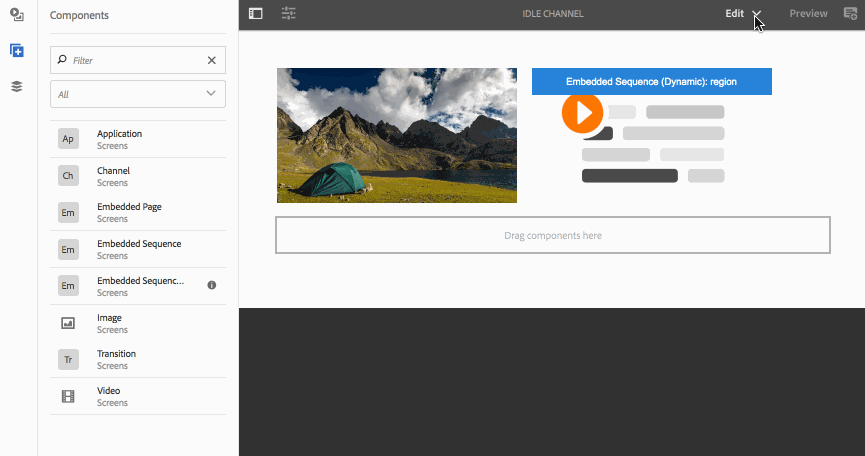

# Hinzufügen von Komponenten zu Kanälen{#adding-components-to-a-channel}

Komponenten sind die grundlegenden Elemente des AEM (Adobe Experience Manager)-Erlebnisses. Sie können mehrere Komponenten verwenden und sie zu Ihrem Kanal in einem AEM Screens-Projekt hinzufügen.

## Komponenten in AEM Screens {#components-in-aem-screens}

AEM Screens bietet verschiedene AEM-Komponenten, die sich in Screens-Projekten verwenden lassen.

### Anzeigen von AEM Screens-Komponenten {#viewing-aem-screens-components}

Jedes Mal, wenn Sie ein AEM Screens-Projekt erstellen, wird eine Liste von Standardkomponenten angezeigt, die dem Projekt hinzugefügt werden können.

Gehen Sie wie folgt vor, um die Standardkomponenten für Ihr Screens-Projekt anzuzeigen:

1. Wählen Sie den Kanal aus. Beispiel: **`We.Retail In Store`** > **Kanäle** > **Leerweg**.

1. Auswählen **Bearbeiten** in der Aktionsleiste aus.
1. Wählen Sie im AEM-Editor **+** Symbol in der Seitenleiste.
1. Alle Komponenten, die standardmäßig in einem AEM Screens-Projekt enthalten sind, werden angezeigt, wie in der folgenden Abbildung dargestellt.

### Hinzufügen neuer Komponenten {#adding-a-new-component}

AEM bietet mehrere weitere Komponenten. Sie können jederzeit weitere (standardmäßig nicht enthaltene) Komponenten zu Ihrem Projekt hinzufügen, sofern diese mit AEM Screens kompatibel sind.

Das folgende Beispiel zeigt das Hinzufügen einer Livefyre-Komponente zu einem AEM Screens-Projekt:

1. Wählen Sie den Kanal aus, dem Sie eine Komponente hinzufügen möchten. Beispiel: **`We.Retail In Store`** > **Kanäle** > **Leerweg**.

1. Auswählen **Bearbeiten** in der Aktionsleiste aus.
1. Wählen Sie den Modus **Design** aus.
1. Wählen Sie auf der rechten Seite den gesamten Design-Editor aus und klicken Sie auf das Einstellungssymbol, um den Editor zu öffnen. **Parsys-Design** Dialogfeld.
1. Sie können die Komponenten auswählen, die Sie in Ihr AEM Screens-Projekt importieren möchten. Im folgenden Beispiel sehen Sie, wie einem AEM Screens-Projekt eine **Livefyre**-Komponente hinzugefügt wird.

>[!NOTE]
>
>Auf die gleiche Weise können Sie dem Projekt eine beliebige Anzahl anderer neuer Komponenten hinzufügen, die mit AEM Screens kompatibel sind.

## Grundlegendes zu AEM Screens-Komponenten {#understanding-aem-screen-components}

Im folgenden Abschnitt werden die AEM Screens-Komponenten beschrieben, die Sie für Projekte nutzen können.

>[!NOTE]
>
>Um die Eigenschaften einer beliebigen Komponente anzuzeigen, wählen Sie die Komponente aus und klicken Sie auf das Hammersymbol, um die Eigenschaften zu öffnen bzw. anzuzeigen.

### Programm {#application}

Die **Anwendung** Mit der Komponente können Sie eine Anwendung zu Ihrem Kanal hinzufügen.

Die Anwendungskomponente hat die folgenden Eigenschaften:

| **Eigenschaft** | **Beschreibung** |
|---|---|
| ***Anwendungspfad*** | Damit wird der absolute Pfad zur Anwendung festgelegt. |
| ***Dauer (Millisekunden)*** | Damit wird die Dauer der Anwendung festgelegt. Standardmäßig ist die Dauer auf den Wert „-1“ eingestellt. Dies bedeutet, dass das Element auf unbestimmte Zeit ausgeführt wird (bei einer Single Page Application). Wird unter „Dauer“ ein Wert über 0 festgelegt, wird das Element für die angegebene Dauer angezeigt. Anschließend wird zum nächsten Element gewechselt. |

Im folgenden Beispiel sehen Sie, wie die Komponente „Anwendung“ hinzugefügt wird, einschließlich einer Vorschau ihrer Eigenschaften:

>[!NOTE]
>
>Im Beispiel oben sehen Sie, wie Eigenschaften aller nachfolgenden Komponenten aufgerufen werden können.

### Kanal {#channel}

Die **Kanal** Mit der Komponente können Sie dem Projekt einen gesamten Kanal hinzufügen.

Die Kanal-Komponente hat die folgenden Eigenschaften:

<table>
 <tbody>
  <tr>
   <td><strong>Eigenschaft</strong></td>
   <td><strong>Beschreibung</strong></td>
  </tr>
  <tr>
   <td><strong><em>Kanalpfad</em></strong></td>
   <td>Damit wird der absolute Pfad zur Anwendung festgelegt.  </td>
  </tr>
  <tr>
   <td><strong><em>Dauer (Millisekunden)</em></strong></td>
   <td>Damit wird die Gesamtdauer des Kanals festgelegt. Wenn Sie die Dauer auf -1 setzen, wird angegeben, dass der eingebettete Kanal in einem bestimmten Kanal seine volle Länge ausführt.</td>
  </tr>
 </tbody>
</table>

### Eingebettete Seite {#embedded-page}

und **Eingebettete Seite** Ermöglicht das Hinzufügen einer eingebetteten Seite zu einem Projekt. Beispiel: eine Webanwendung oder einen Produktkatalog.

Die Komponente „Eingebettete Seite“ verfügt über die folgenden Eigenschaften:

<table>
 <tbody>
  <tr>
   <td><strong>Eigenschaft</strong></td>
   <td><strong>Beschreibung</strong></td>
  </tr>
  <tr>
   <td><strong><em>Seitenpfad  </em></strong></td>
   <td>Damit wird der absolute Pfad zum Kanal festgelegt.  </td>
  </tr>
  <tr>
   <td><strong><em>Dauer (Millisekunden)</em></strong></td>
   <td>Damit wird die Gesamtdauer des Kanals festgelegt. Wenn Sie die Dauer auf -1 setzen, wird angegeben, dass der eingebettete Kanal in einem bestimmten Kanal seine volle Länge ausführt.</td>
  </tr>
 </tbody>
</table>

### Eingebettete Sequenz {#embedded-sequence}

>[!NOTE]
>
>Ausführliche Informationen zu eingebetteten Sequenzen finden Sie unter [Eingebettete Sequenzen](embedded-sequences.md) im Abschnitt Authoring von Screens .

Mit einer eingebetteten Sequenz können Sie einen eingebetteten Sequenzkanal innerhalb Ihres vorhandenen Kanals (mit anderen Assets) hinzufügen.

Die eingebettete Sequenz weist die folgenden Seiteneigenschaften auf:

<table>
 <tbody>
  <tr>
   <td><strong>Eigenschaft</strong></td>
   <td><strong>Beschreibung</strong></td>
  </tr>
  <tr>
   <td>Kanalpfad</td>
   <td>Wählen Sie den absoluten Pfad der Sequenz aus, die Sie in Ihren Kanal aufnehmen möchten.  </td>
  </tr>
  <tr>
   <td><strong><em>Dauer (Millisekunden)</em></strong></td>
   <td>Damit wird die Gesamtdauer des Kanals festgelegt. Wenn Sie die Dauer auf -1 setzen, wird angegeben, dass der eingebettete Kanal in einem bestimmten Kanal seine volle Länge ausführt.</td>
  </tr>
  <tr>
   <td><strong><em>Strategie</em></strong></td>
   <td>Für diese Eigenschaft kann <strong>original</strong> oder <strong>einzeln</strong> festgelegt werden. Einstellung des Werts auf <strong>Original</strong> bedeutet, dass die Untersequenz vollständig auf jedem Zyklus der übergeordneten Sequenz ausgeführt wird. Der andere mögliche Wert ist <strong>ledig</strong>. Dieser Wert zeigt bei jedem Durchgang nur ein Element der Untersequenz an. Beispielsweise das erste Element in der ersten Schleife und das zweite Element in der zweiten Schleife.</td>
  </tr>
 </tbody>
</table>

### Dynamische eingebettete Sequenz {#dynamic-embedded-sequence}

Mit einer dynamischen eingebetteten Sequenz können Sie eine Sequenz hinzufügen, die der oben genannten ähnelt, außer nach Kanalrolle.

Weitere Informationen zu eingebetteten Sequenzen finden Sie unter [Eingebettete Sequenzen](embedded-sequences.md) im Abschnitt Authoring von Screens .

Die Komponente „Dynamische eingebettete Sequenz“ verfügt über die folgenden Eigenschaften:

<table>
 <tbody>
  <tr>
   <td><strong>Eigenschaft</strong></td>
   <td><strong>Beschreibung</strong></td>
  </tr>
  <tr>
   <td><strong><em>Kanalzuordnungsrolle</em></strong>  </td>
   <td>Geben Sie die Kanalrolle an.  </td>
  </tr>
  <tr>
   <td><strong><em>Dauer (Millisekunden)</em></strong></td>
   <td>Damit wird die Gesamtdauer des Kanals festgelegt. Wenn Sie die Dauer auf -1 setzen, wird angegeben, dass der eingebettete Kanal in einem bestimmten Kanal seine volle Länge ausführt.</td>
  </tr>
  <tr>
   <td><strong><em>Strategie</em></strong></td>
   <td>Für diese Eigenschaft kann <strong>original</strong> oder <strong>einzeln</strong> festgelegt werden. Einstellung des Werts auf <strong>Original</strong> bedeutet, dass die Untersequenz vollständig auf jedem Zyklus der übergeordneten Sequenz ausgeführt wird. Der andere mögliche Wert ist <strong>ledig</strong>. Ein solcher Wert würde bei jedem Durchgang nur ein Element der Untersequenz anzeigen. Beispielsweise das erste Element in der ersten Schleife und das zweite Element in der zweiten Schleife.</td>
  </tr>
 </tbody>
</table>

### Experience Fragment {#experience-fragment}

Mit einem Experience Fragment können Sie ein Experience Fragment (eine Gruppe aus einer oder mehreren Komponenten, einschließlich Inhalt und Layout, die innerhalb von Seiten referenziert werden können) zu Ihrem AEM Screens-Kanal hinzufügen. Ziehen Sie die Komponente per Drag-and-Drop in den AEM-Editor und wählen Sie das Experience Fragment aus.

Weitere Informationen zum Erstellen eines Experience Fragments und dessen Anwendung auf ein AEM Screens-Projekt finden Sie unter [Verwenden von Experience Fragments](experience-fragments-in-screens.md).

| **Eigenschaft** | **Beschreibung** |
|---|---|
| **Experience Fragment** |
| ***Experience Fragment*** | Wählen Sie das Experience Fragment aus. |
| ***Dauer*** | Wählen Sie die gesamte Dauer des Experience Fragments aus, das im Kanal wiedergegeben wird. |
| **Offline-Konfiguration** |
| ***Client-seitige Bibliotheken*** | JavaScript- und CSS-Dateien. |
| ***Statische Dateien*** | Statische Dateien, die Sie als Offline-Konfigurationen zu Ihrem Experience Fragment hinzufügen können. |

>[!NOTE]
>
>Die **Client-seitige Bibliotheken** und die **Statische Dateien** , die Sie aus dieser Komponente hinzufügen, sind zusätzlich zu bereits konfiguriert **Client-seitige Bibliotheken** und die statischen Dateien, die aus dem des Experience Fragments hinzugefügt werden **Eigenschaften**.

### Bild {#image}

Mit einem Bild können Sie ein Bild zu Ihrem Kanal hinzufügen.

Das Bild-Asset besitzt die drei Registerkarten **Bild**, **Erreichbarkeit** und **Sequenz**:

| **Eigenschaft** | **Beschreibung** |
|---|---|
| **Bild** |
| ***Bild-Asset*** | Damit wird das Bild-Asset festgelegt. |
| ***Titel*** | Hierbei handelt es sich um den Titel des Bildes. |
| ***Verknüpfung zu*** | Damit wird dem Bild ein Link hinzugefügt. |
| ***Beschreibung*** | Hierbei handelt es sich um eine kurze Beschreibung des Bildes. |
| ***Größe*** | Größe des Bildes. |
| **Erreichbarkeit** |
| ***Alternativtext*** | Alternativtext zum Bild. |
| **Sequenz** |
| ***Dauer*** | Standardmäßig ist die Dauer auf festgelegt. *8000 Millisekunden*. Wenn Sie die Wiedergabedauer des Bildes ändern möchten, aktualisieren Sie das Feld **Dauer**. |

### Übergang {#transition}

Mit der Transition-Komponente können Sie eine Transition zu Ihrem Screens-Projekt hinzufügen.

Die folgende Abbildung veranschaulicht die (per Drag-and-Drop hinzugefügte) Übergangskomponente im Editor.

Klicken Sie auf das Übergangssymbol und dann auf **Konfigurieren von** (Schraubenschlüsselsymbol) zum Öffnen des **Übergang** Dialogfeld. Dieses Dialogfeld enthält drei Registerkarten:

* **Übergang**
* **Sequenz**
* **Aktivierung**

>[!NOTE]
>
>Standardmäßig ist die Sequenz auf 600 Millisekunden festgelegt. Sie können die Übergangssequenz mithilfe der folgenden Optionen auf andere Werte aktualisieren **Ablauf** Tabulator.

Die Komponente „Übergang“ verfügt über die folgenden Eigenschaften:

<table>
 <tbody>
  <tr>
   <td><strong>Eigenschaft</strong></td>
   <td><strong>Beschreibung</strong></td>
  </tr>
  <tr>
   <td><strong>Übergang</strong></td>
   <td></td>
  </tr>
  <tr>
   <td><strong><em>Typ</em></strong></td>
   <td>
Hierbei handelt es sich um den Typ des Übergangs zwischen zwei aufeinanderfolgenden Elementen. Der <strong>Typ</strong> des Übergangs umfasst die folgenden Optionen:

    <ul>
     <li><strong>Normal</strong></li>
     <li><strong>Überblendung</strong></li>
     <li><strong>Von rechts einfügen</strong></li>
     <li><strong>Von links einfügen</strong></li>
     <li><strong>Von oben einfügen</strong></li>
     <li><strong>Von unten einfügen</strong></li>
    </ul> </td>
  </tr>
  <tr>
   <td><strong>Sequenz</strong></td>
   <td></td>
  </tr>
  <tr>
   <td><strong><em>Dauer</em></strong></td>
   <td>Damit wird die Gesamtdauer des Übergangs festgelegt. Standardmäßig ist dieser Wert auf 600 Millisekunden festgelegt.</td>
  </tr>
  <tr>
   <td><strong>Aktivierung</strong></td>
   <td></td>
  </tr>
  <tr>
   <td><strong><em>Aktiv ab</em></strong></td>
   <td>Zeitstempel, der beschreibt, ab wann der Übergang aktiv sein kann.  </td>
  </tr>
  <tr>
   <td><strong><em>Aktiv bis</em></strong></td>
   <td>Zeitstempel, der beschreibt, bis wann der Übergang aktiv sein kann.</td>
  </tr>
  <tr>
   <td><strong><em>Zeitplan</em></strong></td>
   <td>Fügen Sie einen vordefinierten Zeitplan hinzu.</td>
  </tr>
 </tbody>
</table>

### Video {#video}

Mit der Komponente Video können Sie ein Video zu Ihrem Screens-Projekt hinzufügen.

Die Videokomponente weist die folgenden Eigenschaften auf:

<table>
 <tbody>
  <tr>
   <td><strong>Eigenschaft</strong></td>
   <td><strong>Beschreibung</strong></td>
  </tr>
  <tr>
   <td><em><strong>Video-Asset</strong></em></td>
   <td>Damit wird der Link zum Video festgelegt.</td>
  </tr>
  <tr>
   <td><em><strong>Dauer</strong></em></td>
   <td>Damit wird die Dauer des Videos festgelegt. Standardmäßig ist unter „Dauer“ ein Wert von „-1“ eingestellt. Dies bedeutet, dass das Element auf unbestimmte Zeit ausgeführt wird. Wird unter „Dauer“ ein Wert über 0 festgelegt, wird das Element für die angegebene Dauer angezeigt. Anschließend wird zum nächsten Element gewechselt.  </td>
  </tr>
  <tr>
   <td><em><strong>Rendering</strong></em></td>
   <td>
Wenn das Seitenverhältnis des Videos nicht auf den Bildschirm passt, können Sie das Rendering wie folgt anpassen <strong>contain</strong> oder <strong>überziehen</strong>.
 
<em>contain</em> bedeutet, dass das vollständige Video angezeigt wird und die fehlenden Bereiche mit einem schwarzen Rahmen aufgefüllt sind.
 
<em>überziehen</em> bedeutet, dass das Video das gesamte Ansichtsfenster abdeckt, aber einige Teile, die an den Seiten überlaufen, ausgeblendet sind.
 </td>
  </tr>
  <tr>
   <td><em><strong>Größe</strong></em></td>
   <td>Hierbei handelt es sich um die Größe des Videos.</td>
  </tr>
 </tbody>
</table>
