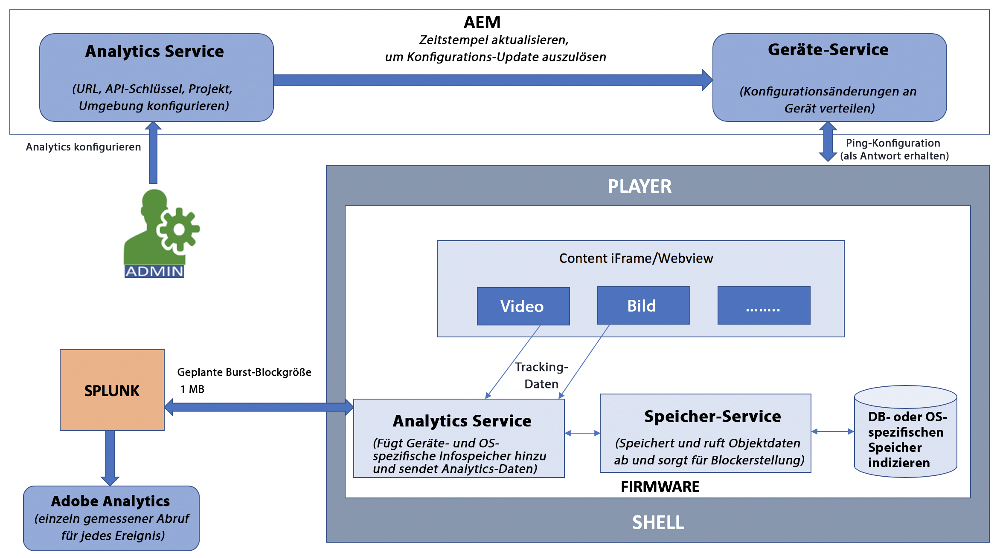

# Adobe Analytics-Integration mit AEM Screens {#adobe-analytics-integration-with-aem-screens}

>[!CAUTION]
>
>Diese AEM Screens-Funktion ist nur verfügbar, wenn Sie mindestens AEM 6.4.2 Feature Pack 2 oder AEM 6.3.3 Feature Pack 4 installiert haben. Wenden Sie sich für AEM Screens Cloud-Service-Kunden an Ihren Adobe Relationship Manager, um Adobe Analytics in Screens Cloud zu aktivieren.

>[!NOTE]
>
>Um Zugriff auf eines dieser Feature Packs zu erhalten, wenden Sie sich an den Adobe-Support und fordern Sie Zugriff an. Sie können das neueste Feature Pack für AEM Screens über das [Software Distribution-Portal](https://experience.adobe.com/#/downloads/content/software-distribution/de/aem.html) die Verwendung Ihrer Adobe ID.

In diesem Abschnitt werden folgende Themen behandelt:

* **Überblick**
* **Architekturdetails**
* **Konfigurieren der Eigenschaften**

## Überblick {#overview}

***AEM Screens*** verwendet Adobe Analytics, damit Sie etwas Einzigartiges auf dem Markt erreichen können - kanalübergreifende Analysen, die die Korrelation von lokal angezeigten Inhalten mit anderen Datenquellen ermöglichen.

AEM Screens bietet eine vorkonfigurierte Integration mit Adobe Analytics und liefert Ihnen einen Wiedergabenachweis.

In diesem Abschnitt werden folgende Funktionen beschrieben, die beim Verbinden eines AEM Screens-Projekts mit Adobe Analytics genutzt werden:

* Berichte zum Nachweis der Wiedergabe nach Gerät
* Berichte zum Nachweis der Wiedergabe nach Asset
* Sicherstellung, dass alle Player-Ereignisse erfasst und mit einem Zeitstempel versehen werden
* Sicherstellung, dass alle Player-Ereignisse lokal gespeichert werden, wenn die Wiedergabe nicht mit einem Netzwerk verbunden ist
* Feedback-Schleifen können erstellt werden, die Wiedergabeereignisse im Zeitverlauf verfolgen
* Ermöglicht es dem System, Inhalte und Layouts basierend auf vom Inhaltsautor definierten Erfolgskriterien zu bearbeiten

Eine Integration von Adobe Analytics mit AEM Screens hat somit folgende *Ziele*:

* Fördern des ROI bei der Implementierung von Digital Signage
* Integrieren von Analytics als Grundlage für die künftige Erfassung und Analyse von Nutzungsdaten

## Architekturdetails {#architectural-details}

Ein AEM Screens-Kunde möchte wissen, welche Inhalte wann und wie lange (aggregiert) angezeigt wurden. Diese Notwendigkeit ist eine gemeinsame Fähigkeit einer Signage-Lösung. Anstatt eine separate Analyseanwendung zu erstellen, verwendet AEM Screens Adobe Analytics. Die Kombination ermöglicht es uns, etwas Einzigartiges auf dem Markt zu erreichen - kanalübergreifende Analysen, die die Korrelation von lokal angezeigten Inhalten mit anderen Datenquellen ermöglichen.

Im folgenden Architekturdiagramm wird die Integration von Adobe Analytics mit AEM Screens veranschaulicht:

## Aktivieren von Adobe Analytics in AEM Screens {#enabling-adobe-analytics-in-aem-screens}

Die Einstellungen von Adobe Analytics können über die OSGi-Konsole konfiguriert werden.

Navigieren Sie zu **Konfiguration der Adobe Experience Manager-Web-Konsole** , damit Sie Adobe Analytics für AEM Screens konfigurieren können.

## Screens Analytics: Aktivierungsablauf {#screens-analytics-enablement-flow}

>[!CAUTION]
>
>Wenden Sie sich vor der Konfiguration der Eigenschaften an das Adobe-Relationship-Management, um ein Ticket öffnen zu lassen und einen **Analytics-API-Schlüssel** sowie ein **Analytics-Projekt** zur Verwendung mit AEM Screens zu erhalten.

### Konfigurieren der Eigenschaften {#configuring-the-properties}

>[!CAUTION]
>
>Wenden Sie sich vor der Konfiguration der Eigenschaften an das Adobe-Relationship-Management, um ein Ticket öffnen zu lassen und einen **Analytics-API-Schlüssel** sowie ein **Analytics-Projekt** zur Verwendung mit AEM Screens zu erhalten.

In der folgenden Tabelle werden die Eigenschaften mit ihrer Beschreibung zur Konfiguration von Adobe Analytics für AEM Screens aufgeführt:

<table>
 <tbody>
  <tr>
   <td><strong>Eigenschaft</strong></td>
   <td><strong>Beschreibung</strong></td>
  </tr>
  <tr>
   <td><strong>Analytics-URL</strong></td>
   <td>URL zum Posten von Analysedaten aus dem Player.  
   Für Entwicklung/Staging</em>: https://cc-api-data-stage.adobe.io/ingest/  <em>Für Produktion</em>: https://cc-api-data.adobe.io/ingest/   </td>
  </tr>
  <tr>
   <td><strong>Analytics-API-Schlüssel</strong></td>
   <td>API-Schlüssel für die Authentifizierung beim Adobe Analytics-Server (bereitgestellt vom Account Manager).</td>
  </tr>
  <tr>
   <td><strong>Analytics-Projekt</strong></td>
   <td>Das AEM Screens-Projekt, das in Ihrer Analyse für den Empfang von Daten konfiguriert wurde (bereitgestellt vom Account Manager).</td>
  </tr>
  <tr>
   <td><strong>Umgebung</strong></td>
   <td>
Staging- oder Produktionsumgebung (wählen Sie entweder „Staging“ oder „Produktion“ aus).
</td>
  </tr>
  <tr>
   <td><strong>Analytics-Sendefrequenz</strong></td>
   <td>Häufigkeit (in Minuten), mit der Analysedaten von den Playern gesendet werden. Standardmäßig ist der Wert auf 15 Minuten eingestellt.</td>
  </tr>
 </tbody>
</table>

>[!NOTE]
>
>Standardmäßig beträgt die **Analytics-Sendefrequenz** 15 Minuten.

#### Verwenden des Adobe Analytics-Service in AEM Screens {#using-adobe-analytics-service-in-aem-screens}

Dieses Szenario ruft die Analytics-API über REST-Aufrufe von einem Analytics-Dienst in der Firmware auf. Außerdem werden AEM Screens-Core-Komponenten zum Erstellen und Senden von für einen bestimmten Anwendungsfall spezifischen Ereignissen eingesetzt. All diese Funktionen ermöglichen die Erweiterbarkeit, wobei jede benutzerdefinierte Nachricht von einem benutzerdefinierten Kanal an Analytics gesendet werden kann.

Analytics-Ereignisse werden in indexedDB offline gespeichert und später aufgeteilt und an die Cloud gesendet.

>[!NOTE]
>
>Weitere Informationen zum ***Sequenzieren*** und zum ***Standarddatenmodell für Ereignisse*** finden Sie unter **[Konfigurieren von Adobe Analytics für AEM Screens](configuring-adobe-analytics-aem-screens.md)**.
