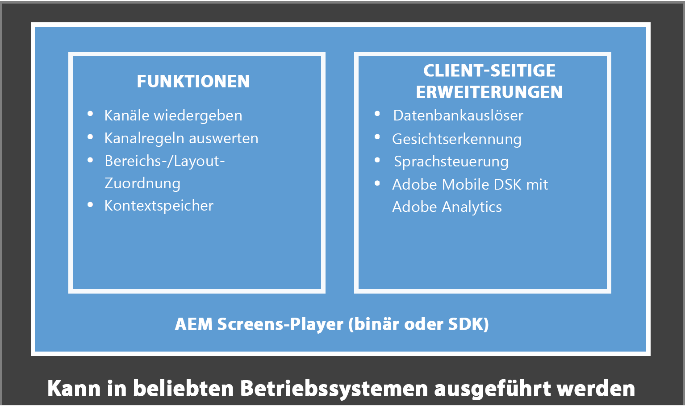
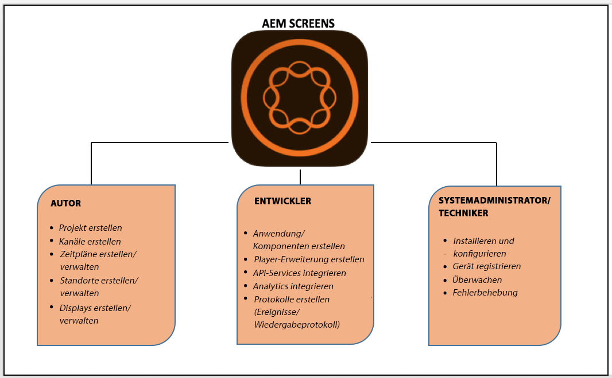

# Was ist Adobe Experience Manager Screens?{#what-is-aem-screens}

>[!IMPORTANT]
>Dieser Inhalt gilt für AEM On-Premise/AMS (AEM 6.5LTS und AEM 6.5). Informationen zu AEM as a Cloud Service Screens-Inhalten finden Sie im [AEM as a Cloud Service-Handbuch](https://experienceleague.adobe.com/en/docs/experience-manager-cloud-service/content/screens-as-cloud-service/overview/introduction).

**Experience Manager Screens** – eine Lösung für Digital Signage, mit der Sie dynamische und interaktive digitale Erlebnisse und Interaktionen auf verschiedenen Arten von Bildschirmen veröffentlichen können, und das alles auf einer umfassenden Digital Marketing-Plattform.

Nutzen Sie den [Schnellstart für AEM Screens](kickstart-for-aem-screens.md) für einen schnellen Einstieg in diese einfach zu nutzende Lösung für digitale Beschilderung.

Informationen zur Konfiguration und Erstellung Ihres Experience Manager Screens-Projekts in Experience Manager as a Cloud Service finden Sie [hier](https://experienceleague.adobe.com/de/docs/experience-manager-screens/using/about-guide).

## Überblick {#overview}

**Experience Manager Screens** baut auf der soliden Basis von ***Experience Manager Sites*** auf. Es ermöglicht Marketing- und IT-Fachleuten, Erlebnisse auf mehreren digitalen Bildschirmen zu erstellen und zu verwalten, was im Ladengeschäft eine Marke bewerben und die Nachfrage ankurbeln kann. Durch die Integration von Experience Manager Screens mit Sites können Sie bereits vorhandene Inhalte wiederverwenden und eine kohärente und konsistente Kundenlösung bereitstellen. Dieser Workflow ist dafür optimiert, digitale Erlebnisse zu entwickeln, die äußerst kostengünstig und optimal nutzbar sind. Zusätzlich können Sie damit die Markenwahrnehmung stärken und Entscheidungen beeinflussen, was zusätzliche Käufe und Interaktionen zur Folge hat.

Experience Manager Screens ist eine leistungsstarke Web-basierte Lösung, mit der Sie spezielle digitale Menütafeln, Produktempfehlungen und Lifestyle-Hintergrundbilder erstellen können, um die Kundeninteraktion zu verbessern. Es hilft Ihnen, einheitliche und hilfreiche Markenerlebnisse an physischen Orten wie Geschäften, Hotels, Banken, Gesundheits- und Bildungseinrichtungen und vielen anderen zu schaffen – und zwar über dieselbe Experience Manager-Plattform. Screens bietet viele einzigartige Anwendungen. Zum Beispiel interaktive Anzeigen, Orientierungssysteme und Branding. Zusätzlich kann je nach Bereitstellungs-Domain eine bestimmte Atmosphäre für Kundinnen und Kunden sowie Mitarbeiter geschaffen werden.

Das Erstellen und Verwalten einer Anwendung mithilfe von Experience Manager Screens ist einfach und intuitiv. Ein *Programm* hostet die Web-Seiten, die von Kunden und Kundinnen oder Implementierungspartnern und -Partnerinnen für Experience Manager Screens erstellt wurden. *Speicherorte* verwalten vordefinierte Hierarchien und enthalten *Anzeigen*. Jedes Display verfügt über ein Dashboard, in dem unterschiedliche angeschlossene Geräte und Bildschirme angezeigt werden. Inhalte für Experience Manager Screens werden in *Kanälen* organisiert. Mit dem Experience Manager Screens-Player wird der auf Kanälen vorhandene Inhalt auf Displays dargestellt.

Die Schlüsselbegriffe in Zusammenhang mit Experience Manager Screens werden im [Glossar](screens-glossary.md) erklärt.

### Architektur des Screens-Players

Das folgende Diagramm zeigt die allgemeine Architektur eines Experience Manager Screens-Players:

### Erstellen eines Erlebnisses für Digital Signage in fünf Minuten {#create-a-digital-signage-experience-in-minutes}

In [Schnellstart für Experience Manager Screens](kickstart-for-aem-screens.md) finden Sie eine Anleitung zum Erstellen eines Screens-Demoprojekts und zum Veröffentlichen Ihrer Inhalte im Screens-Player.

## Starten eines neuen Experience Manager Screens-Projekts {#starting-a-new-aem-screens-project}

Für den Start eines neuen Erlebnisses mit digitaler Beschilderung müssen mehrere Personen mit unterschiedlichen Rollen zusammenarbeiten. Die folgenden Rollen bieten einen Ausgangspunkt für die Erstellung eines Screens-Projekts:

* **Autor**
* **Entwickler**
* **Systemadministrator/Techniker**

In der folgenden Abbildung werden die beteiligten Personen und ihre Rollen für Experience Manager Screens definiert.

## Sonstige Ressourcen {#additional-resources}

* **Tutorial zu den Grundlagen der Implementierung**

  Folgen Sie dem geführten Lernpfad **[Grundlagen der Implementierung von Experience Manager Screens](https://experienceleague.adobe.com/?launch=AEM-7a&lang=de)**, in dem grundlegende und erweiterte Funktionen von Experience Manager Screens behandelt werden.

* **Handbuch mit Best Practices für Experience Manager Screens-Projekte**

  Befolgen Sie das **[Handbuch mit Best Practices für Experience Manager Screens-Projekte](/help/using/about-guide.md)**, in dem auf allgemeine Schwierigkeiten bei der Implementierung eines Experience Manager Screens-Projekts hingewiesen wird. Das Material konzentriert sich in erster Linie auf Projektrollen und Zuständigkeiten. Der Schwerpunkt liegt auf RACI-Diagrammen für verschiedene Rollen, Experience Manager-Platform-Konfigurationen sowie Support und Überwachung.

<!-- 
DEAD LINK * **New Adobe Customer Support Experience**

   Follow **[Customer One for Enterprise Help](https://docs.adobe.com/content/help/en/customer-one/using/home.htmlhome.html#)** to learn more about Admin Console Support tickets. 
-->
