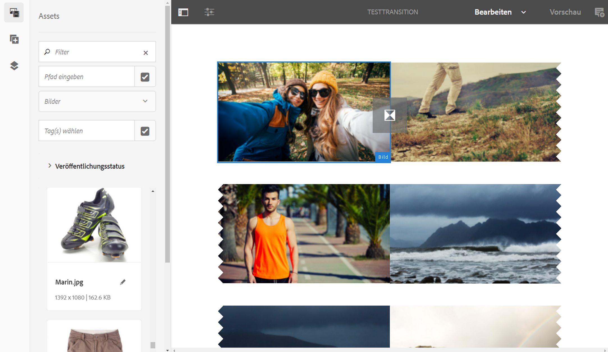
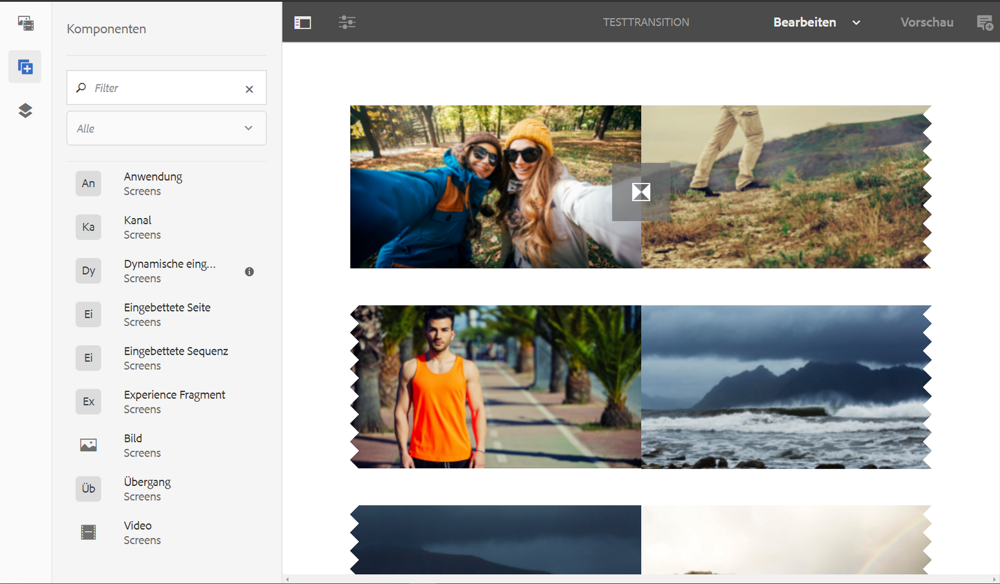
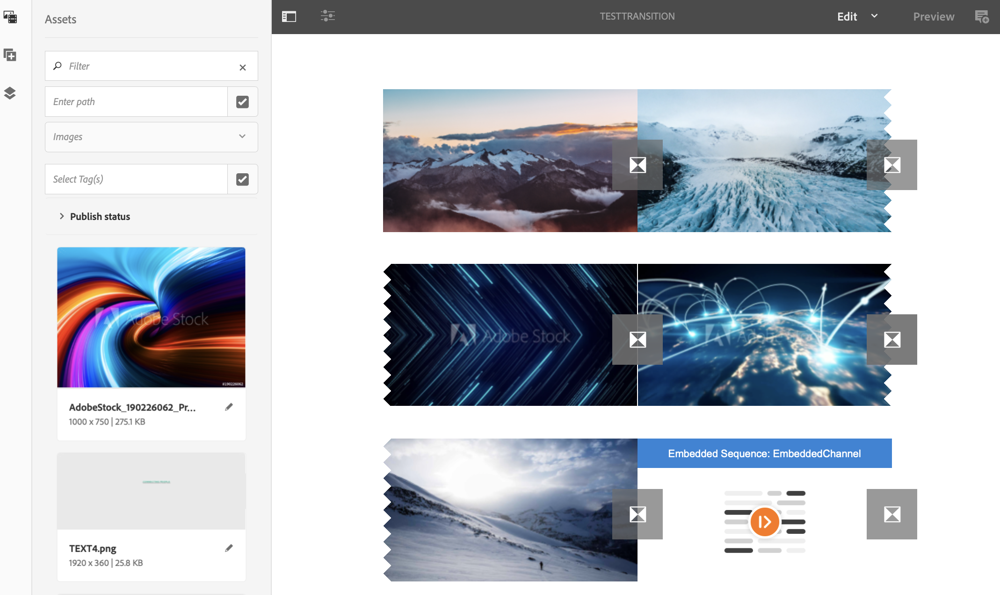

# Anwenden von Übergängen {#applying-transitions}

In diesem Abschnitt wird beschrieben, wie Sie die **Übergangskomponente** zwischen verschiedenen Assets (Bilder und Videos) und eingebetteten Sequenzen in einem Kanal anwenden können.

>[!CAUTION]
>
>Ausführliche Informationen zu den Eigenschaften für die **Übergang** Komponente, siehe [Transitionen](adding-components-to-a-channel.md#transition).

## Hinzufügen der Übergangskomponente zu Assets in einem Kanal {#adding-transition}

Gehen Sie wie folgt vor, um Ihrem AEM Screens-Projekt eine Übergangskomponente hinzuzufügen:

>[!NOTE]
>
>**Voraussetzungen**
>
>Erstellen Sie ein AEM Screens-Projekt namens **Testprojekt** mit einem Kanal namens **Testübergang**. Richten Sie außerdem einen Standort und eine Anzeige ein, um die Ausgabe anzuzeigen.

1. Navigieren zum Kanal **TestTransition** und wählen **Bearbeiten** in der Aktionsleiste aus.

   

   >[!NOTE]
   >
   >Der Kanal **Testübergang** enthält bereits einige Assets (Bilder und Videos). Beispielsweise enthält der Kanal **Testübergang** drei Bilder und zwei Videos, wie unten dargestellt:

   

1. Ziehen Sie die **Übergangskomponente** per Drag-and-Drop in Ihren Editor.

   >[!CAUTION]
   >
   >Bevor Sie den Übergang zu den Assets in Ihrem Kanal hinzufügen, stellen Sie sicher, dass Sie keinen Übergang vor dem ersten Asset im Sequenzkanal hinzufügen. Das erste Element im Kanal muss ein Asset und darf kein Übergang sein.

   

   >[!NOTE]
   >
   >Standardmäßig sind die Eigenschaften der Übergangskomponente wie **Typ** auf **Überblendung** und **Dauer** auf *1600 Millisekunden*. Außerdem ist es nicht ratsam, eine Übergangsdauer festzulegen, die länger ist als das Asset, auf das sie angewendet wird.

1. Wenn Sie außerdem eine **Eingebettete Sequenz** -Komponente (die einen Sequenzkanal enthält), können Sie diesem Kanaleditor am Ende eine Übergangskomponente hinzufügen. Dadurch wird sichergestellt, dass der Inhalt in der richtigen Reihenfolge wiedergegeben wird, wie in der folgenden Abbildung dargestellt:

   
