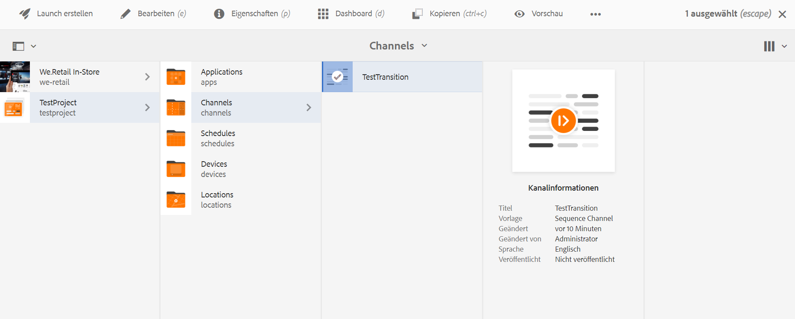

# Anwenden von Übergängen {#applying-transitions}

In diesem Abschnitt wird beschrieben, wie Sie mit einer **Übergangskomponente** einen Übergang zu Ihrem Screens-Projekt hinzufügen können.

>[!CAUTION]
>
>Weitere Informationen zu den Eigenschaften der Übergangskomponente finden Sie unter [Übergänge](adding-components-to-a-channel.md#transition)

## Hinzufügen der Übergangskomponente zu Assets in einem Kanal {#adding-transition}

Gehen Sie wie folgt vor, um Ihrem AEM Screens-Projekt eine Übergangskomponente hinzuzufügen:

>[!NOTE]
>
>**Voraussetzungen**
> Erstellen Sie ein AEM Screens-Projekt **TestProject** mit einem Kanal **TestTransition**. Richten Sie außerdem einen Speicherort und eine Anzeige ein, um die Ausgabe anzuzeigen.

1. Navigieren Sie zum Kanal- **TestTransition** und klicken Sie in der Aktionsleiste auf **Bearbeiten** .

   

   >[!NOTE]
   >
   >Der **TestTransition** -Kanal enthält bereits wenige Assets (Bilder und Videos). Der **TestTransition** -Kanal enthält beispielsweise drei Bilder und zwei Videos, wie unten dargestellt:

   

1. Ziehen Sie die **Übergangskomponente** per Drag &amp; Drop in Ihren Editor.
   >[!CAUTION]
   >
   >Bevor Sie den Übergang zu Ihren Assets in Ihrem Kanal hinzufügen, stellen Sie Folgendes sicher:
Sie fügen keinen Übergang vor dem ersten Asset im sequenziellen Kanal hinzu. Das erste Element im Kanal muss ein Asset und kein Übergang sein.

   

   > [!NOTE]
   >
   >Standardmäßig ist die Übergangskomponente auf "Typ"als " **Normal** "eingestellt, wobei die **Dauer** auf *600 ms* eingestellt ist.  Darüber hinaus ist es nicht ratsam, eine Übergangszeit festzulegen, die länger ist als das Asset, auf das sie angewendet wird.

## Hinzufügen der Übergangskomponente zu Videos in einem Kanal {#adding-transition-videos}

Wenn Sie eine Übergangskomponente zwischen Videos anwenden, stellen Sie den **Typ** immer auf **Fade** und die **Sequenzdauer** auf **1600 ms** ein.

