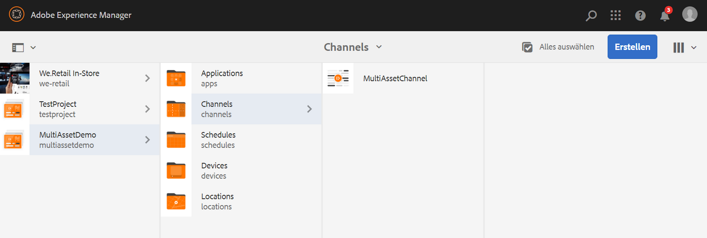
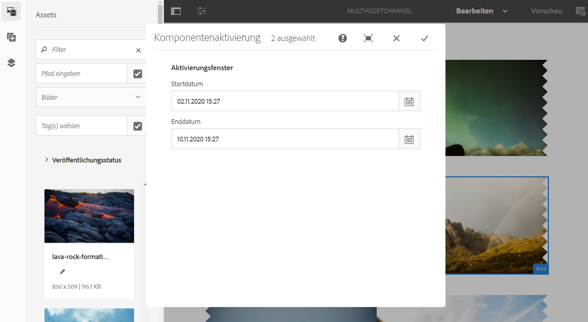
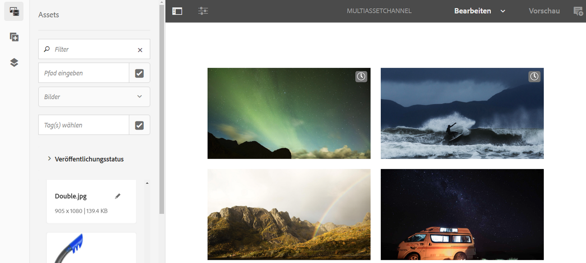

# Aktivierung auf Asset-Ebene {#asset-level-scheduling}

Auf dieser Seite wird die Aktivierung auf der Asset-Ebene für die in Kanälen verwendeten Assets beschrieben.

In diesem Abschnitt werden die folgenden Themen behandelt:

* Überblick
* Aktivierungsfenster
* Wiedergabe eines einzelnen Ereignisses
* Umgang mit sich wiederholenden Assets
   * Dayparting
   * WeekParting
   * MonthParting
   * Kombination von Aufteilungen
* Aktivierung für mehrere Assets
* Globale Überschreibung für universelle Startzeit

>[!CAUTION]
>
>Diese AEM Screens-Funktion ist nur verfügbar, wenn Sie AEM 6.3 Feature Pack 3 oder AEM 6.4 Screens Feature Pack 1 installiert haben.
>
>Wenden Sie sich an den Adobe-Support, um Zugriff auf dieses Feature Pack zu erhalten. Wenn Sie die entsprechenden Berechtigungen erhalten haben, können Sie es von Package Share herunterladen.

## Überblick {#overview}

Mit der ***Aktivierung auf der Asset-Ebene*** können Sie ein bestimmtes Asset in einem Kanal für einen geplanten Zeitraum in der lokalen Zeitzone des Players aktivieren. Diese Funktion ist für Bilder, Videos, Übergänge, Seiten und eingebettete Kanäle (dynamisch oder statisch) verfügbar.

*Beispielsweise* soll eine Sonderaktion nur montags und mittwochs während der Happy Hour (14.00 bis 17.00 Uhr) angezeigt werden.

Mit der Funktion können Sie nicht nur Start- und Enddatum sowie -zeit, sondern auch ein Wiederholungsmuster angeben.

## Aktivierungsfenster {#single-event-playback}

Die Aktivierung auf der Asset-Ebene erfolgt durch Konfiguration der Registerkarte **Aktivierung** beim Zugriff auf die Eigenschaften eines Assets.

Gehen Sie wie folgt vor, um die Zeitplanung auf der Asset-Ebene durchzuführen:

1. Wählen Sie einen beliebigen Kanal aus und klicken Sie in der Aktionsleiste auf **Bearbeiten**, um im Kanal Inhalte hinzuzufügen oder zu bearbeiten.

   

   >[!NOTE]
   >
   >Detaillierte Informationen zum
   >
   >* Erstellen eines Projekts finden Sie unter [Erstellen eines neuen Projekts](creating-a-screens-project.md).
   >* Erstellen von Inhalten und Hinzufügen zu einem Kanal finden Sie unter [Verwalten von Kanälen](managing-channels.md).

1. Klicken Sie auf **Bearbeiten**, um den Kanaleditor zu öffnen und ein Asset auszuwählen, das Sie zeitlich planen möchten.

   

1. Wählen Sie das Asset aus und klicken Sie oben links auf **Konfigurieren** (Schraubenschlüsselsymbol), um die Eigenschaften des Bilds zu öffnen.

   Klicken Sie auf die Registerkarte **Aktivierung**.

   

1. Sie können das Datum mithilfe der Datumsauswahl über die Felder **Aktiv ab** und **Aktiv bis** angeben.

   Wenn Sie Datum und Uhrzeit für die Optionen **Aktiv ab** und **Aktiv bis** wählen, wird das Asset nur zwischen Startdatum/Startzeit und Enddatum/Endzeit angezeigt und in einer Schleife abgespielt.

   

## Umgang mit sich wiederholenden Assets {#handling-recurrence-in-assets}

Sie können eine Wiederholung von Assets Ihren Anforderungen entsprechend in bestimmten Intervallen auf Tages-, Wochen- oder Monatsbasis planen.

Angenommen, Sie möchten ein Bild nur freitags von 13.00 bis 22.00 Uhr anzeigen. Auf der Registerkarte **Aktivierung** können Sie das gewünschte Wiederholungsintervall für Ihr Asset festlegen.

### Tagesaufteilung {#day-parting}

1. Wählen Sie das Asset aus und klicken Sie auf **Konfigurieren** (Schraubenschlüsselsymbol), um das Dialogfeld „Eigenschaften“ zu öffnen.

1. Nach Eingabe von Startdatum/Startzeit und Enddatum/Endzeit können Sie einen Ausdruck oder eine natürliche Textversion verwenden, um Ihren Wiederholungsplan anzugeben.

   >[!NOTE]
   >Sie können die Felder **Aktiv ab** und **Aktiv bis** überspringen oder einbeziehen und den Ausdruck entsprechend Ihren Anforderungen zum Feld „Zeitpläne“ hinzufügen.

1. Geben Sie den Ausdruck in den **Zeitplan** ein. Ihr Asset wird daraufhin für das jeweilige Tages- und Uhrzeitintervall angezeigt.

#### Beispielausdrücke für die DayParting {#example-one}

Die folgende Tabelle enthält einige Beispielausdrücke, die Sie dem Zeitplan hinzufügen können, während Sie einer Anzeige einen Kanal zuweisen.

| **Ausdruck** | **Interpretation** |
|---|---|
| vor 8:00 Uhr | Das Asset im Kanal wird täglich vor 8:00 Uhr wiedergegeben. |
| nach 14:00 Uhr | Das Asset im Kanal wird täglich nach 14:00 Uhr wiedergegeben. |
| nach 12:15 Uhr und vor 12:45 Uhr | Das Asset im Kanal wird täglich 30 Minuten lang nach 12:15 Uhr wiedergegeben. |
| vor 12:15 Uhr auch nach 12:45 Uhr | Das Asset im Kanal wird täglich vor 12:15 Uhr und danach auch nach 12:45 Uhr wiedergegeben. |

>[!NOTE]
>
>Sie können das _24-Stunden-Format_ (d. h. 14:00 Uhr) oder die *am/pm*-Notation (d. h. 2:00 pm) verwenden.

### WeekParting {#week-parting}

1. Wählen Sie das Asset aus und klicken Sie auf **Konfigurieren** (Schraubenschlüsselsymbol), um das Dialogfeld „Eigenschaften“ zu öffnen.

1. Nach Eingabe von Startdatum/Startzeit und Enddatum/Endzeit können Sie einen Ausdruck oder eine natürliche Textversion verwenden, um Ihren Wiederholungsplan anzugeben.

   >[!NOTE]
   >Sie können die Felder **Aktiv ab** und **Aktiv bis** überspringen oder einbeziehen und den Ausdruck entsprechend Ihren Anforderungen zum Feld „Zeitpläne“ hinzufügen.

1. Geben Sie den Ausdruck in den **Zeitplan** ein. Ihr Asset wird daraufhin für das jeweilige Tages- und Uhrzeitintervall angezeigt.

#### Beispielhafte Ausdrücke für WeekParting {#example-two}

Die folgende Tabelle enthält einige Beispielausdrücke, die Sie dem Zeitplan hinzufügen können, während Sie einer Anzeige einen Kanal zuweisen.

| **Ausdruck** | **Interpretation** |
|---|---|
| Mo.,Mi.,Fr. | Das Asset im Kanal wird montags, mittwochs und freitags wiedergegeben. |
| Mo.–Do. | Das Asset im Kanal wird von montags bis donnerstags wiedergegeben. |

>[!NOTE]
>
>Sie können auch die _volle_ Bezeichnung (d. h. Montag,Mittwoch,Freitag) anstelle der _Abkürzung_ (d. h. Mo.,Mi.,Fr.) verwenden.

### MonthParting {#month-parting}

1. Wählen Sie das Asset aus und klicken Sie auf **Konfigurieren** (Schraubenschlüsselsymbol), um das Dialogfeld „Eigenschaften“ zu öffnen.

1. Nach Eingabe von Startdatum/Startzeit und Enddatum/Endzeit können Sie einen Ausdruck oder eine natürliche Textversion verwenden, um Ihren Wiederholungsplan anzugeben.

   >[!NOTE]
   >Sie können die Felder **Aktiv ab** und **Aktiv bis** überspringen oder einbeziehen und den Ausdruck entsprechend Ihren Anforderungen zum Feld „Zeitpläne“ hinzufügen.

1. Geben Sie den Ausdruck in den **Zeitplan** ein. Ihr Asset wird daraufhin für das jeweilige Tages- und Uhrzeitintervall angezeigt.

#### Beispielhafte Ausdrücke für MonthParting {#example-three}

Die folgende Tabelle enthält einige Beispielausdrücke, die Sie dem Zeitplan hinzufügen können, während Sie einer Anzeige einen Kanal zuweisen.

| **Ausdruck** | **Interpretation** |
|---|---|
| Februar, Mai, August, November | Das Asset im Kanal wird im Februar, Mai, August und November wiedergegeben. |
| Februar–Juli | Das Asset im Kanal wird von Februar bis Ende Juli wiedergegeben. |

>[!NOTE]
>Bei der Definition von Wochentagen und Monaten können Sie sowohl die Abkürzung als auch die vollständige Bezeichnung verwenden, beispielsweise „Mo.“/„Montag“ und „Jan.“/„Januar“.

### Kombination von Aufteilungen {#combined-parting}

1. Wählen Sie das Asset aus und klicken Sie auf **Konfigurieren** (Schraubenschlüsselsymbol), um das Dialogfeld „Eigenschaften“ zu öffnen.

1. Nach Eingabe von Startdatum/Startzeit und Enddatum/Endzeit können Sie einen Ausdruck oder eine natürliche Textversion verwenden, um Ihren Wiederholungsplan anzugeben.

   >[!NOTE]
   >Sie können die Felder **Aktiv ab** und **Aktiv bis** überspringen oder einbeziehen und den Ausdruck entsprechend Ihren Anforderungen zum Feld „Zeitpläne“ hinzufügen.

1. Geben Sie den Ausdruck in den **Zeitplan** ein. Ihr Asset wird daraufhin für das jeweilige Tages- und Uhrzeitintervall angezeigt.

#### Beispielausdrücke für die Kombination von Aufteilungen {#example-four}

Die folgende Tabelle enthält einige Beispielausdrücke, die Sie dem Zeitplan hinzufügen können, während Sie einer Anzeige einen Kanal zuweisen.

| **Ausdruck** | **Interpretation** |
|---|---|
| nach 6:00 und vor 18:00 Uhr am Mo.,Mi. im Jan-Mrz | Das Asset im Kanal wird montags bis mittwochs von Januar bis Ende März zwischen 6 Uhr und 18 Uhr und mittwochs wiedergegeben. |
| am 1. Januar nach 14:00 Uhr auch am 2. Januar, auch am 3. Januar vor 3:00 Uhr | Das Asset im Kanal wird ab dem 1. Januar um 14:00 Uhr und weiterhin den ganzen Tag am 2. Januar bis um 3:00 Uhr am 3. Januar wiedergegeben. |
| am 1./2. Januar nach 14:00 Uhr auch am 2./3. Januar vor 3:00 Uhr | Das Asset im Kanal wird ab dem 1. Januar um 14:00 Uhr bis zum 2. Januar um 3:00 Uhr wiedergegeben. Dann wird es erneut am 2. Januar um 14:00 Uhr bis zum 3. Januar um 3:00 Uhr wiedergegeben. |

>[!NOTE]
>Bei der Definition von Wochentagen und Monaten können Sie sowohl die Abkürzung als auch die vollständige Bezeichnung verwenden, beispielsweise „Mo.“/„Montag“ und „Jan.“/„Januar“.  Außerdem können Sie das _24-Stunden-Format_ (d. h. 14:00 Uhr) oder die *am/pm*-Notation (d. h. 2:00 pm) verwenden.

## Aktivierung für mehrere Assets {#multi-asset-scheduling}

>[!CAUTION]
>
>Die Funktion **Aktivierung für mehrere Assets** ist nur verfügbar, wenn Sie AEM 6.3 Feature Pack 5 oder AEM 6.4 Feature Pack 3 installiert haben.

Die ***Aktivierung für mehrere Assets*** ermöglicht es dem Benutzer, mehrere Assets auszuwählen und einen Wiedergabezeitplan auf alle ausgewählten Assets anzuwenden.

### Voraussetzungen {#prerequisites}

Um die Aktivierung für mehrere Assets zu verwenden, erstellen Sie ein AEM Screens-Projekt mit einem Sequenzkanal. Im folgenden Anwendungsbeispiel wird die Implementierung der Funktion veranschaulicht:

* Erstellen Sie ein AEM Screens-Projekt mit dem Titel **MultiAssetDemo**
* Erstellen Sie einen Kanal mit der Bezeichnung **MultiAssetChannel** und fügen Sie dem Kanal Inhalt hinzu, wie in der folgenden Abbildung dargestellt

Gehen Sie wie folgt vor, um mehrere Assets auszuwählen und ihre Anzeige in einem AEM Screens-Projekt zu planen:

1. Wählen Sie **MultiAssetChannel** aus und klicken Sie in der Aktionsleiste auf **Bearbeiten**, um den Editor zu öffnen.

   

1. Wählen Sie im Editor mehrere Assets aus und klicken Sie auf **Aktivierung bearbeiten** (Symbol oben links).

   

1. Wählen Sie Datum und Uhrzeit in **Aktiv ab** und **Aktiv bis** im Dialogfeld **Komponentenaktivierung** aus. Klicken Sie auf das Häkchen, nachdem Sie die Zeitpläne ausgewählt haben.

   

1. Klicken Sie auf „Aktualisieren“, um die Assets zu überprüfen, auf die der Multi-Asset-Plan angewendet wird.

   >[!NOTE]
   >
   >Das Zeitplansymbol wird bei Assets mit Aktivierung für mehrere Assets oben rechts sichtbar.

   

## Globale Überschreibung für universelle Startzeit {#global-override-scheduling}

***Globale Überschreibung für universelle Startzeit*** ist eine Einstellung, mit der der Inhaltsautor die Wiedergabe eines Bild- oder Video-Assets basierend auf einer bestimmten Zeit definieren kann. Die Zeit-/Zeitzoneneinstellung eines einzelnen Players wird nicht verwendet.

Normalerweise wird die Wiedergabe von der lokalen Zeit eines bestimmten Players bestimmt, aber mit der globalen Überschreibung kann eine bestimmte universelle Startzeit verwendet werden, um die Wiedergabe des Assets zu starten.

Dadurch kann der Inhaltsautor festlegen, dass die Wiedergabe eines bestimmten Assets zu einem bestimmten Datum/zu einer bestimmten Uhrzeit erfolgt, unabhängig von der lokalen Uhr auf allen Playern, denen der Inhalt zugewiesen wurde.

Globale Überschreibung für die universelle Startzeit erfolgt durch Konfiguration der **Aktivierung** Registerkarte beim Zugriff auf die Eigenschaften eines Assets. Gehen Sie wie folgt vor, um eine globale Überschreibung für die Asset-Planung durchzuführen:

1. Wählen Sie einen beliebigen Kanal aus und klicken Sie in der Aktionsleiste auf **Bearbeiten**, um im Kanal Inhalte hinzuzufügen oder zu bearbeiten.

   

1. Klicken Sie auf **Bearbeiten**, um den Kanaleditor zu öffnen und ein Asset auszuwählen, das Sie zeitlich planen möchten.

   

1. Geben Sie für eine globale Überschreibung die Aktivierungszeit in der **Zeitzonen-Überschreibung** für das Asset. Wenn Sie in diesem Bereich nichts eingeben, wird die angewendete Zeitzone die Zeitzone des Players sein.

