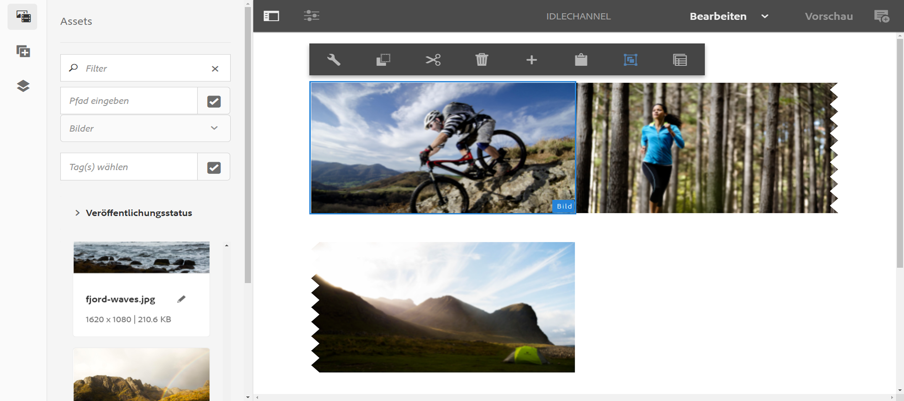
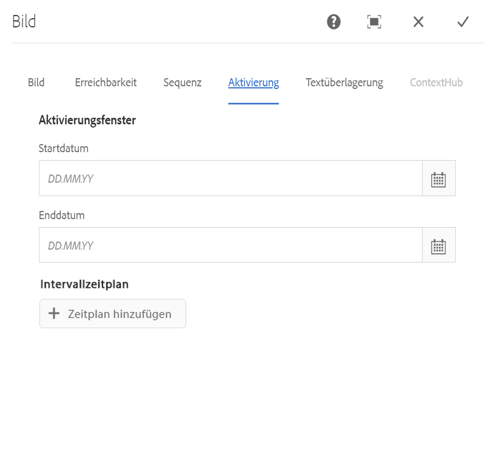
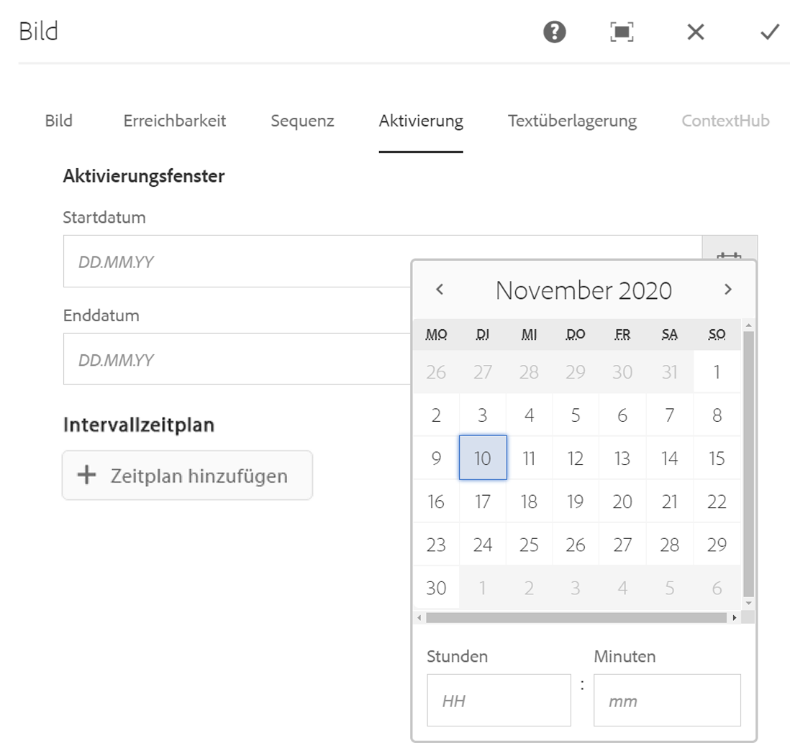

# Planung auf Asset-Ebene {#asset-level-scheduling}

In diesem Abschnitt wird die Planung auf Asset-Ebene für die in Kanälen verwendeten Assets beschrieben.

In diesem Abschnitt werden die folgenden Themen behandelt:

* Überblick
* Planen auf Asset-Ebene
* Umgang mit Wiederholungen in Assets
* Multi-Asset-Planung

>[!CAUTION]
>
>Diese AEM Screens-Funktion ist nur verfügbar, wenn Sie AEM 6.3 Feature Pack 3 oder AEM 6.4 Screens Feature Pack 1 installiert haben.
>
>Wenden Sie sich an den Adobe-Support, um Zugriff auf dieses Feature Pack zu erhalten. Wenn Sie die entsprechenden Berechtigungen erhalten haben, können Sie es von Package Share herunterladen.

## Überblick {#overview}

***Mit der Asset-Planung*** können Sie ein bestimmtes Asset in einem Kanal für einen geplanten Zeitraum in der lokalen Zeitzone des Players aktivieren. Dies ist für Bilder, Videos, Übergänge, Seiten und eingebettete Kanäle (dynamisch oder statisch) verfügbar.

*Beispielsweise* soll eine Sonderaktion nur während der Happy Hour (14.00 bis 17.00 Uhr) montags und mittwochs angezeigt werden.

Mit dieser Funktion können Sie nicht nur Start- und Enddatum und -zeit, sondern auch ein Wiederholungsmuster angeben.

## Planen auf Asset-Ebene {#using-asset-level-scheduling}

Die Planung auf Asset-Ebene erfolgt durch Konfiguration der Registerkarte " **Aktivierung** "beim Zugriff auf die Eigenschaften eines Assets.

Gehen Sie wie folgt vor, um die Planung auf Asset-Ebene durchzuführen:

1. Wählen Sie einen beliebigen Kanal aus und klicken Sie in der Aktionsleiste auf " **Bearbeiten** ", um dem Kanal Inhalte hinzuzufügen oder zu bearbeiten.

   

   >[!NOTE]
   >
   >Detaillierte Informationen zum Thema
   >
   >* Erstellen Sie ein Projekt, siehe [Erstellen eines neuen Projekts](creating-a-screens-project.md).
   >* Erstellen Sie Inhalte und fügen Sie sie zu einem Kanal hinzu, siehe [Verwalten von Kanälen](managing-channels.md).

1. Klicken Sie auf **Bearbeiten** , um den Kanaleditor zu öffnen und ein Asset auszuwählen, auf das Sie die Zeitplanung anwenden möchten.

   

1. Wählen Sie das Asset aus und klicken Sie auf das Symbol **Konfigurieren** oben links, um die Eigenschaften des Bildes zu öffnen.

   Click the **Activation** tab.

   

1. Sie können den Datumsbereich aus der Datumsauswahl aus den Feldern " **Aktiv von** "und " **Aktiv"bis** zu den Feldern angeben.

   Wenn Sie die Option " **Aktiv ab** "und " **Aktiv bis** Datum und Uhrzeit"auswählen, wird das Asset nur zwischen dem Startdatum bzw. der Anfangs- bzw. Enddatum bzw. -zeit angezeigt und in einer Schleife abgespielt.

   

## Umgang mit Wiederholungen in Assets {#handling-recurrence-in-assets}

Sie können Assets entsprechend Ihren Anforderungen in bestimmten Intervallen auf Tages-, Wochen- oder Monatsbasis planen.

Angenommen, Sie möchten ein Bild nur freitags von 13.00 bis 22.00 Uhr anzeigen. Auf der Registerkarte "Aktivierung"können Sie das gewünschte Wiederholungsintervall für Ihr Asset festlegen.

### Hinzufügen eines wiederkehrenden Ereignisses für Ihr Asset {#adding-a-recurring-event-for-your-asset}

1. Wählen Sie das Asset aus und klicken Sie auf das Symbol **Konfigurieren** , um das Dialogfeld Eigenschaften zu öffnen.
1. Nach Eingabe des Anfangsdatums/der Startzeit und der Endzeit/des Datums können Sie einen Cron-Ausdruck oder eine kostenlose Textversion verwenden, um Ihren Wiederholungsplan anzugeben.

   Sie können im Web nach einem kostenlosen Cron-Ausdrucksgenerator suchen und dann den Cron-Ausdruck kopieren und in den **Plan** einfügen. Ihr Asset wird für das jeweilige Tages- und Uhrzeitintervall angezeigt.

   *Alternativ* können Sie anstelle des Cron-Ausdrucks auch die kostenlose Textversion verwenden, z. B. ** nach 6:00 Uhr und vor 18:00 Uhr am Freitag, um Ihre Aufgabe durchzuführen. Geben Sie den Text in den **Zeitplan** ein, um das Asset anzuzeigen.

## Zeitplanung für mehrere Assets {#multi-asset-scheduling}

>[!CAUTION]
>
>Die Planungsfunktion für **mehrere Assets** ist nur verfügbar, wenn Sie AEM 6.3 Feature Pack 5 oder AEM 6.4 Feature Pack 3 installiert haben.

***Die Planung*** mehrerer Assets ermöglicht es dem Benutzer, mehrere Assets auszuwählen und einen Wiedergabezeitplan auf alle ausgewählten Assets anzuwenden.

### Voraussetzungen {#prerequisites}

Um die Planung auf mehreren Assets zu verwenden, erstellen Sie ein AEM Screens-Projekt mit einem Sequenzkanal. Im folgenden Anwendungsfall wird beispielsweise die Implementierung der Funktion veranschaulicht:

* Erstellen eines AEM Screens-Projekts mit dem Titel **MultiAssetDemo**
* Erstellen Sie einen Kanal mit der Bezeichnung **MultiAssetChannel** und fügen Sie dem Kanal Inhalt hinzu, wie in der folgenden Abbildung dargestellt

Gehen Sie wie folgt vor, um mehrere Assets auszuwählen und ihre Anzeige in einem AEM Screens-Projekt zu planen:

1. Select **MultiAssetChannel** and click **Edit** from the action bar to open the editor.

   

1. Wählen Sie im Editor mehrere Assets aus und klicken Sie auf Aktivierung **bearbeiten** (Symbol oben links).

   

1. Wählen Sie das Datum und die Uhrzeit in **Aktiv von** und **Aktiv bis** zum Aktivieren **der** Komponente aus. Klicken Sie auf das Häkchen, wenn Sie die Zeitpläne ausgewählt haben.

   

1. Klicken Sie auf Aktualisieren, um die Assets zu überprüfen, auf die der Zeitplan für mehrere Assets angewendet wird.

   >[!NOTE]
   >
   >Das Symbol "Plan"ist rechts oben in den Assets mit mehreren Asset-Planungen sichtbar.

   

