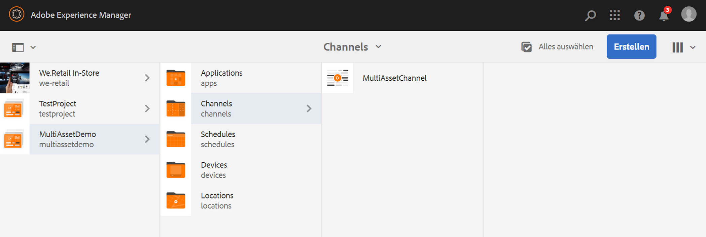
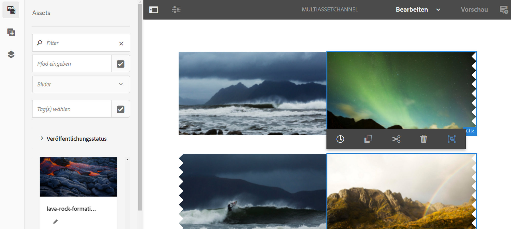
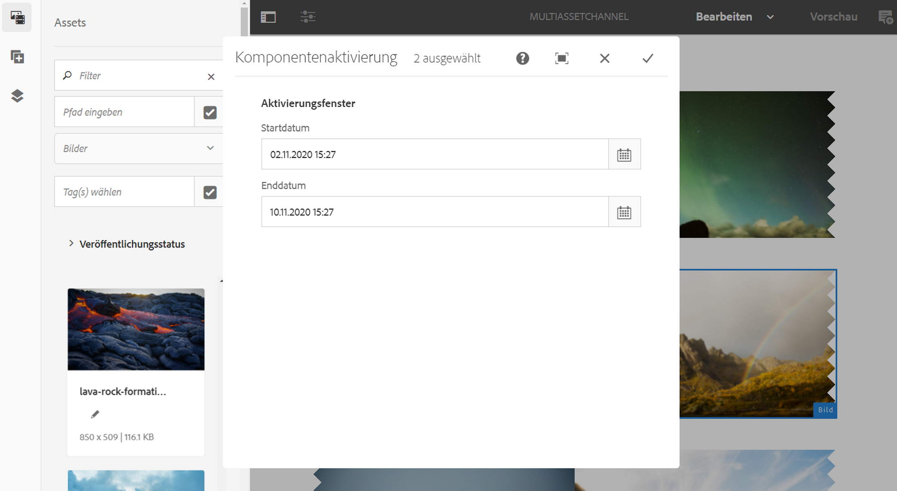
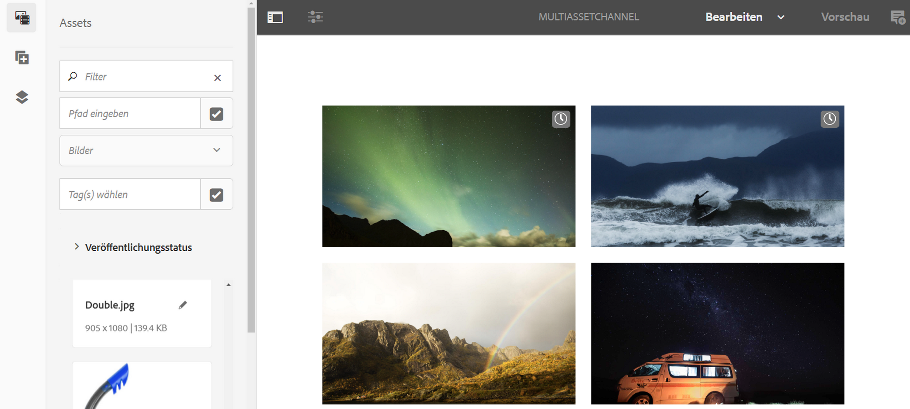

# Aktivierung auf Asset-Ebene {#asset-level-scheduling}

>[!IMPORTANT]
>Dieser Inhalt gilt für AEM On-Premise/AMS (AEM 6.5LTS und AEM 6.5). Informationen zu AEM as a Cloud Service Screens-Inhalten finden Sie im [AEM as a Cloud Service-Handbuch](https://experienceleague.adobe.com/en/docs/experience-manager-cloud-service/content/screens-as-cloud-service/overview/introduction).

Auf dieser Seite wird die Aktivierung auf der Asset-Ebene für die in Kanälen verwendeten Assets beschrieben.

In diesem Abschnitt werden die folgenden Themen behandelt:

* Überblick
* Aktivierungsfenster
* Wiedergabe eines einzelnen Ereignisses
* Umgang mit sich wiederholenden Assets
   * Dayparting
   * WeekParting
   * MonthParting
   * Kombination von Aufteilungen
* Aktivierung für mehrere Assets
* Globale Überschreibung für universelle Startzeit

<!--
REFERS TO ARCHIVED VERSIONS THAT ADOBE NO LONGER SUPPORTS>
>[!CAUTION]
>
>This AEM Screens functionality is only available if you have installed AEM 6.3 Feature Pack 3 or AEM 6.4 Screens Feature Pack 1.
>
>To get access to this Feature Pack, contact Adobe Support and request access. When you have permission, you can download it from Package Share. 
-->

## Überblick {#overview}

Die ***Aktivierung auf Asset-Ebene*** ermöglicht die Aktivierung eines bestimmten Assets in einem Kanal für einen bestimmten Zeitraum innerhalb der lokalen Zeitzone des Players. Diese Funktion ist für Bilder, Videos, Übergänge, Seiten und eingebettete Kanäle (dynamisch oder statisch) verfügbar.

*Beispielsweise* soll eine Sonderaktion nur montags und mittwochs während der Happy Hour (14.00 bis 17.00 Uhr) angezeigt werden.

Mit der Funktion können Sie nicht nur Start- und Enddatum sowie -zeit, sondern auch ein Intervallmuster angeben.

## Aktivierungsfenster {#single-event-playback}

Die Aktivierung auf Asset-Ebene erfolgt durch Konfiguration der Registerkarte **Aktivierung** beim Zugriff auf die Eigenschaften eines Assets.

Gehen Sie wie folgt vor, um die Zeitplanung auf der Asset-Ebene durchzuführen:

1. Klicken Sie auf einen beliebigen Kanal und dann in der Aktionsleiste auf **Bearbeiten**.

   

   >[!NOTE]
   >
   >Detaillierte Informationen zum
   >
   >* Erstellen eines Projekts. Weitere Informationen finden Sie unter [Erstellen eines neuen Projekts](creating-a-screens-project.md).
   >* Erstellen und Hinzufügen von Inhalten zu einem Kanal. Weitere Informationen finden Sie unter [Verwalten von Kanälen](managing-channels.md).

1. Klicken Sie auf **Bearbeiten**, um den Kanal-Editor zu öffnen und ein Asset anzuklicken, auf das Sie die Planung anwenden möchten.

   

1. Klicken Sie auf das Asset und dann oben links auf **Konfigurieren** (Schraubenschlüssel-Symbol).

   Klicken Sie auf die Registerkarte **Aktivierung**.

   

1. Sie können das Datum mithilfe der Datumsauswahl über die Felder **Aktiv ab** und **Aktiv bis** angeben.

   Wenn Sie auf das Datum und die Uhrzeit **Aktiv von** und **Aktiv bis** klicken, wird das Asset nur zwischen Startdatum/Startzeit und Enddatum/Endzeit angezeigt und in einer Schleife abgespielt.

   

## Umgang mit sich wiederholenden Assets {#handling-recurrence-in-assets}

Sie können eine Wiederholung von Assets Ihren Anforderungen entsprechend in bestimmten Intervallen auf Tages-, Wochen- oder Monatsbasis planen.

Angenommen, Sie möchten ein Bild nur freitags von 13 :00 bis 23 :00 anzeigen. Auf der Registerkarte **Aktivierung** können Sie das gewünschte Intervall für das Asset festlegen.

### DayParting {#day-parting}

1. Klicken Sie auf das Asset und dann auf **Konfigurieren** (Schraubenschlüssel-Symbol), um das Dialogfeld „Eigenschaften“ zu öffnen.

1. Nach Eingabe von Startdatum/Startzeit und Enddatum/Endzeit können Sie einen Ausdruck oder eine natürliche Textversion verwenden, um Ihren Intervallplan anzugeben.

   >[!NOTE]
   >Sie können die Felder **Aktiv ab** und **Aktiv bis** überspringen oder einbeziehen und den Ausdruck entsprechend Ihren Anforderungen zum Feld „Zeitpläne“ hinzufügen.

1. Geben Sie den Ausdruck in den **Zeitplan** ein. Ihr Asset wird daraufhin für das jeweilige Tages- und Uhrzeitintervall angezeigt.

#### Beispielausdrücke für Dayparting {#example-one}

Die folgende Tabelle enthält einige Beispielausdrücke, die Sie dem Zeitplan hinzufügen können, während Sie einer Anzeige einen Kanal zuweisen.

| **Ausdruck** | **Interpretation** |
|---|---|
| vor :00 h. | Das Asset im Kanal wird täglich vor :00 Uhr abgespielt |
| nach :00 Uhr nachmittags | Das Asset im Kanal wird täglich nach 14 :00 wiedergegeben |
| Nach 12:15 und vor 12:45 | das Asset im Kanal wird nach 12 :15 täglich für 30 Minuten wiedergegeben |
| Vor 12:15 auch nach 12:45 | Das Asset im Kanal wird täglich vor 12 :15 und dann auch nach 24 :45 wiedergegeben. |

>[!NOTE]
>
>Sie können auch _Militärische Zeit_ Notation (14:00) anstelle von *A.M./P.M.* (14:00) verwenden.

### WeekParting {#week-parting}

1. Klicken Sie auf das Asset und dann auf **Konfigurieren** (Schraubenschlüssel-Symbol).

1. Nach Eingabe von Startdatum/Startzeit und Enddatum/Endzeit können Sie einen Ausdruck oder eine natürliche Textversion verwenden, um Ihren Intervallplan anzugeben.

   >[!NOTE]
   >Sie können die Felder **Aktiv ab** und **Aktiv bis** überspringen oder einbeziehen und den Ausdruck entsprechend Ihren Anforderungen zum Feld „Zeitpläne“ hinzufügen.

1. Geben Sie den Ausdruck in den **Zeitplan** ein. Ihr Asset wird daraufhin im jeweiligen Tages- und Uhrzeitintervall angezeigt.

#### Beispielhafte Ausdrücke für Weekparting {#example-two}

Die folgende Tabelle enthält einige Beispielausdrücke, die Sie dem Zeitplan hinzufügen können, während Sie einer Anzeige einen Kanal zuweisen.

| **Ausdruck** | **Interpretation** |
|---|---|
| `Mon,Wed,Fri` | Das Asset im Kanal wird montags, mittwochs und freitags wiedergegeben. |
| `Mon-Thu` | Das Asset im Kanal wird von montags bis donnerstags wiedergegeben. |

>[!NOTE]
>
>Sie können auch die _vollständige_ Bezeichnung (`Monday,Wednesday,Friday`) statt der _Abkürzung_ (`Mon,Wed,Fri`) verwenden.

### MonthParting {#month-parting}

1. Klicken Sie auf das Asset und dann auf **Konfigurieren** (Schraubenschlüssel-Symbol).

1. Nach Eingabe von Startdatum/Startzeit und Enddatum/Endzeit können Sie einen Ausdruck oder eine natürliche Textversion verwenden, um Ihren Intervallplan anzugeben.

   >[!NOTE]
   >Sie können die Felder **Aktiv ab** und **Aktiv bis** überspringen oder einbeziehen und den Ausdruck entsprechend Ihren Anforderungen zum Feld „Zeitpläne“ hinzufügen.

1. Geben Sie den Ausdruck in den **Zeitplan** ein. Ihr Asset wird daraufhin im jeweiligen Tages- und Uhrzeitintervall angezeigt.

#### Beispielhafte Ausdrücke für Monthparting {#example-three}

Die folgende Tabelle enthält einige Beispielausdrücke, die Sie dem Zeitplan hinzufügen können, während Sie einer Anzeige einen Kanal zuweisen.

| **Ausdruck** | **Interpretation** |
|---|---|
| `on February,May,August,November` | Das Asset im Kanal wird im Februar, Mai, August und November wiedergegeben. |
| `on February-July` | Das Asset im Kanal wird von Februar bis Ende Juli wiedergegeben. |

>[!NOTE]
>Bei der Definition von Wochentagen und Monaten können Sie sowohl die Abkürzung als auch die vollständige Bezeichnung verwenden, beispielsweise „Mo.“/„Montag“ und „Jan.“/„Januar“.

### Kombination von Aufteilungen {#combined-parting}

1. Klicken Sie auf das Asset und dann auf **Konfigurieren** (Schraubenschlüssel-Symbol).

1. Nach Eingabe von Startdatum/Startzeit und Enddatum/Endzeit können Sie einen Ausdruck oder eine natürliche Textversion verwenden, um Ihren Intervallplan anzugeben.

   >[!NOTE]
   >Sie können die Felder **Aktiv ab** und **Aktiv bis** überspringen oder einbeziehen und den Ausdruck entsprechend Ihren Anforderungen zum Feld „Zeitpläne“ hinzufügen.

1. Geben Sie den Ausdruck in den **Zeitplan** ein. Ihr Asset wird daraufhin im jeweiligen Tages- und Uhrzeitintervall angezeigt.

#### Beispielausdrücke für die Kombination von Aufteilungen {#example-four}

Die folgende Tabelle enthält einige Beispielausdrücke, die Sie dem Zeitplan hinzufügen können, während Sie einer Anzeige einen Kanal zuweisen.

| **Ausdruck** | **Interpretation** |
|---|---|
| `after 6:00 and before 18:00 on Mon,Wed of Jan-Mar` | Das Asset im Kanal wird von Januar bis Ende März montags und mittwochs zwischen 6 Uhr und 18 Uhr wiedergegeben. |
| `on the 1st day of January after 2:00 P.M. also on the 2nd day of January also on the 3rd day of January before 3:00 A.M.` | Das Asset im Kanal wird ab dem 1. Januar um :00 Uhr wiedergegeben und läuft am 2. Januar den ganzen Tag lang bis zum 3. Januar :00 Uhr morgens weiter |
| `on the 1-2 days of January after 2:00 P.M. also on the 2-3 days of January before 3:00 A.M.` | Das Asset im Kanal wird ab dem 1. Januar um :00 Uhr bis zum 2. Januar um :00 Uhr wiedergegeben. Dann wird es am 2. Januar um 14 :00 erneut gestartet und bis zum 3. Januar :00 Uhr fortgesetzt |

>[!NOTE]
>Bei der Definition von Wochentagen und Monaten können Sie sowohl die Abkürzung als auch die vollständige Bezeichnung verwenden, beispielsweise „Mo.“/„Montag“ und „Jan.“/„Januar“. Sie können auch die Notation _Militärische Zeit_ (14:00) anstelle von *A.M./P.M.*(18:00) verwenden.

## Aktivierung für mehrere Assets {#multi-asset-scheduling}

<!--
>[!CAUTION]
>
>The **Multi-asset Activation** feature is only available if you have installed AEM 6.3 Feature Pack 5 or AEM 6.4 Feature Pack 3. 
-->

Die ***Aktivierung für mehrere Assets*** ermöglicht es Benutzenden, mehrere Assets anzuklicken und einen Wiedergabezeitplan auf alle ausgewählten Assets anzuwenden.

### Voraussetzungen {#prerequisites}

Um die Aktivierung für mehrere Assets zu verwenden, erstellen Sie ein AEM Screens-Projekt mit einem Sequenzkanal. Im folgenden Anwendungsbeispiel wird die Implementierung der Funktion veranschaulicht:

* Erstellen Sie ein AEM Screens-Projekt mit dem Titel **MultiAssetDemo**.
* Erstellen Sie einen Kanal mit dem Titel **MultiAssetChannel** und fügen Sie dem Kanal Inhalt hinzu, wie in der folgenden Abbildung dargestellt.

Gehen Sie wie folgt vor, um mehrere Assets auszuwählen und ihre Anzeige in einem AEM Screens-Projekt zu planen:

1. Klicken Sie auf **MultiAssetChannel** und dann in der Aktionsleiste auf **Bearbeiten**.

   

1. Wählen Sie im Editor mehrere Assets und klicken Sie auf **Aktivierung bearbeiten** (Symbol oben links).

   

1. Wählen Sie das Datum und die Uhrzeit in **Aktiv von** und **Aktiv bis** im Dialogfeld **Komponentenaktivierung**. Klicken Sie auf das Häkchen, nachdem Sie die Zeitpläne ausgewählt haben.

   

1. Klicken Sie auf „Aktualisieren“, um die Assets zu überprüfen, auf die der Multi-Asset-Plan angewendet wird.

   >[!NOTE]
   >
   >Das Zeitplansymbol ist bei Assets mit Aktivierung für mehrere Assets oben rechts sichtbar.

   

## Globale Überschreibung für universelle Startzeit {#global-override-scheduling}

***Globale Überschreibung für universelle Startzeit*** ist eine Einstellung, mit der die Inhaltsautorin bzw. der Inhaltsautor die Wiedergabe eines Bild- oder Video-Assets basierend auf einer bestimmten Zeit definieren kann. Die Zeit-/Zeitzoneneinstellung eines einzelnen Players wird nicht verwendet.

Normalerweise bestimmt die lokale Zeit eines bestimmten Players die Wiedergabe. Mit der globalen Außerkraftsetzung kann jedoch eine bestimmte universelle Startzeit verwendet werden, um die Wiedergabe des Assets zu starten.

Daher können Inhaltsautorinnen und Inhaltsautoren die Wiedergabe eines bestimmten Assets festlegen. Sie können diese unabhängig von der lokalen Uhrzeit auf allen Playern mit dem zugewiesenen Inhalt zu einem bestimmten Datum und einer bestimmten Uhrzeit ausführen lassen.

Die ***globale Überschreibung der universellen Startzeit*** erfolgt durch Konfigurieren der Registerkarte **Aktivierung**, während auf die Eigenschaften eines Assets zugegriffen wird. Um eine globale Überschreibung für die Asset-Planung durchzuführen, gehen Sie wie folgt vor:

1. Klicken Sie auf einen beliebigen Kanal und dann in der Aktionsleiste auf **Bearbeiten**, damit Sie Inhalte in Ihrem Kanal hinzufügen oder bearbeiten können.

   

1. Klicken Sie auf **Bearbeiten**.
1. Klicken Sie im Kanaleditor auf ein Asset, dessen Zeitplan Sie darauf anwenden möchten.

   

1. Für eine globale Überschreibung geben Sie im Abschnitt zur **Zeitzonen-Überschreibung** für das Asset die Aktivierungszeit ein. Wenn Sie in diesem Bereich nichts eingeben, wird als Zeitzone die Zeitzone des Players verwendet.

