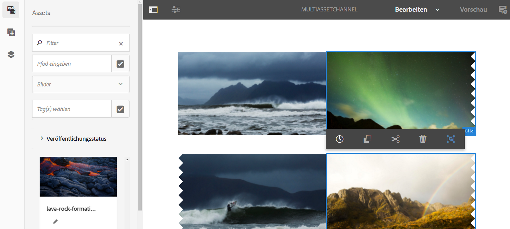

# Aktivierung auf Asset-Ebene {#asset-level-scheduling}

In diesem Abschnitt wird die Aktivierung auf Asset-Ebene für die in Kanälen verwendeten Assets beschrieben.

In diesem Abschnitt werden die folgenden Themen behandelt:

* Überblick
* Aktivierungsfenster
* Wiedergabe einzelner Ereignisse
* Umgang mit sich wiederholenden Assets
   * Tagesaufteilung
   * Wochenaufteilung
   * Monatsaufteilung
* Aktivierung mehrerer Assets

>[!CAUTION]
>
>Diese AEM Screens-Funktion ist nur verfügbar, wenn Sie AEM 6.3 Feature Pack 3 oder AEM 6.4 Screens Feature Pack 1 installiert haben.
>
>Wenden Sie sich an den Adobe-Support, um Zugriff auf dieses Feature Pack zu erhalten. Wenn Sie die entsprechenden Berechtigungen erhalten haben, können Sie es von Package Share herunterladen.

## Überblick {#overview}

***Aktivierung*** auf Asset-Ebene: Sie können ein bestimmtes Asset in einem Kanal für einen geplanten Zeitraum in der lokalen Zeitzone des Players aktivieren. Diese Funktion ist für Bilder, Videos, Übergänge, Seiten und eingebettete Kanäle (dynamisch oder statisch) verfügbar.

*Beispielsweise* soll eine Sonderaktion nur montags und mittwochs während der Happy Hour (14.00 bis 17.00 Uhr) angezeigt werden.

Mit der Funktion können Sie nicht nur Start- und Enddatum sowie -zeit, sondern auch ein Wiederholungsmuster angeben.

## Wiedergabe einzelner Ereignisse {#single-event-playback}

Asset Level Activation is done by configuring the **Activation** tab while accessing properties of an asset.

Gehen Sie wie folgt vor, um die Zeitplanung auf der Asset-Ebene durchzuführen:

1. Wählen Sie einen beliebigen Kanal aus und klicken Sie in der Aktionsleiste auf **Bearbeiten**, um im Kanal Inhalte hinzuzufügen oder zu bearbeiten.

   

   >[!NOTE]
   >
   >Detaillierte Informationen zum
   >
   >* Erstellen eines Projekts finden Sie unter [Erstellen eines neuen Projekts](creating-a-screens-project.md).
   >* Erstellen von Inhalten und Hinzufügen zu einem Kanal finden Sie unter [Verwalten von Kanälen](managing-channels.md).

1. Klicken Sie auf **Bearbeiten**, um den Kanaleditor zu öffnen und ein Asset auszuwählen, das Sie zeitlich planen möchten.

   

1. Wählen Sie das Asset aus und klicken Sie oben links auf das Symbol **Konfigurieren**, um die Eigenschaften des Bilds zu öffnen.

   Klicken Sie auf die Registerkarte **Aktivierung**.

   

1. Sie können das Datum von der Datumsauswahl mit **Aktiv von** und **Aktiv bis** zu den Feldern angeben.

   Wenn Sie Datum und Uhrzeit für die Optionen **Aktiv ab** und **Aktiv bis** wählen, wird das Asset nur zwischen Startdatum/Startzeit und Enddatum/Endzeit angezeigt und in einer Schleife abgespielt.

   

## Umgang mit sich wiederholenden Assets {#handling-recurrence-in-assets}

Sie können eine Wiederholung von Assets Ihren Anforderungen entsprechend in bestimmten Intervallen auf Tages-, Wochen- oder Monatsbasis planen.

Angenommen, Sie möchten ein Bild nur freitags von 13.00 bis 22.00 Uhr anzeigen. You can use the **Activation** tab to set the desired recurring interval for your asset.

### Tagesaufteilung {#day-parting}

1. Wählen Sie das Asset aus und klicken Sie auf das Symbol **Konfigurieren**, um das Dialogfeld „Eigenschaften“ zu öffnen.

1. Nach Eingabe des Anfangsdatums/der Startzeit und der Endzeit/des Datums können Sie einen Ausdruck oder eine kostenlose Textversion verwenden, um Ihren Wiederholungsplan anzugeben.

   > [!NOTE]
   > Sie können die Felder &quot; **Aktiv von** &quot;und &quot; **Aktiv bis** &quot;überspringen oder einschließen und den Ausdruck entsprechend Ihren Anforderungen zum Feld &quot;Zeitpläne&quot;hinzufügen.

1. Geben Sie den Ausdruck in den **Zeitplan** ein, und Ihr Asset wird für das jeweilige Tages- und Uhrzeitintervall angezeigt.

#### Beispielausdrücke für die Tagesaufteilung {#example-one}

Die folgende Tabelle enthält einige Beispielausdrücke, die Sie dem Zeitplan hinzufügen können, während Sie einer Anzeige einen Kanal zuweisen.

| **Ausdruck** | **Interpretation** |
|---|---|
| vor 8:00 Uhr | der Kanal wird täglich vor 8:00 Uhr wiedergegeben |
| nach 14:00 Uhr | der Kanal wird täglich nach 14.00 Uhr wiedergegeben |
| nach 12:15 Uhr und vor 12:45 Uhr | der Kanal wird täglich für 30 Minuten nach 12:15 Uhr wiedergegeben |
| vor 12:15 Uhr auch nach 12:45 Uhr | Der Kanal wird täglich vor 12:15 Uhr und danach auch nach 12:45 Uhr wiedergegeben |
| Mon, Tue, Wed oder Mon-Wed | Das Asset wird von Montag bis Mittwoch im Kanal wiedergegeben |

### Wochenaufteilung {#week-parting}

1. Wählen Sie das Asset aus und klicken Sie auf das Symbol **Konfigurieren**, um das Dialogfeld „Eigenschaften“ zu öffnen.

1. Nach Eingabe des Anfangsdatums/der Startzeit und der Endzeit/des Datums können Sie einen Ausdruck oder eine kostenlose Textversion verwenden, um Ihren Wiederholungsplan anzugeben.

   > [!NOTE]
   > Sie können die Felder &quot; **Aktiv von** &quot;und &quot; **Aktiv bis** &quot;überspringen oder einschließen und den Ausdruck entsprechend Ihren Anforderungen zum Feld &quot;Zeitpläne&quot;hinzufügen.

1. Geben Sie den Ausdruck in den **Zeitplan** ein, und Ihr Asset wird für das jeweilige Tages- und Uhrzeitintervall angezeigt.

#### Beispielausdrücke für die Wochenaufteilung {#example-two}

Die folgende Tabelle enthält einige Beispielausdrücke, die Sie dem Zeitplan hinzufügen können, während Sie einer Anzeige einen Kanal zuweisen.

| **Ausdruck** | **Interpretation** |
|---|---|
| vor 8:00 Uhr | der Kanal wird täglich vor 8:00 Uhr wiedergegeben |
| nach 14:00 Uhr | der Kanal wird täglich nach 14.00 Uhr wiedergegeben |
| nach 12:15 Uhr und vor 12:45 Uhr | der Kanal wird täglich für 30 Minuten nach 12:15 Uhr wiedergegeben |
| vor 12:15 Uhr auch nach 12:45 Uhr | Der Kanal wird täglich vor 12:15 Uhr und danach auch nach 12:45 Uhr wiedergegeben |

### Monatsaufteilung {#month-parting}

1. Wählen Sie das Asset aus und klicken Sie auf das Symbol **Konfigurieren**, um das Dialogfeld „Eigenschaften“ zu öffnen.
1. Nach Eingabe des Anfangsdatums/der Startzeit und der Endzeit/des Datums können Sie einen Ausdruck oder eine kostenlose Textversion verwenden, um Ihren Wiederholungsplan anzugeben.

   > [!NOTE]
   > Sie können die Felder &quot; **Aktiv von** &quot;und &quot; **Aktiv bis** &quot;überspringen oder einschließen und den Ausdruck entsprechend Ihren Anforderungen zum Feld &quot;Zeitpläne&quot;hinzufügen.

1. Geben Sie den Ausdruck in den **Zeitplan** ein, und Ihr Asset wird für das jeweilige Tages- und Uhrzeitintervall angezeigt.

#### Beispielausdrücke für die Monatsaufteilung {#example-three}

Die folgende Tabelle enthält einige Beispielausdrücke, die Sie dem Zeitplan hinzufügen können, während Sie einer Anzeige einen Kanal zuweisen.

| **Ausdruck** | **Interpretation** |
|---|---|
| vom Februar, Mai, August, November | Das Asset wird im Februar, Mai, August, November |
| nach 14:00 Uhr | der Kanal wird täglich nach 14.00 Uhr wiedergegeben |
| nach 12:15 Uhr und vor 12:45 Uhr | der Kanal wird täglich für 30 Minuten nach 12:15 Uhr wiedergegeben |
| vor 12:15 Uhr auch nach 12:45 Uhr | Der Kanal wird täglich vor 12:15 Uhr und danach auch nach 12:45 Uhr wiedergegeben |

> [!NOTE]
> Bei der Definition von Wochentagen und Monaten können Sie sowohl die Kurzbezeichnung als auch den Vollnamen verwenden, z. B. &quot;Mon/Montag&quot;und &quot;Jan/Januar&quot;.

## Aktivierung mehrerer Assets {#multi-asset-scheduling}

>[!CAUTION]
>
>The **Multi-asset Activation** feature is only available, if you have installed AEM 6.3 Feature Pack 5 or AEM 6.4 Feature Pack 3.

***Die Aktivierung*** mehrerer Assets ermöglicht es dem Benutzer, mehrere Assets auszuwählen und einen Wiedergabezeitplan auf alle ausgewählten Assets anzuwenden.

### Voraussetzungen {#prerequisites}

Um die Aktivierung auf mehreren Assets zu verwenden, erstellen Sie ein AEM Screens-Projekt mit einem Sequenzkanal. Im folgenden Anwendungsbeispiel wird die Implementierung der Funktion veranschaulicht:

* Erstellen Sie ein AEM Screens-Projekt mit dem Titel **MultiAssetDemo**
* Erstellen Sie einen Kanal mit der Bezeichnung **MultiAssetChannel** und fügen Sie dem Kanal Inhalt hinzu, wie in der folgenden Abbildung dargestellt

Gehen Sie wie folgt vor, um mehrere Assets auszuwählen und ihre Anzeige in einem AEM Screens-Projekt zu planen:

1. Wählen Sie **MultiAssetChannel** aus und klicken Sie in der Aktionsleiste auf **Bearbeiten**, um den Editor zu öffnen.

   

1. Wählen Sie im Editor mehrere Assets aus und klicken Sie auf **Aktivierung bearbeiten** (Symbol oben links).

   

1. Wählen Sie Datum und Uhrzeit in **Aktiv von** und **Aktiv bis** im Dialogfeld **Komponentenaktivierung** aus. Klicken Sie auf das Häkchen, nachdem Sie die Zeitpläne ausgewählt haben.

   

1. Klicken Sie auf „Aktualisieren“, um die Assets zu überprüfen, auf die der Multi-Asset-Plan angewendet wird.

   >[!NOTE]
   >
   >Das Symbol &quot;Plan&quot;ist rechts oben in den Assets mit Aktivierung mehrerer Assets sichtbar.

   

## Beispielausdrücke {#example-expressions}

Die folgende Tabelle enthält einige Beispielausdrücke, die Sie dem Zeitplan hinzufügen können, während Sie einer Anzeige einen Kanal zuweisen.

| **Ausdruck** | **Interpretation** |
|---|---|
| vor 8:00 Uhr | der Kanal wird täglich vor 8:00 Uhr wiedergegeben |
| nach 14:00 Uhr | der Kanal wird täglich nach 14.00 Uhr wiedergegeben |
| nach 12:15 Uhr und vor 12:45 Uhr | der Kanal wird täglich für 30 Minuten nach 12:15 Uhr wiedergegeben |
| vor 12:15 Uhr auch nach 12:45 Uhr | Der Kanal wird täglich vor 12:15 Uhr und danach auch nach 12:45 Uhr wiedergegeben |
| am 1. Januar nach 14:00 Uhr auch am 2. Januar, auch am 3. Januar vor 3:00 Uhr | Der Kanal beginnt die Wiedergabe am 1. Januar um 14:00 Uhr, läuft den ganzen Tag am 2. Januar, bis um 3:00 Uhr am 3. Januar |
| am 1./2. Januar nach 14:00 Uhr auch am 2./3. Januar vor 3:00 Uhr | Der Kanal startet den Player am 1. Januar um 14:00 Uhr, läuft bis 3:00 Uhr am 2. Januar und beginnt dann am 2. Januar um 14:00 Uhr und läuft bis 3:00 Uhr am 3. Januar |

>[!NOTE]
>Sie können das _24-Stunden-Format_ (d. h. 14:00 Uhr) oder die *am/pm*-Notation (d. h. 2:00 pm) verwenden.
