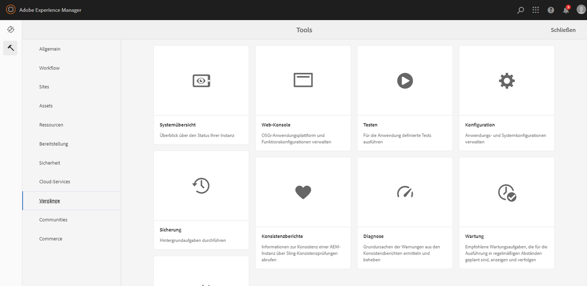

# Konfigurieren von Autoren- und Veröffentlichungsinstanzen in AEM Screens {#configuring-author-and-publish-in-aem-screens}

Auf dieser Seite werden folgende Themen hervorgehoben:

* **Konfigurieren von Autoren- und Veröffentlichungsinstanzen**
* **Einrichten der Veröffentlichungstopologie**
* **Verwalten von Veröffentlichungen: Bereitstellen von Inhaltsaktualisierungen vom Autor zur Veröffentlichung auf dem Gerät**

## Voraussetzungen {#prerequisites}

Bevor Sie mit Autoren- und Veröffentlichungs-Servern beginnen, sollten Sie mit folgenden Themen vertraut sein:

* **AEM-Topologie**
* **Erstellen und Verwalten von AEM Screens-Projekten**
* **Verfahren zur Geräteregistrierung**

>[!NOTE]
>
>Diese AEM Screens-Funktion ist nur verfügbar, wenn Sie das Feature Pack 2 für AEM 6.4 Screens installiert haben.  Wenden Sie sich an den Adobe-Support, um Zugriff auf dieses Feature Pack zu erhalten.  Nachdem Sie die entsprechenden Berechtigungen erhalten haben, können Sie es von Package Share herunterladen.

>[!IMPORTANT]
>
>Wenn Sie mehr als eine Veröffentlichungsinstanz mit dem Dispatcher verwenden möchten, aktualisieren Sie den Dispatcher. Weitere Informationen finden Sie unter [Aktivieren von fixierbaren Sitzungen](dispatcher-configurations-aem-screens.md#enable-sticky-session).

## Konfigurieren von Autoren- und Veröffentlichungsinstanz {#configuring-author-and-publish-instances}

>[!NOTE]
>
>Weitere Informationen zur Architektur der Autoren- und Veröffentlichungsinstanz sowie über die Methode, mit der Inhalte in einer AEM-Autoreninstanz verfasst und dann an mehrere Veröffentlichungsinstanzen vorwärts repliziert werden, finden Sie unter [Architektonischer Überblick zur Autoren- und Veröffentlichungsinstanz](author-publish-architecture-overview.md).

Im folgenden Abschnitt wird beschrieben, wie sich in der Autoren- und Veröffentlichungstopologie Replikationsagenten einrichten lassen.

Sie können ein einfaches Beispiel anlegen, in dem Sie eine Autoren- und zwei Veröffentlichungsinstanzen hosten:

* Autor > localhost:4502
* Veröffentlichung 1 (pub1) > localhost:4503
* Veröffentlichung 2 (pub2) > localhost:4504

## Einrichten von Replikationsagenten in der Autoreninstanz {#setting-replication-agents}

Um Replikationsagenten zu erstellen, bringen Sie in Erfahrung, wie man einen standardmäßigen Replikationsagenten erstellt.

Für Screens sind drei Replikationsagenten erforderlich:

1. **Standardmäßiger Replikationsagent ***(angegeben als*** Standard Replication Agent**)
1. **Screens-Replikationsagent**
1. **Agent für Rückwärtsreplikation**

### Schritt 1: Erstellen eines standardmäßigen Replikationsagenten {#step-creating-a-default-replication-agent}

Gehen Sie wie folgt vor, um einen standardmäßigen Replikationsagenten einzurichten:

1. Navigieren Sie zu Ihrer AEM-Instanz > Hammersymbol > **Vorgänge** > **Konfiguration**.

   

1. Klicken Sie in der linken Navigationsstruktur auf **Replikation**.

   

1. Klicken Sie auf **Agenten für Autor** aus dem Ordner **Replikation** und klicken Sie auf **Neu**, um einen neuen standardmäßigen Replikationsagenten zu erstellen.

   

1. Geben Sie **Titel** und **Name** ein, damit Sie den Replikationsagenten erstellen können, und klicken Sie dann auf **Erstellen**.

   

1. Klicken Sie mit der rechten Maustaste auf den Replikationsagenten und wählen Sie **Öffnen**, um die Einstellungen zu bearbeiten.

   

1. Klicken Sie auf **Bearbeiten**.

1. Geben Sie im Dialogfeld **Agenteneinstellungen** die Details ein.

   >[!NOTE]
   >
   >Die Benutzenden müssen die Option **Aktiviert** ankreuzen, um den Replikationsagenten zu aktivieren. Aktivieren Sie diese Option für standardmäßige Agenten, Screens-Replikationsagenten und Agenten für die Rückwärtsreplikation.

   

1. Navigieren Sie zur Registerkarte **Transport** und geben Sie den **URI**, den **Benutzer** und das **Kennwort** ein.

   

   >[!NOTE]
   >
   >Alternativ können Sie einen vorhandenen Replikationsagenten kopieren und umbenennen.

#### Erstellen von standardmäßigen Replikationsagenten {#creating-standard-replication-agents}

1. Erstellen Sie einen standardmäßigen Replikationsagenten für pub1 (der vordefinierte Standardagent sollte bereits konfiguriert sein). Beispiel: *`https://<hostname>:4503/bin/receive?sling:authRequestLogin=1`*
1. Richten Sie einen standardmäßigen Replikationsagenten für pub2 ein. Sie können den Replikationsagenten von pub1 kopieren und den für pub2 zu verwendenden Transport aktualisieren, indem Sie in der Transportkonfiguration den Port ändern. Zum Beispiel: *`https://<hostname>:4504/bin/receive?sling:authRequestLogin=1`*.

#### Erstellen von Screens-Replikationsagenten {#creating-screens-replication-agents}

1. Richten Sie einen AEM Screens-Replikationsagenten für pub1 ein. Standardmäßig gibt es einen benannten Screens-Replikationsagenten, der auf Port 4503 verweist. Aktivieren Sie diesen.
1. Richten Sie einen AEM Screens-Replikationsagenten für pub2 ein. Kopieren Sie den Screens-Replikationsagenten für pub1 und ändern Sie den Port für pub2 so, dass er auf 4504 verweist.

   >[!NOTE]
   >Informationen zum Konfigurieren von Screens-Replikationsagenten finden Sie unter [Konfigurieren von Screens-Replikationsagenten](https://experienceleague.adobe.com/de/docs/experience-manager-screens/user-guide/administering/configure-screens-replication).

#### Erstellen von Screens-Agenten für die Rückwärtsreplikation {#creating-screens-reverse-replication-agents}

1. Erstellen Sie für pub1 einen Agenten für die Rückwärtsreplikation.
1. Erstellen Sie für pub2 einen Agenten für die Rückwärtsreplikation. Sie können den Agenten für die Rückwärtsreplikation von pub1 kopieren und den für pub2 zu verwendenden Transport aktualisieren, indem Sie in der Transportkonfiguration den Port ändern.

## Einrichten der Veröffentlichungstopologie {#setting-up-publish-topology}

### Schritt 1: Konfigurieren der Apache Sling Oak-basierten Erkennung {#step-configure-apache-sling-oak-based-discovery}

Einrichten der Apache Sling Oak-basierten Erkennung für alle Veröffentlichungsinstanzen in der Topologie

Für jede Veröffentlichungsinstanz:

1. Navigieren Sie zu `https://<host>:<port>/system/console/configMgr`
1. Klicken Sie auf die Konfiguration **Apache Sling Oak-basierter Erkennungs-Service**.
1. Aktualisieren Sie die Topologie-Connector-URLs: Fügen Sie URLs aller beteiligten Veröffentlichungsinstanzen hinzu, d. h.:
   * `https://publish:4503/libs/sling/topology/connector`
   * `https://publish:4504/libs/sling/topology/connector`
1. ** `Whitelist`-Liste der Topologie-Connectoren**: Passen Sie diese entsprechend den IP-Adressen oder Subnetzen an, die alle Veröffentlichungsinstanzen abdecken. Stellen Sie sicher, dass Sie die IP-Adresse/den Host-Namen aller Veröffentlichungsinstanzen ohne Port-Nummer auf die `whitelist` setzen.

1. Aktivieren Sie **Auto-Stop Local-Loops**

Die Konfiguration sollte für jede Veröffentlichungsinstanz identisch sein. Durch „Auto-Stop Local-Loops“ wird eine Endlosschleife verhindert.

#### Schritt 2: Überprüfen der Veröffentlichungstopologie {#step-verify-publish-topology}

Navigieren Sie bei allen Veröffentlichungsinstanzen zu `https://:/system/console/topology`. Sie sollten unter **Ausgehende Topologie-Connectoren** alle Veröffentlichungsinstanzen in der Topologie dargestellt sehen können.

#### Schritt 3: Einrichten des ActiveMQ Artemis-Clusters {#step-setup-activemq-artemis-cluster}

In diesem Schritt können Sie ein verschlüsseltes Kennwort für den ActiveMQ Artemis-Cluster erstellen.
Die Cluster-Benutzerin bzw. der Cluster-Benutzer und das Kennwort müssen für alle Veröffentlichungsinstanzen in der Topologie identisch sein. Das Kennwort der ActiveMQ Artemis-Konfiguration muss verschlüsselt werden. Da jede Instanz über einen eigenen Verschlüsselungsschlüssel verfügt, müssen Sie mit Crypto Support eine verschlüsselte Kennwortzeichenfolge erstellen. Dann wird das verschlüsselte Kennwort in der OSGi-Konfiguration für ActiveMQ verwendet.

In jeder Veröffentlichungsinstanz:

1. Navigieren Sie in der OSGi-Konsole zu **MAIN** > **Crypto Support** (`https://<host>:<port>/system/console/crypto`).
1. Geben Sie in **Nur Text** das gewünschte Passwort (nur Text) ein, für alle Instanzen das gleiche.
1. Klicken Sie auf **Schützen**.
1. Kopieren Sie den Wert **Geschützter Text** in das Notepad oder einen Texteditor. Dieser Wert kann in der OSGi-Konfiguration für ActiveMQ verwendet werden.

Da jede Veröffentlichungsinstanz standardmäßig über eindeutige Verschlüsselungsschlüssel verfügt, müssen Sie diesen Schritt für jede Veröffentlichungsinstanz ausführen und den eindeutigen Schlüssel für die nächste Konfiguration speichern.

>[!NOTE]
>
>Das Passwort sollte mit geschweiften Klammern beginnen und enden. Beispiel:
>`{1ec346330f1c26b5c48255084c3b7272a5e85260322edd59119828d1fa0a610e}`

#### Schritt 4: Aktivieren des ActiveMQ Artemis-Clusters {#step-activate-activemq-artemis-cluster}

Tun Sie für jede Veröffentlichungsinstanz Folgendes:

1. Navigieren Sie zum OSGi-Konfigurations-Manager `https://<host>:<port>/system/console/configMgr`
1. Klicken Sie auf die Konfiguration **Apache ActiveMQ Artemis JMS Provider**
1. Aktualisieren Sie Folgendes:

   * ***Cluster-Kennwort***: Verwenden Sie den verschlüsselten Wert aus dem vorherigen Schritt pro Instanz
   * ***Themen***: `{name: 'commands', address: 'com.adobe.cq.screens.commands', maxConsumers: 50}`

#### Überprüfen des ActiveMQ Artemis-Clusters {#verify-activemq-artemis-cluster}

Gehen Sie in jeder Veröffentlichungsinstanz wie folgt vor:

1. Navigieren Sie zur OSGi-Konsole > „Haupt“ > „ActiveMQ Artemis“ `https://localhost:4505/system/console/mq`.
1. Überprüfen Sie die Ports anderer Instanzen unter „Cluster-Informationen“ > „Topologie“ > „nodes=2, members=2“.
1. Senden Sie eine Testnachricht (oben im Bildschirm unter „Broker-Informationen“).
1. Geben Sie folgende Änderungen in die Felder ein:

   1. **Ziel**: /com.adobe.cq.screens/devTestTopic
   1. **Text**: Hallo Welt
   1. Zeigen Sie für jede Instanz das `error.log` an, um zu prüfen, ob die Nachricht im ganzen Cluster gesendet und empfangen wurde.

>[!NOTE]
>
>Das Navigieren zur OSGi-Konsole kann nach dem Speichern der Konfiguration im vorherigen Schritt einige Sekunden dauern. Sie können das Fehlerprotokoll (error.log) auch auf weitere Details prüfen.

Beispiel: Das folgende Bild zeigt eine erfolgreiche Konfiguration von ActiveMQ Artemis Server.

Wenn Sie die folgende Konfiguration über */system/console/mq* nicht sehen können, navigieren Sie zu */system/console/mq* und klicken Sie auf **Neu starten**, um den Broker neu zu starten.

#### Anforderung für Referrer-Header entfernen {#remove-referrer-header-requirement}

Führen Sie für jede Veröffentlichungsinstanz folgende Schritte aus:

1. Navigieren Sie zu **OSGi-Konsole** > **Configuration Manager**
1. Klicken Sie auf **Apache Sling Referrer Filter**
1. Aktualisieren Sie die Konfiguration und aktivieren Sie **Leere erlauben**

### Konfigurieren der Autoren- und Veröffentlichungsinstanz {#configuring-author-and-publish-instance}

Nach dem Einrichten der Veröffentlichungstopologie müssen Sie die Autoren- und Veröffentlichungsinstanzen konfigurieren, um die praktischen Ergebnisse der Implementierung anzuzeigen:

>[!NOTE]
>
>**Voraussetzungen**
>
>Erstellen Sie zunächst ein AEM Screens-Projekt und anschließend einen Standort, eine Anzeige und einen Kanal in Ihrem Projekt. Fügen Sie Ihrem Kanal Inhalte hinzu und weisen Sie den Kanal einer Anzeige zu.

#### Schritt 1: Starten eines AEM Screens-Players (Gerät)

1. Öffnen Sie ein separates Browser-Fenster.
1. Rufen Sie mithilfe des *Webbrowsers*, d. h. `https://localhost:4502/content/mobileapps/cq-screens-player/firmware.html`, den Screens-Player auf oder starten Sie die AEM Screens-App. Wenn Sie das Gerät öffnen, können Sie sehen, dass das Gerät nicht registriert ist.

>[!NOTE]
>
>Sie können einen AEM Screens-Player über die heruntergeladene AEM Screens-App oder mithilfe des Webbrowsers öffnen.

#### Schritt 2: Registrieren eines Geräts in der Autoreninstanz {#step-registering-a-device-on-author}

1. Navigieren Sie zu `https://localhost:4502/screens.html/content/screens/we-retail` oder klicken Sie auf das Projekt und navigieren Sie zu „Geräte“ > „Geräte-Manager“.
1. Klicken Sie auf **Gerät registrieren**.
1. Klicken Sie auf **Geräteregistrierung**.
1. Klicken Sie auf das Gerät, das Sie registrieren möchten, und dann auf **Gerät registrieren**.
1. Überprüfen Sie den Registrierungs-Code und klicken Sie dann auf **Validieren**.
1. Geben Sie einen Titel für Ihr Gerät ein und klicken Sie dann auf **Registrieren**.

#### Schritt 3: Zuweisen des Geräts zur Anzeige {#step-assigning-the-device-to-display}

1. Klicken Sie im Dialogfeld aus dem vorherigen Schritt auf **Anzeige zuweisen**.
1. Klicken Sie im Ordner **Standorte** auf den Anzeigepfad für Ihren Kanal.
1. Klicken Sie auf **Zuweisen**.
1. Klicken Sie auf **Beenden**, um den Vorgang abzuschließen. Das Gerät ist jetzt zugewiesen.

Überprüfen Sie den Player und beachten Sie den Inhalt, den Sie in Ihrem Kanal hinzugefügt haben.

#### Schritt 4: Veröffentlichen der Gerätekonfiguration auf Veröffentlichungsinstanzen {#step-publishing-device-configuration-to-publish-instances}

**Überprüfen des Geräts**

Gehen Sie wie folgt vor, um die Benutzerin bzw. den Benutzer des Geräts zu replizieren:

1. Navigieren Sie zur Admin-Seite für Benutzende.  Zum Beispiel: `https://localhost:4502/useradmin`.
1. Suchen Sie nach der Gruppe **`screens-devices-master`**.
1. Klicken Sie mit der rechten Maustaste auf die Gruppe und wählen Sie **Aktivieren**.

>[!CAUTION]
>
>Aktivieren Sie nicht „author-publish-screens-service“, da es sich dabei um eine Systembenutzerin oder einen Systembenutzer handelt, die bzw. der vom Autorenauftrag verwendet wird.

Sie können das Gerät auch über die Geräteverwaltungskonsole aktivieren. Führen Sie dazu folgende Schritte durch:

1. Navigieren Sie zu Ihrem Screens-Projekt > **Geräte**.
1. Klicken Sie in der Aktionsleiste auf **Geräte-Manager**.
1. Wählen Sie das Gerät aus und klicken Sie in der Aktionsleiste auf **Aktivieren** (wie in der folgenden Abbildung dargestellt).

>[!NOTE]
>
>Alternativ können Sie nach der Aktivierung des Geräts auch die Server-URL bearbeiten oder aktualisieren. Klicken Sie in der Aktionsleiste auf **Server-URL bearbeiten**, wie in der Abbildung unten gezeigt. Ihre Änderungen werden auf den AEM Screens-Player übertragen.

### Checkliste für Veröffentlichungen {#publishing-check-list}

Folgende Punkte fassen die Checkliste für Veröffentlichungen zusammen:

* *Screens-Gerätebenutzer*: Diese Information wird als AEM-Benutzerin oder -Benutzer gespeichert und kann über **Tools** > **Sicherheit** > **Benutzer** aktiviert werden. Der Benutzerin oder dem Benutzer wird „screens“ mit einer langen, serialisierten Zeichenfolge vorangestellt.

* *Projekt*: Das AEM Screens-Projekt.
* *Standort*: Der Standort, mit dem das Gerät verbunden ist.
* *Kanäle*: Ein oder mehrere Kanäle, die am Standort gezeigt werden.
* *Zeitplan*: Stellen Sie bei Verwendung eines Zeitplans sicher, dass dieser veröffentlicht wird.
* *Standort-, Zeitplan- und Kanalordner*: Wenn sich die entsprechenden Ressourcen in einem Ordner befinden.

Gehen Sie wie folgt vor, um das Verhalten von Autoren- und Veröffentlichungsinstanzen zu überprüfen:

1. Aktualisieren Sie einige Kanalinhalte in der Autoreninstanz.
1. Führen Sie **Veröffentlichung verwalten** aus, um neue Änderungen in allen Veröffentlichungsinstanzen zu veröffentlichen.
1. Wählen Sie **Aktivieren**, um das Gerät über den **Geräte-Manager** zu aktivieren.
1. Ändern Sie die URL (**URL bearbeiten**) von der Autoreninstanz-URL in die URL einer der Veröffentlichungsinstanzen.
1. Überprüfen Sie, ob der aktualisierte Kanalinhalt im AEM Screens-Player angezeigt wird.
1. Wiederholen Sie diese Schritte mit einer anderen Veröffentlichungsinstanz.

#### Schritt 5: Verweisen des Geräts auf eine Veröffentlichungsinstanz im Admin-Bedienfeld {#step-pointing-the-device-to-publish-instance-in-the-admin-panel}

1. Um die Administrator-Benutzeroberfläche vom Screens-Player aus zu öffnen, halten Sie die linke obere Ecke lange gedrückt, um das Menü „Admin“ auf Ihrem Touch-optimierten AEM Screens-Player öffnen zu können, oder verwenden Sie eine Maus.
1. Klicken Sie im seitlichen Bereich auf die Option **Konfiguration**.
1. Wechseln Sie in **Server** von der Autoreninstanz zur Veröffentlichungsinstanz.

Sehen Sie sich die Änderungen in Ihrem AEM Screens-Player an.

Alternativ können Sie über die Geräteverwaltungskonsole die Server-URL aktualisieren/bearbeiten:

1. Navigieren Sie zu Ihrem AEM Screens-Projekt und wählen Sie den Ordner **Geräte**.
1. Klicken Sie in der Aktionsleiste auf **Geräte-Manager**.
1. Klicken Sie auf das Gerät und dann in der Aktionsleiste auf **Server-URL bearbeiten**, wie in der folgenden Abbildung dargestellt. Ihre Änderungen werden auf den AEM Screens-Player übertragen.

Mit der Funktion **Veröffentlichung verwalten** können Sie Inhaltsaktualisierungen von Author an Publish und dann an das Gerät senden. Sie können Inhalte für Ihr gesamtes AEM Screens-Projekt oder nur für einzelne Kanäle, Standorte, Geräte, Anwendungen oder einen Zeitplan veröffentlichen bzw. die Veröffentlichung aufheben. Weitere Informationen zu dieser Funktion finden Sie unter [On-Demand-Inhaltsaktualisierungen](on-demand-content.md).

## Tipps zur Fehlerbehebung {#troubleshoot-tips}

Im folgenden Abschnitt finden Sie Antworten auf häufig gestellte Fragen zur Einrichtung von Autoren-/Veröffentlichungsinstanzen.

### Wie kann nach der ersten Registrierung und Zuweisung eine Umleitung von https zu http hinzugefügt werden? {#add-redirect}

**Lösung**
Setzen Sie unter „Aktivieren“ die Option `Proxy/Load Balancer Connection in the Jetty configuration` auf `true`.

### Wie werden Offline-Inhalte und Player-Download-Probleme mit Assets außerhalb von `/content/dam/projects/<project>` aktualisiert? {#update-offline-content}

**Lösung**
Erteilen Sie Leseberechtigungen für den Benutzer „bulk-offline-update-screens-service“ und die Gruppe `screens-devices-master` für ganz `/content/dam` oder, wenn Sie restriktiver sein möchten, für die spezifischen Assets, die Sie verwenden möchten.

### Wie können Screens-Replikationsagenten-Fehler behoben werden? {#replication-agent}

**Lösung**
Vergewissern Sie sich, dass Sie in der Agentenkonfiguration die Option „Für Rückwärtsreplikation verwenden“ nicht aktiviert haben. Der Screens-Replikationsagent kann nicht als Agent für die Rückwärtsreplikation verwendet werden. Ziel dieser Funktion ist, Gerätebefehle von der Autoren- an die Veröffentlichungsinstanz weiterzuleiten.