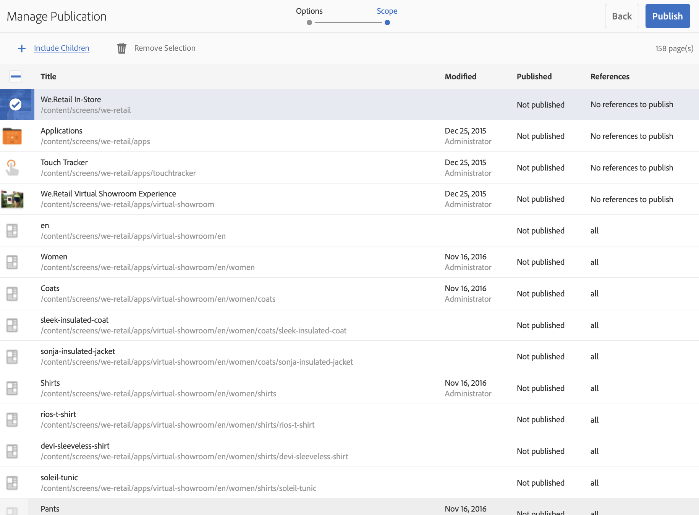

# Konfigurieren von Authoring und Veröffentlichung in AEM-Bildschirmen {#configuring-author-and-publish-in-aem-screens}

Auf dieser Seite werden die folgenden Themen hervorgehoben:

* **Authoring- und Veröffentlichungsinstanzen konfigurieren**
* **Einrichten der Veröffentlichungstopologie**
* **Verwalten von Veröffentlichungen: Bereitstellen von Inhaltsaktualisierungen vom Autor zum Veröffentlichen auf dem Gerät**

## Voraussetzungen {#prerequisites}

Bevor Sie mit Autor- und Veröffentlichungsservern beginnen, sollten Sie über Folgendes verfügen:

* **AEM-Topologie**
* **AEM Screens-Projekt erstellen und verwalten**
* **Geräteregistrierungsprozess**

>[!NOTE]
>
>Diese AEM Screens-Funktion ist nur verfügbar, wenn Sie AEM 6.4 Screens Feature Pack 2 installiert haben. Wenden Sie sich an den Adobe-Support, um Zugriff auf dieses Feature Pack zu erhalten. Wenn Sie die entsprechenden Berechtigungen erhalten haben, können Sie es von Package Share herunterladen.

## Authoring- und Veröffentlichungsinstanzen konfigurieren {#configuring-author-and-publish-instances}

>[!NOTE]
>
>Weitere Informationen zum Überblick über die Authoring- und Veröffentlichungsarchitektur sowie dazu, wie der Inhalt in einer AEM-Autoreninstanz verfasst und dann in mehrere Instanzen im Veröffentlichungsmodus repliziert wird, finden Sie unter Übersicht über die Architektur [für Autoren und Veröffentlichungen](author-publish-architecture-overview.md).

Im folgenden Abschnitt wird beschrieben, wie Replizierungsagenten in der Autor- und Veröffentlichungstopologie eingerichtet werden.

Sie können ein einfaches Beispiel einrichten, in dem Sie einen Autor und zwei Instanzen im Veröffentlichungsmodus hosten:

* Autor —&gt; localhost:4502
* Publish 1 (pub1) —&gt; localhost:4503
* Publish (pub2) —&gt; localhost:4504

## Einrichten von Replizierungsagenten beim Autor {#setting-replication-agents}

Um Replizierungsagenten zu erstellen, müssen Sie lernen, wie Sie einen standardmäßigen Replizierungsagenten erstellen.

Für Bildschirme sind drei Replizierungsagenten erforderlich:

1. **Default Replication Agent ***(angegeben als ***Standard Replication Agent**)
1. **Bildschirmreplikationsagent**
1. **Agent für Rückwärtsreplikation**

### Schritt 1: Erstellen eines standardmäßigen Replizierungsagenten {#step-creating-a-default-replication-agent}

Gehen Sie wie folgt vor, um einen standardmäßigen Replizierungsagenten zu erstellen:

1. Navigieren Sie zu Ihrer AEM-Instanz —&gt; Hammersymbol —&gt; **Vorgänge** —&gt; **Konfiguration**.

   

1. Wählen Sie die **Replikation** aus der linken Navigationsstruktur.

   

1. Wählen Sie die **Agenten für Autor** aus dem Ordner **Replication** und klicken Sie auf **Neu** , um einen neuen Replizierungsagenten zu erstellen.

   

1. Geben Sie den **Titel** und den **Namen** ein, um den Replizierungsagenten zu erstellen, und klicken Sie auf **Erstellen**.

   

1. Klicken Sie mit der rechten Maustaste auf den Replizierungsagenten und klicken Sie auf **Öffnen** , um die Einstellungen zu bearbeiten.

   

1. Klicken Sie auf **Bearbeiten** , um das Dialogfeld " **Agenteinstellungen** "zu öffnen und die Details einzugeben.

   

1. Navigieren Sie zur Registerkarte " **Transport** "und geben Sie den **URI**, den **Benutzer** und das **Kennwort** ein.

   

   >[!NOTE]
   >
   >Sie können auch einen vorhandenen Replizierungsagenten kopieren und umbenennen.

#### Erstellen von Standard-Replizierungsagenten {#creating-standard-replication-agents}

1. Erstellen Sie einen standardmäßigen Replizierungsagenten für pub1 (der standardmäßige Agent, der bereits standardmäßig konfiguriert sein soll) (z. B. *https://&lt;Hostname&gt;:4503/bin/receive?sling:authRequestLogin=1*).
1. Erstellen Sie einen standardmäßigen Replizierungsagenten für pub2. Sie können den Rep Agent für pub1 kopieren und den Transport für pub2 aktualisieren, indem Sie den Port in der Transportkonfiguration ändern. (Beispiel: *https://&lt;Hostname&gt;:4504/bin/receive?sling:authRequestLogin=1*)

#### Erstellen von Replikationsagenten für Bildschirme {#creating-screens-replication-agents}

1. Erstellen Sie den AEM Screens Replizierungsagenten für pub1. Standardmäßig ist ein Bildschirmreplikationsagent vorhanden, der auf Port 4503 verweist. Dies muss aktiviert werden.
1. Erstellen Sie den AEM Screens Replizierungsagenten für pub2. Kopieren Sie den Bildschirmreplikationsagenten für pub1 und ändern Sie den Port in 4504 für pub2.

#### Erstellen von Bildschirmen umgekehrter Replizierungsagenten {#creating-screens-reverse-replication-agents}

1. Erstellen Sie einen standardmäßigen Agenten für die Rückwärtsreplikation für pub1.
1. Erstellen Sie einen standardmäßigen Agenten für die Rückwärtsreplikation für pub2. Sie können den Reverse Rep Agent für pub1 kopieren und den Transport für pub2 aktualisieren, indem Sie den Port in der Transportkonfiguration ändern.

## Einrichten der Veröffentlichungstopologie {#setting-up-publish-topology}

### Schritt 1: Apache Sling Oak-basierte Erkennung konfigurieren {#step-configure-apache-sling-oak-based-discovery}

Einrichten der Apache Sling Oak-basierten Erkennung für alle Veröffentlichungsinstanzen in der Topologie

Für jede Instanz im Veröffentlichungsmodus:

1. Navigieren Sie zu `https://<host>:<port>/system/console/configMgr`
1. Wählen Sie **Apache Sling Oak-Based Discovery Service** Configuration.
1. Topology-Connector-URLs aktualisieren: URLs aller beteiligten Instanzen im Veröffentlichungsmodus hinzufügen, die `https://localhost:4502/libs/sling/topology/connector`
1. Whitelist zum Thema "Topology Connector": an IPs oder Subnetze anpassen, die Instanzen im Zusammenhang mit der teilweisen Veröffentlichung abdecken
1. Lokale Schleifen **automatisch anhalten aktivieren**

Die Konfiguration sollte für jede Instanz im Veröffentlichungsmodus identisch sein, und die "Local-Schleife automatisch beenden"verhindert eine Endlosschleife.

#### Schritt 2: Veröffentlichungstopologie überprüfen {#step-verify-publish-topology}

Navigieren Sie für alle Veröffentlichungsinstanzen zu `https://<host>:<port>/system/console/topology`. Sie sollten jede Instanz im Veröffentlichungsmodus in der Topologie anzeigen.

#### Schritt 3: Setup ActiveMQ-Artemis-Cluster {#step-setup-activemq-artemis-cluster}

Mit diesem Schritt können Sie ein verschlüsseltes Kennwort für den ActiveMQ-Artemis-Cluster erstellen.
Der Clusterbenutzer und das Kennwort aller Veröffentlichungsinstanzen in der Topologie müssen identisch sein. Das Kennwort der ActiveMQ Artemis-Konfiguration muss verschlüsselt sein. Da jede Instanz über einen eigenen Verschlüsselungsschlüssel verfügt, müssen Sie mit der Crypto-Unterstützung eine verschlüsselte Kennwortzeichenfolge erstellen. Dann wird in der OSGi-Konfiguration für ActiveMQ ein verschlüsseltes Kennwort verwendet.

Bei jeder Veröffentlichungsinstanz:

1. Navigieren Sie in der OSGi-Konsole zu **MAIN** —&gt; **Crypto-Unterstützung** (*https://&lt;Host&gt;:&lt;Port&gt;/system/console/crypto*).
1. Geben Sie in **Normaltext das gewünschte Kennwort (für alle Instanzen gleich) ein**
1. Klicken Sie auf **Schützen**.
1. Kopieren Sie den Wert **"Geschützter Text** "in den Notizblock oder Texteditor. Dieser Wert wird in der OSGi-Konfiguration für ActiveMQ verwendet.

Da jede Instanz im Veröffentlichungsmodus standardmäßig über eindeutige Verschlüsselungsschlüssel verfügt, müssen Sie diesen Schritt für jede Instanz im Pub ausführen und den eindeutigen Schlüssel für die nächste Konfiguration speichern.

*Beispiel*,

Pub1 - `{1ec346330f1c26b5c48255084c3b7272a5e85260322edd59119828d1fa0a610e}`Pub2 - `{8d3d113c834cc4f52c2daee0da3cb0a21122a31f0138bfe4b70c9ead79415f41}`

#### Schritt 4: ActiveMQ-Artemis-Cluster aktivieren {#step-activate-activemq-artemis-cluster}

Bei jeder Veröffentlichungsinstanz:

1. Navigieren Sie zum OSGi Config Manager *https://&lt;Host&gt;:&lt;Anschluss&gt;/system/console/configMgr*
1. Wählen Sie **Apache ActiveMQ Artemis JMS Provider** Configuration
1. Aktualisieren Sie Folgendes:

* ***Cluster-Kennwort***: (Verwendung eines verschlüsselten Werts aus dem vorherigen Schritt pro Instanz)
* ***Themen***: {name: 'Befehle', Adresse: 'com.adobe.cq.screens.commands', maxConsumers: 50}

#### ActiveMQ-Artemis-Cluster überprüfen {#verify-activemq-artemis-cluster}

Gehen Sie bei jeder Veröffentlichungsinstanz wie folgt vor:

1. Navigieren Sie zur OSGi-Konsole -&gt; Main &gt; ActiveMQ-Artemis `[https://localhost:4505/system/console/mq`.
1. Überprüfen und überprüfen Sie, um die Anschlüsse anderer Instanzen unter Clusterinformationen &gt; Topologie &gt; Knoten=2, members=2 anzuzeigen.
1. Testnachricht senden (oben im Bildschirm unter "Browserinformationen")
1. Geben Sie die folgenden Änderungen in die Felder ein:

   1. **Ziel**: /com.adobe.cq.screens/devTestTopic
   1. **Text**: Hallo Welt
   1. Zeigen Sie die Datei "error.log"jeder Instanz an, um zu sehen, dass die Nachricht über den Cluster gesendet und empfangen wurde.

>[!NOTE]
>
>Die Navigation zur OSGI-Konsole kann einige Sekunden nach dem Speichern der Konfiguration im vorherigen Schritt dauern. Sie können auch die Datei "error.log"für weitere Details überprüfen.

Beispiel: Die folgende Abbildung zeigt eine erfolgreiche Konfiguration von ActiveMQ Artemis Server.

Wenn Sie die folgende Konfiguration von */system/console/mq* nicht sehen, navigieren Sie zu */system/console/mq* und klicken Sie auf **Neu starten** , um den Makler neu zu starten.

#### Anforderung für Referrer-Header entfernen {#remove-referrer-header-requirement}

Führen Sie die Schritte für jede Instanz im Veröffentlichungsmodus aus:

1. Navigieren Sie zur **OSGi-Konsole** &gt; **Configuration Manager**
1. Select **Apache Sling Referrer Filter**
1. Konfiguration aktualisieren und leere **aktivieren**

### Configuring Author and Publish Instance {#configuring-author-and-publish-instance}

Nachdem Sie die Veröffentlichungstoplogie eingerichtet haben, müssen Sie die Autor- und Veröffentlichungsinstanzen konfigurieren, um die praktischen Ergebnisse der Implementierung anzuzeigen:

>[!NOTE]
>
>**Voraussetzungen**
>
>Um mit diesem Beispiel zu beginnen, erstellen Sie ein neues AEM Screens-Projekt und erstellen Sie anschließend einen Ort, eine Anzeige und einen Kanal in Ihrem Projekt. Fügen Sie Ihrem Kanal Inhalte hinzu und weisen Sie den Kanal einer Anzeige zu.

#### Schritt 1: Starten eines AEM Screens Player (Gerät) {#step-starting-an-aem-screens-player-device}

1. Öffnen Sie ein separates Browserfenster.
1. Go to Screens player using the *web browser*, that is,`https://localhost:4502/content/mobileapps/cq-screens-player/firmware.html` or launch the AEM Screens app. Wenn Sie das Gerät öffnen, können Sie sehen, dass das Gerät nicht registriert ist.

>[!NOTE]
>
>Sie können einen AEM Screens-Player mit der heruntergeladenen AEM Screens-App oder über den Webbrowser öffnen.

#### Schritt 2: Registrieren eines Geräts beim Autor {#step-registering-a-device-on-author}

1. Navigieren Sie zum Projekt `https://localhost:4502/screens.html/content/screens/we-retail` oder wählen Sie es aus und navigieren Sie zu Geräte &gt; Geräte-Manager.
1. Wählen Sie **Gerät** registrieren.
1. Klicken Sie auf **Geräteregistrierung** , um das Gerät anzuzeigen.
1. Wählen Sie das zu registrierende Gerät aus und klicken Sie auf **Gerät registrieren**.
1. Überprüfen Sie den Registrierungscode und klicken Sie auf **Überprüfen**.
1. Geben Sie einen Titel für Ihr Gerät ein und klicken Sie auf **Registrieren**.

#### Step 3: Assigning the Device to Display {#step-assigning-the-device-to-display}

1. Klicken Sie im Dialogfeld im vorherigen Schritt auf **Anzeige** zuweisen.
1. Wählen Sie den Anzeigepfad für Ihren Kanal aus dem Ordner " **Speicherorte** "aus.
1. Klicken Sie auf **Zuweisen**.
1. Click **Finish** to complete the process, and now the device is assigned.

Überprüfen Sie Ihren Player und Sie sehen den Inhalt, den Sie in Ihrem Kanal hinzugefügt haben.

#### Schritt 4: Konfiguration des Veröffentlichungsgeräts auf Veröffentlichungsinstanzen {#step-publishing-device-configuration-to-publish-instances}

**Überprüfen des Geräts**

Bevor Sie die folgenden Schritte ausführen, überprüfen Sie die Geräte-ID. Suchen Sie zur Überprüfung nach der Geräte-ID in CRXDELite mit dem Pfad als */home/users/screens/{project}/devices*.

Gehen Sie wie folgt vor, um den Gerätebenutzer zu replizieren:

1. Navigieren Sie zur Admin-Seite des Benutzers (z. B.: `https://localhost:4502/useradmin`
1. Suchen Sie nach der **Gruppe "screens-devices-master** "
1. Klicken Sie mit der rechten Maustaste auf die Gruppe und klicken Sie auf **Aktivieren**

>[!CAUTION]
>
>Aktivieren Sie nicht den Autorenveröffentlichungs-screens-Service, da es sich um einen Systembenutzer handelt, der vom Autorenauftrag verwendet wird.

Sie können das Gerät auch über die Geräteverwaltungskonsole aktivieren. Gehen Sie wie folgt vor:

1. Navigieren Sie zu Ihrem Screens-Projekt —&gt; **Geräte**.
1. Klicken Sie in der Aktionsleiste auf **Geräte-Manager **s.
1. Wählen Sie das Gerät aus und klicken Sie in der Aktionsleiste auf **Aktivieren** , wie in der Abbildung unten dargestellt.

>[!NOTE]
>
>Alternativ können Sie nach Aktivierung des Geräts auch die Server-URL bearbeiten oder aktualisieren, indem Sie auf **Server-URL bearbeiten **in der Aktionsleiste klicken, wie in der Abbildung unten dargestellt. Ihre Änderungen werden an den AEM Screens Player weitergeleitet.

### Checkliste für Veröffentlichungen {#publishing-check-list}

Die folgenden Punkte fassen die Liste der Veröffentlichungsprüfungen zusammen:

* *Bildschirmgerät-Benutzer* : Dieser wird als AEM-Benutzer gespeichert und über **Tools** &gt; **Sicherheit** &gt; **Benutzer** aktiviert. Dem Benutzer wird eine lange serialisierte Zeichenfolge vorangestellt.

* *Projekt* - Das AEM Screens-Projekt.
* *Ort* : Der Speicherort, an den das Gerät angeschlossen ist.
* *Kanal(e)* - ein oder mehrere Kanäle, die am Ort angezeigt werden
* *Plan* - bei Verwendung eines Zeitplans sicherstellen, dass dieser veröffentlicht wird
* *Speicherort, Zeitpläne und Kanalordner* - wenn sich die entsprechenden Ressourcen in einem Ordner befinden.

Nachdem Sie die Checkliste überprüft haben, müssen Sie die folgenden Änderungen/Verhaltensweisen in Ihrem Kanal überprüfen:

* Öffnen Sie nach dem Veröffentlichen der Gerätekonfiguration die Bildschirmplayer-Konfiguration und verweisen Sie auf die Veröffentlichungsinstanz. Sie können das Gerät auch über die Geräteverwaltungskonsole aktivieren.
* Aktualisieren Sie einige Kanalinhalte im Autorenmodus, veröffentlichen Sie sie und überprüfen Sie, ob der aktualisierte Kanal jetzt im AEM Screens Player angezeigt wird.
* Schließen Sie den Bildschirmplayer an eine andere Instanz im Veröffentlichungsmodus an und überprüfen Sie das obige Verhalten.

#### Schritt 5: Veröffentlichen der Instanz des Geräts zur Veröffentlichung im Admin-Bedienfeld {#step-pointing-the-device-to-publish-instance-in-the-admin-panel}

1. Zeigen Sie die Admin-Benutzeroberfläche vom Bildschirmplayer aus an, drücken Sie die lange Taste oben links, um das Admin-Menü, den Touch-aktivierten AEM Screens-Player oder eine Maus zu öffnen.
1. Klicken Sie im Seitenbedienfeld auf die Option " **Konfiguration** ".
1. Ändern Sie die Autoreninstanz in die Veröffentlichungsinstanz in **Server**.

Zeigen Sie die Änderungen im AEM Screens-Player an.

Alternativ können Sie die Server-URL auch über die Geräteverwaltungskonsole aktualisieren/bearbeiten:

1. Navigieren Sie zu Ihrem AEM Screens-Projekt und wählen Sie den Ordner " **Geräte** "aus.
1. Klicken Sie in der Aktionsleiste auf **Geräte-Manager**.
1. Wählen Sie das Gerät aus und klicken Sie auf **Server-URL bearbeiten **in der Aktionsleiste, wie in der Abbildung unten dargestellt. Ihre Änderungen werden an den AEM Screens-Player übertragen.

## Verwalten von Veröffentlichungen: Bereitstellen von Inhaltsaktualisierungen vom Autor zum Veröffentlichen auf dem Gerät {#managing-publication-delivering-content-updates-from-author-to-publish-to-device}

Sie können Inhalte über AEM-Bildschirme veröffentlichen und die Veröffentlichung rückgängig machen. Mit der Funktion "Veröffentlichung verwalten"können Sie Inhaltsaktualisierungen vom Autor an das Gerät senden, um sie zu veröffentlichen. Sie können Inhalte für Ihr gesamtes AEM Screens-Projekt oder nur für einen Ihrer Kanäle, Standorte, Geräte, Anwendungen oder einen Zeitplan veröffentlichen oder die Veröffentlichung rückgängig machen.

### Verwalten von Veröffentlichungen für ein AEM Screens-Projekt {#managing-publication-for-an-aem-screens-project}

Führen Sie die folgenden Schritte aus, um Inhaltsaktualisierungen vom Autor zum Veröffentlichen auf dem Gerät für ein AEM Screens-Projekt bereitzustellen:

1. Navigieren Sie zu Ihrem AEM Screens-Projekt.
1. Klicken Sie in der Aktionsleiste auf Veröffentlichung **verwalten** , um das Projekt zur Veröffentlichungsinstanz zu veröffentlichen.

   

1. The **Manage Publication** wizard opens. Sie können die **Aktion** auswählen und auch die Veröffentlichungszeit für jetzt oder später planen. Klicken Sie auf **Weiter**.

   

1. Markieren Sie das Kästchen, um das gesamte Projekt im Assistenten **"Veröffentlichung** verwalten"auszuwählen.

   

1. Klicken Sie in der Aktionsleiste auf **+ Untergeordnete Elemente** einschließen, deaktivieren Sie alle Optionen, um alle Module im Projekt zu veröffentlichen, und klicken Sie auf **Hinzufügen** , um sie zu veröffentlichen.

   >[!NOTE]
   >
   >Standardmäßig werden alle Felder markiert und Sie müssen die Kontrollkästchen manuell deaktivieren, um alle Module in Ihrem Projekt zu veröffentlichen.

   

   **Dialogfeld "Untergeordnete Elemente einschließen"**

   Der oben erwähnte Schritt zeigt, wie Sie den gesamten Inhalt veröffentlichen können. Falls Sie die anderen drei verfügbaren Alternativen verwenden möchten, müssen Sie diese Option aktivieren.
Beispielsweise können Sie mit der folgenden Abbildung nur die geänderten Seiten in Ihrem Projekt verwalten und aktualisieren:
   

   Befolgen Sie die folgenden Erläuterungen, um die verfügbaren Optionen zu verstehen:

   1. **Nur unmittelbar untergeordnete Elemente**einschließen:
Mit dieser Option können Sie Updates nur für die Unterknoten in Ihrer Projektstruktur verwalten.
   1. **Nur geänderte Seiten**einschließen:
Mit dieser Option können Sie nur Updates auf den geänderten Seiten des Projekts verwalten, auf denen die Änderungen in Ihrer Projektstruktur gefunden werden.
   1. **Schließen Sie nur Seiten**mit bereits aktualisierten Informationen ein:
Mit diesen Optionen können Updates nur für die zuvor veröffentlichten Seiten verwaltet werden.

1. Klicken Sie im Assistenten "Veröffentlichung **verwalten"auf**"Veröffentlichen **".**

   

   >[!NOTE]
   >
   >Warten Sie einige Sekunden/Minuten, damit der Inhalt die Veröffentlichungsinstanz erreicht.
   >
   >
   >Die Funktion "Veröffentlichung **** verwalten"mit Offlineinhalt aktualisieren ist ein zweistufiger Vorgang und die Schritte müssen in der richtigen Reihenfolge ausgeführt werden.
   >
   >
   >
   >    1. Der Arbeitsablauf funktioniert nicht, wenn **Offline-Inhalte** aktualisieren vor der Veröffentlichung mit **Veröffentlichung** verwalten ausgelöst wird.
      >
      >    
   1. Der Arbeitsablauf funktioniert nicht, wenn keine Änderungen am Projekt vorgenommen wurden und keine **Offline-Inhalte** aktualisiert werden müssen.
   >    1. Der Workflow funktioniert nicht, wenn der Autor den Replizierungsprozess nicht abgeschlossen hat (Inhalte werden weiterhin in die Veröffentlichungsinstanz hochgeladen), nachdem im Arbeitsablauf für die Verwaltung der Veröffentlichung auf die Schaltfläche " **Veröffentlichen** "geklickt wurde.

1. Nachdem Sie den Arbeitsablauf zum Verwalten von Veröffentlichungen abgeschlossen haben, müssen Sie den Offlineinhalt des Autors aktualisieren, damit das Update offline in der Autoreninstanz erstellt wird.

   Navigieren Sie zum Projekt und klicken Sie in der Aktionsleiste auf "Offline-Inhalte **aktualisieren"** . Mit dieser Aktion wird derselbe Befehl an die Veröffentlichungsinstanz weitergeleitet, sodass die Offline-Zips auch in der Veröffentlichungsinstanz erstellt werden.

   

   >[!CAUTION]
   >
   >Zunächst müssen Sie den Offlineinhalt aktualisieren und dann auslösen, wie in den vorherigen Schritten zusammengefasst.

### Verwalten der Veröffentlichung für einen Kanal {#managing-publication-for-a-channel}

Führen Sie die folgenden Schritte aus, um Inhaltsaktualisierungen vom Autor zum Veröffentlichen auf einem Gerät für einen Kanal in einem AEM-Screens-Projekt bereitzustellen:

>[!NOTE]
>
>Befolgen Sie diesen Abschnitt nur, wenn Änderungen in einem Kanal vorliegen. Wenn in einem Kanal nach der vorherigen Aktualisierung des Offlineinhalts keine Änderungen vorgenommen wurden, funktioniert der Arbeitsablauf zur Verwaltung der Veröffentlichung für einen einzelnen Kanal nicht.

1. Navigieren Sie zu Ihrem Screens-Projekt und wählen Sie den Kanal aus.
1. Klicken Sie in der Aktionsleiste auf Veröffentlichung **verwalten** , um den Kanal zur Veröffentlichungsinstanz zu veröffentlichen.

   

1. The **Manage Publication** wizard opens. Sie können die **Aktion** auswählen und auch die Veröffentlichungszeit für jetzt oder später planen. Klicken Sie auf **Weiter**.

   

1. Klicken Sie im Assistenten "Veröffentlichung **verwalten"auf**"Veröffentlichen **".**

   

   >[!NOTE]
   >
   >Warten Sie einige Sekunden/Minuten, damit der Inhalt die Veröffentlichungsinstanz erreicht.

1. Nachdem Sie den Arbeitsablauf zum Verwalten von Veröffentlichungen abgeschlossen haben, müssen Sie den Offlineinhalt des Autors aktualisieren, damit das Update offline in der Autoreninstanz erstellt wird.

   Navigieren Sie zum Kanal-Dashboard und klicken Sie auf Offline-Inhalt **aktualisieren**. Mit dieser Aktion wird derselbe Befehl an die Veröffentlichungsinstanz weitergeleitet, sodass die Offline-Zips auch in der Veröffentlichungsinstanz erstellt werden.

   

   >[!CAUTION]
   >
   >Zunächst müssen Sie den Offlineinhalt aktualisieren und dann auslösen, wie in den vorherigen Schritten zusammengefasst.

### Kanal- und Gerätewiederzuweisung: {#channel-and-device-re-assignment}

Wenn Sie ein Gerät neu zugewiesen haben, müssen Sie sowohl die Erstanzeige als auch die neue Anzeige veröffentlichen, nachdem das Gerät der neuen Anzeige neu zugewiesen wurde.

Wenn Sie einen Kanal erneut zugewiesen haben, müssen Sie sowohl die Erstanzeige als auch die neue Anzeige veröffentlichen, sobald der Kanal der neuen Anzeige neu zugewiesen wurde.
