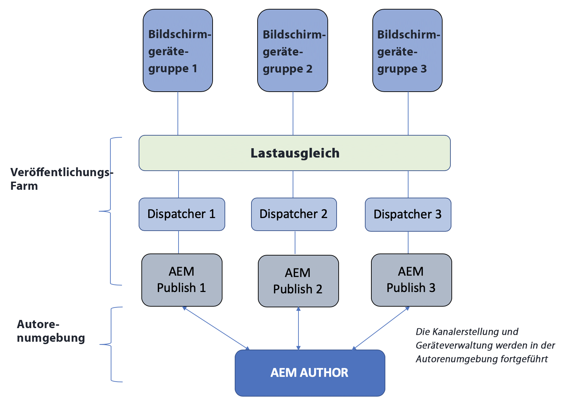

# Architektur-Überblick zur Autoren- und Veröffentlichungsinstanz {#author-and-publish-architectural-overview}

Auf dieser Seite werden folgende Themen hervorgehoben:

* **Einführung in Veröffentlichungs-Server**
* **Architektonischer Überblick**
* **Registrierungsverfahren**

## Voraussetzungen {#prerequisites}

Bevor Sie Autoren- und Veröffentlichungs-Server verwenden, sollten Sie mit folgenden Themen vertraut sein:

* **AEM-Topologie**
* **Erstellen und Verwalten von AEM Screens-Projekten**
* **Verfahren zur Geräteregistrierung**

>[!NOTE]
>
>Diese AEM Screens-Funktion ist nur verfügbar, wenn Sie das Feature Pack 2 für AEM 6.4 Screens installiert haben.  Wenden Sie sich an den Adobe-Support, um Zugriff auf dieses Feature Pack zu erhalten.  Nachdem Sie die Berechtigung erhalten haben, laden Sie es von Package Share herunter.

## Einführung {#introduction}

Die Architektur von AEM Screens ähnelt einer traditionellen AEM Sites-Architektur. Inhalte werden in einer AEM-Autoreninstanz erstellt und dann vorwärts an mehrere Veröffentlichungsinstanzen repliziert. Geräte auf AEM Screens können nun per Load-Balancer mit einer AEM-Veröffentlichungsfarm verbunden werden. Zur weiteren Skalierung der Veröffentlichungs-Farm lassen sich mehrere AEM-Veröffentlichungsinstanzen hinzufügen.

*Ein Beispiel*: Eine Inhaltsautorin oder ein Inhaltsautor von AEM Screens gibt auf dem Authoring-System einen Befehl für ein bestimmtes Gerät aus. Dieses Gerät ist für die Interaktion mit einer Veröffentlichungsfarm konfiguriert. Oder es interagiert mit einer AEM Screens-Inhaltsautorin oder einem -Inhaltsautor, die bzw. der Informationen über Geräte erhält, die für die Interaktion mit Veröffentlichungsfarmen konfiguriert sind.

Die folgende Abbildung zeigt sowohl die Autorenumgebung als auch die Veröffentlichungsumgebung.

## Architektonisches Design {#architectural-design}

Es gibt fünf architektonische Komponenten, die diese Lösung unterstützen:

* ***Replizieren von Inhalten*** von der Autoren- zur Veröffentlichungsinstanz für die Anzeige auf Geräten

* ***Rückwärtsreplikation*** binärer Inhalte aus der Veröffentlichungsumgebung (empfangen von Geräten) in die Authoring-Umgebung.
* ***Senden*** von Befehlen von der Autoren- an die Veröffentlichungsinstanz über bestimmte REST-APIs.
* ***Messaging*** zwischen Veröffentlichungsinstanzen zur Synchronisierung von aktualisierten Geräteinformationen und Befehlen.
* ***Abruf*** durch die Autorin oder den Autor von Veröffentlichungsinstanzen zum Abrufen von Geräteinformationen über bestimmte REST-APIs.

### Replikation (Weiterleitung) von Inhalten und Konfigurationen {#replication-forward-of-content-and-configurations}

Mit den standardmäßigen Replikationsagenten werden AEM Screens-Kanalinhalte, -Standortkonfigurationen und -Gerätekonfigurationen repliziert. Mit dieser Funktion können Autorinnen und Autoren den Inhalt eines Kanals aktualisieren und optional eine Art Genehmigungs-Workflow durchlaufen, bevor Kanalaktualisierungen veröffentlicht werden. Für jede Veröffentlichungsinstanz in der Veröffentlichungsfarm muss ein Replikationsagent eingerichtet werden.

Das folgende Diagramm veranschaulicht das Replikationsverfahren:

>[!NOTE]
>
>Für jede Veröffentlichungsinstanz in der Veröffentlichungsfarm muss ein Replikationsagent eingerichtet werden.

### Screens-Replikationsagenten und -Befehle {#screens-replication-agents-and-commands}

Benutzerdefinierte Screens-spezifische Replikationsagenten werden erstellt, um Befehle von der Autoreninstanz an das AEM Screens-Gerät zu senden. Die AEM-Veröffentlichungsinstanzen dienen als Vermittler für die Weiterleitung dieser Befehle an das Gerät.

Mit diesem Workflow können Autorinnen und Autoren das Gerät weiter verwalten, z. B. Geräteaktualisierungen senden und Screenshots der Authoring-Umgebung erstellen. Die AEM Screens-Replikationsagenten verfügen ebenso wie standardmäßige Replikationsagenten über eine benutzerdefinierte Transportkonfiguration.

### Messaging zwischen Veröffentlichungsinstanzen {#messaging-between-publish-instances}

Häufig soll ein Befehl an ein Gerät nur einmal gesendet werden. In einer Veröffentlichungsarchitektur mit Lastenausgleich ist die Veröffentlichungsinstanz, mit der das Gerät eine Verbindung herstellt, jedoch unbekannt.

Daher sendet die Autoreninstanz die Nachricht an alle Veröffentlichungsinstanzen. Es soll jedoch nur eine einzige Nachricht an das Gerät weitergeleitet werden. Um eine korrekte Benachrichtigung sicherzustellen, muss zwischen den Veröffentlichungsinstanzen kommuniziert werden. Diese Kommunikation wird mit *Apache ActiveMQ Artemis* erreicht. Jede Veröffentlichungsinstanz wird mithilfe des Oak-basierten Sling-Erkennungsdienstes in einer locker gekoppelten Topologie platziert. ActiveMQ ist so konfiguriert, dass jede Veröffentlichungsinstanz kommunizieren und eine einzelne Nachrichtenwarteschlange erstellen kann. Das AEM Screens-Gerät fragt über den Load-Balancer die AEM Veröffentlichungs-Farm ab und übernimmt den Befehl an der Spitze der Warteschlange.

### Rückwärtsreplikation {#reverse-replication}

In vielen Fällen wird nach einem Befehl eine bestimmte Antwort vom Screens-Gerät erwartet, die an die Autoreninstanz weitergeleitet wird. Dafür wird AEM-***Rückwärtsreplikation*** verwendet.

* Erstellen Sie für jede Veröffentlichungsinstanz einen Agenten für Rückwärtsreplikation, ähnlich wie bei den standardmäßigen Replikationsagenten und den AEM Screens-Replikationsagenten.
* Eine Workflow-Starter-Konfiguration überwacht die in der AEM-Veröffentlichungsinstanz geänderten Knoten und löst dann einen Workflow aus, um die Antwort des Geräts im Ausgang der AEM-Veröffentlichungsinstanz zu platzieren.
* Eine Rückwärtsreplikation wird in diesem Kontext nur für binäre Daten (wie Protokolldateien und Screenshots) verwendet, die von den Geräten bereitgestellt werden. Die Erfassung nicht binärer Daten wird abgerufen.
* Bei einer von der AEM-Autoreninstanz abgerufenen Rückwärtsreplikation wird die Antwort abgerufen und in der Autoreninstanz gespeichert.

### Abrufen von Veröffentlichungsinstanzen {#polling-of-publish-instances}

Die Autoreninstanz muss die Geräte abfragen können, um einen Takt zu erhalten und den Integritätsstatus eines verbundenen Geräts zu kennen.

Geräte pingen den Load-Balancer und werden an eine Veröffentlichungsinstanz weitergeleitet. Der Status des Geräts wird dann von der AEM-Veröffentlichungsinstanz über eine Veröffentlichungs-API veröffentlicht, die für alle aktiven Geräte unter **api/screens-dcc/devices/static** und für einzelne Geräte unter **api/screens-dcc/devices/&lt;device_id>/status.json** bereitgestellt wird.

Die Autoreninstanz fragt alle Veröffentlichungsinstanzen ab und führt die Antworten zum Gerätestatus in einem Status zusammen. Der geplante Auftrag, der die Autoreninstanz abfragt, lautet `com.adobe.cq.screens.impl.jobs.DistributedDevicesStatiUpdateJob` und kann auf Basis eines Cron-Ausdrucks konfiguriert werden.

## Registrierung {#registration}

Der Ursprung der Registrierung liegt weiterhin in der AEM-Autoreninstanz. Das AEM Screens-Gerät wird auf die Autoreninstanz verwiesen und die Registrierung ist abgeschlossen.

Nachdem ein Gerät in der AEM-Autorenumgebung registriert wurde, werden die Gerätekonfiguration und die Kanal-/Zeitplanzuweisungen an die AEM-Veröffentlichungsinstanzen repliziert. Anschließend wird die Konfiguration des AEM Screens-Geräts aktualisiert, um auf den Load-Balancer vor der AEM-Veröffentlichungsfarm zu verweisen. Dabei soll es sich um eine einmalige Einrichtung handeln. Nachdem das Screens-Gerät erfolgreich mit der Veröffentlichungsumgebung verbunden wurde, kann es weiterhin Befehle aus der Autorenumgebung erhalten. Es sollte nicht erforderlich sein, das AEM Screens-Gerät direkt mit der AEM-Autorenumgebung zu verbinden.

### Die nächsten Schritte {#the-next-steps}

Nachdem Sie sich mit dem architektonischen Design der Autoren- und Veröffentlichungsinstanz in AEM Screens vertraut gemacht haben, finden Sie weitere Informationen unter [Konfigurieren von Autoren- und Veröffentlichungsinstanz für AEM Screens](author-and-publish.md).
