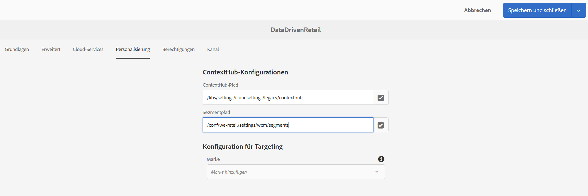
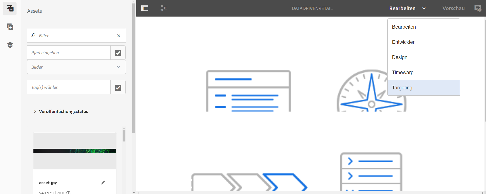

# Inhaltserstellung mit Datenauslösern {#authoring-with-data-triggers}

In diesem Abschnitt wird erläutert, wie Sie Targeting in Ihren Kanälen aktivieren.

>[!IMPORTANT]
>
>Die Mindestversion, die Datenauslöser in einem AEM Screens-Kanal unterstützt, ist AEM 6.5.3 Feature Pack 3.

## Voraussetzungen {#prereqs}

Bevor Sie die folgenden Schritte ausführen, um das Targeting in Kanälen zu aktivieren, müssen Sie die [Schlüsselbegriffe für das Konfigurieren in AEM Screens](configuring-context-hub.md) kennen, die zum Verständnis von ContextHub und Targeting in AEM Screens erforderlich sind.

>[!IMPORTANT]
>
>Sie sollten ContextHub-Konfigurationen verstehen und einzurichten können, bevor Sie das Targeting in einem AEM Screens-Kanal aktivieren.

Weitere Informationen finden Sie unter den folgenden Links:

1. **[Einrichten eines Datenspeichers](configuring-context-hub.md)**
1. **[Einrichten der Zielgruppensegmentierung](configuring-context-hub.md)**

Nachdem Sie die vorherigen Schritte durchgeführt haben, können Sie das Targeting in Ihren Kanälen aktivieren.

## Überblick über die Inhaltserstellung mit Datenauslösern {#author-targeting}

>[!VIDEO](https://video.tv.adobe.com/v/31921)

## Aktivieren von Targeting in einem AEM Screens-Kanal {#enabling-targeting}

Gehen Sie wie folgt vor, um das Targeting in Ihren Kanälen zu aktivieren.

1. Navigieren Sie zu einem der AEM Screens-Kanäle. Die folgenden Schritte zeigen, wie Sie das Targeting mithilfe von **DataDrivenRetail** *(Sequenzkanal)* aktivieren, das in einem AEM Screens-Kanal erstellt wurde.

1. Klicken Sie auf den Kanal **DataDrivenRetail** und dann in der Aktionsleiste auf **Eigenschaften**.

   

1. Klicken Sie auf die Registerkarte **Personalisierung**, damit Sie die ContextHub-Konfigurationen einrichten können, und klicken Sie auf den Pfad „ContextHub und Segmente“.

   1. Klicken Sie für den **ContextHub-Pfad** auf **libs** > **settings** > **cloudsettings** > **default** > **ContextHub Konfigurationen** und dann auf **Auswählen**.

   1. Klicken Sie für den **Segmentpfad** auf **conf** > **`We.Retail`** > **settings** > **wcm** > **segments** und dann auf **Auswählen**.

   1. Klicken Sie auf **Speichern und schließen**.

   >[!NOTE]
   >
   >Verwenden Sie den ContextHub- und den Segmentpfad, in dem Sie Ihre Kontexthub-Konfigurationen und -Segmente anfänglich gespeichert haben.

   

1. Navigieren Sie von **DataDrivenAssets** > **Kanäle** zu **DataDrivenRetail**, wählen Sie es aus und klicken Sie in der Aktionsleiste auf **Bearbeiten**. Ziehen Sie die Assets per Drag-and-Drop in Ihren Kanal-Editor.

   >[!NOTE]
   >
   >Wenn Sie alles korrekt eingerichtet haben, ist in der Dropdown-Liste des Editors die Option **Targeting** zu sehen, wie in der folgenden Abbildung dargestellt.

   

1. Klicken Sie auf **Targeting**.

1. Wählen Sie **Marke** und **Aktivität** aus dem Dropdown-Menü und klicken Sie auf **Targeting starten**.

### Weitere Informationen: Anwendungsbeispiele {#learn-more-example-use-cases}

Nachdem Sie ContextHub für Ihr AEM Screens-Projekt konfiguriert haben, können Sie die verschiedenen Nutzungsszenarios durchgehen, um zu verstehen, wie datengesteuerte Assets in verschiedenen Branchen eine wichtige Rolle spielen:

1. **[Zielgerichtete Aktivierung des Einzelhandelsinventars](retail-inventory-activation.md)**
1. **[Temperaturaktivierung für ein Reiseangebot](local-temperature-activation.md)**
1. **[Aktivierung der Gastgewerbereservierung](hospitality-reservation-activation.md)**
