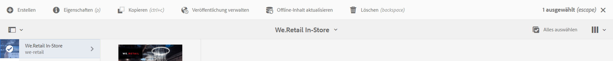
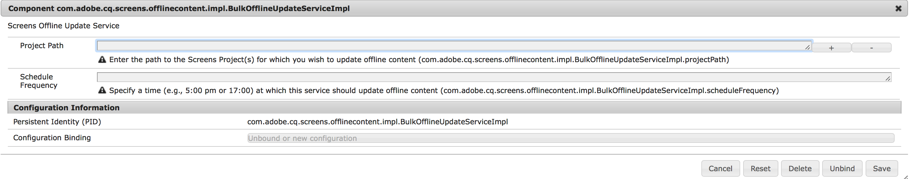

# Massen-Offline-Update {#bulk-offline-update}

>[!IMPORTANT]
>Dieser Inhalt gilt für AEM On-Premise/AMS (AEM 6.5LTS und AEM 6.5). Informationen zu AEM as a Cloud Service Screens-Inhalten finden Sie im [AEM as a Cloud Service-Handbuch](https://experienceleague.adobe.com/en/docs/experience-manager-cloud-service/content/screens-as-cloud-service/overview/introduction).

In diesem Abschnitt werden die folgenden Themen zum Massen-Offline-Update behandelt:

* **Überblick**
* **Verwenden des Massen-Offline-Updates**

<!--
OBSOLETE VERSIONS
>[!CAUTION]
>
>This AEM Screens functionality is only available, if you have installed AEM 6.3 Feature Pack 3 or AEM 6.4 Screens Feature Pack 1.
>
>To get access to this Feature Pack, contact Adobe Support and request access. When you have permissions you can download it from Package Share.
-->

## Überblick {#overview}

Das Massen-Offline-Update ermöglicht es Ihnen, alle Kanäle gemeinsam zu aktualisieren. Das vermeidet den Aufwand, zu einem bestimmten Kanal zu navigieren und den Inhalt zu aktualisieren. Stattdessen können Sie den gesamten Inhalt in den Kanälen für ein bestimmtes Projekt gemeinsam aktualisieren.

Sie können diese Aktivität auch für eine Zeit mit geringerem Netzwerk-Traffic planen.

>[!NOTE]
>
>Die Funktion für das Massen-Offline-Update wurde so optimiert, dass nur die geänderten Kanäle aktualisiert werden.

## Verwenden des Massen-Offline-Updates {#using-bulk-offline-update}

Sie können das Massen-Offline-Update manuell über die Benutzeroberfläche (UI) verwenden oder ein Massen-Update über OSGi-Services planen.

### Verwenden der AEM Screens-Benutzeroberfläche {#using-aem-screens-user-interface}

Gehen Sie wie folgt vor, um das Massen-Offline-Update für ein AEM Screens-Projekt zu verwenden:

1. Navigieren Sie zu Ihrem AEM Screens-Projekt.
1. Klicken Sie auf das Projekt und dann in der Aktionsleiste auf die Option **Offline-Inhalt aktualisieren**, um den Kanalinhalt manuell zu aktualisieren.

   

### Konfiguration der Adobe Experience Manager-Web-Konsole {#adobe-experience-manager-web-console-configuration}

Gehen Sie wie folgt vor, um das Massen-Offline-Update für ein AEM Screens-Projekt zu verwenden:

1. Konfiguration der Adobe Experience Manager-Web-Konsole.
1. Suchen Sie nach den Services für das Massen-Offline-Update.

   

1. Fügen Sie die folgenden Eigenschaften hinzu:

   **Projektpfad** - Gibt den Pfad Ihres AEM Screens-Projekts an. Der Pfad heißt gewöhnlich `/content/screens/<Name of your project>`.

   *Zum Beispiel* `/content/screens/we-retail`. Sie können diesen Pfad in der URL finden, indem Sie ein beliebiges Projekt unter AEM Screens auswählen (klicken Sie nicht auf das Symbol).

   >[!NOTE]
   >
   >Geben Sie den Projektpfad relativ zum Kanal an.

   **Zeitplanfrequenz** - Gibt einen Zeitpunkt an, z. B:00 17 Uhr, zu :00 dieser Service Offline-Inhalte aktualisieren soll.

1. Klicken Sie auf **Speichern**, um Ihre Einstellungen zu speichern. Ihr Inhalt wird zum angegebenen Zeitpunkt aktualisiert.
