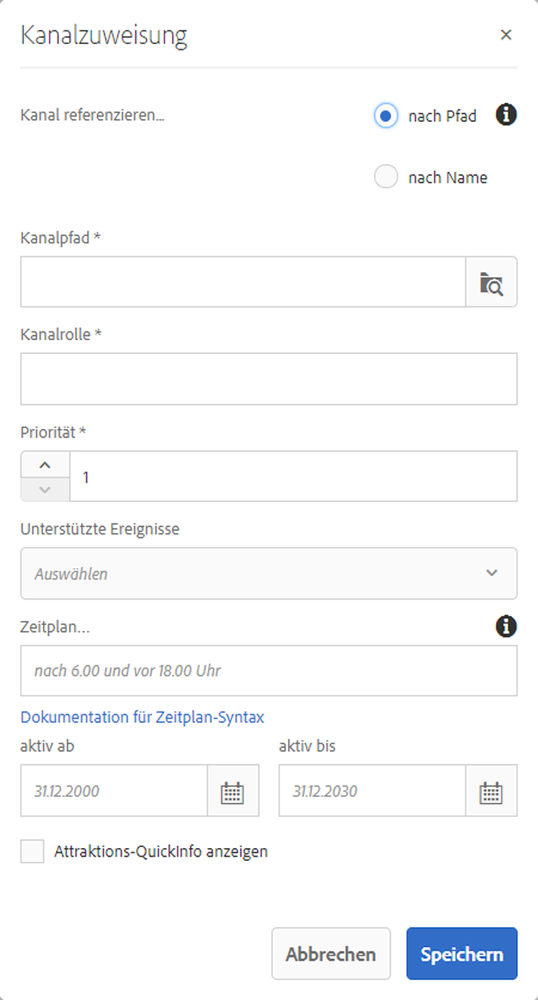

# Kanalzuweisung {#channel-assignment}

Dieser Abschnitt behandelt die folgenden Themen:

* **Zuweisen eines Kanals**
* **Eigenschaften der Kanalzuweisung (Dialogfeld)**
* **Dayparting**

Nachdem Sie eine Anzeige definiert haben, müssen Sie ihr einen Kanal zuweisen.

Auf dieser Seite wird beschrieben, wie Sie Ihren Anzeigen einen Kanal zuweisen.

**Voraussetzungen**:

* [Konfigurieren und Bereitstellen von Screens](configuring-screens-introduction.md) 
* [Bildschirmprojekt erstellen und verwalten](creating-a-screens-project.md)
* [Kanäle erstellen und verwalten](managing-channels.md)
* [Orte erstellen und verwalten](managing-locations.md)
* [Anzeigen erstellen und verwalten](managing-displays.md)

## Zuweisen eines Kanals {#assign-a-channel}

Gehen Sie wie folgt vor, um einer Anzeige einen Kanal zuzuweisen:

1. Navigieren Sie zum gewünschten Display, z. B. **DemoProject** —&gt; **Speicherorte** —&gt; **SanJose** —&gt; **StoreDisplay**.

   

1. Tippen/Klicken Sie auf **Kanal zuweisen **in der Aktionsleiste

   Oder

   Tap/click **Dashboard** and click **+Assign Channel** from the **ASSIGNED CHANNNELS** panel to open the **Channel Assignment** dialog box.

   

   Sie können im Dialogfeld **Kanalzuweisung** die folgenden Eigenschaften konfigurieren:

   **Kanalrolle**:

   In „Kanalrolle“ wird der Kontext der Anzeige definiert. Die Rolle kann durch verschiedene Aktionen festgelegt werden und ist unabhängig vom eigentlichen Kanal, der der Rolle entspricht.

   **Kanal referenzieren**:

   Diese Option ermöglicht es Ihnen, einen Verweis zum gewünschten Kanal bereitzustellen, entweder in Form des Namens oder des Pfads des Kanals.

   * **nach Pfad**: Sie stellen einen expliziten Verweis durch Angabe des absoluten Pfads des Kanals bereit.
   * **nach Name**: Sie geben den Namen des Kanals ein, der nach Kontext zu einem tatsächlichen Kanal aufgelöst werden soll. Mit dieser Funktion können Sie eine lokale Version eines Kanals erstellen, um ortspezifischen Inhalt dynamisch aufzulösen. For example, a channel with name *deals of the day*, where the actual content would be different in two cities, but you still have the sane channel role on all the displays.
   **Priorität:**

   Mit „Priorität“ können Zuweisungen gereiht werden, falls mehrere die Präsentationskriterien erfüllen. Höhere Werte haben stets Vorrang vor niedrigeren Werten. Wenn es beispielsweise die beiden Kanäle A und B gibt und A eine Priorität von 1 und B eine Priorität von 2 hat, wird Kanal B angezeigt, da er eine höhere Priorität als A hat.

   Die Priorität für einen Kanal wird im Dialogfeld **Kanalzuweisung **wie oben erwähnt als Zahl (1) festgelegt. Darüber hinaus werden die zugewiesenen Kanäle nach absteigender Priorität sortiert.

   **Unterstützte Ereignisse**:

   * **Erster Ladevorgang**: Lädt den Kanal, wenn der Player gestartet wird. Dies kann in Kombination mit einem Zeitplan mehreren Kanälen zugewiesen werden.
   * **Bildschirm bei Untätigkeit**: Lädt, wenn der Bildschirm inaktiv ist. Dies kann in Kombination mit einem Zeitplan mehreren Kanälen zugewiesen werden.
   * **Timer**: Muss eingestellt werden, wenn ein Zeitplan vorhanden ist
   * **Benutzerinteraktion**: Der Player wechselt in den angegebenen Kanal, wenn in einem inaktiven Kanal auf dem Bildschirm (Touch) eine Benutzerinteraktion stattfindet, und wird geladen, wenn der Bildschirm berührt wird.
   **Plan**:

   Hiermit können Sie in einer Beschreibung in Textform angeben, wann der Kanal angezeigt werden soll. Sie können damit auch ein Startdatum (**aktiv ab**) und ein Enddatum (**aktiv bis**) definieren, zwischen denen der Kanal angezeigt werden soll. Die Syntax für den Planausdruck basiert auf later.js-Text und der cron-Syntax:

   * [https://bunkat.github.io/later/parsers.html#text](https://bunkat.github.io/later/parsers.html#text)
   * [https://bunkat.github.io/later/parsers.html#cron](https://bunkat.github.io/later/parsers.html#cron)
   **Attraktions-QuickInfo anzeigen**:

   Mit der Option „Attraktions-QuickInfo anzeigen“ wird definiert, ob die Attraktions-QuickInfo (*Zum Beginnen irgendwo tippen*) angezeigt wird, während der Kanal ausgeführt wird.

1. Klicken Sie auf **Speichern**, um den erstellten Kanal einer Anzeige zuzuweisen.

### Dayparting {#dayparting}

Schedules when when combined with **Dayparting**, allows you to set a global schedule with multiple channels running at specific times of the day, and re-use that setup for all your displays at once.

Bei Dayparting wird ein Tag in Zeitfenster unterteilt und festgelegt, welcher Inhalt zum gewünschten Zeitpunkt dargestellt wird. Mit AEM Screens können Sie den Dayparting-Zeitplan von Kanälen nach Bedarf für Tage, Wochen oder Monate festlegen.

Im Folgenden wird in drei Szenarien beschrieben, wie Dayparting mit Kanälen verwendet werden kann:

#### Anzeigen von Inhalten an einem einzigen Tag unterteilt in mehrere Zeitfenster {#playing-content-on-a-single-day-divided-into-multiple-time-slots}

Im folgenden Beispiel wird veranschaulicht, wie ein Restaurant Dayparting verwendet, um sein Angebot für Frühstück, Mittagessen und Abendessen zu präsentieren.

Hier unterteilen wir jeden Tag drei verschiedene Zeitfenster, sodass der Kanalinhalt gemäß der angegebenen Tageszeit abgespielt wird:

| **Channel** | **Rolle** | **Priorität** | **Plan** |
|---|---|---|---|
| Menu_A | Frühstück |  | nach 6:00 und vor 11:00 Uhr |
| Menu_B | Mittagessen |  | nach 11:00 und vor 15:00 Uhr |
| Menu_C | Abendessen |  | nach 15:00 und vor 20:00 |

#### Anzeigen von Inhalten an einem bestimmten Wochentag {#playing-content-on-a-particular-day-of-the-week}

In diesem Beispiel wird gezeigt, wie Dayparting in einem Casino umgesetzt wird, wo an jedem Wochenende von 20:00 Uhr bis 22:00 Uhr eine Live-Veranstaltung stattfindet und von 22:00 Uhr bis 1:00 Uhr in der Abendkarte spezielle Speisen angeboten werden.

<table>
 <tbody>
  <tr>
   <td><strong>Channel</strong></td>
   <td><strong>Rolle</strong></td>
   <td><strong>Priorität</strong></td>
   <td><strong>Plan</strong></td>
  </tr>
  <tr>
   <td>LiveConcert</td>
   <td>Wochenende</td>
   <td> </td>
   <td>21. Oktober 2017 - 22. Oktober 2017   nach 20:00 Uhr vor 22:00 Uhr</td>
  </tr>
  <tr>
   <td>SpecialsDinner</td>
   <td>Wochenende</td>
   <td> </td>
   <td>21. Oktober 2017 - 22. Oktober 2017   nach 22:00 Uhr vor 1:00 Uhr</td>
  </tr>
 </tbody>
</table>

#### Anzeigen von Inhalten für einen bestimmten Monat oder mehrere Monate {#playing-content-for-a-particular-month-months}

Dieses Beispiel veranschaulicht Dayparting für einen Laden, der seine Sommerkollektion von Juni bis August und die Herbstkollektion von September bis Ende Oktober präsentiert.

Hier wird Dayparting auf monatlicher Basis erstellt, sodass der Kanalinhalt an den angegebenen Monaten im Jahr angezeigt wird.

| **Channel** | **Rolle** | **Priorität** | **Plan** |
|---|---|---|---|
| SummerCollection | Sommer |  | 01. Juni 2017 - 31. August 2017 |
| FallCollection | Herbst |  | 01. September 2017 - 30. Oktober 2017 |

>[!NOTE]
>
>Darüber hinaus können Sie für jeden Kanal die ***Priorität**festlegen.* Wenn beispielsweise zwei Kanäle für denselben Tag und dieselbe Uhrzeit oder für denselben Monat festgelegt sind, wird der Kanal mit höherer Priorität zuerst gezeigt. Der Mindestwert für die Priorität beträgt 0.

#### Anzeigen von Inhalt für Kanäle derselben Priorität {#playing-content-for-channels-with-same-priority}

Diese Beispiele veranschaulichen die Verwendung von Dayparting durch einen Laden, der seine Winterkollektion mit demselben Zeitplan im Dezember präsentiert. Doch da die Priorität von Kanal B in dieser Woche 2 beträgt, wird der Inhalt von Kanal B anstelle des Inhalts von Kanal A gezeigt.

| **Channel** | **Rolle** | **Priorität** | **Plan** |
|---|---|---|---|
| A | Winter | 1 | 01. Dezember 2017 - 31. Dezember 2017 |
| B | Weihnachten | 2 | 24. Dezember 2017 - 31. Dezember 2017 |

