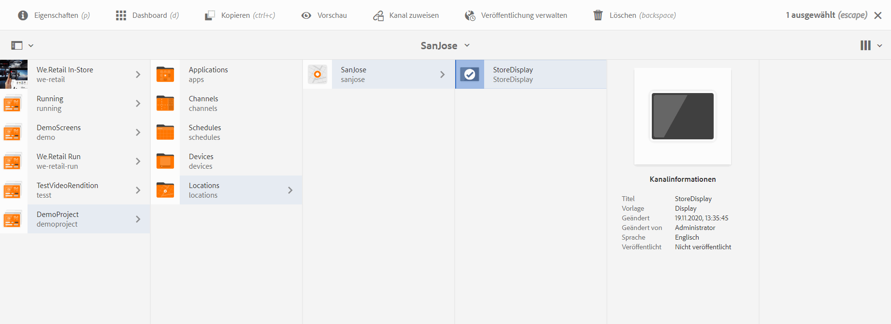

# Kanalzuweisung {#channel-assignment}

>[!IMPORTANT]
>In diesem Abschnitt wird die Kanalzuweisung und -zeitplanung für Feature Packs beschrieben, die älter als AEM 6.5.5 Screens sind.

Wenn Sie eine Anzeige eingerichtet haben, weisen Sie einen Kanal einer Anzeige zu, um Ihren Inhalt anzuzeigen.

Auf dieser Seite wird beschrieben, wie Sie Ihrer Anzeige einen Kanal zuweisen.

>[!NOTE]
>Sie können einer Anzeige mehrere Kanäle zuweisen.

## Zuweisen von Kanälen {#assign-a-channel}

Gehen Sie wie folgt vor, um einer Anzeige einen Kanal zuzuweisen:

1. Navigieren Sie zur gewünschten Anzeige, beispielsweise **DemoProject** > **Standorte** > **SanJose** > **StoreDisplay**.

   

1. Klicks **Kanal zuweisen** in der Aktionsleiste.

   oder

   Klicks **Dashboard** und klicken **+Kanal zuweisen** aus dem **ZUGEWIESENE KANÄLE** -Bedienfeld, damit Sie **Kanalzuweisung** Dialogfeld.

   

   Sie können die Eigenschaften im Dialogfeld **Kanalzuweisung** im nachstehenden Abschnitt konfigurieren. Siehe [Kanaleigenschaften](#channel-properties) für weitere Informationen zu den Kanaleigenschaften.

## Verstehen der Kanaleigenschaften bei Kanalzuweisung {#channel-properties}

### Kanal referenzieren {#ref-channel}

Mithilfe des Referenzkanals können Sie einen Verweis auf den gewünschten Kanal entweder nach Kanalname oder nach Kanalpfad bereitstellen.

* **nach Pfad** - Sie stellen einen expliziten Verweis mithilfe des absoluten Pfads des Kanals bereit.

* **nach Namen** - Sie geben den Namen des Kanals ein, der nach Kontext zu einem tatsächlichen Kanal aufgelöst wird. Mit dieser Funktion können Sie eine lokale Version eines Kanals erstellen, um standortspezifischen Inhalt dynamisch aufzulösen. Beispiel: ein Kanal mit dem Namen *Tagesangebote*, bei dem der eigentliche Inhalt in zwei Städten zwar unterschiedlich ist, aber bei allen Anzeigen dieselbe Kanalrolle vorhanden ist.

### Kanalrolle {#role-channel}

In „Kanalrolle“ wird der Kontext der Anzeige definiert. Die Rolle wird durch verschiedene Aktionen angesprochen und ist unabhängig vom tatsächlichen Kanal, der die Rolle erfüllt.

### Priorität {#priority-channel}

Die Priorität wird verwendet, um die Zuweisungen in eine Reihenfolge zu bringen, wenn mehrere Zuweisungen den Wiedergabekriterien entsprechen. Höhere Werte haben stets Vorrang vor niedrigeren Werten. Angenommen, es gibt zwei Kanäle, A und B. Wenn A die Priorität 1 und B die Priorität 2 hat, wird Kanal B angezeigt, da er eine höhere Priorität als A hat.

>[!NOTE]
>Die Priorität eines Kanals wird als Zahl (1 für Minimum) im Dialogfeld **Kanalzuweisung** festgelegt, wie oben angegeben. Außerdem werden die zugewiesenen Kanäle nach absteigender Priorität sortiert.

### Unterstützte Ereignisse {#supported-events-channel}

* **Erster Ladevorgang** - Lädt den Kanal, wenn der Player gestartet wird. Er kann mehreren Kanälen mit einem Zeitplan zugewiesen werden.
* **Idle Screen** - Wird geladen, wenn der Bildschirm inaktiv ist. Er kann mehreren Kanälen mit einem Zeitplan zugewiesen werden.
* **Timer** - Muss festgelegt werden, wenn ein Zeitplan angegeben wird.
* **Benutzerinteraktion** - Der Player wechselt zum angegebenen Kanal, wenn eine Benutzerinteraktion auf dem Bildschirm (Touch) in einem inaktiven Kanal stattfindet und geladen wird, wenn der Bildschirm berührt wird.

### Unterbrechungsmethode {#interruption-method-channel}

>[!IMPORTANT]
>
> Diese Option ist nur verfügbar mit <!--AEM 6.4 Feature Pack 8 or -->AEM 6.5 Feature Pack 4.

Geben Sie als Inhaltsautor an, wann ein Kanal unterbrochen wird, damit Sie nichtkritische Inhalte abschneiden und optional wichtige Inhalte wiedergeben können, bevor die Wiedergabe aufgrund der Planung abgebrochen wird.

Klicken Sie auf eine der folgenden Optionen, die verfügbar sind, um die Unterbrechungsmethode über die **Kanalzuweisung** Dialogfeld:

* **Sofort** - Wenn der Zeitplan aktiviert oder eine Aktualisierung empfangen wird, können Sie die Wiedergabe abbrechen und den neuen Inhalt sofort aktualisieren oder wiedergeben.
* **Am Ende des aktuellen Elements** - Wenn ein neuer Zeitplan aktiviert oder eine Aktualisierung empfangen wird, können Sie optional warten, bis die Wiedergabe des aktuellen Elements in der Sequenz abgeschlossen ist. Erst danach können Sie den neuen Inhalt aktualisieren oder wiedergeben.

  >[!NOTE]
  >Standardmäßig ist diese Option aktiviert.
* **Am Ende der Sequenz** - Wenn ein neuer Zeitplan aktiviert oder eine Aktualisierung empfangen wird, können Sie optional warten, bis die gesamte Sequenz ihr Ende erreicht. Kurz vor der gewünschten Sequenz können Sie dann zum ersten Element zurückkehren, den neuen Inhalt aktualisieren oder wiedergeben.

  >[!NOTE]
  >Die Verwendung der zweiten oder dritten Option kann dazu führen, dass die für die Zuweisung festgelegten Planungszeiten geringfügig verschoben werden. Der Grund dafür ist, dass der Player vor der Aktualisierung auf das Ende des Elements oder der Sequenz (nach der angegebenen Zeit) wartet. Die Verzögerung hängt von der Wiedergabedauer des Elements ab.

### Zeitplan {#schedule-channel}

Mit &quot;Zeitplan&quot;können Sie eine Beschreibung im Text angeben, wann der Kanal angezeigt werden soll. Sie ermöglicht auch die Definition eines Anfangsdatums (**aktiv aus**) und ein Enddatum (**aktiv bis**), damit der Kanal angezeigt wird.

**Attraktions-QuickInfo anzeigen**

Anzeigen der Attraktions-QuickInfo definiert, ob die Attraktions-QuickInfo (&quot;*Alles berühren, um zu beginnen*&quot;) muss angezeigt werden oder nicht, während der Kanal ausgeführt wird.

### Dayparting {#dayparting}

Zeitpläne in Kombination mit **Dayparting** können Sie einen globalen Zeitplan mit mehreren Kanälen festlegen, die zu bestimmten Tageszeiten ausgeführt werden, und diese für alle Anzeigen wiederverwenden.

Bei Dayparting wird ein Tag in Zeitfenster unterteilt und festgelegt, welcher Inhalt zum gewünschten Zeitpunkt dargestellt wird. Mit AEM Screens können Sie die Planung von Kanälen in Form von Dayparting nach Bedarf für einen Tag, eine Woche oder einen Monat festlegen.

In den folgenden Beispielen wird Dayparting in Kanälen in drei verschiedenen Szenarien erläutert:

#### Anzeigen von Inhalten an einem einzigen Tag unterteilt in mehrere Zeitfenster {#playing-content-on-a-single-day-divided-into-multiple-time-slots}

In diesem Beispiel wird gezeigt, wie ein Restaurant Dayparting verwendet, um sein Angebot für Frühstück, Mittagessen und Abendessen zu präsentieren.

Hier unterteilen Sie jeden Tag in drei Zeitfenster, sodass der Kanalinhalt gemäß der Tageszeit angezeigt wird:

| **Kanal** | **Rolle** | **Priorität** | **Zeitplan** |
|---|---|---|---|
| Menü_A | Frühstück |  | Nach 6:00 Uhr und vor 11:00 Uhr |
| Menü_B | Mittagessen |  | Nach 11:00 Uhr und vor 15:00 Uhr |
| Menü_C | Abendessen |  | Nach 15:00 Uhr und vor 20:00 Uhr |

#### Anzeigen von Inhalten an einem bestimmten Wochentag {#playing-content-on-a-particular-day-of-the-week}

In diesem Beispiel wird gezeigt, wie Dayparting in einem Casino umgesetzt wird, wo an jedem Wochenende von 20:00 Uhr bis 22:00 Uhr eine Live-Veranstaltung stattfindet und von 22:00 Uhr bis 13:00 Uhr in der Abendkarte spezielle Gerichte angeboten werden.

<table>
 <tbody>
  <tr>
   <td><strong>Kanal</strong></td>
   <td><strong>Rolle</strong></td>
   <td><strong>Priorität</strong></td>
   <td><strong>Zeitplan</strong></td>
  </tr>
  <tr>
   <td>Live-Konzert</td>
   <td>Wochenende</td>
   <td> </td>
   <td>21. Oktober 2017 - 22. Oktober 2017   nach 20:00 Uhr und vor 22:00 Uhr</td>
  </tr>
  <tr>
   <td>Spezialitätenkarte</td>
   <td>Wochenende</td>
   <td> </td>
   <td>21. Oktober 2017 - 22. Oktober 2017   nach 22:00 Uhr vor 1:00 Uhr</td>
  </tr>
 </tbody>
</table>

#### Anzeigen von Inhalten für einen bestimmten Monat oder mehrere Monate {#playing-content-for-a-particular-month-months}

Dieses Beispiel veranschaulicht Dayparting für einen Laden, der seine Sommerkollektion von Juni bis August und die Herbstkollektion von September bis Ende Oktober präsentiert.

Hier erstellen Sie Dayparting auf monatlicher Basis, sodass der Kanalinhalt gemäß den angegebenen Monaten des Jahres wiedergegeben wird.

| **Kanal** | **Rolle** | **Priorität** | **Zeitplan** |
|---|---|---|---|
| Sommerkollektion | Sommer |  | 1. Juni 2017 - 31. August 2017 |
| Herbstkollektion | Herbst |  | 1. September 2017 - 30. Oktober 2017 |

>[!NOTE]
>
>Außerdem können Sie ***Priorität*** für jeden Kanal. Wenn beispielsweise zwei Kanäle für denselben Tag und dieselbe Uhrzeit oder für denselben Monat festgelegt sind, wird der Kanal mit höherer Priorität zuerst wiedergegeben. Der Mindestwert für die Priorität kann auf 0 gesetzt werden.

#### Anzeigen von Inhalt für Kanäle derselben Priorität {#playing-content-for-channels-with-same-priority}

In diesem Beispiel wird Dayparting für einen Store gezeigt, der seine Winterkollektion mit demselben Zeitplan im Dezember anzeigt. Doch da die Priorität von Kanal B in dieser Woche 2 beträgt, wird der Inhalt von Kanal B anstelle des Inhalts von Kanal A gezeigt.

| **Kanal** | **Rolle** | **Priorität** | **Zeitplan** |
|---|---|---|---|
| A | Winter | 1 | 1. Dezember 2017 - 31. Dezember 2017 |
| B | Weihnachten | 2 | 24. Dezember 2017 - 31. Dezember 2017 |

>[!NOTE]
>
> Weitere Informationen zu Dayparting finden Sie in den folgenden Abschnitten:
>
>* [Umgang mit sich wiederholenden Assets](https://experienceleague.adobe.com/en/docs/experience-manager-screens/user-guide/authoring/product-features/asset-level-scheduling)
>* [Umgang mit sich wiederholenden Assets in einem Kanal](https://experienceleague.adobe.com/en/docs/experience-manager-screens/user-guide/authoring/product-features/channel-level-activation)
