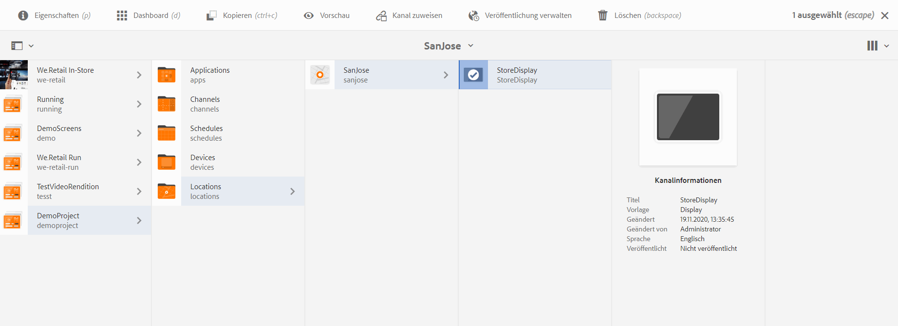

# Kanalzuweisung {#channel-assignment}

>[!IMPORTANT]
>In diesem Abschnitt wird die Kanalzuweisung und -zeitplanung für Feature Packs beschrieben, die älter als AEM 6.5.5 Screens sind.

Wenn Sie eine Anzeige eingerichtet haben, weisen Sie der Anzeige einen Kanal zu, um Ihren Inhalt anzuzeigen.

Auf dieser Seite wird beschrieben, wie Sie Ihrer Anzeige einen Kanal zuweisen.

Dieser Inhalt gilt für AEM On-Premise/AMS (AEM 6.5LTS und AEM 6.5). Informationen zu AEM as a Cloud Service Screens-Inhalten finden Sie im [AEM as a Cloud Service-Handbuch](https://experienceleague.adobe.com/en/docs/experience-manager-cloud-service/content/screens-as-cloud-service/overview/introduction).

>[!NOTE]
>Sie können einer Anzeige mehrere Kanäle zuweisen.

## Zuweisen von Kanälen {#assign-a-channel}

Gehen Sie wie folgt vor, um einer Anzeige einen Kanal zuzuweisen:

1. Navigieren Sie zur gewünschten Anzeige, z. B. **DemoProject** > **Standorte** > **SanJose** > **StoreDisplay**.

   

1. Klicken Sie in der Aktionsleiste auf **Kanal zuweisen**.

   ODER

   Klicken Sie auf **Dashboard** und dann im Bedienfeld **ZUGEWIESENE KANÄLE** auf **+ Kanal zuweisen**, um das Dialogfeld **Kanalzuweisung** zu öffnen.

   

   Sie können die Eigenschaften im Dialogfeld **Kanalzuweisung** im nachstehenden Abschnitt konfigurieren. Weitere Informationen zu den Kanaleigenschaften finden Sie im Abschnitt [Kanaleigenschaften](#channel-properties).

## Verstehen der Kanaleigenschaften bei Kanalzuweisung {#channel-properties}

### Kanal referenzieren {#ref-channel}

Diese Option ermöglicht es Ihnen, einen Verweis zum gewünschten Kanal bereitzustellen, entweder in Form des Kanalnamens oder des Kanalpfads.

* **nach Pfad**: Sie stellen einen expliziten Verweis durch Angabe des absoluten Pfads des Kanals bereit.

* **nach Name**: Sie geben den Namen des Kanals ein, der entsprechend dem Kontext zu einem tatsächlichen Kanal führt. Mit dieser Funktion können Sie eine lokale Version eines Kanals erstellen, um ortsspezifische Inhalte dynamisch aufzulösen. Beispiel: ein Kanal mit dem Namen *Tagesangebote*, bei dem der eigentliche Inhalt in zwei Städten zwar unterschiedlich ist, aber bei allen Anzeigen dieselbe Kanalrolle vorhanden ist.

### Kanalrolle {#role-channel}

Mit „Kanalrolle“ wird der Kontext der Anzeige definiert. Die Rolle kann durch verschiedene Aktionen festgelegt werden und ist unabhängig vom eigentlichen Kanal, der der Rolle entspricht.

### Priorität {#priority-channel}

Die Priorität wird verwendet, um die Zuweisungen in eine Reihenfolge zu bringen, wenn mehrere Zuweisungen den Wiedergabekriterien entsprechen. Höhere Werte haben stets Vorrang vor niedrigeren Werten. Wenn es beispielsweise zwei Kanäle A und B gibt. A hat die Priorität 1 und B hat die Priorität 2, dann wird Kanal B angezeigt, da er eine höhere Priorität als A hat.

>[!NOTE]
>Die Priorität eines Kanals wird als Zahl (1 für Minimum) im Dialogfeld **Kanalzuweisung** festgelegt, wie oben angegeben. Außerdem werden die zugewiesenen Kanäle nach absteigender Priorität sortiert.

### Unterstützte Ereignisse {#supported-events-channel}

* **Erster Ladevorgang**: Lädt den Kanal, wenn der Player gestartet wird. Die Option kann mehreren Kanälen mit einem Zeitplan zugewiesen werden.
* **Bildschirm bei Untätigkeit**: Lädt, wenn der Bildschirm inaktiv ist. Die Option kann mehreren Kanälen mit einem Zeitplan zugewiesen werden.
* **Timer**: Muss eingestellt werden, wenn ein Zeitplan angegeben wird.
* **Benutzerinteraktion**: Der Player wechselt in den angegebenen Kanal, wenn in einem inaktiven Kanal auf dem Bildschirm (Touch) eine Benutzerinteraktion stattfindet, und wird geladen, wenn der Bildschirm berührt wird.

### Unterbrechungsmethode {#interruption-method-channel}

>[!IMPORTANT]
>
> Diese Option ist nur mit <!--AEM 6.4 Feature Pack 8 or -->AEM 6.5 Feature Pack 4 verfügbar.

Als Inhaltsautorin oder Inhaltsautor können Sie festlegen, wann ein Kanal unterbrochen wird. Auf diese Weise können Sie nicht kritische Inhalte auf Wunsch abschneiden, aber optional die wichtigen Inhalte vollständig abspielen, bevor die Wiedergabe aufgrund der Zeitplanung abgebrochen wird.

Klicken Sie auf eine der folgenden Optionen, die zum Festlegen der Unterbrechungsmethode im Dialogfeld **Kanalzuweisung** verfügbar sind:

* **Sofort**: Wenn der Zeitplan aktiviert oder eine Aktualisierung empfangen wird, können Sie die Wiedergabe abbrechen und sofort aktualisieren oder den neuen Inhalt wiedergeben.
* **Am Ende des aktuellen Elements**: Wenn ein neuer Zeitplan aktiviert oder eine Aktualisierung empfangen wird, können Sie optional warten, bis die Wiedergabe des aktuellen Elements in der Sequenz abgeschlossen ist. Erst danach können Sie aktualisieren oder den neuen Inhalt wiedergeben.

  >[!NOTE]
  >Standardmäßig ist diese Option aktiviert.
* **Am Ende der Sequenz**: Wenn ein neuer Zeitplan aktiviert oder eine Aktualisierung empfangen wird, können Sie optional warten, bis die gesamte Sequenz ihr Ende erreicht. Kurz vor der gewünschten Sequenz können Sie dann zum ersten Element zurückkehren, aktualisieren oder den neuen Inhalt wiedergeben.

  >[!NOTE]
  >Die Verwendung der zweiten oder dritten Option kann dazu führen, dass sich die für die Zuweisung festgelegten Planungszeiten geringfügig verschieben. Dies liegt daran, dass der Player vor der Aktualisierung auf das Ende des Elements oder der Sequenz (nach der angegebenen Zeit) wartet. Die Verzögerung hängt von der Wiedergabedauer des Elements ab.

### Zeitplan {#schedule-channel}

Hiermit können Sie in einer Beschreibung in Textform angeben, wann der Kanal angezeigt werden soll. Sie können damit auch ein Startdatum (**aktiv ab**) und ein Enddatum (**aktiv bis**) definieren, um einen Zeitraum anzugeben, in dem der Kanal angezeigt werden soll.

**Attraktions-QuickInfo anzeigen**

Mit der Option „Attraktions-QuickInfo anzeigen“ wird definiert, ob die Attraktions-QuickInfo („*Zum Beginnen irgendwo tippen*“) angezeigt wird, während der Kanal ausgeführt wird.

### Dayparting {#dayparting}

Durch die Kombination von Zeitplänen mit **Dayparting** können Sie einen globalen Zeitplan mit mehreren Kanälen festlegen, die zu bestimmten Tageszeiten ausgeführt werden. Diese Einstellung können dann für alle Anzeigen wiederverwendet werden.

DayParting wird als Aufteilung eines Tages in Zeitschlitze bezeichnet, wobei angegeben wird, welcher Inhalt zur gewünschten Zeit abgespielt wird. Mit AEM Screens können Sie den Dayparting-Zeitplan von Kanälen nach Bedarf für Tage, Wochen oder Monate festlegen.

Im Folgenden wird anhand von drei Szenarien beschrieben, wie Dayparting mit Kanälen verwendet werden kann:

#### Anzeigen von Inhalten an einem einzigen Tag unterteilt in mehrere Zeitfenster {#playing-content-on-a-single-day-divided-into-multiple-time-slots}

Im folgenden Beispiel wird veranschaulicht, wie ein Restaurant Dayparting verwendet, um sein Frühstücks-, Mittags- und Abendangebot zu präsentieren.

Hier wird jeder Tag in drei Zeitfenster unterteilt, sodass der Kanalinhalt gemäß der festgelegten Tageszeit angezeigt wird:

| **Kanal** | **Rolle** | **Priorität** | **Zeitplan** |
|---|---|---|---|
| Menü_A | Frühstück |  | Nach 6:00 und vor 11:00 |
| Menü_B | Mittagessen |  | Nach 11:00 und vor 15 :00 |
| Menü_C | Abendessen |  | Nach 15:00 und vor 20:00 |

#### Anzeigen von Inhalten an einem bestimmten Wochentag {#playing-content-on-a-particular-day-of-the-week}

Dieses Beispiel zeigt den DayParting in einem Casino, in dem jedes Wochenende von 20 :00 bis 22 :00 stattfindet und für das Abendmenü nach 22 :00 bis 1 :00 Uhr Sonderangebote verfügbar sind.

<table>
 <tbody>
  <tr>
   <td><strong>Kanal</strong></td>
   <td><strong>Rolle</strong></td>
   <td><strong>Priorität</strong></td>
   <td><strong>Zeitplan</strong></td>
  </tr>
  <tr>
   <td>Live-Konzert</td>
   <td>Wochenende</td>
   <td> </td>
   <td>21. Oktober 2017 – 22. Oktober 2017   nach 20:00 Uhr und vor 22:00 Uhr</td>
  </tr>
  <tr>
   <td>Spezialitätenkarte</td>
   <td>Wochenende</td>
   <td> </td>
   <td>21. Oktober 2017 – 22. Oktober 2017   nach 22:00 Uhr vor 1:00 Uhr</td>
  </tr>
 </tbody>
</table>

#### Anzeigen von Inhalten für einen bestimmten Monat oder mehrere Monate {#playing-content-for-a-particular-month-months}

Dieses Beispiel veranschaulicht das Dayparting für einen Laden, der seine Sommerkollektion von Juni bis August und die Herbstkollektion von September bis Ende Oktober präsentiert.

Hier wird das Dayparting auf monatlicher Basis erstellt, sodass der Kanalinhalt für die angegebenen Monate des Jahres abgespielt wird.

| **Kanal** | **Rolle** | **Priorität** | **Zeitplan** |
|---|---|---|---|
| Sommerkollektion | Sommer |  | &#x200B;1. Juni 2017 – 31. August 2017 |
| Herbstkollektion | Herbst |  | &#x200B;1. September 2017 – 30. Oktober 2017 |

>[!NOTE]
>
>Außerdem können Sie für jeden Kanal eine ***Priorität*** festlegen. Wenn beispielsweise zwei Kanäle für denselben Tag und dieselbe Uhrzeit oder für denselben Monat festgelegt sind, wird der Kanal mit höherer Priorität zuerst gezeigt. Der Mindestwert für die Priorität beträgt 0.

#### Anzeigen von Inhalt für Kanäle derselben Priorität {#playing-content-for-channels-with-same-priority}

Diese Beispiele veranschaulichen die Verwendung von Dayparting durch einen Laden, der seine Winterkollektion mit demselben Zeitplan im Dezember präsentiert. Doch da die Priorität von Kanal B in dieser Woche 2 beträgt, wird der Inhalt von Kanal B anstelle des Inhalts von Kanal A gezeigt.

| **Kanal** | **Rolle** | **Priorität** | **Zeitplan** |
|---|---|---|---|
| A | Winter | 1 | &#x200B;1. Dezember 2017 – 31. Dezember 2017 |
| B | Weihnachten | 2 | &#x200B;24. Dezember 2017 – 31. Dezember 2017 |

>[!NOTE]
>
> Weitere Informationen zu Dayparting finden Sie in den folgenden Abschnitten:
>
>* [Umgang mit sich wiederholenden Assets](https://experienceleague.adobe.com/de/docs/experience-manager-screens/user-guide/authoring/product-features/asset-level-scheduling)
>* [Umgang mit sich wiederholenden Assets in einem Kanal](https://experienceleague.adobe.com/de/docs/experience-manager-screens/user-guide/authoring/product-features/channel-level-activation)
