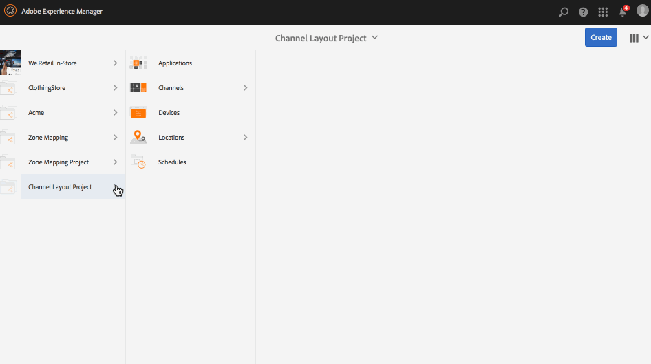

# Kanal-Layouteditor {#channel-layout-editor}

***Mit dem Kanal-Layouteditor*** können Sie Inhalte für mehrere Bereiche erstellen und verschiedene Assets wie Videos, Bilder und Text verwenden, die sich in einem einzigen Bildschirm kontextbezogen kombinieren lassen. Führen Sie Bilder, Videos und Texte zusammen und erschaffen Sie so ein intuitives und interaktives digitales Erlebnis. 

Abhängig von den Projektanforderungen sind ggf. mehrere Bereiche in einem Kanal erforderlich, die dann zusammen als Einheit bearbeitet werden. Beispiel: Eine Produktsequenz mit einem zugehörigen Social Media-Feed, die in drei separaten Zonen auf einem Kanal ausgeführt wird.

## Überblick {#overview}

Beim Erstellen eines Kanals können Sie mithilfe verschiedener Vorlagen Bereiche in Ihrem Kanal erstellen. Sie können je nach Projektanforderungen ein Bild, ein Video oder einen eingebetteten Kanal hinzufügen, um Inhalte zu nutzen.

### Nutzungsszenario – Beschreibung {#use-case-description}

Im Rahmen des folgenden Nutzungsszenarios wird beschrieben, wie mehrere Bereiche für einen Kanal erstellt werden.

1. ***Erstellen eines Screens-Projekts***

   1. Wählen Sie den Link zu Adobe Experience Manager (oben links) und dann **Screens** aus. Alternatively, you can go directly to: `http://localhost:4502/screens.html/content/screens`.
   1. Click **Create** to create a new Screens project.
   1. Wählen Sie im Assistenten **Screens-Projekt erstellen** die Option **Screens** aus und klicken Sie auf **Weiter**.
   1. Enter the title as **Channel Layout Project** and click **Create**.
   

1. ***Erstellen eines Kanals***

   1. Navigate to **Channel Layout Project**.
   1. Klicken Sie in der Aktionsleiste auf **Erstellen.** Ein Assistent wird geöffnet.
   1. Choose the **1x2 Split Screen Channel** and click **Next**.
   1. Enter the **Title** as **Split horizontal** and click **Create**.
   

1. ***Hinzufügen von Inhalten zum Kanal***

   1. Navigate to the **Channel Layout Project** you created and select the channel (**Split Channel**).
   1. Click **Edit** from the action bar and the editor for the **Split Channel** opens.
   1. Klicken Sie auf der linken Seite der Aktionsleiste auf das Symbol zum Ein-/Ausblenden des seitlichen Bedienfelds, um die Assets und Komponenten zu öffnen. Wählen Sie die Ihrem Kanal hinzuzufügenden Komponenten per Drag-and-Drop aus.
   

   >[!NOTE]
   >
   >Als Beispiel werden die beiden folgenden Bilder dem Kanal im Editor hinzugefügt.

   

1. ***Erstellen eines Ortes***

   1. Navigate to the Locations folder where you want to create your display (**Channel Layout Project**--&gt; **Locations**).
   1. Klicken Sie in der Aktionsleiste auf **Erstellen**.
   1. Select **Location** from the **Create** wizard and click **Next**.
   1. Enter **Title** for your location as **San Jose**.
   1. Klicken Sie auf **Erstellen**.
   

1. ***Erstellen einer neuen Anzeige***

   1. Navigate to the location where you want to create your display (**Acme** --&gt; **Locations** --&gt; **San Jose**) and select **San Jose**.
   1. Klicken Sie in der Aktionsleiste auf **Erstellen.** Select **Display** from the **Create** wizard and click **Next**.
   1. Enter **Title** for your display location (enter the title as **Split Display)**.
   1. Under the **Display** tab, choose the details of the Layout. Choose the **Resolution** as **Full HD**. Choose the **Number of Devices Horizontally** as 1 and the **Number of Devices Vertically** as **1**.
   1. Klicken Sie auf **Erstellen**.
   

1. ***Zuweisen von Kanälen***

   1. Navigate to the display from **Channel Layout Project** --&gt; **Locations** --&gt; **San Jose** --&gt; **Split Display**.
   1. Select **Split Display** and tap/click **Assign Channel** from the action bar, Or,
   1. Click **Dashboard** and select **+Assign Channel** at the top right from **ASSIGNED CHANNELS &amp; SCHEDULES** panel. Daraufhin wird das Dialogfeld **Kanalzuweisung** geöffnet.
   1. Enter the **Channel Role** as **Split**.
   1. Wählen Sie als Vorgehensweise für **Kanal referenzieren** die Option Pfad aus. Select the channel folder path (**Channel Layout Project** --&gt; **Channels** --&gt; **Split horizontal**) in the Channel.
   1. Wählen Sie als **Priorität** für den Kanal **1** aus.
   1. Wählen Sie **Erster Ladevorgang** und **Bildschirm bei Untätigkeit** als **Unterstützte Ereignisse** aus.
   1. Klicken Sie auf **Speichern**.
   

1. ***Registrieren und Zuweisen des Geräts***

   1. Öffnen Sie ein separates Browserfenster. Navigieren Sie zum Bildschirmplayer über den Webbrowser oder starten Sie die AEM Screens-App.
   1. Wenn Sie das Gerät öffnen, können Sie sehen, dass das Gerät nicht registriert ist. From the AEM dashboard, navigate to **Channel Layout Project** --&gt; **Devices**.
   1. Klicken Sie in der Aktionsleiste auf **Geräte-Manager**.
   1. Click **Device Registration** and you will see the pending devices. Wählen Sie das zu registrierende Gerät aus und klicken Sie auf **Gerät registrieren**.
   1. Sie müssen den Code validieren, indem Sie ihn über den Webbrowser oder den Player für AEM Screens überprüfen. Click **Validate** to navigate to **Device Registration** screen.
   1. Enter Title as **NewD** and click **Register** and the device will be registered.
   1. Click **Assign Display** to move on to the next step where you assign the device to a display.
   1. Klicken Sie auf Gerät zuweisen und wählen Sie den Anzeigepfad für Ihren Kanal () als /content/screens/Test_Project/Locations/TestLocation/TestDisplay aus. Klicken Sie auf **Zuweisen**.
   1. Click **Finish** to complete the process, and now the device is assigned.
   

#### Anzeigen von Inhalten im Player für AEM Screens {#viewing-content-in-aem-screens-player}

Laden Sie den Player für AEM Screens oder verwenden Sie den Webbrowser. Sie werden feststellen, dass die Inhalte für den Kanal im Screens-Player angezeigt werden. Die Inhalte werden als 1x2-Splitscreen-Kanalvorlage angezeigt.

### Folgerung {#inference}

Wenn Sie einen Kanal mithilfe der verfügbaren Vorlagen erstellen, können Sie Inhalte in verschiedenen Bereichen nutzen und dort anzeigen. Das Beispiel oben bezieht sich auf ein Nutzungsszenario für die 2x2-Vorlage.

Die folgenden Abbildungen zeigen das Layout, das mit verschiedenen Vorlagen erreicht werden kann.
