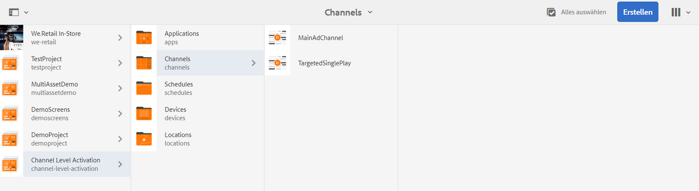
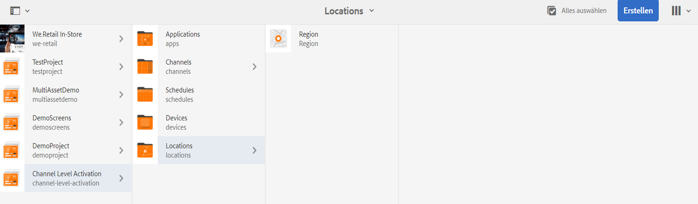
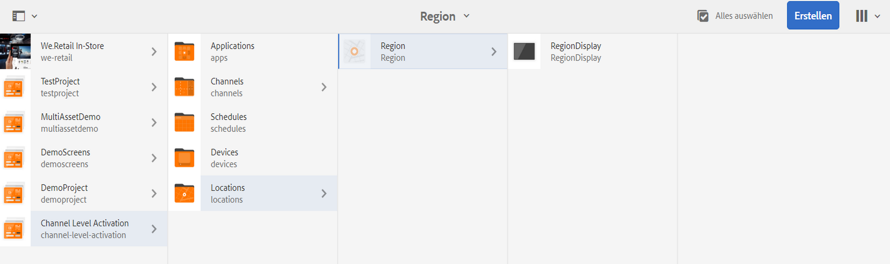
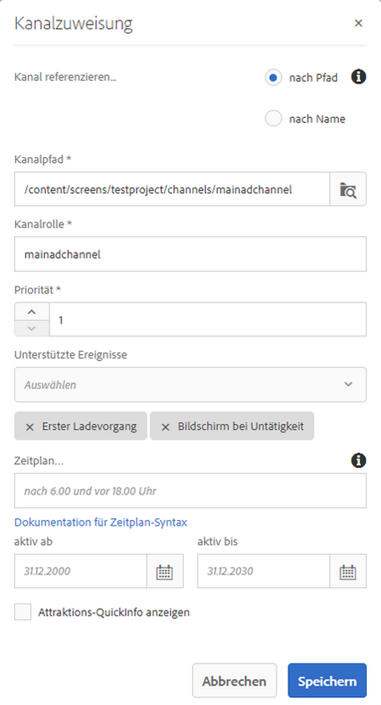

# Aktivierung auf Kanalebene {#channel-level-activation-single-event-playback}

Auf dieser Seite wird die Aktivierung auf Kanalebene für die in Kanälen verwendeten Assets beschrieben.

In diesem Abschnitt werden die folgenden Themen behandelt:

* Überblick
* Aktivierungsfenster
* Verwenden der Aktivierung auf Kanalebene als Wiedergabe eines einzelnen Ereignisses
* Umgang mit sich wiederholenden Assets in einem Kanal
   * DayParting
   * WeekParting
   * MonthParting
   * Kombination von Aufteilungen
* Verwenden der Aktivierung auf Kanalebene als Wiedergabe eines einzelnen Ereignisses

## Überblick {#overview}

Die ***Aktivierung auf Kanalebene*** ermöglicht den Wechsel von Kanälen nach einem festgelegten Zeitplan. Der Kanal für ein einzelnes Ereignis ersetzt den Hauptkanal nach einem festgelegten Zeitplan und spielt für eine bestimmte Zeit, bis der Hauptkanal seinen Inhalt wiedergibt.

Das folgende Beispiel zeigt eine Lösung mit Konzentration auf die folgenden Schlüsselbegriffe:

* einen ***Hauptsequenzkanal*** für die globale Sequenz
* einen ***Kanal für ein einzelnes Ereignis***, der nur einmal zur festgelegten Zeit ausgeführt wird
* einen ***festgelegten Zeitplan und eine Priorität*** für die einzelne Wiedergabe des Ereignisses, die innerhalb des Hauptsequenzkanals erfolgt

## Aktivierungsfenster {#using-channel-level-activation}

Im folgenden Abschnitt wird die Erstellung der Wiedergabe eines einzelnen Ereignisses innerhalb eines Kanals für ein AEM Screens-Projekt erläutert.

### Voraussetzungen {#prerequisites}

Bevor Sie mit der Implementierung dieser Funktion beginnen, stellen Sie sicher, dass Sie über die folgenden Voraussetzungen verfügen, um mit der Implementierung der Aktivierung auf Kanalebene beginnen zu können:

* Erstellen eines AEM Screens-Projekts, in diesem Beispiel **Channel Level Activation**

* Erstellen eines Kanals als **MainAdChannel** im Ordner **Kanäle**

* Erstellen eines weiteren Kanals als **TargetedSinglePlay** im Ordner **Kanäle**

* Hinzufügen relevanter Assets zu beiden Kanälen

Die folgende Abbildung zeigt das Projekt **Channel Level Activation** mit den Kanälen **MainAdChannel** und **TargetedSinglePlay** im Ordner **Kanäle**.

>[!NOTE]
>
>Weitere Informationen zum Erstellen eines Projekts und zum Erstellen eines Sequenzkanals finden Sie in den folgenden Ressourcen:
>
>* [Erstellen und Verwalten von Projekten](creating-a-screens-project.md)
>
>* [Verwalten eines Kanals](managing-channels.md)
>

### Implementierung {#implementation}

Die Implementierung der Aktivierung auf Kanalebene in einem AEM Screens-Projekt umfasst drei Hauptaufgaben:

1. **Einrichten des Klassifikationsschemas des Projekts, einschließlich Kanälen, Standorten und Anzeigen**
1. **Zuweisen anzuzeigender Kanäle**
1. **Konfigurieren eines Zeitplan und einer Priorität**

Gehen Sie wie folgt vor, um die Funktion zu implementieren:

1. **Erstellen eines Standorts**

   Navigieren Sie zum Ordner **Standorte** in Ihrem AEM Screens-Projekt und erstellen Sie einen Standort als **Region**.

   

   >[!NOTE]
   >
   >Informationen zum Erstellen eines Standorts finden Sie unter **[Erstellen und Verwalten von Standorten](managing-locations.md)**.

1. **Erstellen einer Anzeige unter dem Standort**

   1. Navigieren Sie zu **Channel Level Activation** > **Standorte** > **Region**.
   1. Klicks **Region** und klicken **+ Erstellen** in der Aktionsleiste aus.
   1. Klicks **Anzeige** aus dem Assistenten erstellen und eine Anzeige mit dem Titel **RegionDisplay.**

   

1. **Zuweisen anzuzeigender Kanäle**

   Für **MainAdChannel:**

   1. Navigieren Sie zu **Channel Level Activation** > **Standorte** > **Region** > **RegionDisplay** und klicken Sie in der Aktionsleiste auf **Kanal zuweisen**.
   1. Daraufhin wird das Dialogfeld **Kanalzuweisung** geöffnet.
   1. Klicks **Referenzkanal** nach Pfad.
   1. Klicken Sie auf **Kanalpfad** as **Aktivierung auf Kanalebene** > ***Kanäle*** > ***MainAdChannel***.
   1. Die **Kanalrolle** wird mit **mainadchannel** ausgefüllt.
   1. Klicken Sie auf **Priorität** as **1**.
   1. Klicken Sie auf **Unterstützte Ereignisse** as **Erster Ladevorgang** und **Idle Screen**.
   1. Klicken Sie auf **Speichern**.

   

   >[!NOTE]
   >
   >Sie können Kanäle auch über das Anzeigen-Dashboard zuweisen, indem Sie zu **Aktivierung auf Kanalebene** > **Standorte** > **Region** > **RegionDisplay** und auswählen **Dashboard** in der Aktionsleiste aus. Klicken Sie im Bedienfeld **ZUGEWIESENE KANÄLE UND ZEITPLÄNE** auf **+ Kanal zuweisen**.

   Weisen Sie den Kanal **TargetedSinglePlay** für die Anzeige zu:

   1. Navigieren Sie zu **Channel Level Activation** > **Standorte** > **Region** > **RegionDisplay** und klicken Sie in der Aktionsleiste auf **Kanal zuweisen**.
   1. Daraufhin wird das Dialogfeld **Kanalzuweisung** geöffnet.
   1. Klicks **Referenzkanal** nach Pfad.
   1. Klicken Sie auf **Kanalpfad** as **Aktivierung auf Kanalebene*** > ***Kanäle*** > ***TargetedSinglePlay***.
   1. Die **Kanalrolle** wird mit **targetedsingleplay** ausgefüllt.
   1. Legen Sie die als **Priorität** den Wert **2** fest.
   1. Klicken Sie auf **Unterstützte Ereignisse** as **Erster Ladevorgang**, **Idle Screen**, und **Timer**, wie in der folgenden Abbildung dargestellt.
   1. Wählen Sie das Datum unter **aktiv aus** als 27. November 2018, 11:59 Uhr und in **aktiv bis** als 28. November 2018 um 12:05 Uhr
   1. Klicken Sie auf **Speichern**.

   >[!CAUTION]
   >
   >Legen Sie die Priorität für **TargetedSinglePlay** Kanal höher als **MainAdSegment** -Kanal.

   

   >[!NOTE]
   >
   >Um denselben Tag auszuwählen, klicken Sie auf den nächsten Tag und bearbeiten Sie dann das Datum manuell auf den gleichen Tag, aber für einen späteren Zeitpunkt. Dadurch wird der Benutzer daran gehindert, ein vergangenes Datum auszuwählen. Siehe folgendes Beispiel:

   

## Anzeigen der Ergebnisse {#viewing-the-results}

Wenn Sie die Einrichtung für Kanäle und die Anzeige abgeschlossen haben, starten Sie den AEM Screens-Player, um den Inhalt anzuzeigen.

Der Player zeigt den Inhalt von **MainAdChannel** und genau um 11:59 Uhr (wie im Zeitplan festgelegt), wird die **TargetedSinglePlay** -Kanal zeigt seinen Inhalt bis 12:05 Uhr an, und dann **MainAdChannel** setzt die Wiedergabe des Inhalts fort.

>[!NOTE]
>
>Weitere Informationen zu AEM Player finden Sie in den folgenden Ressourcen:
>[AEM Screens Player-Downloads](https://download.macromedia.com/screens/)
>[Arbeiten mit dem AEM Screens Player](working-with-screens-player.md)

## Umgang mit sich wiederholenden Assets in einem Kanal {#handling-recurrence-in-assets}

Sie können eine Wiederholung von Assets in einem Kanal Ihren Anforderungen entsprechend in bestimmten Intervallen auf Tages-, Wochen- oder Monatsbasis planen.

Angenommen, Sie möchten Inhalte eines Kanals nur freitags von 13:00 Uhr bis 22:00 Uhr anzeigen. Auf der Registerkarte **Aktivierung** können Sie das gewünschte Wiederholungsintervall für Ihr Asset festlegen.

### DayParting {#day-parting}

1. Klicken Sie auf den Kanal und dann auf **Dashboard** in der Aktionsleiste aus.

1. Nach Eingabe von Startdatum/Startzeit und Enddatum/Endzeit im Dialogfeld **Kanalzuweisung** können Sie einen Ausdruck oder eine natürliche Textversion verwenden, um Ihren Wiederholungsplan anzugeben.

   >[!NOTE]
   >
   >Sie können die Felder **Aktiv ab** und **Aktiv bis** überspringen oder einbeziehen und den Ausdruck entsprechend Ihren Anforderungen zum Feld „Zeitpläne“ hinzufügen.

1. Geben Sie den Ausdruck in die **Zeitplan** und Ihr Asset für das jeweilige Tages- und Uhrzeitintervall angezeigt wird.

#### Beispielausdrücke für die DayParting {#example-one}

Die folgende Tabelle enthält einige Beispielausdrücke, die Sie dem Zeitplan hinzufügen können, während Sie einer Anzeige einen Kanal zuweisen.

| **Ausdruck** | **Interpretation** |
|---|---|
| vor 8:00 Uhr | Das Asset im Kanal wird täglich vor 8:00 Uhr wiedergegeben |
| nach 14:00 Uhr. | Das Asset im Kanal wird täglich nach 14:00 Uhr wiedergegeben |
| nach 12:15 Uhr und vor 12:45 Uhr | Das Asset im Kanal wird täglich 30 Minuten lang nach 12:15 Uhr wiedergegeben. |
| vor 12:15 Uhr auch nach 12:45 Uhr | Das Asset im Kanal wird täglich vor 12:15 Uhr und danach auch nach 12:45 Uhr wiedergegeben. |
| Mo., Tue., Mi. oder Mo.-Mi. | Das Asset im Kanal wird von Montag bis Mittwoch wiedergegeben. |
| am ersten Januar nach 14:00 Uhr auch am zweiten Januar, auch am dritten Januar vor 3:00 Uhr. | Die Wiedergabe des Assets im Kanal beginnt am 1. Januar um 14:00 Uhr und läuft den ganzen Tag am 2. Januar bis 3:00 Uhr am 3. Januar |
| an den 1-2 Tagen des Januar nach 14:00 Uhr auch an den 2-3 Tagen des Januar vor 3:00 Uhr. | Das Asset im Kanal startet den Player am 1. Januar um 14:00 Uhr, läuft bis 2. Januar um 3:00 Uhr und beginnt dann am 2. Januar um 2:00 Uhr und läuft bis 3:00 Uhr am 3. Januar |

>[!NOTE]
>
>Sie können auch _Militärzeit_ Notation (14:00) anstelle von *A.M./P.M* (14:00 Uhr).

### WeekParting {#week-parting}

1. Klicken Sie auf den Kanal und dann auf **Dashboard** in der Aktionsleiste aus.

1. Nach Eingabe von Startdatum/Startzeit und Enddatum/Endzeit im Dialogfeld **Kanalzuweisung** können Sie einen Ausdruck oder eine natürliche Textversion verwenden, um Ihren Wiederholungsplan anzugeben.

   >[!NOTE]
   >
   >Sie können die Felder **Aktiv ab** und **Aktiv bis** überspringen oder einbeziehen und den Ausdruck entsprechend Ihren Anforderungen zum Feld „Zeitpläne“ hinzufügen.

1. Geben Sie den Ausdruck in die **Zeitplan** und Ihr Asset für das jeweilige Tages- und Uhrzeitintervall angezeigt wird.

#### Beispielhafte Ausdrücke für WeekParting {#example-two}

Die folgende Tabelle enthält einige Beispielausdrücke, die Sie dem Zeitplan hinzufügen können, während Sie einer Anzeige einen Kanal zuweisen.

| **Ausdruck** | **Interpretation** |
|---|---|
| Mo., Tue., Mi. oder Mo.-Mi. | Das Asset im Kanal wird von Montag bis Mittwoch wiedergegeben. |
| vor 8:00 Uhr | Das Asset im Kanal wird täglich vor 8:00 Uhr wiedergegeben |
| nach 14:00 Uhr. | Das Asset im Kanal wird täglich nach 14:00 Uhr wiedergegeben |
| nach 12:15 Uhr und vor 12:45 Uhr | Das Asset im Kanal wird täglich 30 Minuten lang nach 12:15 Uhr wiedergegeben. |
| vor 12:15 Uhr auch nach 12:45 Uhr | Der Kanal wird täglich vor 12:15 Uhr und danach auch nach 12:45 Uhr wiedergegeben. |

>[!NOTE]
>
>Sie können auch _Militärzeit_ Notation (14:00) anstelle von *A.M./P.M* (14:00 Uhr).

### MonthParting {#month-parting}

1. Klicken Sie auf den Kanal und dann auf **Dashboard** in der Aktionsleiste aus.

1. Nach Eingabe von Startdatum/Startzeit und Enddatum/Endzeit im Dialogfeld **Kanalzuweisung** können Sie einen Ausdruck oder eine natürliche Textversion verwenden, um Ihren Wiederholungsplan anzugeben.

   >[!NOTE]
   >
   >Sie können die Felder **Aktiv ab** und **Aktiv bis** überspringen oder einbeziehen und den Ausdruck entsprechend Ihren Anforderungen zum Feld „Zeitpläne“ hinzufügen.

1. Geben Sie den Ausdruck in die **Zeitplan** und Ihr Asset für das jeweilige Tages- und Uhrzeitintervall angezeigt wird.

#### Beispielhafte Ausdrücke für MonthParting {#example-three}

Die folgende Tabelle enthält einige Beispielausdrücke, die Sie dem Zeitplan hinzufügen können, während Sie einer Anzeige einen Kanal zuweisen.

| **Ausdruck** | **Interpretation** |
|---|---|
| von `February,May,August,November` | Das Asset im Kanal wird im Februar, Mai, August, November wiedergegeben. |

>[!NOTE]
>
>Bei der Definition von Wochentagen und Monaten können Sie sowohl die Abkürzung als auch die vollständige Bezeichnung verwenden, z. B. &quot;Mo.&quot;/&quot;Montag&quot;und &quot;Jan.&quot;/&quot;Januar&quot;.

>[!NOTE]
>
>Sie können auch _Militärzeit_ Notation (14:00) anstelle von *A.M./P.M* (14:00 Uhr).

### Kombination von Aufteilungen {#combined-parting}

1. Klicken Sie auf den Kanal und dann auf **Dashboard** in der Aktionsleiste aus.

1. Nach Eingabe von Startdatum/Startzeit und Enddatum/Endzeit im Dialogfeld **Kanalzuweisung** können Sie einen Ausdruck oder eine natürliche Textversion verwenden, um Ihren Wiederholungsplan anzugeben.

   >[!NOTE]
   >
   >Sie können die Felder **Aktiv ab** und **Aktiv bis** überspringen oder einbeziehen und den Ausdruck entsprechend Ihren Anforderungen zum Feld „Zeitpläne“ hinzufügen.

1. Geben Sie den Ausdruck in die **Zeitplan** und Ihr Asset für das jeweilige Tages- und Uhrzeitintervall angezeigt wird.

#### Beispielausdrücke für die Kombination von Aufteilungen {#example-four}

Die folgende Tabelle enthält einige Beispielausdrücke, die Sie dem Zeitplan hinzufügen können, während Sie einer Anzeige einen Kanal zuweisen.

| **Ausdruck** | **Interpretation** |
|---|---|
| nach 6:00 Uhr und vor 18:00 Uhr am Mo., Mi. von Jan-Mar | Das Asset im Kanal wird montags bis mittwochs von Januar bis Ende März zwischen 6 Uhr und 18 Uhr und mittwochs wiedergegeben. |
| am ersten Januar nach 14:00 Uhr auch am zweiten Januar, auch am dritten Januar vor 3:00 Uhr. | Die Wiedergabe des Assets im Kanal beginnt am 1. Januar um 14:00 Uhr und läuft den ganzen Tag am 2. Januar bis 3:00 Uhr am 3. Januar |
| an den 1-2 Tagen des Januar nach 14:00 Uhr auch an den 2-3 Tagen des Januar vor 3:00 Uhr. | Das Asset im Kanal startet den Player am 1. Januar um 14:00 Uhr, läuft bis 2. Januar um 3:00 Uhr und beginnt dann am 2. Januar um 2:00 Uhr und läuft bis 3:00 Uhr am 3. Januar |

>[!NOTE]
>
>Bei der Definition von Wochentagen und Monaten können Sie sowohl die Abkürzung als auch die vollständige Bezeichnung verwenden, z. B. &quot;Mo.&quot;/&quot;Montag&quot;und &quot;Jan.&quot;/&quot;Januar&quot;. Sie können auch _Militärzeit_ Notation (14:00) anstelle von *A.M./P.M* (14:00 Uhr).
