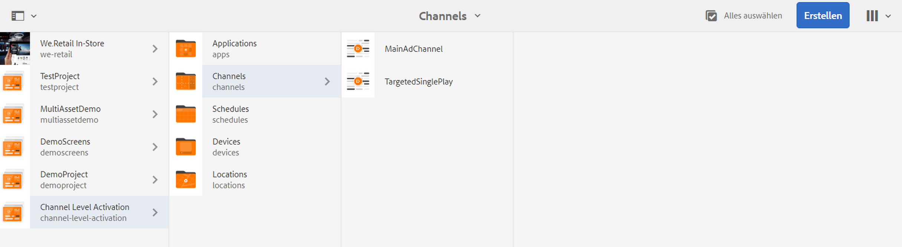
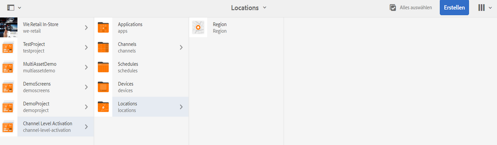
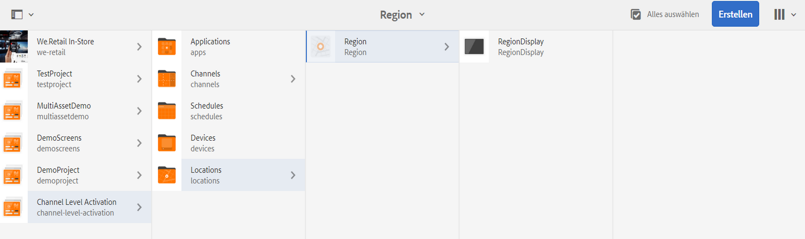
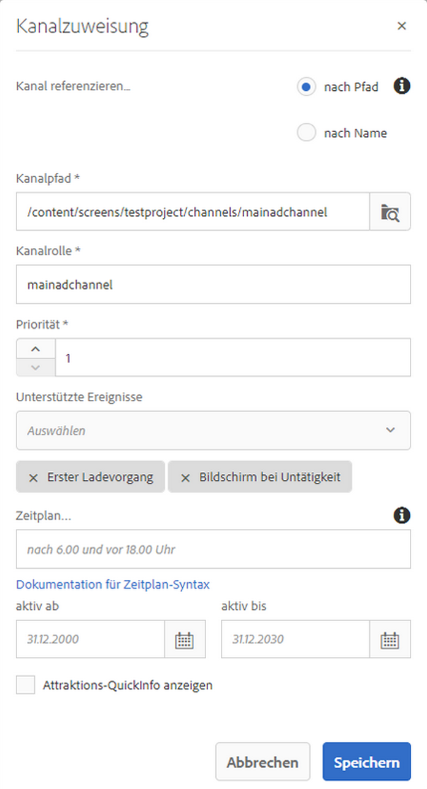
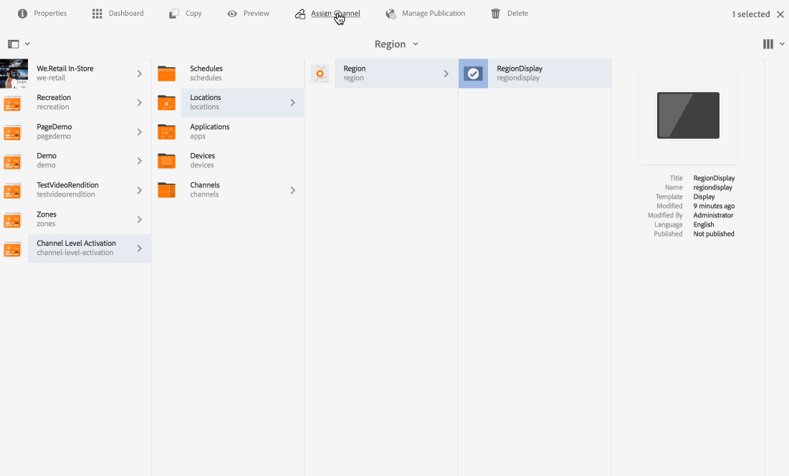

# Aktivierung auf Kanalebene {#channel-level-activation-single-event-playback}

>[!IMPORTANT]
>Dieser Inhalt gilt für AEM On-Premise/AMS (AEM 6.5LTS und AEM 6.5). Informationen zu AEM as a Cloud Service Screens-Inhalten finden Sie im [AEM as a Cloud Service-Handbuch](https://experienceleague.adobe.com/en/docs/experience-manager-cloud-service/content/screens-as-cloud-service/overview/introduction).

Auf dieser Seite wird die Aktivierung auf Kanalebene für die in Kanälen verwendeten Assets beschrieben.

In diesem Abschnitt werden die folgenden Themen behandelt:

* Überblick
* Aktivierungsfenster
* Verwenden der Aktivierung auf Kanalebene als Wiedergabe eines einzelnen Ereignisses
* Umgang mit sich wiederholenden Assets in einem Kanal
   * Dayparting
   * WeekParting
   * MonthParting
   * Kombination von Aufteilungen
* Verwenden der Aktivierung auf Kanalebene als Wiedergabe eines einzelnen Ereignisses

## Überblick {#overview}

Die ***Aktivierung auf Kanalebene*** ermöglicht den Wechsel von Kanälen nach einem festgelegten Zeitplan. Der Kanal für ein einzelnes Ereignis ersetzt den Hauptkanal nach einem festgelegten Zeitplan und spielt für eine bestimmte Zeit, bis der Hauptkanal seinen Inhalt wiedergibt.

Das folgende Beispiel zeigt eine Lösung mit Konzentration auf die folgenden Schlüsselbegriffe:

* einen ***Hauptsequenzkanal*** für die globale Sequenz
* einen ***Kanal für ein einzelnes Ereignis***, der nur einmal zur festgelegten Zeit ausgeführt wird
* einen ***festgelegten Zeitplan und eine Priorität*** für die einzelne Wiedergabe des Ereignisses, die innerhalb des Hauptsequenzkanals erfolgt

## Aktivierungsfenster {#using-channel-level-activation}

Im folgenden Abschnitt wird die Erstellung der Wiedergabe eines einzelnen Ereignisses innerhalb eines Kanals für ein AEM Screens-Projekt erläutert.

### Voraussetzungen {#prerequisites}

Bevor Sie diese Funktionalität implementieren, stellen Sie sicher, dass Sie die folgenden Voraussetzungen erfüllen, um mit der Implementierung der Aktivierung auf Kanalebene beginnen zu können:

* Erstellen eines AEM Screens-Projekts, in diesem Beispiel **Channel Level Activation**.

* Erstellen eines Kanals als **MainAdChannel** unter dem Ordner **Channels**.

* Erstellen eines weiteren Kanals als **TargetedSinglePlay** unter dem Ordner **Channels**.

* Hinzufügen relevanter Assets zu beiden Kanälen.

Die folgende Abbildung zeigt das Projekt **Channel Level Activation** mit den Kanälen **MainAdChannel** und **TargetedSinglePlay** im Ordner **Channels**.

>[!NOTE]
>
>Weitere Informationen zum Erstellen eines Projekts und zum Erstellen eines Sequenzkanals finden Sie in den folgenden Ressourcen:
>
>* [Erstellen und Verwalten von Projekten](creating-a-screens-project.md)
>
>* [Verwalten eines Kanals](managing-channels.md)
>

### Implementierung {#implementation}

Die Implementierung der Aktivierung auf Kanalebene in einem AEM Screens-Projekt umfasst drei Hauptaufgaben:

1. **Einrichten des Klassifikationsschemas des Projekts, einschließlich Kanälen, Standorten und Anzeigen**
1. **Zuweisen anzuzeigender Kanäle**
1. **Konfigurieren eines Zeitplan und einer Priorität**

Gehen Sie wie folgt vor, um die Funktion zu implementieren:

1. **Erstellen eines Standorts**

   Navigieren Sie zum Ordner **Standorte** in Ihrem AEM Screens-Projekt und erstellen Sie einen Standort als **Region**.

   

   >[!NOTE]
   >
   >Informationen zum Erstellen eines Standorts finden Sie unter **[Erstellen und Verwalten von Standorten](managing-locations.md)**.

1. **Erstellen einer Anzeige unter dem Standort**

   1. Navigieren Sie zu **Channel Level Activation** > **Standorte** > **Region**.
   1. Klicken Sie in der Aktionsleiste auf **Region** und dann auf **+ Erstellen**.
   1. Klicken Sie im Assistenten auf die Option **Anzeigen** und erstellen Sie eine Anzeige mit dem Titel **RegionDisplay.**.

   

1. **Zuweisen anzuzeigender Kanäle**

   Für **MainAdChannel:**

   1. Navigieren Sie zu **Channel Level Activation** > **Standorte** > **Region** > **RegionDisplay** und klicken Sie in der Aktionsleiste auf **Kanal zuweisen**.
   1. Wählen Sie im Dialogfeld **Kanalzuweisung** die Option **Referenzkanal** nach Pfad aus.
   1. Wählen Sie unter **Kanalpfad** den Wert **Channel Level Activation** > ***Channels*** > ***MainAdChannel*** aus.
   1. Die **Kanalrolle** wird mit **mainadchannel** ausgefüllt.
   1. Wählen Sie die Option **Priorität** aus und legen Sie den Wert **1** fest.
   1. Klicken Sie auf **Unterstützte Ereignisse** z. B. **Erstladevorgang** und **Bildschirm im Leerlauf**.
   1. Klicken Sie auf **Speichern**.

   

   >[!NOTE]
   >
   >Sie können den Kanal auch über das Anzeigen-Dashboard zuweisen. Navigieren Sie zu **Channel Level Activation** > **Standorte** > **Region** > **RegionDisplay**. Wählen Sie in der Aktionsleiste die Option **Dashboard**. Klicken Sie im Bereich **ZUGEWIESENE KANÄLE UND ZEITPLÄNE** auf **+ Kanal zuweisen**.

   Weisen Sie analog den Kanal **TargetedSinglePlay** für die Anzeige zu:

   1. Navigieren Sie zu **Channel Level Activation** > **Standorte** > **Region** > **RegionDisplay** und klicken Sie in der Aktionsleiste auf **Kanal zuweisen**.
   1. Wählen Sie im Dialogfeld **Kanalzuweisung** die Option **Referenzkanal** nach Pfad aus.
   1. Wählen Sie unter **Kanalpfad** den Wert **Channel Level Activation** > ***Channels*** > ***TargetedSinglePlay*** aus.
   1. Die **Kanalrolle** wird mit **targetedsingleplay** ausgefüllt.
   1. Legen Sie als **Priorität** den Wert **2** fest.
   1. Wählen Sie unter **Unterstützte Ereignisse** die Optionen **Erster Ladevorgang**, **Bildschirm bei Untätigkeit** und **Timer** aus, wie in der folgenden Abbildung dargestellt.
   1. In **aktiv ab**, festgelegt als 27. November 2018, :59 Uhr, und in **aktiv bis**, festgelegt als 28. November 2018, :05 Uhr.
   1. Klicken Sie auf **Speichern**.

   >[!CAUTION]
   >
   >Legen Sie für den Kanal **TargetedSinglePlay** eine höhere Priorität fest als für den Kanal **MainAdSegment**.

   

   >[!NOTE]
   >
   >Um denselben Tag festzulegen, wählen Sie den nächsten Tag aus und ändern Sie das Datum manuell auf denselben Tag, jedoch mit einer späteren Uhrzeit. Dadurch werden Benutzende daran gehindert, ein Datum in der Vergangenheit auszuwählen. Siehe folgendes Beispiel:

   

## Anzeigen der Ergebnisse {#viewing-the-results}

Wenn Sie die Einrichtung für die Kanäle und die Anzeige abgeschlossen haben, starten Sie den AEM Screens-Player, um den Inhalt anzuzeigen.

Der Player zeigt den Inhalt von **MainAdChannel** an und genau um :59 Uhr (wie im Zeitplan festgelegt) zeigt der Kanal **TargetedSinglePlay** seinen Inhalt bis 12 :05 Uhr an. Danach nimmt der **MainAdChannel** die Wiedergabe seines Inhalts wieder auf.

>[!NOTE]
>
>Weitere Informationen zum AEM Screens-Player finden Sie unter:AEM Screens Player-DownloadsArbeiten mit dem AEM Screens-Player&rbrack;(working-with-screens-player.md)

## Umgang mit sich wiederholenden Assets in einem Kanal {#handling-recurrence-in-assets}

Sie können eine Wiederholung von Assets in einem Kanal in bestimmten Intervallen auf Tages-, Wochen- oder Monatsbasis planen.

Angenommen, Sie möchten den Inhalt eines Kanals nur freitags von 13 :00 bis 23 :00 anzeigen. Auf der Registerkarte **Aktivierung** können Sie das gewünschte Intervall für das Asset festlegen.

### DayParting {#day-parting}

1. Klicken Sie auf den Kanal und dann in der Aktionsleiste auf **Dashboard**.

1. Nach Eingabe von Startdatum/Startzeit und Enddatum/Endzeit im Dialogfeld **Kanalzuweisung** können Sie einen Ausdruck oder eine natürliche Textversion verwenden, um Ihren Intervallplan anzugeben.

   >[!NOTE]
   >
   >Sie können die Felder **Aktiv ab** und **Aktiv bis** überspringen oder einbeziehen und den Ausdruck entsprechend Ihren Anforderungen zum Feld „Zeitpläne“ hinzufügen.

1. Geben Sie den Ausdruck in den **Zeitplan** ein. Ihr Asset wird daraufhin im jeweiligen Tages- und Uhrzeitintervall angezeigt.

#### Beispielausdrücke für Dayparting {#example-one}

Die folgende Tabelle enthält einige Beispielausdrücke, die Sie dem Zeitplan hinzufügen können, während Sie einer Anzeige einen Kanal zuweisen.

| **Ausdruck** | **Interpretation** |
|---|---|
| vor :00 h. | Das Asset im Kanal wird täglich vor :00 Uhr abgespielt |
| nach :00 Uhr nachmittags | Das Asset im Kanal wird täglich nach 14 :00 wiedergegeben |
| Nach 12:15 und vor 12:45 | das Asset im Kanal wird nach 12 :15 täglich für 30 Minuten wiedergegeben |
| Vor 12:15 auch nach 12:45 | Das Asset im Kanal wird täglich vor 12 :15 und dann auch nach 24 :45 wiedergegeben. |
| Mo., Di., Mi. oder Mo.–Mi. | Das Asset im Kanal wird von Montag bis Mittwoch wiedergegeben. |
| am ersten Januartag nach 14 :00, auch am zweiten Januartag und auch am dritten Januartag vor 3 :00 Uhr. | Das Asset im Kanal wird ab dem 1. Januar um :00 Uhr wiedergegeben und läuft am 2. Januar den ganzen Tag lang bis zum 3. Januar :00 Uhr morgens weiter |
| an den 1-2 Tagen des Januar nach :00 Uhr auch an den 2-3 Tagen des Januar vor :00 Uhr. | Das Asset im Kanal wird ab dem 1. Januar um :00 Uhr bis zum 2. Januar um :00 Uhr wiedergegeben. Dann wird es am 2. Januar um 14 :00 erneut gestartet und bis zum 3. Januar :00 Uhr fortgesetzt |

>[!NOTE]
>
>Sie können auch _Militärische Zeit_ Notation (14:00) anstelle von *A.M./P.M.* (14:00) verwenden.

### WeekParting {#week-parting}

1. Klicken Sie auf den Kanal und dann in der Aktionsleiste auf **Dashboard**.

1. Nach Eingabe von Startdatum/Startzeit und Enddatum/Endzeit im Dialogfeld **Kanalzuweisung** können Sie einen Ausdruck oder eine natürliche Textversion verwenden, um Ihren Intervallplan anzugeben.

   >[!NOTE]
   >
   >Sie können die Felder **Aktiv ab** und **Aktiv bis** überspringen oder einbeziehen und den Ausdruck entsprechend Ihren Anforderungen zum Feld „Zeitpläne“ hinzufügen.

1. Geben Sie den Ausdruck in den **Zeitplan** ein. Ihr Asset wird daraufhin im jeweiligen Tages- und Uhrzeitintervall angezeigt.

#### Beispielhafte Ausdrücke für Weekparting {#example-two}

Die folgende Tabelle enthält einige Beispielausdrücke, die Sie dem Zeitplan hinzufügen können, während Sie einer Anzeige einen Kanal zuweisen.

| **Ausdruck** | **Interpretation** |
|---|---|
| Mo., Di., Mi. oder Mo.–Mi. | Das Asset im Kanal wird von Montag bis Mittwoch wiedergegeben. |
| vor :00 h. | Das Asset im Kanal wird täglich vor :00 Uhr abgespielt |
| nach :00 Uhr nachmittags | Das Asset im Kanal wird täglich nach 14 :00 wiedergegeben |
| Nach 12:15 und vor 12:45 | das Asset im Kanal wird nach 12 :15 täglich für 30 Minuten wiedergegeben |
| Vor 12:15 auch nach 12:45 | Der Kanal spielt jeden :15 vor 12 Uhr und dann auch nach :45 Uhr. |

>[!NOTE]
>
>Sie können auch _Militärische Zeit_ Notation (14:00) anstelle von *A.M./P.M.* (14:00) verwenden.

### MonthParting {#month-parting}

1. Klicken Sie auf den Kanal und dann in der Aktionsleiste auf **Dashboard**.

1. Nach Eingabe von Startdatum/Startzeit und Enddatum/Endzeit im Dialogfeld **Kanalzuweisung** können Sie einen Ausdruck oder eine natürliche Textversion verwenden, um Ihren Intervallplan anzugeben.

   >[!NOTE]
   >
   >Sie können die Felder **Aktiv ab** und **Aktiv bis** überspringen oder einbeziehen und den Ausdruck entsprechend Ihren Anforderungen zum Feld „Zeitpläne“ hinzufügen.

1. Geben Sie den Ausdruck in den **Zeitplan** ein. Ihr Asset wird daraufhin im jeweiligen Tages- und Uhrzeitintervall angezeigt.

#### Beispielhafte Ausdrücke für Monthparting {#example-three}

Die folgende Tabelle enthält einige Beispielausdrücke, die Sie dem Zeitplan hinzufügen können, während Sie einer Anzeige einen Kanal zuweisen.

| **Ausdruck** | **Interpretation** |
|---|---|
| im `February,May,August,November` | Das Asset im Kanal wird im Februar, Mai, August und November wiedergegeben. |

>[!NOTE]
>
>Bei der Definition von Wochentagen und Monaten können Sie sowohl die Abkürzung als auch die vollständige Bezeichnung verwenden, beispielsweise „Mo.“/„Montag“ und „Jan.“/„Januar“.

>[!NOTE]
>
>Sie können auch _Militärische Zeit_ Notation (14:00) anstelle von *A.M./P.M.* (14:00) verwenden.

### Kombination von Aufteilungen {#combined-parting}

1. Klicken Sie auf den Kanal und dann in der Aktionsleiste auf **Dashboard**.

1. Nach Eingabe von Startdatum/Startzeit und Enddatum/Endzeit im Dialogfeld **Kanalzuweisung** können Sie einen Ausdruck oder eine natürliche Textversion verwenden, um Ihren Intervallplan anzugeben.

   >[!NOTE]
   >
   >Sie können die Felder **Aktiv ab** und **Aktiv bis** überspringen oder einbeziehen und den Ausdruck entsprechend Ihren Anforderungen zum Feld „Zeitpläne“ hinzufügen.

1. Geben Sie den Ausdruck in den **Zeitplan** ein. Ihr Asset wird daraufhin im jeweiligen Tages- und Uhrzeitintervall angezeigt.

#### Beispielausdrücke für die Kombination von Aufteilungen {#example-four}

Die folgende Tabelle enthält einige Beispielausdrücke, die Sie dem Zeitplan hinzufügen können, während Sie einer Anzeige einen Kanal zuweisen.

| **Ausdruck** | **Interpretation** |
|---|---|
| nach 6:00 und vor 18:00 am Mo, Mi von Jan-Mar | Das Asset im Kanal wird von Januar bis Ende März montags und mittwochs zwischen 6 Uhr und 18 Uhr wiedergegeben. |
| am ersten Januartag nach 14 :00, auch am zweiten Januartag und auch am dritten Januartag vor 3 :00 Uhr. | Das Asset im Kanal wird ab dem 1. Januar um :00 Uhr wiedergegeben und läuft am 2. Januar den ganzen Tag lang bis zum 3. Januar :00 Uhr morgens weiter |
| an den 1-2 Tagen des Januar nach :00 Uhr auch an den 2-3 Tagen des Januar vor :00 Uhr. | Das Asset im Kanal wird ab dem 1. Januar um :00 Uhr bis zum 2. Januar um :00 Uhr wiedergegeben. Dann wird es am 2. Januar um 14 :00 erneut gestartet und bis zum 3. Januar :00 Uhr fortgesetzt |

>[!NOTE]
>
>Bei der Definition von Wochentagen und Monaten können Sie sowohl die Abkürzung als auch die vollständige Bezeichnung verwenden, beispielsweise „Mo.“/„Montag“ und „Jan.“/„Januar“. Sie können auch die Notation _Militärische Zeit_ (14 :00) anstelle von *A.M./P.M.* (14 :00) verwenden.

