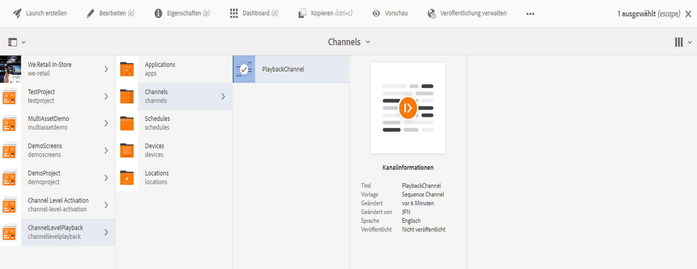
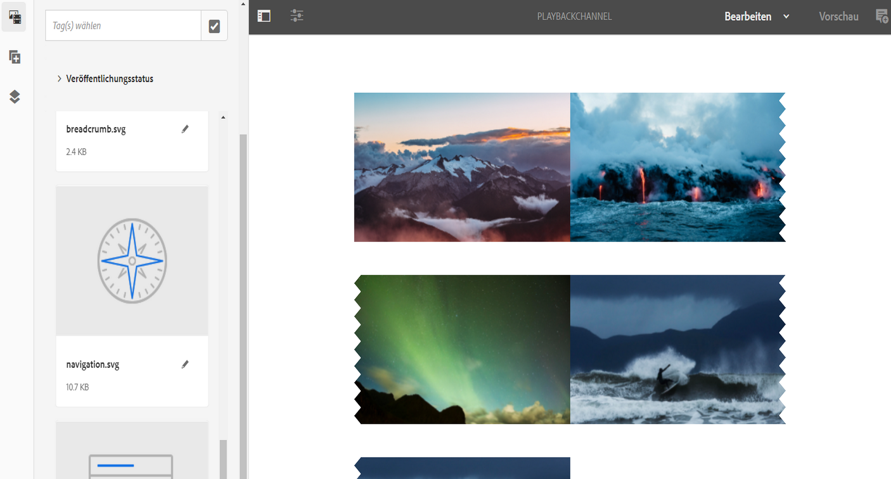
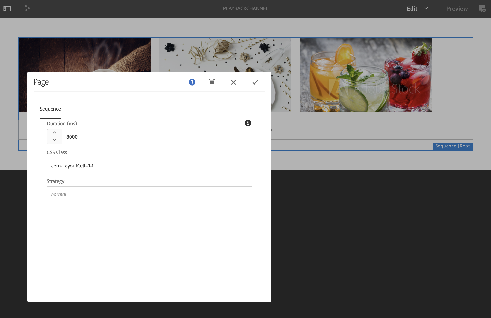
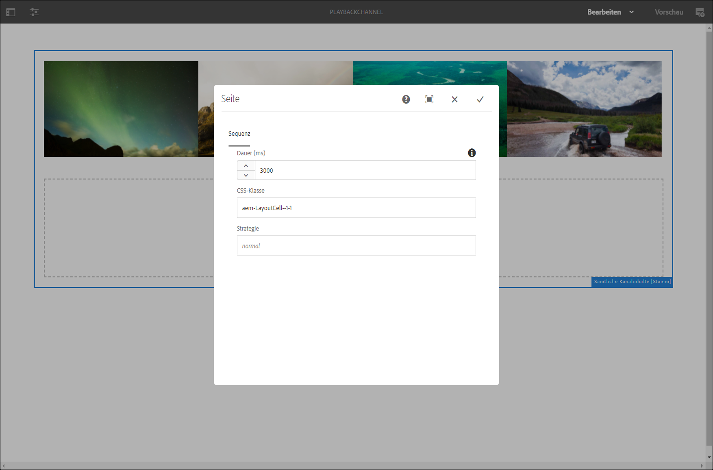

# Dauer der Massenwiedergabe von Bildern auf Kanalebene {#channel-level-bulk-image-playback-duration}

## Überblick {#overview}

Wenn Sie einen Sequenzkanal erstellen und Bilder hinzufügen, gilt für alle Bilder standardmäßig die in der Konfiguration auf Kanalebene definierte Wiedergabedauer. Jedes einzelne Bild kann den Standard weiterhin überschreiben und eine andere Wiedergabedauer aufweisen. Dies wird durch Bearbeiten der Wiedergabedauer der jeweiligen Bildkomponente erreicht.

### Voraussetzungen {#prerequisites}

Bevor Sie diese Funktionalität implementieren, vergewissern Sie sich, dass Sie ein Projekt eingerichtet haben. Dies ist die Voraussetzung für die Implementierung dieser Funktionalität. Zum Beispiel:

1. Erstellen eines AEM Screens-Projekts (in diesem Beispiel **ChannelLevelPlayback**).

1. Erstellen Sie einen Sequenzkanal als **PlaybackChannel** im Ordner **Kanäle**.

1. Hinzufügen von Inhalten zum **PlaybackChannel**.

## Bearbeiten der Bildwiedergabedauer auf Kanalebene {#editing-channel-level-image-playback-duration-assignment}

Im folgenden Abschnitt wird beschrieben, wie Sie die Wiedergabedauer von Inhalten in einem AEM Screens-Kanal bearbeiten können.

### Aktualisieren der Wiedergabedauer für Bilder in einem Kanal {#updating-the-playback-duration-for-images-in-a-channel}

Gehen Sie wie folgt vor, um zu erfahren, wie Sie die Wiedergabedauer auf Kanalebene aktualisieren:

1. Navigieren Sie zum Sequenzkanal **PlaybackChannel**.

   

1. Klicken Sie in der Aktionsleiste auf **Bearbeiten**.

   

1. Fügen Sie im Kanaleditor zwei oder mehr Bilder hinzu, wie in der Abbildung unten gezeigt.

   

1. Klicken Sie auf alle Bilder im Kanal und dann auf das Schraubenschlüsselsymbol oben links (wie in der Abbildung unten gezeigt), um das Dialogfeld zum Konfigurieren auf Kanalebene zu öffnen.

   

1. Das Dialogfeld **Seite** wird geöffnet.

   >[!NOTE]
   >Standardmäßig sind die Bilder in einem Kanal auf eine Wiedergabedauer von 8 Sekunden eingestellt.

   

   Ändern Sie die **Dauer** von 8000 (Millisekunden) in 3000 (Millisekunden), d. h. 3 Sekunden. Klicken Sie auf das Häkchen oben rechts im Dialogfeld **Seite**, um Ihre Änderungen zu speichern.

   

### Anzeigen des Ergebnisses {#viewing-the-result}

Nachdem Sie die Dauer der Kanalwiedergabe (in diesem Beispiel alle drei Bilder) aktualisiert haben, werden Sie feststellen, dass die Bilder nun jeweils 3 Sekunden lang statt 8 Sekunden (Standardwert) wiedergegeben werden.

