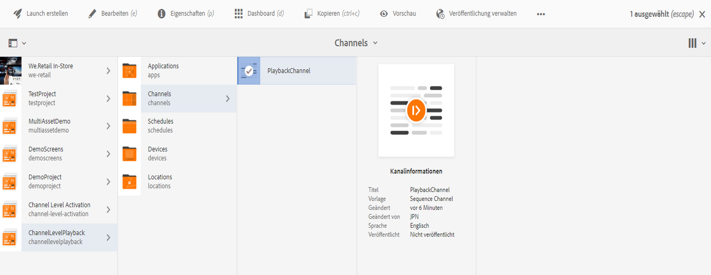

# Dauer der Massenwiedergabe von Bildern auf der Kanalebene {#channel-level-bulk-image-playback-duration}

## Überblick {#overview}

Nachdem Sie einen Sequenzkanal erstellt und Bilder hinzugefügt haben, gilt für alle Bilder standardmäßig die in der Konfiguration auf Kanalebene definierte Wiedergabedauer. Jedes einzelne Bild kann jedoch den Standard überschreiben und eine andere Wiedergabedauer haben. Dies wird durch Bearbeiten der Wiedergabedauer der jeweiligen Bildkomponente erreicht.

### Voraussetzungen {#prerequisites}

Bevor Sie mit der Implementierung dieser Funktion beginnen, stellen Sie sicher, dass Sie ein Projekt als Voraussetzung für die Implementierung dieser Funktion eingerichtet haben. Beispiel:

1. Create an AEM Screens project example, **ChannelLevelPlayback**.

1. Erstellen eines Sequenzkanals als **PlaybackChannel** im Ordner **Kanäle.**

1. Hinzufügen von Inhalten zum **PlaybackChannel**.

## Bearbeiten der Bildwiedergabedauer auf Kanalebene {#editing-channel-level-image-playback-duration-assignment}

Im folgenden Abschnitt wird beschrieben, wie Sie die Wiedergabedauer von Inhalten in einem AEM Screens-Kanal bearbeiten.

### Aktualisieren der Wiedergabedauer für Bilder in einem Kanal {#updating-the-playback-duration-for-images-in-a-channel}

Gehen Sie wie folgt vor, um zu erfahren, wie Sie die Wiedergabedauer auf Kanalebene aktualisieren:

1. Navigieren Sie zum Sequenzkanal **PlaybackChannel**.

   

1. Klicken Sie in der Aktionsleiste auf **Bearbeiten**, um den Editor zu öffnen.

   

1. Fügen Sie im Kanaleditor zwei oder mehr Bilder hinzu, wie in der Abbildung unten gezeigt.

   

1. Wählen Sie alle Bilder im Kanal aus und klicken Sie auf das Schraubenschlüsselsymbol oben links (wie in der Abbildung unten gezeigt), um das Dialogfeld zum Konfigurieren auf Kanalebene zu öffnen.

   

1. Das Dialogfeld **Seite** wird geöffnet.

   >[!NOTE]
   >Standardmäßig sind die Bilder in einem Kanal auf eine Wiedergabedauer von 8 Sekunden eingestellt.

   

   Ändern Sie die **Dauer** von 8000 (ms) in 3000 (ms), d. h. 3 Sekunden. Klicken Sie auf das Häkchen oben rechts im Dialogfeld **Seite**, um Ihre Änderungen zu speichern.

   

### Anzeigen des Ergebnisses {#viewing-the-result}

Nachdem Sie die Dauer der Kanalwiedergabe (in diesem Beispiel alle drei Bilder) aktualisiert haben, werden Sie feststellen, dass die Bilder jetzt für 3 Sekunden statt für 8 Sekunden (Standardwert) wiedergegeben werden.

