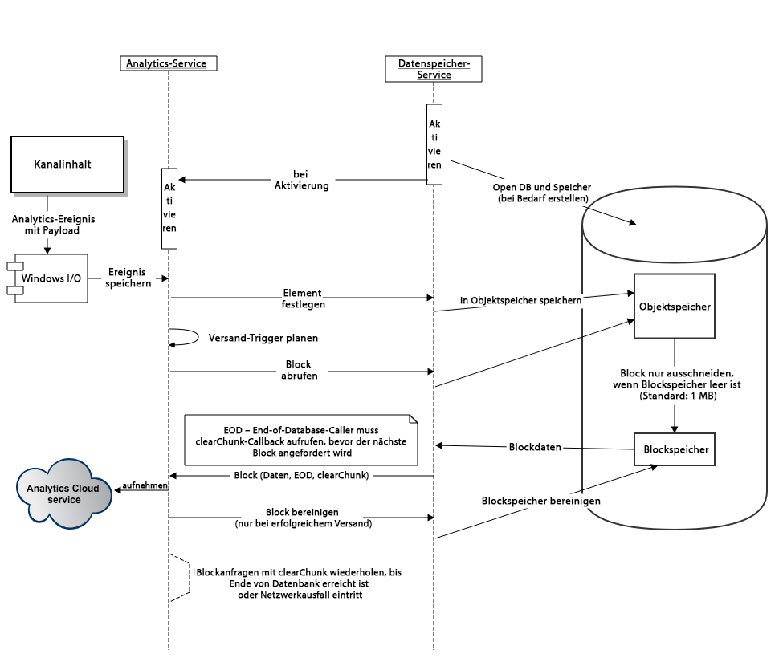

# Konfigurieren von Adobe Analytics mit AEM Screens {#configuring-adobe-analytics-with-aem-screens}

<!-- OBSOLETE NOTE>
>[!CAUTION]
>
>This AEM Screens functionality is only available if you have installed AEM 6.4.2 Feature Pack 2 and AEM 6.3.3 Feature Pack 4.
>
>To get access to either of these Feature Packs, contact Adobe Support and request access. When you have permissions, download it from Package Share. -->

In diesem Abschnitt werden folgende Themen behandelt:

* **Sequenzierung in Adobe Analytics mit AEM Screens**
* **Senden benutzerspezifischer Ereignisse mit Adobe Analytics im Offline-Modus**

## Sequenzierung in Adobe Analytics mit AEM Screens {#sequencing-in-adobe-analytics-with-aem-screens}

Die ***Sequenzierungsprozess*** beginnt mit einem Datenspeicherdienst, der den Adobe Analytics-Dienst aktiviert. Kanalinhalte senden Adobe Analytics-Ereignisse mit Kostenanalyse, d. h. die Erfassung von Datentests an Windows I/O und die Auslösung von Aufenthaltsereignissen werden ausgelöst. Die Ereignisse werden in der Index-DB gespeichert und weiter in den Objektspeicher verschoben. Basierend auf dem vom Administrator festgelegten Zeitplan werden die Daten aus dem Objektspeicher ausgeschnitten und weiter in den Blockspeicher übertragen. Es versucht, die maximale Datenmenge zu senden, wenn eine Verbindung hergestellt wird.

### Sequenzierungsdiagramm {#sequencing-diagram}

Im folgenden Sequenzierungsdiagramm wird die Adobe Analytics-Integration mit AEM Screens beschrieben:

## Senden benutzerspezifischer Ereignisse mit Adobe Analytics im Offline-Modus {#sending-custom-events-using-offline-adobe-analytics}

Die folgende Tabelle fasst das Standarddatenmodell für Ereignisse zusammen. Es werden alle Felder aufgelistet, die an Adobe Analytics gesendet werden:

<table>
 <tbody>
  <tr>
   <td><strong>Abschnitt</strong></td> 
   <td><strong>Eigenschaftsbezeichnung</strong></td> 
   <td><strong>Eigenschaftsname/Schlüssel</strong></td> 
   <td><strong>Erforderlich</strong></td> 
   <td><strong>Datentyp</strong></td> 
   <td><strong>Eigenschaftstyp</strong>  </td> 
   <td><strong>Beschreibung</strong></td> 
  </tr>
  <tr>
   <td><strong><em>Core/Ereignis</em></strong></td> 
   <td>Ereignis-GUID</td> 
   <td>event.guid</td> 
   <td>empfohlen</td> 
   <td>Zeichenfolge</td> 
   <td>UUID</td> 
   <td>Eindeutige ID, die eine Instanz eines Ereignisses identifiziert</td> 
  </tr>
  <tr>
   <td> </td> 
   <td>Datum und Uhrzeit der Erfassung des Ereignisses</td> 
   <td>event.coll_dts</td> 
   <td>optional</td> 
   <td>Zeichenfolge</td> 
   <td>Zeitstempel – UTC</td> 
   <td>Datum und Uhrzeit der Erfassung</td> 
  </tr>
  <tr>
   <td> </td> 
   <td>Datum und Uhrzeit des Ereignisses (Start)</td> 
   <td>event.dts_start</td> 
   <td>empfohlen</td> 
   <td>Zeichenfolge</td> 
   <td>Zeitstempel – UTC</td> 
   <td>Startzeitpunkt des Ereignisses: Wenn Sie diese Zeit nicht angegeben haben, wird die Ereigniszeit vom Server als die Zeit angenommen, zu der sie empfangen wurde.</td> 
  </tr>
  <tr>
   <td> </td> 
   <td>Datum und Uhrzeit des Ereignisses (Ende)</td> 
   <td>event.dts_end</td> 
   <td>optional</td> 
   <td>Zeichenfolge</td> 
   <td>Zeitstempel – UTC</td> 
   <td>Abschlussdatum des Ereignisses</td> 
  </tr>
  <tr>
   <td> </td> 
   <td>Processus</td> 
   <td>event.workflow</td> 
   <td>empfohlen</td> 
   <td>Zeichenfolge</td> 
   <td> </td> 
   <td>Nom du processus (Screens)</td> 
  </tr>
  <tr>
   <td> </td> 
   <td>DMe-Hauptkategorie</td> 
   <td>event.category</td> 
   <td>erforderlich</td> 
   <td>Zeichenfolge</td> 
   <td> </td> 
   <td>Hauptkategorie (DESKTOP, MOBILE, WEB, PROZESS, SDK, SERVICE, ÖKOSYSTEM) – Gruppierung von Ereignistypen – <strong>Player gesendet</strong></td> 
  </tr>
  <tr>
   <td> </td> 
   <td>Unterkategorie</td> 
   <td>event.subcategory</td> 
   <td>empfohlen</td> 
   <td>Zeichenfolge</td> 
   <td> </td> 
   <td>Unterkategorie – Abschnitt eines Workflows oder Bereich eines Bildschirms usw. (Zuletzt verwendete Dateien, CC-Dateien, mobile Kreationen usw.)</td> 
  </tr>
  <tr>
   <td> </td> 
   <td>Ereignis-/Aktionstyp</td> 
   <td>event.type</td> 
   <td>erforderlich</td> 
   <td>Zeichenfolge</td> 
   <td> </td> 
   <td>Ereignistyp (Rendering, Klicken, Pinch, Zoom) – Primäre Benutzeraktion</td> 
  </tr>
  <tr>
   <td> </td> 
   <td>Untertyp</td> 
   <td>event.subtype</td> 
   <td>empfohlen</td> 
   <td>Zeichenfolge</td> 
   <td> </td> 
   <td>Ereignisuntertyp (Erstellen, Aktualisieren, Löschen, Veröffentlichen usw.) – weitere Details zur Benutzeraktion</td> 
  </tr>
  <tr>
   <td> </td> 
   <td>Offline</td> 
   <td>event.offline</td> 
   <td>optional</td> 
   <td>Boolesch</td> 
   <td> </td> 
   <td>Das Ereignis wurde generiert, während die Aktion offline/online war (true/false)</td> 
  </tr>
  <tr>
   <td> </td> 
   <td>Benutzeragent</td> 
   <td>event.user_agent</td> 
   <td>empfohlen (Web-Eigenschaften)</td> 
   <td>Zeichenfolge</td> 
   <td> </td> 
   <td>Benutzeragent</td> 
  </tr>
  <tr>
   <td> </td> 
   <td>Sprache/Gebietsschema</td> 
   <td>event.language</td> 
   <td>empfohlen</td> 
   <td>Zeichenfolge</td> 
   <td> </td> 
   <td>Das Gebietsschema des Benutzers ist eine Zeichenfolge, basierend auf den Sprachkennzeichnungskonventionen von RFC 3066 (z. B. en-US, fr-FR oder es-ES).</td> 
  </tr>
  <tr>
   <td> </td> 
   <td>Geräte-GUID</td> 
   <td>event.device_guid</td> 
   <td>optional</td> 
   <td>Zeichenfolge  </td> 
   <td>UUID</td> 
   <td>Identifiziert die Geräte-GUID (z. B. Computer-ID oder Hash der IP-Adresse + Subnetzmaske + Netzwerk-ID + Benutzeragent) – Senden des Benutzernamens des Players, der bei der Registrierung generiert wurde</td> 
  </tr>
  <tr>
   <td> </td> 
   <td>Anzahl</td> 
   <td>event.count</td> 
   <td>optional</td> 
   <td>number</td> 
   <td> </td> 
   <td>Häufigkeit des aufgetretenen Ereignisses – Senden der Videodauer</td> 
  </tr>
  <tr>
   <td> </td> 
   <td>Wert</td> 
   <td>event.value</td> 
   <td>optional</td> 
   <td>Zeichenfolge</td> 
   <td> </td> 
   <td>Wert des Ereignisses (z. B. Einstellungen ein-/ausschalten)</td> 
  </tr>
  <tr>
   <td> </td> 
   <td>Seitenname</td> 
   <td>event.pagename</td> 
   <td>für AA erforderlich</td> 
   <td>Zeichenfolge</td> 
   <td> </td> 
   <td>Unterstützung von Adobe Analytics für benutzerdefinierte Seitennamen</td> 
  </tr>
  <tr>
   <td> </td> 
   <td>URL</td> 
   <td>event.url</td> 
   <td>optional</td> 
   <td>Zeichenfolge</td> 
   <td> </td> 
   <td>URL der Webeigenschaft oder des mobilen Schemas - muss eine vollständig qualifizierte URL enthalten</td> 
  </tr>
  <tr>
   <td> </td> 
   <td>Fehler-Code</td> 
   <td>event.error_code</td> 
   <td> </td> 
   <td>Zeichenfolge</td> 
   <td> </td> 
   <td>Fehler-Code</td> 
  </tr>
  <tr>
   <td> </td> 
   <td>Fehlertyp</td> 
   <td>event.error_type</td> 
   <td> </td> 
   <td>Zeichenfolge</td> 
   <td> </td> 
   <td>Fehlertyp</td> 
  </tr>
  <tr>
   <td> </td> 
   <td>Fehlerbeschreibung</td> 
   <td>event.error_description</td> 
   <td> </td> 
   <td>Zeichenfolge</td> 
   <td> </td> 
   <td>Fehlerbeschreibung  </td> 
  </tr>
  <tr>
   <td><strong><em>Quelle/Ursprungsprodukt</em></strong></td> 
   <td>Name</td> 
   <td>source.name</td> 
   <td>erforderlich</td> 
   <td>Zeichenfolge</td> 
   <td> </td> 
   <td>App-Name (AEM Screens)</td> 
  </tr>
  <tr>
   <td> </td> 
   <td>Version</td> 
   <td>source.version</td> 
   <td>erforderlich</td> 
   <td>Zeichenfolge</td> 
   <td> </td> 
   <td>Firmware-Version</td> 
  </tr>
  <tr>
   <td> </td> 
   <td>Plattform</td> 
   <td>source.platform</td> 
   <td>erforderlich</td> 
   <td>Zeichenfolge</td> 
   <td> </td> 
   <td>navigator.platform</td> 
  </tr>
  <tr>
   <td> </td> 
   <td>Gerät</td> 
   <td>source.device</td> 
   <td>erforderlich, mit Ausnahmen</td> 
   <td>Zeichenfolge</td> 
   <td> </td> 
   <td>Player-Name</td> 
  </tr>
  <tr>
   <td> </td> 
   <td>Betriebssystemversion</td> 
   <td>source.os_version</td> 
   <td>erforderlich, mit Ausnahmen</td> 
   <td>Zeichenfolge</td> 
   <td> </td> 
   <td>BS-Version</td> 
  </tr>
  <tr>
   <td><strong><em>Inhalt</em></strong></td> 
   <td>Aktion</td> 
   <td>content.action</td> 
   <td>erforderlich</td> 
   <td>Zeichenfolge</td> 
   <td> </td> 
   <td>Die URL des Assets, einschließlich der tatsächlichen Ausgabedarstellung</td> 
  </tr>
  <tr>
   <td> </td> 
   <td>Mime-Typ</td> 
   <td>content.mimetype</td> 
   <td>optional</td> 
   <td>Zeichenfolge</td> 
   <td> </td> 
   <td>Mime-Typ des Inhalts</td> 
  </tr>
  <tr>
   <td><strong><em>Transaktion</em></strong></td> 
   <td>Transaktionsnummer</td> 
   <td>trn.number</td> 
   <td>erforderlich</td> 
   <td>Zeichenfolge</td> 
   <td>UUID</td> 
   <td>Eindeutige ID, die vorzugsweise UUID v4 entspricht</td> 
  </tr>
  <tr>
   <td> </td> 
   <td>Produktbeschreibung</td> 
   <td>trn.product</td> 
   <td>erforderlich</td> 
   <td>Zeichenfolge</td> 
   <td> </td> 
   <td>Die URL des Assets (ohne Wiedergabe)</td> 
  </tr>
  <tr>
   <td> </td> 
   <td>Menge</td> 
   <td>trn.quantity</td> 
   <td>erforderlich</td> 
   <td>Zeichenfolge</td> 
   <td> </td> 
   <td>Die Dauer der Wiedergabe</td> 
  </tr>
 </tbody>
</table>
