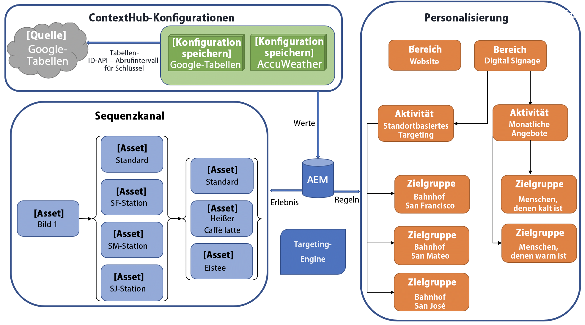

# Konfigurieren von ContextHub in AEM Screens {#configuring-contexthub-in-aem-screens}

Dieser Abschnitt konzentriert sich auf das Erstellen und Verwalten von datengesteuerten Asset-Änderungen mithilfe eines Datenspeichers.

## Schlüsselbegriffe {#key-terms}

Bevor Sie sich mit der Erstellung und Verwaltung von bestandsgesteuerten Kanälen in Ihrem AEM Screens-Projekt beschäftigen, machen Sie sich mit einigen der Schlüsselbegriffe der verschiedenen Szenarien vertraut.

**Marke**: Ihre allgemeine Projektbeschreibung.

**Bereich**: bezieht sich auf den Namen Ihres AEM Screens-Projekts, z. B. „Digitale Werbebeschilderung“

**Aktivität**: Definiert die Kategorieregeln wie „bestandsgesteuert“, „wettergesteuert“ oder „Abteilungsverfügbarkeits-gesteuert“.

**Zielgruppe** definiert die Regel.

**Segment**: Die Version eines Assets, das für die jeweilige Regel wiedergegeben werden soll. Wenn die Temperatur beispielsweise unter 50 Grad Fahrenheit (10 °C) liegt, zeigt der Bildschirm ein Bild eines heißen Getränks an, ansonsten ein kaltes Getränk.

Das folgende Diagramm zeigt visuell, wie ContextHub-Konfigurationen mit Aktivität, Zielgruppe und Kanälen zusammenfallen.



## Voraussetzungen {#preconditions}

Bevor Sie mit der Konfiguration von ContextHub-Konfigurationen für ein AEM Screens-Projekt beginnen, richten Sie (für Demonstrationszwecke) Google-Tabellen ein.

>[!IMPORTANT]
>
>Google Tabellen wird im folgenden Beispiel als Beispieldatenbanksystem verwendet, von dem die Werte abgerufen werden und das ausschließlich zu Fortbildungszwecken dient. Adobe unterstützt die Verwendung von Google Tabellen in Produktionsumgebungen nicht.
>
>Weitere Informationen finden Sie in der Google-Dokumentation unter [Abrufen eines API-Schlüssels](https://developers.google.com/maps/documentation/javascript/get-api-key).

## Schritt 1: Einrichten eines Datenspeichers {#step-setting-up-a-data-store}

Sie können den Datenspeicher als lokales E/A-Ereignis oder als lokales Datenbankereignis einrichten.

Im folgenden Beispiel für Daten-Trigger auf Asset-Ebene wird ein lokales Datenbankereignis veranschaulicht. Das Ereignis richtet einen Datenspeicher wie etwa eine Excel-Tabelle ein, mit dem Sie ContextHub-Konfigurationen und Segmentpfade zum AEM Screens-Kanal verwenden können.

Nachdem Sie das `google`-Blatt korrekt eingerichtet haben, wie im folgenden Beispiel dargestellt:


Die folgende Validierung wird angezeigt, wenn Sie Ihre Verbindung prüfen, indem Sie die beiden Werte `*google sheet ID*` und `*API key*` im folgenden Format eingeben:

`https://sheets.googleapis.com/v4/spreadsheets/<your sheet id>/values/Sheet1?key=<your API key>`


>[!NOTE]
>
>Im folgenden Beispiel wird die Google-Tabelle als Datenspeicher gezeigt, der eine Asset-Änderung auslöst, wenn der Wert größer als 100 oder kleiner als 50 ist.

## Schritt 2: Einrichten von Speicherkonfigurationen {#step-setting-store-configurations}

1. **Navigieren zu ContextHub**

   Navigieren Sie zu Ihrer AEM-Instanz und klicken Sie in der linken Seitenleiste auf das Symbol „Tools“. Klicken Sie auf **Sites** > **ContextHub**, wie in der Abbildung unten gezeigt.

   

1. **Erstellen einer ContextHub-Speicherkonfiguration**

   1. Navigieren Sie zum Konfigurations-Containers mit dem Namen **screens**.

   1. Klicken Sie auf **Erstellen** > **Konfigurations-Container erstellen** und geben Sie als Titel **ContextHubDemo** ein.

      

   1. **Navigieren** Sie zu **ContextHubDemo** > **Erstellen** **ContextHub-Konfiguration** und klicken Sie auf **Speichern**.

      >[!NOTE]
      > Nachdem Sie auf **Speichern** geklickt haben, befinden Sie sich auf dem Bildschirm **ContextHub-Konfiguration**.

   1. Klicken Sie im Bildschirm **ContextHub-Konfiguration** auf **Erstellen** > **ContextHub-Filialkonfiguration**.

   

   >[!CAUTION]
   >
   >Als Teil von AEM 6.5 Feature Pack 4 oder AEM 6.4 Feature Pack 8 sollten Kunden `/conf/screens/settings/cloudsettings` in `sling:Folder` ändern.
   >
   >Führen Sie dazu folgende Schritte durch:
   >
   >1. Navigieren Sie zu CRXDE Lite und dann zu `/conf/screens/settings/cloudsettings`.
   >1. Überprüfen Sie, ob `cloudsettings jcr:primaryType` sich in `sling:Folder` befindet. Wenn die Variable `jcr:primaryType` sich nicht in `sling:folder` befindet, fahren Sie mit den nächsten Schritten fort.
   >1. Klicken Sie mit der rechten Maustaste auf `/conf/screens/settings` und erstellen Sie einen Knoten mit *Namen* als **`cloudsettings1`** und *Typ* als **`sling:Folder`** und speichern Sie die Änderungen.
   >1. Verschieben Sie alle Knoten unter `/conf/screens/settings/cloudsettings` nach `cloudsettings1`.
   >1. Löschen Sie `cloudsettings` und speichern Sie.
   >1. Benennen Sie `cloudsettings1` in `cloudsettings` um und speichern Sie sie.
   >1. Beachten Sie, dass `/conf/screens/settings/cloudsettings` über `jcr:primaryType` als `sling:Folder` verfügt.
   >
   >Führen Sie diese Schritte vor oder nach dem Upgrade im Autorenmodus und im Veröffentlichungsmodus aus.

   1. Geben Sie unter **Titel** den Wert **Google Tabellen**, unter **Speichername** den Wert **`googlesheets`** und unter **Speichertyp** den Wert **c`ontexthub.generic-jsonp`** ein und klicken Sie auf **Weiter**.

      >[!CAUTION]
      >Wenn Sie Adobe Experience Manager (AEM) 6.4 verwenden, geben Sie den **Konfigurationstitel** als **`googlesheets`** und den **Speichertyp** als **c`ontexthub.generic-jsonp`** ein.

      

   1. Geben Sie Ihre spezifische json-Konfiguration ein. Beispielsweise können Sie die folgende JSON-Konfiguration für Demozwecke verwenden und auf **Speichern** klicken. Sie sehen die Speicherkonfiguration mit dem Titel **Google Tabellen** in der ContextHub-Konfiguration.

      >[!IMPORTANT]
      >Stellen Sie sicher, dass Sie den Code durch Ihre `*<Sheet ID>*` und Ihren `*<API Key>*` ersetzen, den Sie beim Einrichten von Google Tabellen abgerufen haben.

      ```
       {
        "service": {
        "host": "sheets.googleapis.com",
        "port": 80,
        "path": "/v4/spreadsheets/<your google sheets id>/values/Sheet1",
        "jsonp": false,
        "secure": true,
        "params": {
        "key": "<your Google API key>"
       }
      },
      "pollInterval": 10000
      }
      ```

      >[!NOTE]
      >
      >Im obigen Beispiel-Code definiert **pollInterval** die Häufigkeit, mit der die Werte aktualisiert werden (in Millisekunden).
      >
      >Ersetzen Sie den Code durch Ihre `*<Sheet ID>*` und Ihren `*<API Key>*`, den Sie beim Einrichten von Google Tabellen abgerufen haben.

      >[!CAUTION]
      >
      >Wenn Sie Ihre Google Tabellen zum Speichern von Konfigurationen außerhalb des globalen Ordners erstellen (z. B. in Ihrem eigenen Projektordner), funktioniert das Targeting nicht standardmäßig.

1. **Einrichten der Speichersegmentierung**

   1. Navigieren Sie zu **ContentHub-Speicherkonfiguration** und erstellen Sie eine weitere Speicherkonfiguration im AEM Screens-Konfigurationscontainer und legen Sie den **Titel** als **segmentation-contexthub**, den **Speichernamen** als **segmentation** und den **Speichertyp** als **aem.segmentation** fest.

      

   1. Klicken Sie auf **Weiter** und dann auf **Speichern**.

      >[!NOTE]
      >Überspringen Sie die Definition der JSON-Datei und lassen Sie diese leer.


## Schritt 3: Einrichten von Segmenten in der Zielgruppe {#setting-up-audience}

1. **Erstellen von Segmenten in Zielgruppen**

   1. Navigieren Sie von Ihrer AEM-Instanz zu **Personalisierung** > **Zielgruppen** > **Screens**.

   1. Klicken Sie auf **Erstellen** > **ContextHub-Segment erstellen.** Das Dialogfeld **Neues ContextHub-Segment** wird geöffnet.

   1. Geben Sie unter **Titel** den Wert `**Higherthan50**` ein und klicken Sie auf **Erstellen**. Erstellen Sie auf ähnliche Weise ein weiteres Segment mit der Bezeichnung `**Lowerthan50**`.

      

   1. Klicken Sie auf das Segment `**Higherthan50**` und dann in der Aktionsleiste auf **Eigenschaften**.
      

   1. Klicken Sie unter **Segmenteigenschaften** auf die Registerkarte **Personalisierung**. Stellen Sie den **ContextHub-Pfad** auf `/conf/screens/settings/cloudsettings/ContextHubDemo/contexthub configurations` und den **Segmentpfad** auf `/conf/screens/settings/wcm/segments` ein und klicken Sie auf **Speichern**, wie in der folgenden Abbildung dargestellt.

   

   1. Stellen Sie auf ähnliche Weise auch den **ContextHub-Pfad** und den **Segmentpfad** für das Segment `**Lowerthan50**` ein.

## Schritt 4: Einrichten von Marke und Bereich {#setting-brand-area}

Gehen Sie wie folgt vor, um eine Marke in Ihren Aktivitäten und einen Bereich unter der Marke zu erstellen:

1. **Erstellen einer Marke in „Aktivitäten“**

   1. Navigieren Sie von Ihrer AEM-Instanz aus zu **Personalisierung** > **Aktivitäten**.

   1. Klicken Sie auf **Erstellen** > **Marke erstellen**.

   1. Klicken Sie im Assistenten **Seite erstellen** auf **Marke** und dann auf **Weiter**.

   1. Geben Sie unter **Titel** den Wert **ScreensBrand** ein und klicken Sie auf **Erstellen**. Ihre Marke wird jetzt wie unten dargestellt erstellt.

      


      >[!CAUTION]
      >
      >Bekanntes Problem:
      >Um einen Bereich hinzuzufügen, entfernen Sie den Primär aus der URL, z. B.
      >`http://localhost:4502/libs/cq/personalization/touch-ui/content/v2/activities.html/content/campaigns/screensbrand/master`.

1. **Erstellen eines Bereichs in Ihrer Marke**

   Gehen Sie wie folgt vor, um einen Bereich in der Marke zu erstellen:

   1. Klicken Sie auf **Erstellen** und dann auf **Gebiet erstellen**.

      

   1. Klicken Sie im Assistenten **Seite erstellen** auf **Bereich** und dann auf **Weiter**.

   1. Geben Sie unter **Titel** den Wert **ScreensValue** ein und klicken Sie auf **Erstellen**.
Es wird ein Bereich in Ihrer Marke erstellt.

## Schritt 5: Erstellen der Segmente in einer Aktivität {#step-setting-up-audience-segmentation}

Nachdem Sie einen Datenspeicher eingerichtet und Ihre Aktivität (Marke und Bereich) definiert haben, führen Sie die folgenden Schritte aus, um Segmente in Ihrer Aktivität zu erstellen.

1. **Erstellen von Segmenten in Aktivitäten**

   1. Navigieren Sie von Ihrer AEM-Instanz aus zu **Personalisierung** > **Aktivitäten** > **ScreensBrand** > **ScreensValue**.

   1. Klicken Sie auf **Erstellen** > **Aktivität erstellen.** Der **Assistent zum Konfigurieren der Aktivität** wird geöffnet.

   1. Geben Sie den **Titel** als **ValueCheck50** und den **Namen** als **valuecheck50** ein. Klicken Sie im Dropdown-Menü **Targeting-Engine** auf **ContextHub (AEM)** und dann auf **Weiter**.

      

   1. Klicken Sie im Assistenten `**Configure Activity**` auf **Erlebnis hinzufügen**.

   1. Wählen Sie unter **Zielgruppen** die Option `**Higherthan50**` aus, klicken Sie auf **Erlebnis hinzufügen** und geben Sie unter **Titel** den Wert `**higherthan50**` und unter **Name** den Wert `**higherthan50**` ein. Klicken Sie auf **OK**.

   1. Wählen Sie unter **Zielgruppen** die Option `**Lowerthan50**` aus, klicken Sie auf **Erlebnis hinzufügen** und geben Sie unter **Titel** den Wert `**lowerthan50**` und unter **Name** den Wert `**lowerthan50**` ein. Klicken Sie auf **OK**.

   

   1. Klicken Sie auf **Weiter** und dann auf **Speichern**. Die Aktivität `**ValueCheck50**` wird nun erstellt und konfiguriert.

      

## Schritt 5: Bearbeiten der Segmente in Zielgruppen{#editing-audience-segmentation}

1. **Bearbeiten der Segmente**

   1. Navigieren Sie von Ihrer AEM-Instanz zu **Personalisierung** > **Zielgruppen** > **Screens**.

   1. Klicken Sie auf das Segment `**Higherthan50**` und dann in der Aktionsleiste auf **Bearbeiten**.

   1. Ziehen Sie die Komponente **Vergleich: Eigenschaft – Wert** in den Editor.

   1. Klicken Sie auf das Schraubenschlüsselsymbol, um das Dialogfeld **Eigenschaft mit Wert vergleichen** zu öffnen.

   1. Klicken Sie im Dropdown-Menü **Eigenschaftsname** auf **googlesheets/value/1/0**.

      >[!NOTE]
      > **googlesheets/value/1/0** bezieht sich auf die Zeile 2 und die Spalte, wie in `google` Tabellen in der folgenden Abbildung angegeben:

      

   1. Klicken Sie im Dropdown-Menü **Operator** auf **größer als**.

   1. Geben Sie den **Wert** als **70** ein.

      >[!NOTE]
      >
      >AEM validiert Ihre Daten aus dem Google-Tabellenblatt, indem Ihr Segment grün anzeigt wird.

      

   Geben Sie die Eigenschaftswerte als `**Lowerthan50**` an.

   1. Ziehen Sie die Komponente **Vergleich: Eigenschaft – Wert** in den Editor.

   1. Klicken Sie auf das Schraubenschlüssel-Symbol.

   1. Klicken Sie im Dialogfeld **Eigenschaft mit Wert vergleichen** im Dropdown-Menü **Eigenschaftsname** auf **googlesheets/value/1/0**.

   1. Klicken Sie im Dropdown-Menü **Operator** auf **kleiner als**.

   1. Geben Sie den **Wert** als **50** ein.


## Aktivieren von Targeting in Kanälen {#step-enabling-targeting-in-channels}

Gehen Sie wie folgt vor, um das Targeting in Ihren Kanälen zu aktivieren.

1. Navigieren Sie zu einem der AEM Screens-Kanäle. Die folgenden Schritte zeigen, wie Sie das Targeting mit dem in einem AEM Screens-Kanal erstellten **DataDrivenChannel** aktivieren.

1. Klicken Sie auf den Kanal **TargetChannel** und dann in der Aktionsleiste auf **Eigenschaften**.

   

1. Klicken Sie auf die Registerkarte **Personalisierung**, um die ContextHub-Konfigurationen einzurichten.

   1. Stellen Sie den **ContextHub-Pfad** auf `/conf/screens/settings/wcm/segments` und den **Segmentpfad** auf `/conf/screens/settings/wcm/segments` ein.
   1. Setzen Sie die Marke im Dropdown-Menü auf **ScreensBrand** und setzen Sie **Gebietsverweis festlegen** auf **ScreensValue**.

   1. Klicken Sie auf **Speichern und schließen**.

      >[!NOTE]
      >
      >Verwenden Sie den ContextHub- und den Segmentpfad, in dem Sie Ihre ContextHub-Konfigurationen und -Segmente anfänglich gespeichert haben.

      

   1. Navigieren Sie zum Kanal **TargetChannel** und klicken Sie darauf. Klicken Sie dann in der Aktionsleiste auf **Bearbeiten**.

      >[!NOTE]
      >
      >Wenn Sie alles korrekt eingerichtet haben, ist in der Dropdown-Liste des Editors die Option **Targeting** zu sehen, wie in der folgenden Abbildung dargestellt.

      

## Weitere Informationen: Anwendungsbeispiele {#learn-more-example-use-cases}

Nachdem Sie ContextHub für Ihr AEM Screens-Projekt konfiguriert haben, können Sie die verschiedenen Nutzungsszenarios durchgehen, um zu verstehen, wie datengesteuerte Assets in verschiedenen Branchen eine wichtige Rolle spielen:

1. **[Zielgerichtete Aktivierung des Einzelhandelsinventars](retail-inventory-activation.md)**
1. **[Temperaturaktivierung für ein Reiseangebot](local-temperature-activation.md)**
1. **[Aktivierung der Gastgewerbereservierung](hospitality-reservation-activation.md)**
