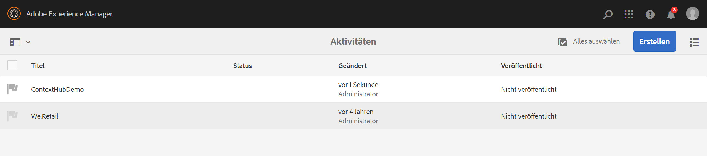

# Konfigurieren von ContextHub in AEM Screens {#configuring-contexthub-in-aem-screens}

Dieser Abschnitt konzentriert sich auf das Erstellen und Verwalten von datengesteuerten Asset-Änderungen mithilfe eines Datenspeichers.

## Schlüsselbegriffe {#key-terms}

Bevor wir uns mit der Erstellung und Verwaltung von bestandsgesteuerten Kanälen in Ihrem AEM Screens-Projekt beschäftigen, müssen Sie sich mit einigen der Schlüsselbegriffe vertraut machen, die für die verschiedenen Szenarien wichtig und relevant sind.

**Marke** bezieht sich auf Ihre allgemeine Projektbeschreibung.

**Bereich** bezieht sich auf den Namen Ihres AEM Screens-Projekts, z. B. „Digitale Werbebeschilderung“

**Aktivität** definiert die Regelkategorie wie „bestandsgesteuert“, „wettergesteuert“, „gesteuert durch Abteilungsverfügbarkeit“ usw.

**Zielgruppe** definiert die Regel.

**Segment** bezieht sich auf die Version des Assets, die für die jeweilige Regel abgespielt werden soll, z. B. wenn die Temperatur unter 10 Grad Celsius liegt, zeigt der Bildschirm ein Bild eines heißen Kaffees an, andernfalls ein kaltes Getränk.

Das folgende Diagramm zeigt visuell, wie ContextHub-Konfigurationen mit Aktivität, Zielgruppe und Kanälen zusammenfallen.


## Voraussetzungen {#preconditions}

Bevor Sie mit der Konfiguration von Context-Hub-Konfigurationen für ein AEM Screens-Projekt beginnen, müssen Sie Google Tabellen (für Demonstrationszwecke) einrichten.

>[!CAUTION]
>
>Google Tabellen wird im folgenden Beispiel als Beispieldatenbanksystem verwendet, von dem die Werte abgerufen werden und das ausschließlich zu Fortbildungszwecken dient. Adobe unterstützt die Verwendung von Google Tabellen in Produktionsumgebungen nicht.
>
>Weitere Informationen finden Sie in der Google-Dokumentation unter [Abrufen eines API-Schlüssels](https://developers.google.com/maps/documentation/javascript/get-api-key).

## Schritt 1: Einrichten eines Datenspeichers {#step-setting-up-a-data-store}

Sie können den Datenspeicher als lokales E/A-Ereignis oder als lokales Datenbankereignis einrichten.

### Lokales E/A-Ereignis {#local-io-event}

Gehen Sie wie unten beschrieben vor, um einen Datenspeicher wie ein ASCII-Ereignis einzurichten, mit dem Sie ContextHub-Konfigurationen und Segmentpfade zum AEM Screens-Kanal verwenden können.

### Lokales Datenbankereignis {#local-db-event}

Gehen Sie wie unten beschrieben vor, um einen Datenspeicher wie eine Excel-Tabelle einzurichten, mit dem Sie ContextHub-Konfigurationen und Segmentpfade zum AEM Screens-Kanal verwenden können.

1. **Navigieren zu ContextHub**

   Navigieren Sie zu Ihrer AEM-Instanz und klicken Sie in der linken Seitenleiste auf das Symbol „Tools“. Klicken Sie auf **Sites** > **ContextHub**, wie in der Abbildung unten gezeigt.

   

1. **Erstellen einer neuen ContextHub-Store-Konfiguration**

   1. Navigieren Sie zu **global** > **default** > **ContextHub-Konfiguration**.

   1. Klicken Sie auf **Erstellen** > **Konfigurations-Container** und geben Sie als Titel **ContextHubDemo** ein.

   1. **Navigieren** Sie zu **ContextHubDemo** > **ContextHub-Store-Konfiguration...**, um den **Konfigurationsassistenten** zu öffnen.

   1. Geben Sie unter **Titel** den Wert **Google Tabellen**, unter **Store-Name** den Wert **googlesheets** und unter **Store-Typ** den Wert **contexthub.generic-jsonp** ein.

   1. Klicken Sie auf **Weiter**
   1. Geben Sie Ihre spezifische json-Konfiguration ein. Beispielsweise können Sie die folgende json für Demozwecke verwenden.
   1. Klicken Sie auf **Speichern**.

   ```
   {
     "service": {
       "host": "sheets.googleapis.com",
       "port": 80,
       "path": "/v4/spreadsheets/<your sheet it>/values/Sheet1",
       "jsonp": false,
       "secure": true,
       "params": {
         "key": "<your API key>"
       }
     },
     "pollInterval": 3000
   }
   ```

   >[!NOTE]
   >
   >Im obigen Beispiel-Code definiert **pollInterval** die Häufigkeit, mit der die Werte aktualisiert werden (in ms).
   >
   >
   >Ersetzen Sie den Code durch Ihre *&lt;Tabellenblatt-ID>* und Ihren *&lt;API-Schlüssel>*, den Sie beim Einrichten von Google Tabellen abgerufen haben.

   >[!CAUTION]
   Wenn Sie Google Tabellen-Store-Konfigurationen außerhalb des bestehenden Ordners erstellen (z. B. in Ihrem eigenen Projektordner), funktioniert das Targeting nicht standardmäßig.
   Wenn Sie die Google Tabellen-Store-Konfigurationen außerhalb des bestehenden globalen Ordners konfigurieren möchten, müssen Sie den **Store-Namen** als **segmentation** und den **Store-Typ** als **aem.segmentation** festlegen. Außerdem müssen Sie den Prozess der Definition des json wie oben definiert überspringen.

1. **Erstellen einer Marke in „Aktivitäten“**

   1. Navigieren Sie von Ihrer AEM-Instanz aus zu **Personalisierung** > **Aktivitäten**

   1. Klicken Sie auf **Erstellen** > **Marke erstellen**

   1. Wählen Sie im Assistenten **Seite erstellen** die Option **Marke** aus und klicken Sie auf **Weiter**.

   1. Geben Sie unter **Titel** den Wert **ContextHubDemo** ein und klicken Sie auf **Erstellen**. Ihre Marke wird jetzt wie unten dargestellt erstellt.
   


   >[!CAUTION]
   Bekanntes Problem:
   Um einen Bereich hinzuzufügen, entfernen Sie den Master aus der URL, z. B.
   `https://localhost:4502/libs/cq/personalization/touch-ui/content/v2/activities.html/content/campaigns/contexthubdemo/master`

1. **Erstellen eines Bereichs in Ihrer Marke**

   Gehen Sie wie folgt vor, um einen Bereich in der Marke zu erstellen:

   1. Klicken Sie auf **Erstellen** und dann auf **Bereich erstellen**.

   1. Wählen Sie im Assistenten **Seite erstellen** die Option **Bereich** aus und klicken Sie auf „Weiter“.

   1. Geben Sie unter **Titel** den Wert **GoogleTabellen** ein und klicken Sie auf **Erstellen**.
Ihr Bereich wird in Ihrer Aktivität erstellt.

## Schritt 2: Einrichten der Zielgruppensegmentierung {#step-setting-up-audience-segmentation}

Nachdem Sie einen Datenspeicher eingerichtet und Ihre Marke definiert haben, führen Sie die folgenden Schritte aus, um Zielgruppensegmente einzurichten.

1. **Erstellen von Segmenten in Zielgruppen**

   1. Navigieren Sie von Ihrer AEM-Instanz zu **Personalisierung** > **Zielgruppen** > **We.Retail**.

   1. Klicken Sie auf **Erstellen** > **ContextHub-Segment erstellen.** Das Dialogfeld **Neues ContextHub-Segment** wird geöffnet.

   1. Geben Sie unter **Titel** den Wert **TabellenblattA1 1** ein und klicken Sie auf **Erstellen**. Erstellen Sie auf ähnliche Weise ein weiteres Segment mit der Bezeichnung **TabellenblattA2 2**.

1. **Bearbeiten der Segmente**

   1. Wählen Sie das Segment **Tabellenblatt A1 1** (erstellt in Schritt 5) aus und klicken Sie in der Aktionsleiste auf **Bearbeiten**.

   1. Ziehen Sie die Komponente **Vergleich: Eigenschaft - Wert** in den Editor.
   1. Klicken Sie auf das Schraubenschlüsselsymbol, um das Dialogfeld **Vergleich von Eigenschaft und Wert** zu öffnen.
   1. Wählen Sie **googlesheets/value/1/0** aus der Dropdown-Liste in **Eigenschaftsname** aus.

   1. Wählen Sie unter **Operator** den Wert **Gleich** aus dem Dropdown-Menü aus.

   1. Geben Sie den **Wert** als **1** ein.
   >[!NOTE]
   AEM validiert Ihre Daten aus dem Google-Tabellenblatt, indem Ihr Segment grün anzeigt wird.

   

   Bearbeiten Sie die Eigenschaftswerte entsprechend in **Tabellen A1 2**.

   1. Ziehen Sie die Komponente **Vergleich: Eigenschaft - Wert** in den Editor.
   1. Klicken Sie auf das Schraubenschlüsselsymbol, um das Dialogfeld **Vergleich von Eigenschaft und Wert** zu öffnen.
   1. Wählen Sie **googlesheets/value/1/0** aus der Dropdown-Liste in **Eigenschaftsname** aus.

   1. Wählen Sie unter **Operator** den Wert **Gleich** aus dem Dropdown-Menü aus.

   1. Geben Sie den **Wert** als **2** ein.
   >[!NOTE]
   Die in den vorherigen Schritten angewendeten Regeln sind nur ein Beispiel dafür, wie Sie Segmente für die Implementierung der folgenden Anwendungsfälle einrichten.

## Schritt 3: Aktivieren von Targeting in Kanälen {#step-enabling-targeting-in-channels}

Gehen Sie wie folgt vor, um Targeting in Ihren Kanälen zu aktivieren.

1. Navigieren Sie zu einem der AEM Screens-Kanäle. Die folgenden Schritte zeigen, wie Sie das Targeting mit **DataDrivenRetail** aktivieren, das in einem AEM Screens-Kanal erstellt wurde.

1. Wählen Sie den Kanal **DataDrivenRetail** aus und klicken Sie in der Aktionsleiste auf **Eigenschaften**.

   

1. Wählen Sie die Registerkarte **Personalisierung**, um die ContextHub-Konfigurationen einzurichten.

   1. Wählen Sie unter **ContextHub-Pfad** den Wert **libs** > **settings** > **cloudsettings** > **default** > **ContextHub Konfigurationen** aus und klicken Sie auf **Auswählen**.

   1. Wählen Sie unter **Segmentpfad** den Wert **conf** > **We.Retail** > **settings** > **wcm** > **segments** aus und klicken Sie auf **Auswählen**.

   1. Klicken Sie auf **Speichern und schließen**.
   >[!NOTE]
   Verwenden Sie den ContextHub- und den Segmentpfad, in dem Sie Ihre Kontexthub-Konfigurationen und -Segmente anfänglich gespeichert haben.

   

1. Navigieren Sie zu und wählen Sie **DataDrivenRetail** aus **DataDrivenAssets** > **Kanäle** aus und klicken Sie in der Aktionsleiste auf **Bearbeiten**.

   >[!NOTE]
   Wenn Sie alles korrekt eingerichtet haben, sehen Sie die Option **Targeting** in der Dropdown-Liste des Editors, wie in der Abbildung unten gezeigt.

   

   >[!NOTE]
   Nachdem Sie die ContextHub-Konfigurationen für Ihren Kanal konfiguriert haben, stellen Sie sicher, dass Sie die vorhergehenden Schritte 1 bis 4 auch für die anderen drei Sequenzkanäle befolgen, wenn Sie alle unten aufgeführten Anwendungsfälle nutzen möchten.

## Weitere Informationen: Anwendungsbeispiele {#learn-more-example-use-cases}

Nachdem Sie ContextHub für Ihr AEM Screens-Projekt konfiguriert haben, können Sie die verschiedenen Nutzungsszenarios durchgehen, um zu verstehen, wie datengesteuerte Assets in verschiedenen Branchen eine wichtige Rolle spielen:

1. **[Zielgerichtete Aktivierung des Einzelhandelsinventars](retail-inventory-activation.md)**
1. **[Temperaturaktivierung für ein Reiseangebot](local-temperature-activation.md)**
1. **[Aktivierung der Gastgewerbereservierung](hospitality-reservation-activation.md)**
