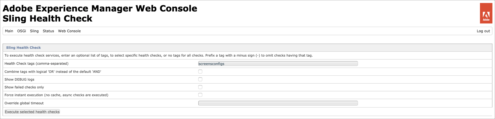
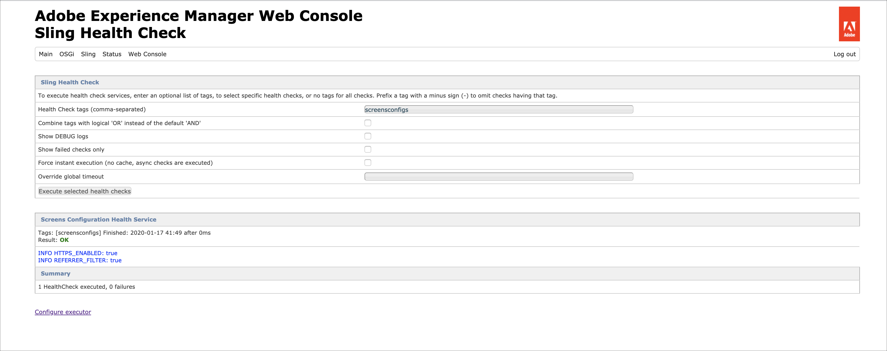
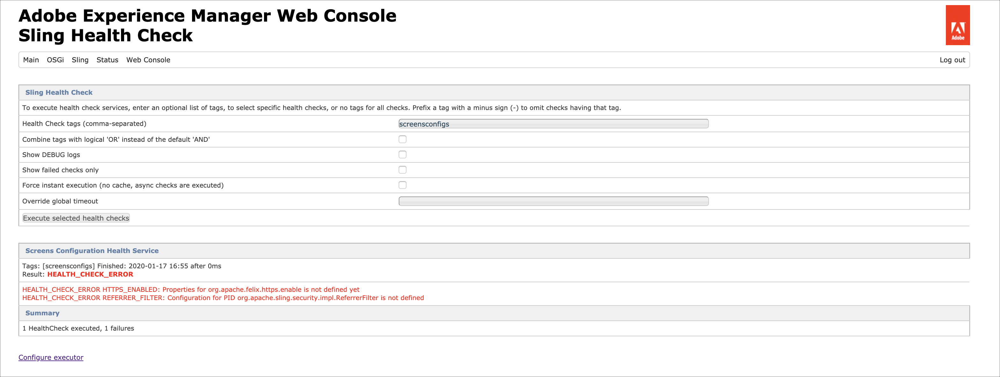
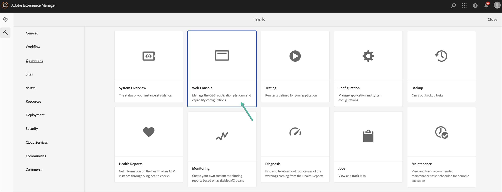
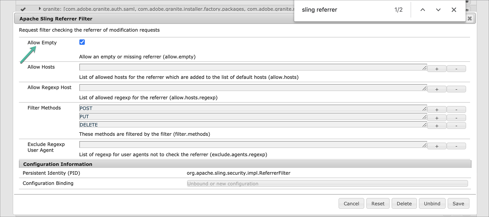
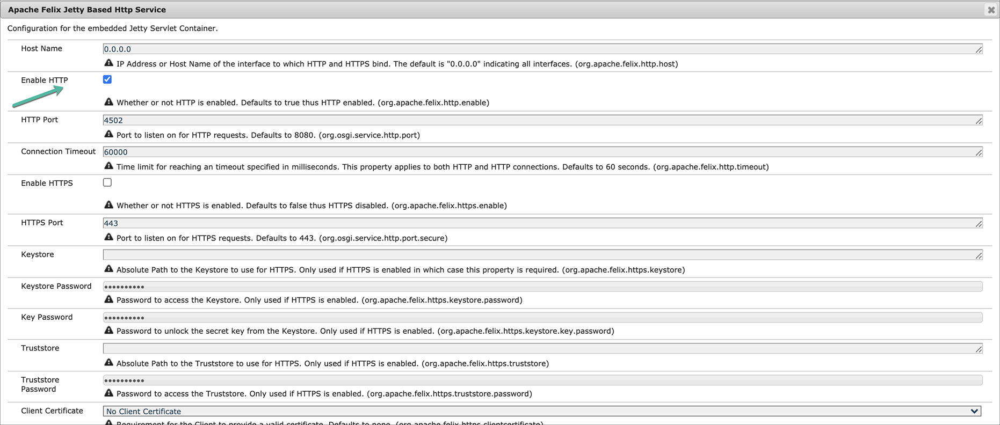
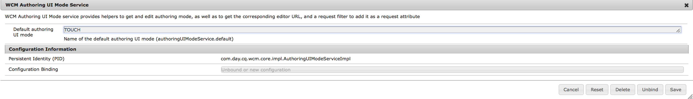
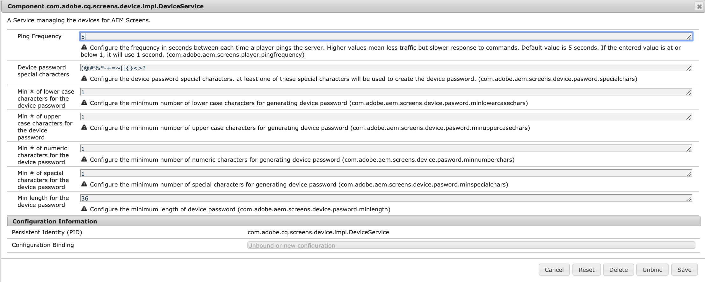

# Konfigurieren und Bereitstellen von AEM Screens {#configuring-and-deploying-aem-screens}

>[!IMPORTANT]
>Dieser Inhalt gilt für AEM On-Premise/AMS (AEM 6.5LTS und AEM 6.5). Informationen zu AEM as a Cloud Service Screens-Inhalten finden Sie im [AEM as a Cloud Service-Handbuch](https://experienceleague.adobe.com/en/docs/experience-manager-cloud-service/content/screens-as-cloud-service/overview/introduction).

Auf dieser Seite erfahren Sie, wie Sie die Player für Screens auf Ihren Geräten installieren und konfigurieren.

## Server-Konfiguration {#server-configuration}

>[!IMPORTANT]
>
>Der AEM Screens-Player verwendet kein Cross-Site Request Forgery(CSRF)-Token. Um den AEM-Server für den Einsatz von AEM Screens zu konfigurieren, müssen Sie daher den Referrer-Filter überspringen, indem Sie leere Referrer zulassen.

## Framework für Statusprüfungen {#health-check-framework}

Mit dem Framework für Statusprüfungen kann die Benutzerin bzw. der Benutzer vor der Ausführung eines AEM Screens-Projekts prüfen, ob zwei erforderliche Konfigurationen eingerichtet wurden.

So kann der Benutzer die folgenden zwei Konfigurationsprüfungen für die Ausführung eines AEM Screens-Projekts vornehmen, d. h. zur Überprüfung des Status der folgenden beiden Filter:

1. **Leeren Referrer erlauben**
2. **https**

Gehen Sie wie folgt vor, um zu prüfen, ob diese beiden wichtigen Konfigurationen für AEM Screens aktiviert sind:

1. Navigieren Sie zur [Sling-Statusprüfung der Adobe Experience Manager-Web-Konsole](http://localhost:4502/system/console/healthcheck?tags=screensconfigs&overrideGlobalTimeout=).

   

2. Klicken Sie auf **Ausgewählte Statusprüfungen ausführen**, um die Validierung für zwei oben aufgelistete Eigenschaften auszuführen.

   Wenn beide Filter aktiviert sind, zeigt der **Screens Configuration Health Service** das **Ergebnis** als **OK** an (beide Konfigurationen sind aktiviert).

   

   Wenn einer oder beide Filter deaktiviert sind, wird dem Benutzer eine Warnung angezeigt, wie in der folgenden Abbildung dargestellt.

   Die folgende Warnung weist darauf hin, dass beide Filter deaktiviert sind:
   

>[!NOTE]
>
>* Informationen zum Aktivieren des **Apache Sling Referrer-Filters** finden Sie unter [Zulassen von leeren Referrer-Anfragen](/help/user-guide/configuring-screens-introduction.md#allow-empty-referrer-requests).
>* Informationen zum Aktivieren des **HTTP**-Dienstes finden Sie unter [Apache Felix Jetty-basierter HTTP-Dienst](/help/user-guide/configuring-screens-introduction.md#allow-apache-felix-service).

### Voraussetzungen {#prerequisites}

Die folgenden wichtigen Punkte bieten Hilfestellung beim Konfigurieren von AEM-Servern für die Nutzung von AEM Screens.

#### Zulassen von leeren Referrer-Anforderungen {#allow-empty-referrer-requests}

1. Navigieren Sie zur **Konfiguration der Adobe Experience Manager-Web-Konsole** über die AEM-Instanz > Hammersymbol > **Vorgänge** > **Web-Konsole**.

   

1. Die **Konfiguration der Adobe Experience Manager-Web-Konsole** wird geöffnet. Suchen Sie nach „sling referrer“.

   Um nach der Eigenschaft „sling referrer“ zu suchen, drücken Sie **Befehl+F** für **Mac** und **Strg+F** für **Windows**.

1. Markieren Sie die Option **Leere erlauben**, wie in der folgenden Abbildung dargestellt.

   

1. Klicken Sie auf **Speichern**, um den Apache Sling Referrer-Filter „Leere erlauben“ zu aktivieren.

#### Apache Felix Jetty-basierter HTTP-Service {#allow-apache-felix-service}

1. Navigieren Sie zur **Konfiguration der Adobe Experience Manager-Web-Konsole** über die AEM-Instanz > Hammersymbol > **Vorgänge** > **Web-Konsole**.

   

1. Die **Konfiguration der Adobe Experience Manager-Web-Konsole** wird geöffnet. Suchen Sie nach „Apache Felix Jetty-basierter HTTP-Service“.

   Um nach dieser Eigenschaft zu suchen, drücken Sie **Befehl+F** für **Mac** und **Strg+F** für **Windows**.

1. Markieren Sie die Option **HTTP AKTIVIEREN**, wie in der folgenden Abbildung dargestellt.

   

1. Klicken Sie auf **Speichern**, um den *HTTP*-Service zu aktivieren.

#### Aktivieren der Touch-Benutzeroberfläche für AEM Screens {#enable-touch-ui-for-aem-screens}

AEM Screens erfordert die TOUCH-Benutzeroberfläche und funktioniert nicht mit der klassischen Benutzeroberfläche von Adobe Experience Manager (AEM).

1. Navigieren Sie zu `*<yourAuthorInstance>/system/console/configMgr/com.day.cq.wcm.core.impl.AuthoringUIModeServiceImpl*`
1. Stellen Sie sicher, dass der **standardmäßige Authoring-Oberflächenmodus** auf **TOUCH** gesetzt ist, wie in der folgenden Abbildung gezeigt.

Alternativ können Sie dieselbe Einstellung auch mit „yourAuthorInstance“ *>* Tools (Hammersymbol) > **Vorgänge** > **Web-Konsole** vornehmen und nach **WCM Authoring UI Mode Service** suchen.

>[!NOTE]
>
>Sie können die klassische Benutzeroberfläche jederzeit mithilfe der Benutzereinstellungen für bestimmte Benutzer aktivieren.

#### AEM im NOSAMPLECONTENT-Ausführungsmodus {#aem-in-nosamplecontent-runmode}

Beim Ausführen von AEM in einer Produktionsumgebung wird der Ausführungsmodus **NOSAMPLECONTENT** verwendet. Entfernen Sie die Kopfzeile *X-Frame-Options=SAMEORIGIN* (im Abschnitt für die zusätzliche Antwortkopfzeile) von

`https://localhost:4502/system/console/configMgr/org.apache.sling.engine.impl.SlingMainServlet`.

Dies Entfernung ist erforderlich, damit der AEM Screens-Player Online-Kanäle wiedergeben kann.

#### Kennworteinschränkungen {#password-restrictions}

Mit den letzten Änderungen an ***DeviceServiceImpl*** müssen Sie die Kennworteinschränkungen nicht entfernen.

Sie können ***DeviceServiceImpl*** über den unten stehenden Link konfigurieren, um die Kennworteinschränkungen zu aktivieren, während Sie das Kennwort für die Screens-Gerätebenutzenden erstellen:

`https://localhost:4502/system/console/configMgr/com.adobe.cq.screens.device.impl.DeviceService`

Gehen Sie wie folgt vor, um ***DeviceServiceImpl*** zu konfigurieren:

1. Navigieren Sie zur **Konfiguration der Adobe Experience Manager-Web-Konsole** über AEM-Instanz > Hammersymbol > **Vorgänge** > **Web-Konsole**.

1. Die **Konfiguration der Adobe Experience Manager-Web-Konsole** wird geöffnet. Suchen Sie nach `*deviceservice*`. Um nach der Eigenschaft zu suchen, drücken Sie **Befehl+F** unter macOS und **Strg+F** unter Microsoft® Windows.

#### Dispatcher-Konfiguration {#dispatcher-configuration}

Weitere Informationen zum Konfigurieren von Dispatcher für ein AEM Screens-Projekt finden Sie unter [Konfigurieren von Dispatcher für ein AEM Screens-Projekt](dispatcher-configurations-aem-screens.md).

#### Java™-Kodierung {#java-encoding}

Stellen Sie die ***Java™-Kodierung*** auf Unicode ein. Zum Beispiel funktioniert `*Dfile.encoding=Cp1252*` nicht.

>[!NOTE]
>
>Verwenden Sie HTTPS für AEM Screens-Server in Produktionsumgebungen.
