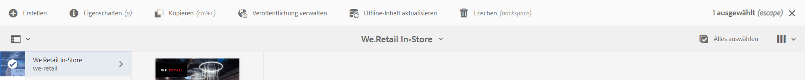

# Inhaltsaktualisierung als Service {#content-update-as-a-service}

In diesem Abschnitt werden folgende Themen zum Aktualisieren von Content-as-a-Service behandelt:

* **Überblick**
* **Verwenden des Massen-Offline-Updates**

<!--
>[!CAUTION]
>
>This AEM Screens functionality is only available, if you have installed AEM 6.3 Feature Pack 3 or AEM 6.4 Screens Feature Pack 1.
>
>To get access to this Feature Pack, you must contact Adobe Support and request access. When you have permission you can download it from Package Share. -->

## Übersicht {#overview}

Bulk Offline Update ermöglicht die Massenaktualisierung aller Kanäle. Das vermeidet den Aufwand, zu einem bestimmten Kanal zu navigieren und den Inhalt zu aktualisieren. Stattdessen können Sie den gesamten Inhalt in den Kanälen für ein bestimmtes Projekt gemeinsam aktualisieren.

Sie können diese Aktivität auch für eine Zeit mit geringerem Netzwerk-Traffic planen.

>[!NOTE]
>
>Die Funktion für das Massen-Offline-Update wurde so optimiert, dass nur die geänderten Kanäle aktualisiert werden.

## Verwenden des Massen-Offline-Updates {#using-bulk-offline-update}

Sie können das Massen-Offline-Update manuell über die Benutzeroberfläche (UI) verwenden oder das Massen-Update über OSGi-Service planen.

### Verwenden der AEM Screens-Benutzeroberfläche {#using-aem-screens-user-interface}

Gehen Sie wie folgt vor, um das Massen-Offline-Update für ein AEM Screens-Projekt zu verwenden:

1. Navigieren Sie zu Ihrem AEM Screens-Projekt.
1. Wählen Sie das Projekt aus und klicken Sie in der Aktionsleiste auf **Offline-Inhalt aktualisieren**, um den Kanalinhalt manuell zu aktualisieren.

   

### Konfiguration der Adobe Experience Manager-Web-Konsole {#adobe-experience-manager-web-console-configuration}

Gehen Sie wie folgt vor, um das Massen-Offline-Update für ein AEM Screens-Projekt zu verwenden:

1. Konfiguration der Adobe Experience Manager-Web-Konsole.
1. Suchen Sie nach den Services für das Massen-Offline-Update.

   

1. Fügen Sie die folgenden Eigenschaften hinzu:

   **Projektpfad** Geben Sie den Pfad Ihres AEM Screens-Projekts an. Der Pfad heißt gewöhnlich `/content/screens/<Name of your project>`.

   *Zum Beispiel* `/content/screens/we-retail`. Sie können diesen Pfad in der URL finden, indem Sie ein beliebiges Projekt unter AEM Screens auswählen (klicken Sie nicht auf das Symbol).

   >[!NOTE]
   >
   >Geben Sie den Projektpfad relativ zum Kanal an.

   **Zeitplanfrequenz** Geben Sie einen Zeitpunkt an, z. B. 17.00 Uhr, zu dem dieser Service Offline-Inhalte aktualisieren soll.

1. Auswählen **Speichern** damit Sie Ihre Einstellungen speichern können. Alle Ihre Inhalte werden zum angegebenen Zeitpunkt aktualisiert.
