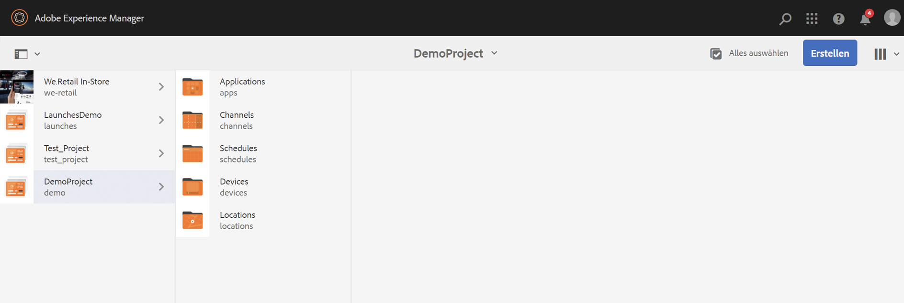

# Erstellen und Verwalten von Projekten {#creating-and-managing-projects}

Rufen Sie AEM Screens auf, indem Sie den Adobe Experience Manager-Link (oben links) und dann „Screens“ auswählen.

Sie können auch direkt zu dieser Adresse gehen: `http://localhost:4502/screens.html/content/screens`

Unterschiedliche Projekte können verschiedene Marken, Implementierungen, Kunden usw. sein.

>[!NOTE]
>
>**Navigationstipp:**
>
>Sie können auch die Cursortasten verwenden, um durch die verschiedenen Ordner in AEM zu navigieren. Sobald Sie eine bestimmte Entität ausgewählt haben, drücken Sie die Leertaste, um die Eigenschaften oder Ansichten für diesen Ordner zu bearbeiten.

## Erstellen eines neuen Screens-Projekts     {#creating-a-new-screens-project}

Gehen Sie wie folgt vor, um ein neues Screens-Projekt zu erstellen:

1. Wählen Sie vom AEM-Dashboard aus die Option **Screens**.
1. Click **Create** --> **Create Project** and **Create Screens Project** wizard will open.

1. Wählen Sie die Vorlage **Screens** aus und klicken Sie auf **Weiter**.

1. Geben Sie die Eigenschaften (**Titel** und **Name**) ein und klicken Sie auf **Erstellen**.

>[!NOTE]
>
>Standardmäßig enthält diese anfängliche Struktur die Master-Seiten für **Zeitpläne**, **Standorte**, **Anwendungen**, **Kanäle** und **Geräte**, doch dies kann bei Bedarf manuell geändert werden. Sie können die Optionen entfernen, wenn die verfügbaren Optionen für Ihr Projekt nicht relevant sind.

Das Projekt wird erstellt und Sie gelangen zurück zur Screens-Projektkonsole. Sie können Ihr Projekt jetzt auswählen.

In einem Projekt gibt es vier Arten von Ordnern, wie in der folgenden Abbildung dargestellt:

* **Zeitpläne**
* **Standorte**
* **Anwendungen**
* **Kanäle**
* **Geräte**

### Anzeigen von Eigenschaften {#viewing-properties}

Sobald Sie das Screens-Projekt erstellt haben, klicken Sie in der Aktionsleiste auf **Eigenschaften**, um die Eigenschaften eines vorhandenen AEM Screens-Projekts zu bearbeiten.

Von Ihrem *DemoProject* aus können Sie die folgenden Optionen bearbeiten bzw. ändern.

### Erstellen eines benutzerspezifischen Ordners {#creating-a-custom-folder}

Sie können auch einen eigenen benutzerdefinierten Ordner unter den in Ihrem Projekt verfügbaren Master-Seiten für **Zeitpläne**, **Standorte**, **Anwendungen**, **Kanäle** und **Geräte** erstellen.

Erstellen eines kundenspezifischen Ordners:

1. Wählen Sie das Projekt aus und klicken Sie neben dem Pluszeichen in der Aktionsleiste auf **Erstellen**.
1. Der Assistent **Erstellen** wird geöffnet und wählt die entsprechende Option.
1. Klicken Sie auf **Weiter**.
1. Geben Sie die Eigenschaften ein und klicken Sie auf **Erstellen**.

Die folgenden Schritte zeigen, wie Sie einen Anwendungsordner für Ihre Master-Seite für **Anwendungen** im *Demo-Projekt* erstellen.

### Die nächsten Schritte {#the-next-steps}

Nachdem Sie Ihr eigenes Projekt erstellt haben, informieren Sie sich unter [Kanalverwaltung](managing-channels.md), wie Sie den Inhalt in Ihrem Kanal erstellen und verwalten.

Außerdem können Sie einen eigenen Zeitplan, eine eigene Anwendung, einen eigenen Standort oder ein eigenes Gerät erstellen.
