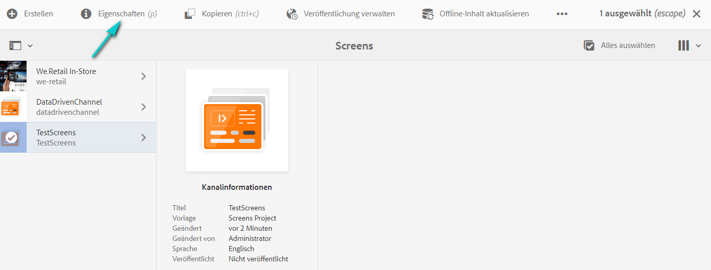

# Erstellen und Verwalten von Projekten {#creating-and-managing-projects}

Rufen Sie AEM Screens auf, indem Sie den Adobe Experience Manager-Link (oben links) und dann „Screens“ auswählen.

Sie haben auch die Möglichkeit, direkt zur folgenden URL zu wechseln: `http://localhost:4502/screens.html/content/screens`

>[!NOTE]
>**Navigationstipp:**
>Sie können auch die Pfeiltasten verwenden, um durch die verschiedenen Ordner in AEM zu navigieren. Nachdem Sie auf eine bestimmte Entität geklickt haben, können Sie zudem die Leertaste drücken, um Eigenschaften für den betreffenden Ordner zu bearbeiten oder anzuzeigen.

## Erstellen eines neuen Screens-Projekts

1. Klicken Sie in Ihrer AEM-Instanz auf **Screens**.
1. Klicken Sie auf **Screens-Projekt erstellen**.
1. Geben Sie **TestScreens** als Titel ein und klicken Sie auf **Speichern**.

Das Projekt wird erstellt und Sie gelangen zurück zur Screens-Projektkonsole. Sie können nun auf Ihr Projekt klicken.

In einem Projekt gibt es fünf Arten von Ordnern, wie in der folgenden Abbildung dargestellt:

* **Zeitpläne**
* **Standorte**
* **Anwendungen**
* **Geräte**
* **Kanäle**

>[!NOTE]
>
>Standardmäßig enthält diese Anfangsstruktur die Primärseiten für **Zeitpläne**, **Standorte**, **Anwendungen**, **Kanäle** und **Geräte**. Diese Struktur kann allerdings bei Bedarf manuell angepasst werden. Sie können die Optionen entfernen, wenn die verfügbaren Optionen für Ihr Projekt nicht relevant sind.

## Anzeigen von Eigenschaften {#viewing-properties}

Nachdem Sie das Screens-Projekt erstellt haben, klicken Sie auf das Projekt und dann in der Aktionsleiste auf **Eigenschaften**, um die Eigenschaften des Projekts zu bearbeiten.

Mit den folgenden Optionen können Sie die Eigenschaften Ihres **TestScreens** bearbeiten/ändern.

## Erstellen eines benutzerspezifischen Ordners {#creating-a-custom-folder}

Sie können auch einen eigenen benutzerdefinierten Ordner unter den in Ihrem Projekt verfügbaren Primärseiten für **Zeitpläne**, **Standorte**, **Anwendungen**, **Kanäle** und **Geräte** erstellen.

Erstellen eines kundenspezifischen Ordners:

1. Klicken Sie auf das Projekt und dann neben dem Pluszeichen in der Aktionsleiste auf **Erstellen**.
1. Der Assistent **Erstellen** wird geöffnet. Klicken Sie auf die entsprechende Option.
1. Klicken Sie auf **Weiter**.
1. Geben Sie die Eigenschaften ein und klicken Sie auf **Erstellen**.

Die folgenden Schritte zeigen, wie Sie einen Anwendungsordner für Ihre Primärseite für **Anwendungen** in **TestScreens** erstellen.

### Die nächsten Schritte {#the-next-steps}

Nachdem Sie Ihr eigenes Projekt erstellt haben, informieren Sie sich unter [Kanalverwaltung](managing-channels.md), wie Sie Inhalte in Ihrem Kanal erstellen und verwalten.
