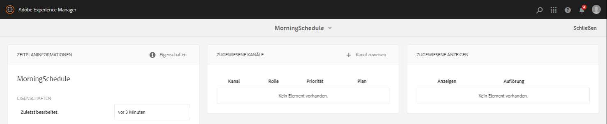

# Erstellen und Verwalten von Projekten {#creating-and-managing-projects}

Rufen Sie AEM Screens auf, indem Sie den Adobe Experience Manager-Link (oben links) und dann „Screens“ auswählen.

Sie können auch direkt zu folgenden Themen gehen: `http://localhost:4502/screens.html/content/screens`chlimage_

Bei Projekten kann es sich um verschiedene Marken, Bereitstellungen, Kunden usw. handeln.

>[!NOTE]
>
>**Navigationstipp:**
>
>Sie können auch die Cursortasten verwenden, um durch die verschiedenen Ordner in AEM zu navigieren. Sobald Sie eine bestimmte Entität ausgewählt haben, können Sie die Leertaste drücken, um Eigenschaften für den betreffenden Ordner zu bearbeiten oder anzuzeigen.

## Erstellen eines neuen Screens-Projekts  {#creating-a-new-screens-project}

Gehen Sie wie folgt vor, um ein neues Screens-Projekt zu erstellen:

1. Wählen Sie vom AEM-Dashboard aus die Option **Screens**.
1. Click **Create **--&gt;** Create Project **and **Create Screens Project** wizard will open.

1. Select the **Screens** template and click **Next**.

1. Enter the properties (**Title** and **Name**) as required and click **Create**.

>[!NOTE]
>
>By default, the initial structure will contain the **Schedules**, **Locations**, **Applications**, **Channels**, and **Devices** master pages, but this can be manually adjusted if needed. Sie können die Optionen entfernen, wenn die verfügbaren Optionen für Ihr Projekt nicht relevant sind.

Das Projekt wird erstellt und Sie gelangen zurück zur Screens-Projektkonsole. Sie können Ihr Projekt jetzt auswählen.

In einem Projekt gibt es vier Arten von Ordnern, wie in der folgenden Abbildung dargestellt:

* **Zeitpläne**
* **Standorte**
* **Anwendungen**
* **Kanäle**
* **Geräte**

### Anzeigen von Eigenschaften {#viewing-properties}

Once you create the Screens project, click **Properties** on the action bar to edit properties of an exiting AEM Screens project.

The following options allow you to edit/change properties of your *DemoProject*.

### Erstellen eines benutzerspezifischen Ordners {#creating-a-custom-folder}

Sie können auch einen eigenen benutzerdefinierten Ordner unter **Zeitpläne**, **Speicherorte**, **Anwendungen**, **Kanäle** und **Geräte** erstellen.

So erstellen Sie einen kundenspezifischen Ordner:

1. Select your project and click on **Create** next to plus icon in the action bar.
1. Der Assistent **Erstellen** wird geöffnet und wählt die entsprechende Option.
1. Klicken Sie auf **Weiter**.
1. Geben Sie die Eigenschaften ein und klicken Sie auf **Erstellen**.

Die folgenden Schritte zeigen die Erstellung eines Anwendungsordners auf der Masterseite " **Anwendungen** "in *DemoProject*.

### Die nächsten Schritte {#the-next-steps}

Once you have created your own project, see [Channel Management](managing-channels.md) to create and manage content in your channel.

Darüber hinaus können Sie Ihren eigenen Zeitplan, Ihre Anwendung, Ihren Standort oder Ihr Gerät erstellen.
