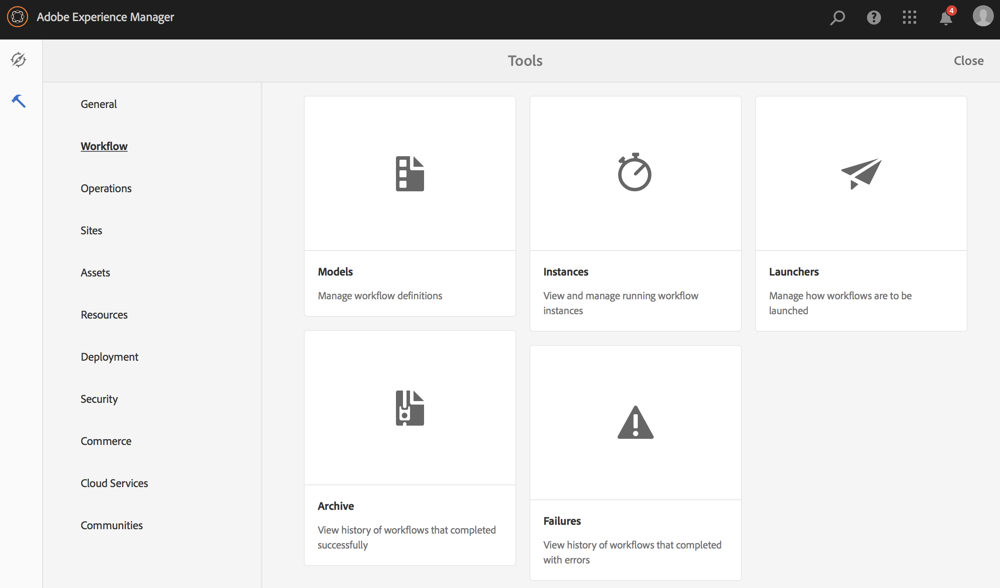
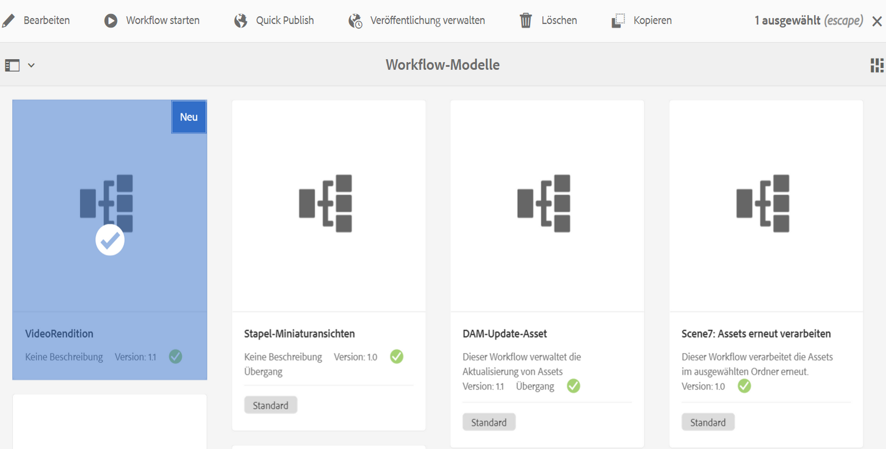
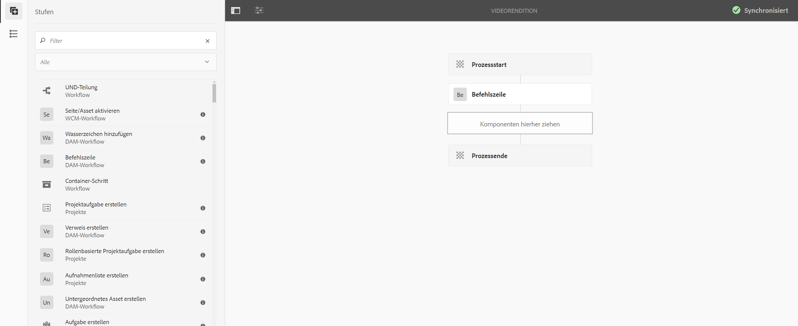
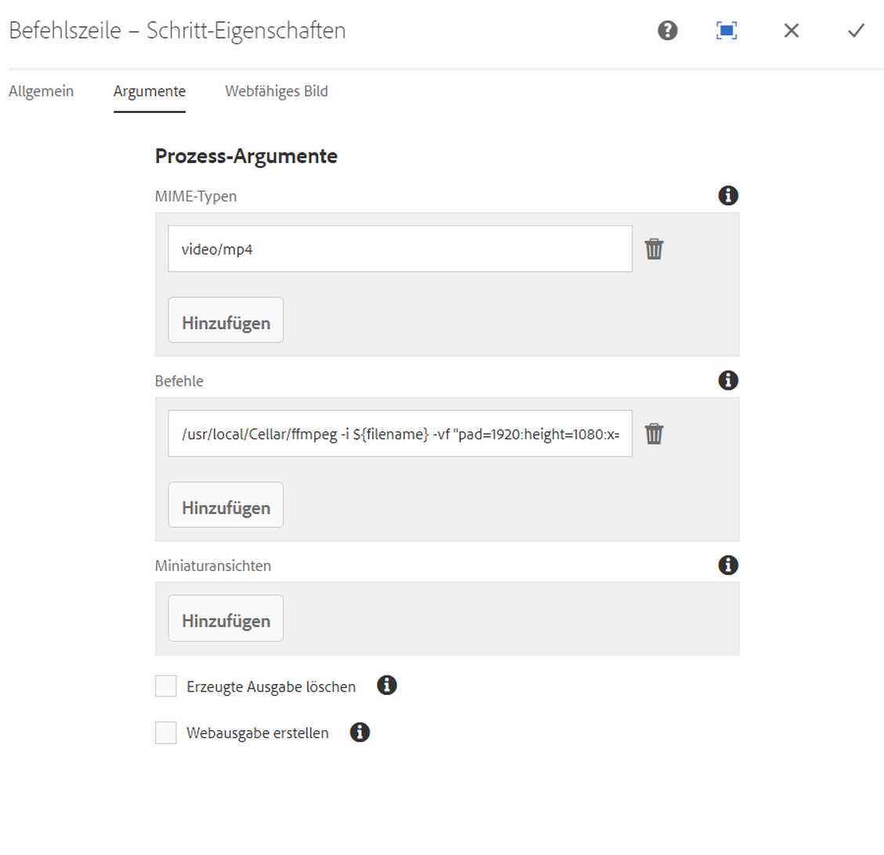
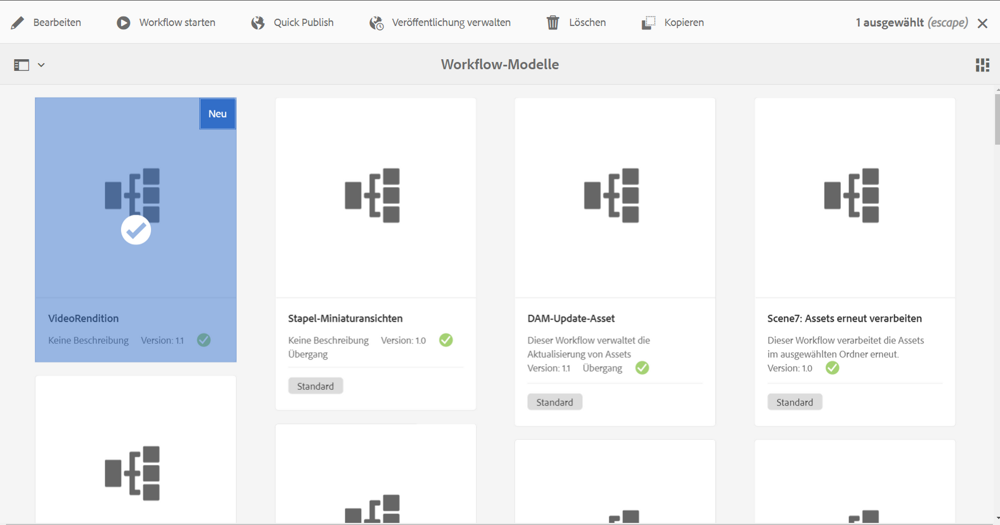
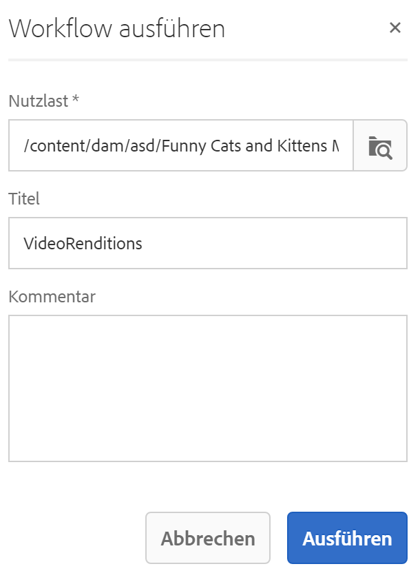
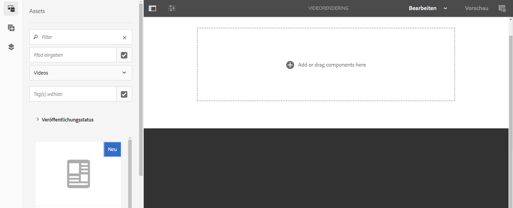
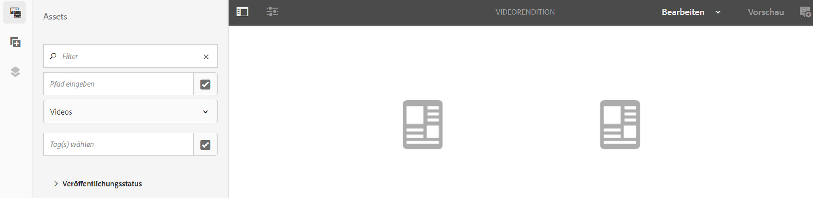
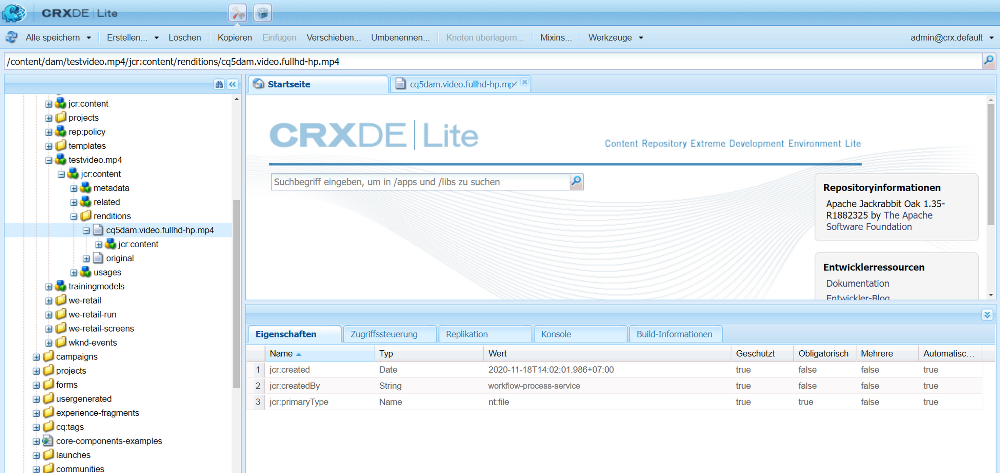

# Erstellen eines Workflows für den Videoabstand {#creating-a-video-padding-workflow}

In diesem Abschnitt werden folgende Themen behandelt:

* **Überblick**
* **Voraussetzungen**
* **Erstellen eines Workflows für den Videoabstand**
   * **Erstellen eines Workflows**
   * **Verwenden des Workflows im AEM Screens-Projekt**

* **Validieren der Ausgabe für den Workflow**

## Überblick {#overview}

Das folgende Nutzungsszenario beinhaltet das Platzieren eines Videos (Beispiel: 1280 x 720) in einem Kanal mit einer Anzeige von 1920 x 1080 und das Platzieren des Videos bei 0x0 (oben links). Das Video sollte in keiner Weise gestreckt oder modifiziert werden und kein **Abdecken** in der Videokomponente verwenden.

Das Video wird als Objekt horizontal von Pixel 1 bis Pixel 1280 und vertikal von Pixel 1 bis Pixel 720 und der Rest des Kanals in der Standardfarbe angezeigt.

## Voraussetzungen {#prerequisites}

Bevor Sie einen Workflow für Videos erstellen, müssen Sie die folgenden Voraussetzungen erfüllen:

1. Laden Sie ein Video in den Ordner **Assets** in Ihrer AEM-Instanz.
1. Erstellen Sie ein AEM Screens-Projekt (z. B. **TestVideoRendition**) und einen Kanal mit dem Namen (**VideoRendering**), wie in der folgenden Abbildung dargestellt:

## Erstellen eines Workflows für den Videoabstand {#creating-a-video-padding-workflow-1}

Um einen Workflow für den Videoabstand zu erstellen, müssen Sie einen Workflow für Ihr Video erstellen und diesen dann im Kanal Ihres AEM Screens-Projekts verwenden.

Gehen Sie wie folgt vor, um den Workflow zu erstellen und zu verwenden:

1. Erstellen eines Workflows
1. Verwenden des Workflows in einem AEM Screens-Projekt

### Erstellen eines Workflows {#creating-a-workflow}

Gehen Sie wie folgt vor, um einen Workflow für Ihr Video zu erstellen:

1. Navigieren Sie zu Ihrer AEM-Instanz und klicken Sie in der Seitenleiste auf „Tools“. Auswählen **Workflow** > **Modelle** , um ein neues Modell zu erstellen.

   

1. Klicks **Modelle** > **Erstellen** > **Modell erstellen**. Geben Sie den **Titel** (als **VideoRendition**) und den **Namen** in **Workflow-Modell hinzufügen** ein. Klicken Sie auf **Fertig**, um das Workflow-Modell hinzuzufügen.

   

1. Nachdem Sie das Workflow-Modell erstellt haben, wählen Sie das Modell (**VideoRendition**) aus und klicken Sie in der Aktionsleiste auf **Bearbeiten**.

   

1. Ziehen Sie die Komponente **Befehlszeile** per Drag-and-Drop in Ihren Workflow.

   

1. Wählen Sie die Komponente **Befehlszeile** aus und öffnen Sie das Eigenschaften-Dialogfeld.

   

1. Wählen Sie die Registerkarte **Argumente** aus, um die Felder im Dialogfeld **Befehlszeile – Schritteigenschaften** einzugeben.

   Geben Sie das Format in den **Mime-Typen** (als ***video/mp4***) und den Befehl als (/usr/local/Cellar/ffmpeg -i ${filename} -vf &quot;pad=1920:height=1080:x=0:y=0:color=black&quot; cq5dam.video.fullhd-hp.mp4) ein, um den Workflow im Feld **Befehle** zu starten.

   Weitere Informationen finden Sie unter **MIME-Typen** und **Befehle** in der unten stehenden Anmerkung.

   

1. Wählen Sie den Workflow (**VideoRenditions**) aus und klicken Sie in der Aktionsleiste auf **Workflow starten**, um das Dialogfeld **Workflow ausführen** zu öffnen.

   

1. Wählen Sie den Pfad Ihres Assets in der **Payload** (als ***/content/dam/huseinpeyda-crossroads01_512kb 2.mp4***) aus, geben Sie den **Titel** (als ***RunVideo***) ein und klicken Sie auf **Ausführen**.

   

### Verwenden des Workflows in einem AEM Screens-Projekt {#using-the-workflow-in-an-aem-screens-project}

Gehen Sie wie folgt vor, um den Workflow in Ihrem AEM Screens-Projekt zu verwenden:

1. Navigieren Sie zu einem AEM Screens-Projekt (**TestVideoRendition** > **Kanäle** >**VideoRendition**).

   

1. Klicken Sie in der Aktionsleiste auf **Bearbeiten**. Ziehen Sie das Video, das Sie ursprünglich in **Assets** hochgeladen haben, per Drag-and-Drop.

   

1. Nachdem Sie das Video hochgeladen haben, klicken Sie auf **Vorschau**, um die Ausgabe anzuzeigen.

   

## Validieren der Ausgabe für den Workflow {#validating-the-output-for-the-workflow}

Sie können Ihre Ausgabe wie folgt validieren:

* Überprüfen Sie die Vorschau des Videos im Kanal
* Navigieren Sie zu ***/content/dam/testvideo.mp4/jcr:content/renditions/cq5dam.video.fullhd-hp.mp4*** in CRXDE Lite, wie in der folgenden Abbildung dargestellt:

