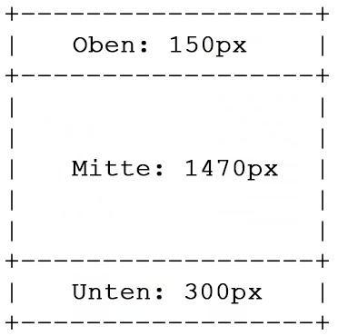

# Erstellen benutzerdefinierter Vorlagen für Mehrzonen-Layouts {#creating-custom-templates-multizone}

Das folgende Beispiel zeigt, wie Sie benutzerdefinierte Vorlagen in einem Mehrzonen-Layout erstellen können.

Der folgende Abschnitt zeigt beispielsweise die Erstellung einer benutzerdefinierten Vorlage in einem Mehrzonen-Layout mit den folgenden Konfigurationen:




## Erstellen einer benutzerdefinierten Vorlage mit einer bestimmten Konfiguration {#basic-flow-setting}

Gehen Sie wie folgt vor, um eine benutzerdefinierte Vorlage zu erstellen.

1. Erstellen Sie die Vorlage in `/apps/<project>/templates/my-custom-layout`

```shell
<?xml version="1.0" encoding="UTF-8"?>
<jcr:root xmlns:sling="http://sling.apache.org/jcr/sling/1.0" xmlns:cq="http://www.day.com/jcr/cq/1.0" xmlns:jcr="http://www.jcp.org/jcr/1.0" xmlns:nt="http://www.jcp.org/jcr/nt/1.0"
    jcr:description="My Custom 3-zones layout "
    jcr:primaryType="cq:Template"
    jcr:title="3-zones layout"
    allowedParents="[/libs/screens/core/templates/channelfolder]"
    allowedPaths="[/content/screens(/.*)?]"
    ranking="{Long}20000">
    <jcr:content
        cq:cssClass="aem-Layout aem-Layout--3x1 my-CustomLayout"
        cq:designPath="/apps/settings/wcm/designs/<project>"
        cq:deviceGroups="[mobile/groups/responsive]"
        jcr:primaryType="cq:PageContent"
        sling:resourceSuperType="screens/core/components/channel"
        sling:resourceType="screens/core/components/multiscreenchannel">
        <r1c1
            cq:cssClass="aem-LayoutCell--1-1 my-CustomLayout-top"
            jcr:primaryType="nt:unstructured"
            sling:resourceType="wcm/foundation/components/responsivegrid"/>
        <r2c1
            cq:cssClass="aem-LayoutCell--1-1 my-CustomLayout-middle"
            jcr:primaryType="nt:unstructured"
            sling:resourceType="wcm/foundation/components/responsivegrid"/>
        <r3c1
            cq:cssClass="aem-LayoutCell--1-1 my-CustomLayout-bottom"
            jcr:primaryType="nt:unstructured"
            sling:resourceType="wcm/foundation/components/responsivegrid"/>
        <cq:responsive jcr:primaryType="nt:unstructured">
            <breakpoints jcr:primaryType="nt:unstructured"/>
        </cq:responsive>
        <offline-config/>
    </jcr:content>
</jcr:root>
```

1. Erstellen Sie ein Seiten-Design in `/apps/settings/wcm/designs/<project>`.

   >[!NOTE]
   >
   >Vergewissern Sie sich, dass der obige `cq:designPath` mit dem Pfad übereinstimmt.

1. Aktualisieren Sie den Knoten **offline-config** für das Design, damit er auf den neuen Pfad verweist.

1. Fügen Sie eine **static.css**-Datei im Ordner `/apps/settings/wcm/designs/<project>` hinzu und setzen Sie deren Inhalt auf

```shell
.cq-Screens-channel--multizone.my-CustomLayout {}
.cq-Screens-channel--multizone.my-CustomLayout .my-CustomLayout-top { height: 150px; }
.cq-Screens-channel--multizone.my-CustomLayout .my-CustomLayout-middle { height: 1470px; }
.cq-Screens-channel--multizone.my-CustomLayout .my-CustomLayout-bottom { height: 300px; }
```

## Einfügen eines Bildes als Hintergrundebene {#inserting-image}

Sie können ein Bild als Hintergrundebene in das Layout einfügen:

Sie können die CSS-Regel so anpassen, dass sie den sogenannten „data-uri“ verwendet und das Bild (Base64-kodiert) direkt in die CSS-Datei einbindet.

Dies geschieht wie folgt:
`.cq-Screens-channel--multizone.my-CustomLayout { background: url('data:image/…;base64,…') no-repeat center center; }`

Sie können auch die folgenden Schritte ausführen:

1. Stellen Sie sicher, dass das Bild in der Offline-Konfiguration für den Kanal enthalten ist.
1. Verwenden Sie einen direkten Link zum Bild im obigen CSS anstelle der „data-uri“-Variante.


## Aktualisieren der Hintergrundfarbe {#updating-color}

Fügen Sie der xml-Datei den folgenden Code hinzu, um die Hintergrundfarbe zu ändern:

`.cq-Screens-channel--multizone.my-CustomLayout { background-color: …; }`
