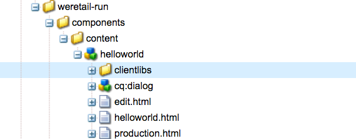

# Entwickeln einer benutzerdefinierten Komponente für AEM Screens {#developing-a-custom-component-for-aem-screens}

Das folgende Tutorial führt Sie durch die Schritte zum Erstellen einer benutzerdefinierten Komponente für AEM Screens. AEM Screens verwendet viele vorhandene Design-Muster und Technologien anderer AEM-Produkte. Das Tutorial hebt Unterschiede und besondere Überlegungen bei der Entwicklung für AEM Screens hervor.

## Überblick {#overview}

Dieses Tutorial richtet sich an Entwicklerinnen und Entwickler, die neu bei AEM Screens sind. In diesem Tutorial wird eine einfache „Hello World“-Komponente für einen Sequenzkanal in AEM Screens erstellt. Über ein Dialogfeld können Autorinnen und Autoren den angezeigten Text aktualisieren.


## Voraussetzungen {#prerequisites}

Um dieses Tutorial abzuschließen, benötigen Sie Folgendes:

1. [AEM 6.5](https://experienceleague.adobe.com/de/docs/experience-manager-65/content/release-notes/release-notes) plus das neueste Screens Feature Pack

1. [AEM Screens-Player](https://experienceleague.adobe.com/de/docs/experience-manager-screens/user-guide/administering/configuring-screens-introduction)
1. Lokale Entwicklungsumgebung

Die Tutorial-Schritte und Screenshots werden mithilfe von **CRXDE Lite** ausgeführt. IDEs können auch zum Abschluss des Tutorials verwendet werden. Weitere Informationen zur Verwendung einer IDE zur Entwicklung mit AEM [finden Sie hier](https://experienceleague.adobe.com/de/docs/experience-manager-learn/getting-started-wknd-tutorial-develop/project-archetype/project-setup).


## Projekt-Setup {#project-setup}

Der Quell-Code eines Screens-Projekts wird normalerweise als Maven-Projekt mit mehreren Modulen verwaltet. Um das Tutorial zu beschleunigen, wurde ein Projekt mithilfe des [AEM-Projektarchetyps 13](https://github.com/adobe/aem-project-archetype) vorgeneriert. Weitere Informationen zum [Erstellen eines Projekts mit einem Maven-Archetyp für AEM-Projekte finden Sie hier](https://experienceleague.adobe.com/de/docs/experience-manager-learn/getting-started-wknd-tutorial-develop/project-archetype/project-setup).

1. Laden Sie die folgenden Pakete mit [CRX Package Manager](http://localhost:4502/crx/packmgr/index.jsp) herunter und installieren Sie sie:

[Abrufen der Datei](assets/base-screens-weretail-runuiapps-001-snapshot.zip)

   [Datei laden](assets/base-screens-weretail-runuicontent-001-snapshot.zip)
   **Optional** Wenn Sie mit Eclipse oder einer anderen IDE arbeiten, laden Sie das folgende Quellpaket herunter. Stellen Sie das Projekt mithilfe des folgenden Maven-Befehls in einer lokalen AEM-Instanz bereit:

   **`mvn -PautoInstallPackage clean install`**

   Starten von HelloWorld SRC Screens im Projekt „`We.Retail` Run“

[Abrufen der Datei](assets/src-screens-weretail-run.zip)

1. Überprüfen Sie in [CRX Package Manager](http://localhost:4502/crx/packmgr/index.jsp), ob die folgenden beiden Pakete installiert sind:

   1. **screens-weretail-run.ui.content-0.0.1-SNAPSHOT.zip**
   1. **screens-weretail-run.ui.apps-0.0.1-SNAPSHOT.zip**

   

   Pakete `We.Retail` Run `Ui.Apps` und `Ui.Content` über CRX Package Manager installiert,

1. Das Paket **screens-weretail-run.ui.apps** installiert Code unter `/apps/weretail-run`.

   Dieses Paket enthält den Code, der für das Rendern von benutzerdefinierten Komponenten für das Projekt verantwortlich ist. Dieses Paket enthält Komponenten-Code und alle erforderlichen JavaScript- oder CSS-Funktionen. Dieses Paket wird auch eingebettet **screens-weretail-run.core-0.0.1-SNAPSHOT.jar** , der einen Java™-Code enthält, der für das Projekt benötigt wird.

   >[!NOTE]
   >
   >In diesem Tutorial wird kein Java™-Code geschrieben. Wenn eine komplexere Geschäftslogik erforderlich ist, kann Backend-Java mit dem Core Java™-Bundle erstellt und bereitgestellt werden.

   

   Darstellung des ui.apps-Codes in CRXDE Lite

   Die Komponente **Hello World** ist nur ein Platzhalter. Im Laufe des Tutorials werden Funktionen hinzugefügt, die es einer Autorin bzw. einem Autor ermöglichen, die von der Komponente angezeigte Nachricht zu aktualisieren.

1. Das Paket **screens-weretail-run.ui.content** installiert den folgenden Code:

   * `/conf/we-retail-run`
   * `/content/dam/we-retail-run`
   * `/content/screens/we-retail-run`

   Dieses Paket enthält den für das Projekt benötigten Startinhalt und die für das Projekt erforderliche Konfigurationsstruktur. **`/conf/we-retail-run`** enthält alle Konfigurationen für das Projekt „`We.Retail` Run“. **`/content/dam/we-retail-run`** umfasst das Starten digitaler Assets für das Projekt. **`/content/screens/we-retail-run`** enthält die Screens-Inhaltsstruktur. Der Inhalt all dieser Pfade wird hauptsächlich in AEM aktualisiert. Um die Konsistenz zwischen Umgebungen (Lokal, Entwicklung, Test und Produktion) zu fördern, wird häufig eine grundlegende Inhaltsstruktur in der Quell-Code-Verwaltung gespeichert.

1. **Navigieren Sie zu „AEM Screens“ > Projekt „`We.Retail` Run“:**

   Klicken Sie im AEM Startmenü auf das Symbol Screens . Vergewissern Sie sich, dass das Projekt „`We.Retail` Run“ angezeigt wird.

   

## Erstellen der Komponente „Hello World“  {#hello-world-cmp}

Die Komponente „Hello World“ ist eine einfache Komponente, mit der Benutzende eine Meldung eingeben können, die auf dem Bildschirm angezeigt werden soll. Die Komponente basiert auf der [Komponentenvorlage für AEM Screens: https://github.com/Adobe-Marketing-Cloud/aem-screens-component-template](https://github.com/Adobe-Marketing-Cloud/aem-screens-component-template).

AEM Screens weist einige interessante Einschränkungen auf, die nicht unbedingt für herkömmliche Komponenten von WCM-Sites gelten.

* Die meisten Screens-Komponenten müssen auf den Zielgeräten für digitale Displays im Vollbildmodus ausgeführt werden
* Die meisten Screens-Komponenten müssen in den Sequenzkanälen einbettbar, um Diashows zu generieren.
* Bei der Inhaltserstellung sollte es möglich sein, einzelne Komponenten in einem Sequenzkanal zu bearbeiten, sodass das Rendern im Vollbildmodus nicht in Frage kommt

1. Navigieren Sie in **CRXDE-Lite** `http://localhost:4502/crx/de/index.jsp` (oder der IDE Ihrer Wahl) zu `/apps/weretail-run/components/content/helloworld.`

   Fügen Sie der Komponente `helloworld` die folgenden Eigenschaften hinzu:

   ```
       jcr:title="Hello World"
       sling:resourceSuperType="foundation/components/parbase"
       componentGroup="We.Retail Run - Content"
   ```

   

   Eigenschaften für /apps/weretail-run/components/content/helloworld

   Die **Hello World** -Komponente erweitert die **foundation, components, parbase** -Komponente, damit sie ordnungsgemäß in einem Sequenzkanal verwendet werden kann.

1. Erstellen Sie unter `/apps/weretail-run/components/content/helloworld` eine Datei mit dem Namen `helloworld.html.`

   Füllen Sie die Datei mit folgendem Inhalt:

   ```xml
   <!--/*
   
    /apps/weretail-run/components/content/helloworld/helloworld.html
   
   */-->
   
   <!--/* production: preview authoring mode + unspecified mode (i.e. on publish) */-->
   <sly data-sly-test.production="${wcmmode.preview || wcmmode.disabled}" data-sly-include="production.html" />
   
   <!--/* edit: any other authoring mode, i.e. edit, design, scaffolding, etc. */-->
   <sly data-sly-test="${!production}" data-sly-include="edit.html" />
   ```

   Screens-Komponenten erfordern je nach verwendetem [Inhaltserstellungsmodus](https://experienceleague.adobe.com/de/docs/experience-manager-64/authoring/authoring/author-environment-tools) zwei unterschiedliche Wiedergaben:

   1. **Produktion**: Vorschau- oder Veröffentlichungsmodus (wcmmode=disabled)
   1. **Bearbeiten**: für alle anderen Inhaltserstellungsmodi, d.h. Bearbeiten, Design, Strukturvorlage, Entwickler ...

   `helloworld.html` fungiert als Schalter, der überprüft, welcher Authoring-Modus gerade aktiv ist, und zu einem anderen HTL-Skript umleitet. Eine gängige Konvention, die von Screens-Komponenten verwendet wird, besteht darin, ein `edit.html`-Skript für den Bearbeitungsmodus und ein `production.html`-Skript für den Produktionsmodus zu verwenden.

1. Erstellen Sie unter `/apps/weretail-run/components/content/helloworld` eine Datei mit dem Namen `production.html.`

   Füllen Sie die Datei mit folgendem Inhalt:

   ```xml
   <!--/*
    /apps/weretail-run/components/content/helloworld/production.html
   
   */-->
   
   <div data-duration="${properties.duration}" class="cmp-hello-world">
    <h1 class="cmp-hello-world__message">${properties.message}</h1>
   </div>
   ```

   Das obige ist das Produktions-Markup für die Komponente &quot;Hello World&quot;. Ein Attribut `data-duration` ist enthalten, da die Komponente auf einem Sequenzkanal verwendet wird. Die `data-duration` -Attribut wird vom Sequenzkanal verwendet, um zu erfahren, wie lange ein Sequenzelement angezeigt werden soll.

   Die Komponente rendert ein `div`- und ein `h1`-Tag mit Text. `${properties.message}` ist ein Teil des HTL-Skripts, der den Inhalt einer JCR-Eigenschaft mit dem Namen `message` ausgibt. Später wird ein Dialogfeld erstellt, in dem Benutzende einen Wert für den Eigenschaftstext `message` eingeben können.

   Beachten Sie außerdem, dass die BEM-Notation (Block Element Modifier) mit der Komponente verwendet wird. BEM ist eine CSS-Kodierungskonvention, die die Erstellung wiederverwendbarer Komponenten erleichtert. BEM ist die Notation, die von den [AEM-Kernkomponenten](https://github.com/adobe/aem-core-wcm-components/wiki/CSS-coding-conventions) verwendet wird. <!-- DEAD LINK More info can be found at: [https://getbem.com/](https://getbem.com/) -->

1. Erstellen Sie unter `/apps/weretail-run/components/content/helloworld` eine Datei mit dem Namen `edit.html.`

   Füllen Sie die Datei mit folgendem Inhalt:

   ```xml
   <!--/*
   
    /apps/weretail-run/components/content/helloworld/edit.html
   
   */-->
   
   <!--/* if message populated */-->
   <div
    data-sly-test.message="${properties.message}"
    class="aem-Screens-editWrapper cmp-hello-world">
    <p class="cmp-hello-world__message">${message}</p>
   </div>
   
   <!--/* empty place holder */-->
   <div data-sly-test="${!message}"
        class="aem-Screens-editWrapper cq-placeholder cmp-hello-world"
        data-emptytext="${'Hello World' @ i18n, locale=request.locale}">
   </div>
   ```

   Oben befindet sich das bearbeitete Markup für die Komponente Hello World . Im ersten Block wird eine bearbeitete Version der Komponente angezeigt, wenn eine Dialogfeldmeldung eingegeben wurde.

   Der zweite Block wird gerendert, wenn keine Dialogfeldmeldung eingegeben wurde. `cq-placeholder` und `data-emptytext` rendern die Beschriftung ***Hello World*** in diesem Fall als Platzhalter. Die Zeichenfolge für die Beschriftung kann mithilfe von i18n internationalisiert werden, um die Inhaltserstellung in mehreren Gebietsschemata zu unterstützen.

1. **Kopieren Sie das Screens-Bilddialogfeld, das für die Komponente „Hello World“ verwendet werden soll.**

   Am einfachsten ist es, mit einem vorhandenen Dialogfeld zu beginnen und dann Änderungen vorzunehmen.

   1. Kopieren Sie das Dialogfeld aus: `/libs/screens/core/components/content/image/cq:dialog`
   1. Einfügen des Dialogfelds unter `/apps/weretail-run/components/content/helloworld`

   

1. **Aktualisieren Sie das Dialogfeld &quot;Hello World&quot;, um eine Registerkarte für die Meldung einzuschließen.**

   Aktualisieren Sie das Dialogfeld, sodass er mit Folgendem übereinstimmt: Die JCR-Knotenstruktur des finalen Dialogfelds wird nachfolgend in XML dargestellt:

   ```xml
   <?xml version="1.0" encoding="UTF-8"?>
   <jcr:root xmlns:sling="https://sling.apache.org/jcr/sling/1.0" xmlns:cq="https://www.day.com/jcr/cq/1.0" xmlns:jcr="https://www.jcp.org/jcr/1.0" xmlns:nt="https://www.jcp.org/jcr/nt/1.0"
       jcr:primaryType="nt:unstructured"
       jcr:title="Hello World"
       sling:resourceType="cq/gui/components/authoring/dialog">
       <content
           jcr:primaryType="nt:unstructured"
           sling:resourceType="granite/ui/components/coral/foundation/tabs"
           size="L">
           <items jcr:primaryType="nt:unstructured">
               <message
                   jcr:primaryType="nt:unstructured"
                   jcr:title="Message"
                   sling:resourceType="granite/ui/components/coral/foundation/fixedcolumns">
                   <items jcr:primaryType="nt:unstructured">
                       <column
                           jcr:primaryType="nt:unstructured"
                           sling:resourceType="granite/ui/components/coral/foundation/container">
                           <items jcr:primaryType="nt:unstructured">
                               <message
                                   jcr:primaryType="nt:unstructured"
                                   sling:resourceType="granite/ui/components/coral/foundation/form/textfield"
                                   fieldDescription="Message for component to display"
                                   fieldLabel="Message"
                                   name="./message"/>
                           </items>
                       </column>
                   </items>
               </message>
               <sequence
                   jcr:primaryType="nt:unstructured"
                   jcr:title="Sequence"
                   sling:resourceType="granite/ui/components/coral/foundation/fixedcolumns">
                   <items jcr:primaryType="nt:unstructured">
                       <column
                           jcr:primaryType="nt:unstructured"
                           sling:resourceType="granite/ui/components/coral/foundation/container">
                           <items jcr:primaryType="nt:unstructured">
                               <duration
                                   jcr:primaryType="nt:unstructured"
                                   sling:resourceType="granite/ui/components/coral/foundation/form/numberfield"
                                   defaultValue=""
                                   fieldDescription="Amount of time the image is shown in the sequence, in milliseconds"
                                   fieldLabel="Duration (milliseconds)"
                                   min="0"
                                   name="./duration"/>
                           </items>
                       </column>
                   </items>
               </sequence>
           </items>
       </content>
   </jcr:root>
   ```

   Das Textfeld für die Meldung wird in der Eigenschaft `message` gespeichert, das Zahlenfeld für die Dauer in der Eigenschaft `duration`. Diese beiden Eigenschaften werden in `/apps/weretail-run/components/content/helloworld/production.html` von HTL als `${properties.message}` und `${properties.duration}` referenziert.

   

   Hello World – fertiges Dialogfeld

## Erstellen Client-seitiger Bibliotheken {#clientlibs}

Client-seitige Bibliotheken bieten einen Mechanismus zum Organisieren und Verwalten von CSS- und JavaScript-Dateien, die für eine AEM-Implementierung erforderlich sind.

AEM Screens-Komponenten werden im Bearbeitungsmodus anders als im Vorschauproduktionsmodus dargestellt. Es werden zwei Client-Bibliotheken erstellt: eine für den Bearbeitungsmodus und eine für die Vorschau-Produktion.

1. Erstellen Sie einen Ordner für Client-seitige Bibliotheken für die Komponente „Hello World“.

   Erstellen Sie unter `/apps/weretail-run/components/content/helloworld` einen Ordner mit dem Namen `clientlibs`.

   

1. Erstellen Sie unter dem Ordner `clientlibs` einen neuen Knoten namens `shared` vom Typ `cq:ClientLibraryFolder`.

   

1. Fügen Sie der freigegebenen Client-Bibliothek die folgenden Eigenschaften hinzu:

   * `allowProxy`   Boolean   `true`

   * `categories`| Zeichenfolge[] | `cq.screens.components`

   

   Eigenschaften für /apps/weretail-run/components/content/helloworld/clientlibs/shared

   Die Eigenschaft „categories“ ist eine Zeichenfolge, die die Client-Bibliothek identifiziert. Die Kategorie cq.screens.componentCategory wird sowohl im Bearbeitungs- als auch im Vorschau-Produktionsmodus verwendet. Daher wird jedes in der sharedclientlib definierte CSS oder JS in allen Modi geladen.

   Es empfiehlt sich, alle Pfade direkt zu `/apps` in einer Produktionsumgebung nicht ausgesetzt werden. Die Eigenschaft allowProxy stellt sicher, dass auf die CSS- und JS-Client-Bibliothek über das Präfix `/etc.clientlibs`.

1. Erstellen Sie eine Datei mit dem Namen `css.txt` unter dem freigegebenen Ordner.

   Füllen Sie die Datei mit folgendem Inhalt:

   ```
   #base=css
   
   styles.less
   ```

1. Erstellen Sie einen Ordner mit dem Namen `css` unter dem Ordner `shared`. Fügen Sie eine Datei mit dem Namen `style.less` unter dem Ordner `css` hinzu. Die Struktur der Client-Bibliotheken sollte jetzt wie folgt aussehen:

   

   Anstatt CSS direkt zu schreiben, verwendet dieses Tutorial LESS. [LESS](https://lesscss.org/) ist ein beliebter CSS-Precompiler, der CSS-Variablen, Mixins und Funktionen unterstützt. AEM-Client-Bibliotheken unterstützen nativ die LESS-Kompilierung. Sass oder andere Pre-Compiler können verwendet werden, müssen aber außerhalb von AEM kompiliert werden.

1. Füllen Sie `/apps/weretail-run/components/content/helloworld/clientlibs/shared/css/styles.less` wie folgt:

   ```css
   /**
       Shared Styles
      /apps/weretail-run/components/content/helloworld/clientlibs/shared/css/styles.less
   
   **/
   
   .cmp-hello-world {
       background-color: #fff;
   
    &__message {
     color: #000;
     font-family: Helvetica;
     text-align:center;
    }
   }
   ```

1. Kopieren Sie den Client-Bibliotheksordner `shared` und fügen Sie ihn ein, um eine neue Client-Bibliothek mit dem Namen `production` zu erstellen.

   

   Kopieren Sie die freigegebene Client-Bibliothek, um eine neue Produktions-Client-Bibliothek zu erstellen.

1. Ändern Sie den Wert der Eigenschaft `categories` der Produktions-Client-Bibliothek in `cq.screens.components.production.`.

   Dadurch wird sichergestellt, dass die Stile nur im Vorschau-Produktionsmodus geladen werden.

   

   Eigenschaften für `/apps/weretail-run/components/content/helloworld/clientlibs/production`.

1. Füllen Sie `/apps/weretail-run/components/content/helloworld/clientlibs/production/css/styles.less` wie folgt:

   ```css
   /**
       Production Styles
      /apps/weretail-run/components/content/helloworld/clientlibs/production/css/styles.less
   
   **/
   .cmp-hello-world {
   
       height: 100%;
       width: 100%;
       position: fixed;
   
    &__message {
   
     position: relative;
     font-size: 5rem;
     top:25%;
    }
   }
   ```

   Die oben genannten Stile zeigen die Meldung zentriert in der Mitte des Bildschirms an, jedoch nur im Produktionsmodus.

Mit einer dritten Client-Bibliothekskategorie, `cq.screens.components.edit`, könnten nur bearbeitbare spezifische Stile zur Komponente hinzugefügt werden.

| Clientlib-Kategorie | Nutzung |
|---|---|
| `cq.screens.components` | Stile und Skripte, die sowohl im Bearbeitungs- als auch im Produktionsmodus verwendet werden |
| `cq.screens.components.edit` | Stile und Skripte, die nur im Bearbeitungsmodus verwendet werden |
| `cq.screens.components.production` | Stile und Skripte, die nur im Produktionsmodus verwendet werden |

## Erstellen einer Design-Seite {#design-page}

AEM Screens verwendet [statische Seitenvorlagen](https://experienceleague.adobe.com/de/docs/experience-manager-65/content/implementing/developing/platform/templates/page-templates-static) und [Design-Konfigurationen](https://experienceleague.adobe.com/de/docs/experience-manager-64/authoring/siteandpage/default-components-designmode) für globale Änderungen. Design-Konfigurationen werden häufig verwendet, um zulässige Komponenten für die Parsys auf einem Kanal zu konfigurieren. Eine bewährte Methode besteht darin, diese Konfigurationen anwendungsspezifisch zu speichern.

Im Folgenden wird eine „`We.Retail` Run“-Design-Seite erstellt, auf der alle für das Projekt „`We.Retail` Run“ spezifischen Konfigurationen gespeichert werden.

1. Navigieren Sie in **CRXDE Lite** `http://localhost:4502/crx/de/index.jsp#/apps/settings/wcm/designs` zu `/apps/settings/wcm/designs`. 
1. Erstellen Sie einen Knoten unterhalb des Designs-Ordners mit dem Namen `we-retail-run` und dem Typ `cq:Page`.
1. Fügen Sie unter der Seite `we-retail-run` einen weiteren Knoten mit dem Namen `jcr:content` und dem Typ `nt:unstructured` hinzu. Fügen Sie dem Knoten `jcr:content` folgende Eigenschaften hinzu:

   | Name | Typ | Wert |
   |---|---|---|
   | `jcr:title` | Zeichenfolge | `We.Retail` Run |
   | `sling:resourceType` | Zeichenfolge | `wcm`, `core`, `components`, `designer` |
   | `cq:doctype` | Zeichenfolge | html_5 |

   

   Design-Seite unter `/apps/settings/wcm/designs/we-retail-run`.

## Erstellen eines Sequenzkanals {#create-sequence-channel}

Die Komponente &quot;Hello World&quot;ist für die Verwendung in einem Sequenzkanal vorgesehen. Zum Testen der Komponente wird ein neuer Sequenzkanal erstellt.

1. Navigieren Sie im AEM Startmenü zu **Screens** > **`We.Retail`Ausführen** > und klicken Sie auf **Kanäle**.

1. Klicken Sie auf die Schaltfläche **Erstellen**

   1. Wahlen Sie **Entität erstellen** aus

   

1. Im Assistenten „Erstellen“:

1. Vorlagenschritt – Wählen Sie **Sequenzkanal** aus

   1. Eigenschaftenschritt

   * Registerkarte „Einfach“ > „Titel“ = **Idle Channel**
   * Registerkarte „Kanal“ > aktivieren Sie **Online-Kanal erstellen**

   

1. Öffnen Sie die Seiteneigenschaften für den inaktiven Kanal („Idle Channel“). 
1. Aktualisieren Sie das Feld „Design“, um auf `/apps/settings/wcm/designs/we-retail-run`, die im vorherigen Abschnitt erstellte Design-Seite, zu verweisen.

   

   Design-Konfiguration mit Verweis auf /apps/settings/wcm/designs/we-retail-run

1. Bearbeiten Sie den neu erstellten inaktiven Kanal, damit Sie ihn öffnen können.

1. Schalten Sie den Seitenmodus in den Modus **Design** um.

   1. Klicken Sie auf das **Schraubenschlüssel**-Symbol im Absatzsystem, um die zulässigen Komponenten zu konfigurieren.

   1. Klicken Sie auf **Screens** und **`We.Retail`Ausführen - Inhalt** hinzugefügt.

   

1. Schalten Sie den Seitenmodus in **Bearbeiten** um. Die Komponente &quot;Hello World&quot;kann jetzt der Seite hinzugefügt und mit anderen Komponenten des Sequenzkanals kombiniert werden.

   

1. Navigieren Sie in **CRXDE Lite** `http://localhost:4502/crx/de/index.jsp#/apps/settings/wcm/designs/we-retail-run/jcr%3Acontent/sequencechannel/par` zu `/apps/settings/wcm/designs/we-retail-run/jcr:content/sequencechannel/par`. Beachten Sie, dass die Eigenschaft `components` jetzt `group:Screens`, `group:We.Retail Run - Content` beinhaltet.

   

   Design-Konfiguration unter /apps/settings/wcm/designs/we-retail-run

## Vorlage für benutzerdefinierte Handler {#custom-handlers}

Wenn Ihre benutzerdefinierte Komponente externe Ressourcen wie Assets (Bilder, Videos, Schriftarten und Symbole), bestimmte Asset-Ausgabedarstellungen oder clientseitige Bibliotheken (CSS und JS) verwendet, werden diese Ressourcen nicht automatisch zur Offline-Konfiguration hinzugefügt. Der Grund dafür ist, dass nur das HTML-Markup standardmäßig gebündelt wird.

Um die exakten Assets, die auf den Player heruntergeladen werden, anzupassen und zu optimieren, bietet Adobe einen Erweiterungsmechanismus. Dieser Mechanismus ermöglicht es benutzerdefinierten Komponenten, ihre Abhängigkeiten der Offline-Caching-Logik in AEM Screens verfügbar zu machen.

Im folgenden Abschnitt wird die Vorlage für benutzerdefinierte Offline-Ressourcen-Handler vorgestellt. Außerdem werden die Mindestanforderungen in der `pom.xml` für dieses spezifische Projekt.

```java
package …;

import javax.annotation.Nonnull;

import org.apache.felix.scr.annotations.Component;
import org.apache.felix.scr.annotations.Reference;
import org.apache.felix.scr.annotations.Service;
import org.apache.sling.api.resource.Resource;
import org.apache.sling.api.resource.ResourceUtil;
import org.apache.sling.api.resource.ValueMap;

import com.adobe.cq.screens.visitor.OfflineResourceHandler;

@Service(value = OfflineResourceHandler.class)
@Component(immediate = true)
public class MyCustomHandler extends AbstractResourceHandler {

 @Reference
 private …; // OSGi services injection

 /**
  * The resource types that are handled by the handler.
  * @return the handled resource types
  */
 @Nonnull
 @Override
 public String[] getSupportedResourceTypes() {
     return new String[] { … };
 }

 /**
  * Accept the provided resource, visit and traverse it as needed.
  * @param resource The resource to accept
  */
 @Override
 public void accept(@Nonnull Resource resource) {
     ValueMap properties = ResourceUtil.getValueMap(resource);
     
     /* You can directly add explicit paths for offline caching using the `visit`
        method of the visitor. */
     
     // retrieve a custom property from the component
     String myCustomRenditionUrl = properties.get("myCustomRenditionUrl", String.class);
     // adding that exact asset/rendition/path to the offline manifest
     this.visitor.visit(myCustomRenditionUrl);
     
     
     /* You can delegate handling for dependent resources so they are also added to
        the offline cache using the `accept` method of the visitor. */
     
     // retrieve a referenced dependent resource
     String referencedResourcePath = properties.get("myOtherResource", String.class);
     ResourceResolver resolver = resource.getResourceResolver();
     Resource referencedResource = resolver.getResource(referencedResourcePath);
     // let the handler for that resource handle it
     if (referencedResource != null) {
         this.visitor.accept(referencedResource);
     }
   }
}
```

Der folgende Code stellt die Mindestanforderungen in der Datei `pom.xml` für dieses spezifische Projekt bereit:

```css
   <dependencies>
        …
        <!-- Felix annotations -->
        <dependency>
            <groupId>org.apache.felix</groupId>
            <artifactId>org.apache.felix.scr.annotations</artifactId>
            <version>1.9.0</version>
            <scope>provided</scope>
        </dependency>

        <!-- Screens core bundle with OfflineResourceHandler/AbstractResourceHandler -->
        <dependency>
            <groupId>com.adobe.cq.screens</groupId>
            <artifactId>com.adobe.cq.screens</artifactId>
            <version>1.5.90</version>
            <scope>provided</scope>
        </dependency>
        …
      </dependencies>
```

**NOTE** : Wenn AEM as a Cloud Service ist, verwenden Sie die folgende Abhängigkeit im `pom.xml` für dieses spezifische Projekt.

```css
   <dependencies>
        …
        <!-- AEM Screens SDK API with OfflineResourceHandler/AbstractResourceHandler -->
        <dependency>
            <groupId>com.adobe.aem</groupId>
            <artifactId>aem-screens-sdk-api</artifactId>
            <version>1.0.8</version>
        </dependency>
        …
      </dependencies>
```

## Zusammenfassung {#putting-it-all-together}

Das folgende Video zeigt die fertige Komponente und wie sie einem Sequenzkanal hinzugefügt werden kann. Der Kanal wird dann einer Standortsanzeige hinzugefügt und letztendlich einem Screens-Player zugewiesen.

>[!VIDEO](https://video.tv.adobe.com/v/22385?quaity=9)

## Weitere Hinweise zu benutzerdefinierten Komponenten, die andere Seiten oder Fragmente einbetten {#additional-considerations}

Wenn Ihre benutzerdefinierte Komponente andere Seiten oder Experience Fragments enthalten soll und Sie möchten, dass Änderungen am eingebetteten Inhalt automatisch vom Player erfasst werden, ohne den Kanal erneut zu veröffentlichen, müssen Sie die beiden folgenden Einschränkungen berücksichtigen:

1. Statt direkt `foundation/components/parbase` zu erweitern, müssen Sie entweder `screens/core/components/content/page` oder `screens/core/components/content/experiencefragment` erweitern.
2. Der Name der Eigenschaft, mit der Sie auf den eingebetteten Inhalt verweisen, muss `pagePath` lauten.

Die Nutzung dieser zwei Screens-Kernkomponenten bietet außerdem den zusätzlichen Vorteil, dass sie einige benötigte Abhängigkeiten (Client-seitige Bibliotheken, Schriftarten usw.) bündeln. Diese Funktion erfolgt über ihre Offline-Konfigurationsoptionen im Komponentendialogfeld. Dadurch wird die Verantwortung jedes benutzerdefinierten Offline-Handlers reduziert, den Sie dafür verwenden müssen. Manchmal erübrigt sich die Notwendigkeit, einen zu verwenden, sogar vollständig.

## Fertiger Code {#finished-code}

Unten finden Sie den fertigen Code aus dem Tutorial. **screens-weretail-run.ui.apps-0.0.1-SNAPSHOT.zip** und **screens-weretail-run.ui.content-0.0.1-SNAPSHOT.zip** sind kompilierte AEM-Pakete. SRC-screens-weretail-run-0.0.1.zip ist der nicht kompilierte Quell-Code, der mithilfe von Maven bereitgestellt werden kann.

[Abrufen der Datei](assets/screens-weretail-runuiapps-001-snapshot.zip)

[Abrufen der Datei](assets/screens-weretail-runuicontent-001-snapshot.zip)

[Abrufen der Datei](assets/screens-weretail-run.zip)
