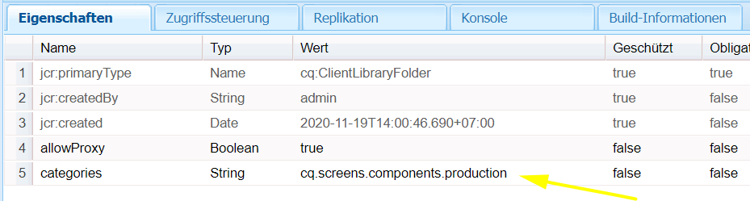
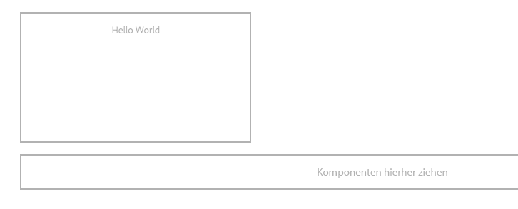

# Entwickeln einer benutzerdefinierten Komponente für AEM-Bildschirme {#developing-a-custom-component-for-aem-screens}

Das folgende Lernprogramm führt Sie durch die Schritte zum Erstellen einer benutzerdefinierten Komponente für AEM Screens. AEM Screens verwendet viele vorhandene Designmuster und Technologien anderer AEM-Produkte. Das Lernprogramm hebt Unterschiede und besondere Überlegungen bei der Entwicklung für AEM Screens hervor.

## Überblick {#overview}

Dieses Lernprogramm richtet sich an Entwickler, die neu bei AEM Screens sind. In diesem Lernprogramm wird eine einfache Komponente "Hello World"für einen Sequenzkanal in AEM Screens erstellt. Über ein Dialogfeld können Autoren den angezeigten Text aktualisieren.


## Voraussetzungen {#prerequisites}

Um dieses Lernprogramm abzuschließen, benötigen Sie Folgendes:

1. [AEM 6.5](https://helpx.adobe.com/experience-manager/6-4/release-notes.html) oder [AEM 6.3](https://helpx.adobe.com/experience-manager/6-3/release-notes.html) + neueste Bildschirme Feature Pack

1. [AEM Screens-Player](https://helpx.adobe.com/experience-manager/6-4/sites/deploying/using/configuring-screens-introduction.html)
1. Lokale Entwicklungsumgebung

Die Lernschritte und Screenshots werden mit **CRXDE-Lite** ausgeführt. IDEs können auch zum Abschluss des Tutorials verwendet werden. Weitere Informationen zur Verwendung einer IDE zur Entwicklung [mit AEM finden Sie hier.](https://helpx.adobe.com/experience-manager/kt/sites/using/getting-started-wknd-tutorial-develop/part1.html#eclipse-ide)


## Project Setup {#project-setup}

Der Quellcode eines Screens-Projekts wird normalerweise als Maven-Projekt mit mehreren Modulen verwaltet. Um das Lernprogramm zu beschleunigen, wurde ein Projekt mithilfe des [AEM-Projektarchetyps 13](https://github.com/Adobe-Marketing-Cloud/aem-project-archetype)vorgeneriert. Weitere Informationen zum [Erstellen eines Projekts mit Maven AEM Project Archetype finden Sie hier](https://helpx.adobe.com/experience-manager/kt/sites/using/getting-started-wknd-tutorial-develop/part1.html#maven-multimodule).

1. Laden Sie die folgenden Pakete mit [CRX Package Manager](http://localhost:4502/crx/packmgr/index.jsp)herunter und installieren Sie sie:

   [Datei abrufen](assets/base-screens-weretail-runuiapps-001-snapshot.zip)

   [Datei abrufen](assets/base-screens-weretail-runuicontent-001-snapshot.zip)
   **Wenn Sie mit Eclipse oder einer anderen IDE arbeiten, laden Sie optional** das folgende Quellpaket herunter. Stellen Sie das Projekt mithilfe des Maven-Befehls in einer lokalen AEM-Instanz bereit:

   **`mvn -PautoInstallPackage clean install`**

   Start HelloWorld SRC Screens We.Retail Run Project

   [Datei abrufen](assets/src-screens-weretail-run.zip)

1. Überprüfen Sie in [CRX Package Manager](http://localhost:4502/crx/packmgr/index.jsp) , ob die folgenden beiden Pakete installiert sind:

   1. **screens-weretail-run.ui.content-0.0.1-SNAPSHOT.zip**
   1. **screens-weretail-run.ui.apps-0.0.1-SNAPSHOT.zip**
   

   Screens Wir.Retail Ausführen von Ui.Apps- und Ui.Content-Paketen, die über CRX Package Manager installiert werden

1. Das **screens-weretail-run.ui.apps** -Paket installiert Code unten `/apps/weretail-run`.

   Dieses Paket enthält den Code, der für die Wiedergabe von benutzerdefinierten Komponenten für das Projekt verantwortlich ist. Dieses Paket enthält Komponentencode und JavaScript- oder CSS-Code, der benötigt wird. Dieses Paket bettet auch **screens-weretail-run.core-0.0.1-SNAPSHOT.jar** ein, das Java-Code enthält, der für das Projekt benötigt wird.

   >[!NOTE]
   >
   >In dieser Übung ist kein Java-Code geschrieben. Wenn komplexere Geschäftslogik erforderlich ist, kann Backend-Java mit dem Core Java Bundle erstellt und bereitgestellt werden.

   

   Darstellung des Codes ui.apps in CRXDE Lite

   Die **Komponente "helloworld** "ist derzeit nur ein Platzhalter. Im Verlauf des Lernprogramms werden Funktionen hinzugefügt, die es einem Autor ermöglichen, die von der Komponente angezeigte Nachricht zu aktualisieren.

1. Das **screens-weretail-run.ui.content** -Paket installiert den folgenden Code:

   * `/conf/we-retail-run`
   * `/content/dam/we-retail-run`
   * `/content/screens/we-retail-run`
   Dieses Paket enthält den für das Projekt benötigten Startinhalt und die für das Projekt erforderliche Konfigurationsstruktur. **`/conf/we-retail-run`** enthält alle Konfigurationen für das Projekt We.Retail Run. **`/content/dam/we-retail-run`** umfasst das Starten digitaler Assets für das Projekt. **`/content/screens/we-retail-run`** enthält die Screens-Inhaltsstruktur. Der Inhalt unter allen diesen Pfaden wird hauptsächlich in AEM aktualisiert. Um die Konsistenz zwischen Umgebungen (lokal, dev, stage, prod) zu fördern, wird häufig eine grundlegende Inhaltsstruktur in der Quellcodeverwaltung gespeichert.

1. **Navigieren Sie zum Projekt AEM Screens &gt; We.Retail Ausführen:**

   Klicken Sie im AEM-Startmenü auf das Symbol Bildschirme. Überprüfen Sie, ob das Web.Retail-Ausführungsprojekt angezeigt werden kann.

   

## Komponente "Hello World"erstellen {#hello-world-cmp}

Die Komponente "Hello World"ist eine einfache Komponente, mit der ein Benutzer eine Nachricht eingeben kann, die auf dem Bildschirm angezeigt werden soll. Die Komponente basiert auf der [AEM Screens-Komponentenvorlage: https://github.com/Adobe-Marketing-Cloud/aem-screens-component-template](https://github.com/Adobe-Marketing-Cloud/aem-screens-component-template).

AEM Screens weist einige interessante Einschränkungen auf, die nicht unbedingt für herkömmliche WCM-Sitekomponenten gelten.

* Die meisten Bildschirmkomponenten müssen im Vollbildmodus auf den digitalen Zielgeräten ausgeführt werden
* Die meisten Bildschirmkomponenten müssen in die Sequenzkanäle eingebettet werden, um Diashows zu erstellen
* Beim Authoring sollte es möglich sein, einzelne Komponenten in einem Sequenzkanal zu bearbeiten, sodass das Rendern im Vollbildmodus ausgeschlossen ist

1. Navigieren Sie in **CRXDE-Lite** `http://localhost:4502/crx/de/index.jsp` (oder IDE Ihrer Wahl) zu `/apps/weretail-run/components/content/helloworld.`

   Add the following properties to the `helloworld` component:

   ```
       jcr:title="Hello World"
       sling:resourceSuperType="foundation/components/parbase"
       componentGroup="We.Retail Run - Content"
   ```

   

   Eigenschaften für /apps/weretail-run/components/content/helloworld

   Die **Helloworld** -Komponente erweitert die **Stiftung/Komponenten/parbase** -Komponente, sodass sie ordnungsgemäß in einem Sequenzkanal verwendet werden kann.

1. Erstellen Sie eine Datei unter dem `/apps/weretail-run/components/content/helloworld` Namen `helloworld.html.`

   Füllen Sie die Datei mit folgenden Elementen:

   ```xml
   <!--/*
   
    /apps/weretail-run/components/content/helloworld/helloworld.html
   
   */-->
   
   <!--/* production: preview authoring mode + unspecified mode (i.e. on publish) */-->
   <sly data-sly-test.production="${wcmmode.preview || wcmmode.disabled}" data-sly-include="production.html" />
   
   <!--/* edit: any other authoring mode, i.e. edit, design, scaffolding, etc. */-->
   <sly data-sly-test="${!production}" data-sly-include="edit.html" />
   ```

   Bildschirmkomponenten erfordern je nach verwendetem [Bearbeitungsmodus](https://helpx.adobe.com/experience-manager/6-4/sites/authoring/using/author-environment-tools.html#PageModes) zwei unterschiedliche Renderings:

   1. **Produktion**: Vorschau- oder Veröffentlichungsmodus (wcmmode=disabled)
   1. **Bearbeiten**: für alle anderen Authoring-Modi, d.h. Bearbeiten, Design, Gerüst, Entwickler...
   `helloworld.html`dient als Schalter, prüft, welcher Authoring-Modus aktuell aktiv ist, und leitet zu einem anderen HTML-Skript um. Eine gängige Regel, die von Bildschirmkomponenten verwendet wird, besteht darin, ein `edit.html` Skript für den Bearbeitungsmodus und ein `production.html` Skript für den Produktionsmodus zu verwenden.

1. Erstellen Sie eine Datei unter dem `/apps/weretail-run/components/content/helloworld` Namen `production.html.`

   Füllen Sie die Datei mit folgenden Elementen:

   ```xml
   <!--/*
    /apps/weretail-run/components/content/helloworld/production.html
   
   */-->
   
   <div data-duration="${properties.duration}" class="cmp-hello-world">
    <h1 class="cmp-hello-world__message">${properties.message}</h1>
   </div>
   ```

   Oben ist das Produktions-Markup für die Komponente "Hello World". Ein `data-duration` Attribut ist enthalten, da die Komponente auf einem Sequenzkanal verwendet wird. Das `data-duration` Attribut wird vom Sequenzkanal verwendet, um zu erfahren, wie lange ein Sequenzelement angezeigt werden soll.

   Die Komponente rendert ein `div` und ein `h1` -Tag mit Text. `${properties.message}` ist ein Teil des HTML-Skripts, der den Inhalt einer JCR-Eigenschaft mit dem Namen `message`ausgibt. Später wird ein Dialogfeld erstellt, in dem der Benutzer einen Wert für den `message` Eigenschaftstext eingeben kann.

   Beachten Sie außerdem, dass die BEM-Notation (Block Element Modifier) mit der Komponente verwendet wird. BEM ist eine CSS-Kodierungskonvention, die die Erstellung wiederverwendbarer Komponenten erleichtert. BEM ist die von [AEM-Kernkomponenten](https://github.com/Adobe-Marketing-Cloud/aem-core-wcm-components/wiki/CSS-coding-conventions)verwendete Notation. Weitere Informationen finden Sie unter: [https://getbem.com/](https://getbem.com/)

1. Erstellen Sie eine Datei unter dem `/apps/weretail-run/components/content/helloworld` Namen `edit.html.`

   Füllen Sie die Datei mit folgenden Elementen:

   ```xml
   <!--/*
   
    /apps/weretail-run/components/content/helloworld/edit.html
   
   */-->
   
   <!--/* if message populated */-->
   <div
    data-sly-test.message="${properties.message}"
    class="aem-Screens-editWrapper cmp-hello-world">
    <p class="cmp-hello-world__message">${message}</p>
   </div>
   
   <!--/* empty place holder */-->
   <div data-sly-test="${!message}"
        class="aem-Screens-editWrapper cq-placeholder cmp-hello-world"
        data-emptytext="${'Hello World' @ i18n, locale=request.locale}">
   </div>
   ```

   Oben befindet sich das Bearbeitungsmarkup für die Komponente "Hello World". Im ersten Block wird eine Bearbeitungsversion der Komponente angezeigt, wenn die Dialogfeldmeldung ausgefüllt wurde.

   Der zweite Block wird gerendert, wenn keine Dialogmeldung eingegeben wurde. Die `cq-placeholder` und `data-emptytext` rendern Sie die Bezeichnung ***Hello World*** als Platzhalter in diesem Fall. Die Zeichenfolge für die Beschriftung kann mithilfe von i18n internationalisiert werden, um das Authoring in mehreren Gebietsschemas zu unterstützen.

1. **Dialogfeld "Bilder kopieren", der für die Komponente "Hello World"verwendet werden soll.**

   Es ist am einfachsten, von einem vorhandenen Dialog zu beginnen und dann Änderungen vorzunehmen.

   1. Dialogfeld kopieren aus: `/libs/screens/core/components/content/image/cq:dialog`
   1. Das Dialogfeld unten einfügen `/apps/weretail-run/components/content/helloworld`
   

1. **Dialogfeld "Hallo Welt"aktualisieren, um eine Registerkarte für die Nachricht einzuschließen.**

   Aktualisieren Sie das Dialogfeld, sodass es mit Folgendem übereinstimmt: Die JCR-Knotenstruktur des finalen Dialogfelds wird nachfolgend in XML dargestellt:

   ```xml
   <?xml version="1.0" encoding="UTF-8"?>
   <jcr:root xmlns:sling="https://sling.apache.org/jcr/sling/1.0" xmlns:cq="https://www.day.com/jcr/cq/1.0" xmlns:jcr="https://www.jcp.org/jcr/1.0" xmlns:nt="https://www.jcp.org/jcr/nt/1.0"
       jcr:primaryType="nt:unstructured"
       jcr:title="Hello World"
       sling:resourceType="cq/gui/components/authoring/dialog">
       <content
           jcr:primaryType="nt:unstructured"
           sling:resourceType="granite/ui/components/coral/foundation/tabs"
           size="L">
           <items jcr:primaryType="nt:unstructured">
               <message
                   jcr:primaryType="nt:unstructured"
                   jcr:title="Message"
                   sling:resourceType="granite/ui/components/coral/foundation/fixedcolumns">
                   <items jcr:primaryType="nt:unstructured">
                       <column
                           jcr:primaryType="nt:unstructured"
                           sling:resourceType="granite/ui/components/coral/foundation/container">
                           <items jcr:primaryType="nt:unstructured">
                               <message
                                   jcr:primaryType="nt:unstructured"
                                   sling:resourceType="granite/ui/components/coral/foundation/form/textfield"
                                   fieldDescription="Message for component to display"
                                   fieldLabel="Message"
                                   name="./message"/>
                           </items>
                       </column>
                   </items>
               </message>
               <sequence
                   jcr:primaryType="nt:unstructured"
                   jcr:title="Sequence"
                   sling:resourceType="granite/ui/components/coral/foundation/fixedcolumns">
                   <items jcr:primaryType="nt:unstructured">
                       <column
                           jcr:primaryType="nt:unstructured"
                           sling:resourceType="granite/ui/components/coral/foundation/container">
                           <items jcr:primaryType="nt:unstructured">
                               <duration
                                   jcr:primaryType="nt:unstructured"
                                   sling:resourceType="granite/ui/components/coral/foundation/form/numberfield"
                                   defaultValue=""
                                   fieldDescription="Amount of time the image will be shown in the sequence, in milliseconds"
                                   fieldLabel="Duration (ms)"
                                   min="0"
                                   name="./duration"/>
                           </items>
                       </column>
                   </items>
               </sequence>
           </items>
       </content>
   </jcr:root>
   ```

   Das Textfeld für die Nachricht wird in einer Eigenschaft mit dem Namen gespeichert `message` und das numerische Feld für die Dauer wird in einer Eigenschaft mit dem Namen `duration`gespeichert. Diese beiden Eigenschaften werden beide in `/apps/weretail-run/components/content/helloworld/production.html` HTML als `${properties.message}` und `${properties.duration}`referenziert.

   

   Hallo Welt - abgeschlossener Dialog

## Clientseitige Bibliotheken erstellen {#clientlibs}

Clientseitige Bibliotheken bieten einen Mechanismus zum Organisieren und Verwalten von CSS- und JavaScript-Dateien, die für eine AEM-Implementierung erforderlich sind.

AEM Screens-Komponenten werden im Bearbeitungsmodus anders als im Vorschaumodus/Produktionsmodus dargestellt. Es werden zwei Client-Bibliotheken erstellt, eine für den Bearbeitungsmodus und eine für Vorschau/Produktion.

1. Erstellen Sie einen Ordner für clientseitige Bibliotheken für die Komponente "Hello World".

   Erstellen `/apps/weretail-run/components/content/helloworld`Sie anschließend einen neuen Ordner mit dem Namen `clientlibs`.

   

1. Erstellen Sie unter dem `clientlibs` Ordner einen neuen Knoten `shared` vom Typ `cq:ClientLibraryFolder.`

   

1. Fügen Sie der freigegebenen Client-Bibliothek die folgenden Eigenschaften hinzu:

   * `allowProxy` | Boolesch | `true`

   * `categories`| Zeichenfolge[] | `cq.screens.components`
   

   Eigenschaften für /apps/weretail-run/components/content/helloworld/clientlibs/shared

   Die categories-Eigenschaft ist eine Zeichenfolge, die die Client-Bibliothek identifiziert. Die cq.screens.component-Klasse wird sowohl im Bearbeitungs- als auch im Vorschaumodus/Produktionsmodus verwendet. Daher wird jedes in sharedclientlib definierte CSS/JS in allen Modi geladen.

   Es empfiehlt sich, in einer Produktionsumgebung niemals Pfade direkt zu /apps bereitzustellen. Die allowProxy-Eigenschaft stellt sicher, dass auf die Client-Bibliothek CSS und JS über ein Präfix of/etc.clientlibs verwiesen wird.

1. Erstellen Sie eine Datei mit dem Namen `css.txt` unter dem freigegebenen Ordner.

   Füllen Sie die Datei mit folgenden Elementen:

   ```
   #base=css
   
   styles.less
   ```

1. Erstellen Sie einen Ordner `css` unter dem `shared` Ordner. Fügen Sie eine Datei mit dem Namen `style.less` unter dem `css` Ordner hinzu. Die Struktur der Client-Bibliotheken sollte nun wie folgt aussehen:

   

   Anstatt CSS direkt zu schreiben, verwendet dieses Tutorial LESS. [LESS](https://lesscss.org/) ist ein beliebter CSS-Prä-Compiler, der CSS-Variablen, Mixins und Funktionen unterstützt. AEM-Client-Bibliotheken unterstützen nativ die LESS-Kompilierung. Sass oder andere Vorkompilatoren können verwendet werden, müssen aber außerhalb von AEM kompiliert werden.

1. Populate `/apps/weretail-run/components/content/helloworld/clientlibs/shared/css/styles.less` with the following:

   ```css
   /**
       Shared Styles
      /apps/weretail-run/components/content/helloworld/clientlibs/shared/css/styles.less
   
   **/
   
   .cmp-hello-world {
       background-color: #fff;
   
    &__message {
     color: #000;
     font-family: Helvetica;
     text-align:center;
    }
   }
   ```

1. Kopieren Sie den `shared` Clientbibliotheksordner und fügen Sie ihn ein, um eine neue Client-Bibliothek mit dem Namen `production`zu erstellen.

   

   Kopieren Sie die freigegebene Client-Bibliothek, um eine neue Produktions-Client-Bibliothek zu erstellen

1. Die `categories` Eigenschaft der Produktions-ClientLibrary aktualisieren, die `cq.screens.components.production.`

   Dadurch wird sichergestellt, dass die Stile nur geladen werden, wenn sie sich im Produktions-/Vorschaumodus befinden.

   

   Eigenschaften für /apps/weretail-run/components/content/helloworld/clientlibs/production

1. Populate `/apps/weretail-run/components/content/helloworld/clientlibs/production/css/styles.less` with the following:

   ```css
   /**
       Production Styles
      /apps/weretail-run/components/content/helloworld/clientlibs/production/css/styles.less
   
   **/
   .cmp-hello-world {
   
       height: 100%;
       width: 100%;
       position: fixed;
   
    &__message {
   
     position: relative;
     font-size: 5rem;
     top:25%;
    }
   }
   ```

   Die oben genannten Stile zeigen die Meldung zentriert in der Mitte des Bildschirms, aber nur im Produktionsmodus an.

Eine dritte clientlibrary-Kategorie: Sie `cq.screens.components.edit` könnten zum Hinzufügen von nur bearbeitbaren spezifischen Stilen zur Komponente verwendet werden.

| Clientlib-Kategorie | Nutzung |
|---|---|
| `cq.screens.components` | Stile und Skripten, die sowohl im Bearbeitungs- als auch im Produktionsmodus verwendet werden |
| `cq.screens.components.edit` | Stile und Skripten, die nur im Bearbeitungsmodus verwendet werden |
| `cq.screens.components.production` | Stile und Skripten, die nur im Produktionsmodus verwendet werden |

## Entwurfsseite erstellen {#design-page}

AEM Screens verwendet [statische Seitenvorlagen](https://helpx.adobe.com/experience-manager/6-5/sites/developing/using/page-templates-static.html) und [Designkonfigurationen](https://helpx.adobe.com/experience-manager/6-4/sites/authoring/using/default-components-designmode.html) für globale Änderungen. Designkonfigurationen werden häufig verwendet, um zulässige Komponenten für Parsys auf einem Kanal zu konfigurieren. Eine bewährte Methode besteht darin, diese Konfigurationen App-spezifisch zu speichern.

Unter einer Web.Retail-Ausführungsseite wird eine Seite erstellt, die alle Konfigurationen speichert, die spezifisch für das Web.Retail-Ausführen-Projekt sind.

1. Navigieren Sie in **CRXDE-Lite** `http://localhost:4502/crx/de/index.jsp#/apps/settings/wcm/designs` zu `/apps/settings/wcm/designs`
1. Erstellen Sie einen neuen Knoten unter dem Ordner "designs", der `we-retail-run` mit einem Typ von benannt ist `cq:Page`.
1. Fügen Sie unter der `we-retail-run` Seite eine weitere Node mit dem Namen `jcr:content` "type"hinzu `nt:unstructured`. Add the following properties to the `jcr:content` node:

   | Name | Typ | Wert |
   |---|---|---|
   | jcr:title | Zeichenfolge | We.Retail-Ausführung |
   | sling:resourceType | Zeichenfolge | wcm/core/components/designer |
   | cq:doctype | Zeichenfolge | html_5 |

   

   Entwurfsseite unter /apps/settings/wcm/designs/we-retail-run

## Sequenzkanal erstellen {#create-sequence-channel}

Die Komponente "Hello World"soll auf einem Sequenzkanal verwendet werden. Zum Testen der Komponente wird ein neuer Sequenzkanal erstellt.

1. Navigieren Sie im AEM-Startmenü zu **Bildschirme** &gt; **We.Retail** Run &gt; und wählen Sie **Kanäle**.

1. Click the **Create** button

   1. Entität **erstellen auswählen**
   

1. Im Assistenten "Erstellen":

1. Vorlagenschritt - Auswahl** Sequenzkanal**

   1. Eigenschaftenschritt
   * Grundlegende Registerkarte &gt; Titel = **Leerkanal**
   * Kanal-Registerkarte &gt; Aktivieren Sie Kanal **online machen**
   

1. Öffnen Sie die Seiteneigenschaften für den Leerkanal. Aktualisieren Sie das Feld "Design", um auf `/apps/settings/wcm/designs/we-retail-run,`die im vorherigen Abschnitt erstellte Entwurfsseite zu verweisen.

   

   Designkonfiguration mit Verweis auf /apps/settings/wcm/designs/we-retail-run

1. Bearbeiten Sie den neu erstellten Leerkanal, um ihn zu öffnen.

1. Seitenmodus in **Designmodus** wechseln

   1. Klicken Sie auf das **Schraubenschlüsselsymbol** in "Parsys", um die zulässigen Komponenten zu konfigurieren.

   1. Wählen Sie die Gruppe **Bildschirme** und die Gruppe **We.Retail Ausführen - Content** .
   

1. Ändern Sie den Seitenmodus in **Bearbeiten**. Die Komponente "Hello World"kann jetzt der Seite hinzugefügt und mit anderen Komponenten des Sequenzkanals kombiniert werden.

   

1. Navigieren Sie in **CRXDE-Lite** zu `http://localhost:4502/crx/de/index.jsp#/apps/settings/wcm/designs/we-retail-run/jcr%3Acontent/sequencechannel/par``/apps/settings/wcm/designs/we-retail-run/jcr:content/sequencechannel/par` . Beachten Sie, dass die `components` Eigenschaft jetzt `group:Screens`beinhaltet `group:We.Retail Run - Content`.

   

   Designkonfiguration unter /apps/settings/wcm/designs/we-retail-run

## Alles zusammenbringen {#putting-it-all-together}

Das folgende Video zeigt die fertige Komponente und wie sie einem Sequenzkanal hinzugefügt werden kann. Der Kanal wird dann zu einer Ortsanzeige hinzugefügt und letztendlich einem Bildschirmplayer zugewiesen.

>[!VIDEO](https://video.tv.adobe.com/v/22385?quaity=9&captions=ger)

## Fertigcode {#finished-code}

Unten finden Sie den fertigen Code aus dem Tutorial. Die **Pakete screens-weretail-run.ui.apps-0.0.1-SNAPSHOT.zip** und **screens-weretail-run.ui.content-0.0.1-SNAPSHOT.zip** sind kompilierte AEM-Pakete. Der **SRC-screens-weretail-run-0.0.1.zip **ist der nicht kompilierte Quellcode, der mithilfe von Maven bereitgestellt werden kann.

[Datei abrufen](assets/screens-weretail-runuiapps-001-snapshot.zip)

[Datei abrufen](assets/screens-weretail-runuicontent-001-snapshot.zip)

[Datei abrufen](assets/screens-weretail-run.zip)
