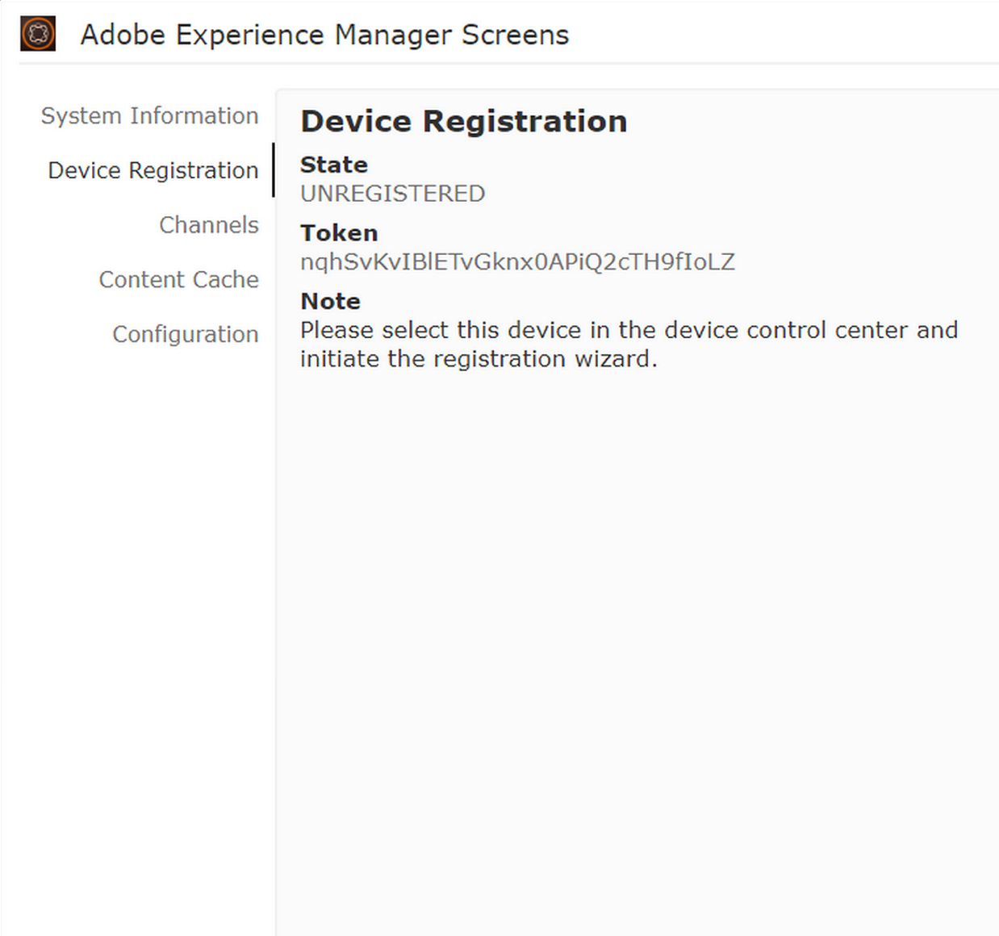
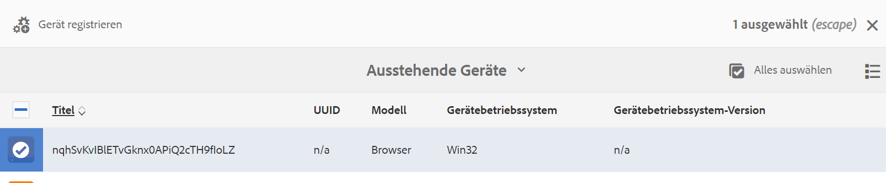
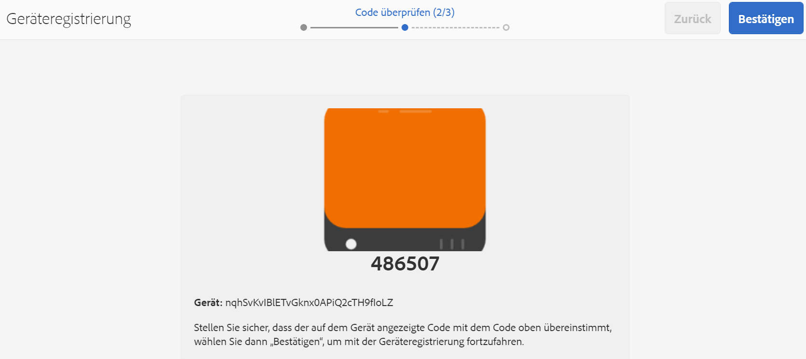
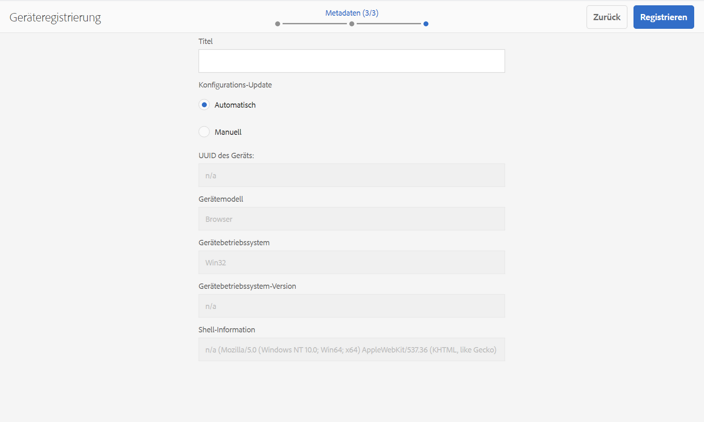
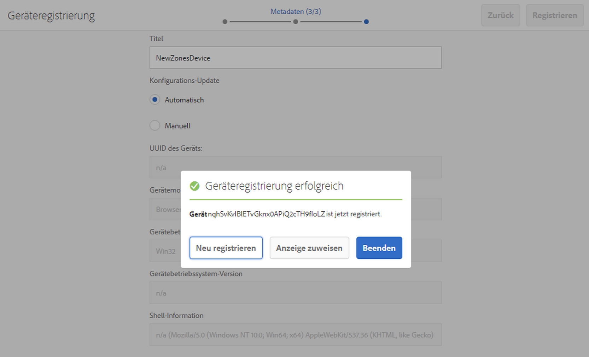
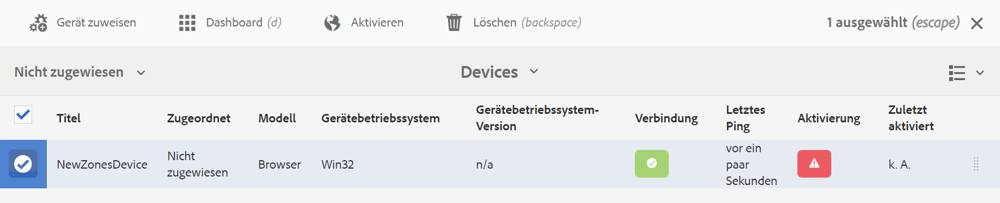
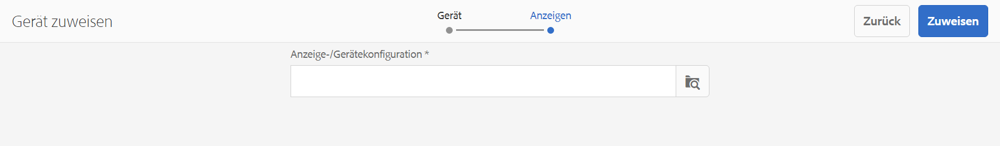
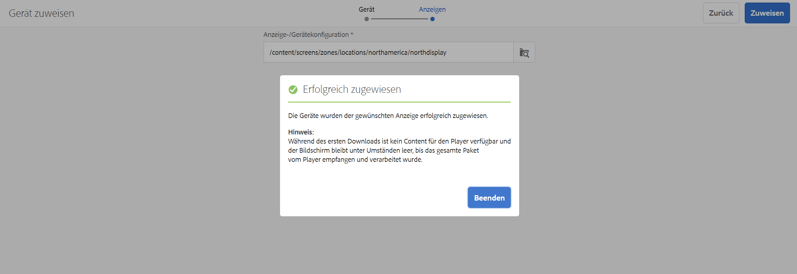
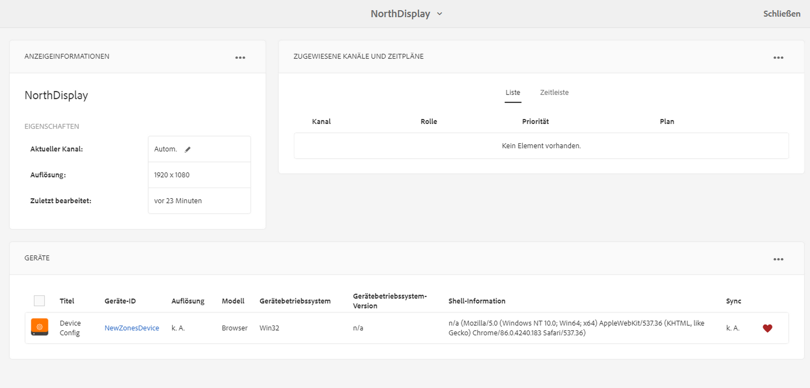

# Geräteregistrierung {#device-registration}

Auf der folgenden Seite wird der Prozess zur Geräteregistrierung in einem AEM Screens-Projekt beschrieben.

## Registrieren von Geräten {#registering-a-device}

Der Prozess zur Geräteregistrierung erfolgt auf zwei separaten Geräten:

* dem Gerät, das registriert werden soll, etwa einer Digital-Signage-Anzeige
* dem zur Registrierung des Geräts verwendeten AEM-Server

>[!NOTE]
>
>Nachdem Sie die neueste Version des Windows-Players (*.exe*) von der Seite [AEM 6.4 Player-Downloads](https://download.macromedia.com/screens/) heruntergeladen haben, führen Sie die Schritte auf dem Player aus, um die Ad-hoc-Installation abzuschließen:
>
>1. Halten Sie die linke obere Ecke eine Weile gedrückt, um das Admin-Bedienfeld zu öffnen.
>1. Navigieren Sie im linken Aktionsmenü zu **Konfiguration**, geben Sie die Speicherortadresse der AEM-Instanz unter **Server** ein und klicken Sie auf **Speichern**.
>1. Klicken Sie im linken Aktionsmenü auf den Link **Registrierung** und führen Sie die Schritte darunter aus, um die Geräteregistrierung abzuschließen.
>


1. Starten Sie den Player für AEM Screens auf dem Gerät. Daraufhin wird die Benutzeroberfläche für die Registrierung angezeigt.

   

1. Navigieren Sie in AEM zum Ordner **Geräte** Ihres Projekts.

   >[!NOTE]
   >
   >Weitere Informationen zum Erstellen eines Projekts für Screens im AEM-Dashboard finden Sie unter [Erstellen und Verwalten von Screens-Projekten](creating-a-screens-project.md).

1. Klicken Sie in der Aktionsleiste auf die Schaltfläche **Geräte-Manager**.

   

1. Klicken Sie oben rechts auf die Schaltfläche **Geräteregistrierung**.

   

1. Wählen Sie das erforderliche Gerät (dasselbe wie in Schritt 1) aus und klicken Sie auf **Gerät registrieren**.

   

1. Warten Sie in AEM darauf, dass das Gerät seinen Registrierungs-Code sendet.

   

1. Prüfen Sie den **Registrierungs-Code** auf Ihrem Gerät.

   

1. Wenn der **Registrierungs-Code** auf beiden Geräten identisch ist, klicken Sie in AEM auf die Schaltfläche **Validieren**, wie in Schritt (6) gezeigt.
1. Legen Sie den gewünschten Namen für das Gerät fest und klicken Sie auf **Registrieren**.

   

1. Klicken Sie auf **Beenden**, um den Registrierungsprozess abzuschließen.

   

   >[!NOTE]
   >
   >Mit **Neu registrieren** können Sie ein neues Gerät registrieren.
   >
   >Mit **Anzeige zuweisen** können Sie das Gerät direkt einer Anzeige hinzufügen.

   Wenn Sie auf **Beenden** klicken, müssen Sie das Gerät einer Anzeige zuweisen.

   

   >[!NOTE]
   >
   >Weitere Informationen zum Erstellen und Verwalten einer Anzeige für Ihr Screens-Projekt finden Sie unter [Erstellen und Verwalten von Anzeigen](managing-displays.md).

### Zuweisen eines Geräts zu einer Anzeige {#assigning-device-to-a-display}

Wenn Sie das Gerät nicht schon einer Anzeige zugewiesen haben, führen Sie die folgenden Schritte aus, um das Gerät einer Anzeige in Ihrem AEM Screens-Projekt zuzuweisen:

1. Wählen Sie das Gerät aus und klicken Sie in der Aktionsleiste auf **Gerät zuweisen**.

   

1. Wählen Sie den Pfad der Anzeige unter **Anzeige-/Gerätekonfiguration** aus.

   

1. Klicken Sie auf **Zuweisen**, wenn Sie den Pfad auswählen.

   

1. Klicken Sie auf **Beenden**, sobald das Gerät erfolgreich zugewiesen wurde, wie in der folgenden Abbildung dargestellt.

   

   Außerdem können Sie das Anzeigen-Dashboard anzeigen, wenn Sie auf **Beenden** klicken.

   

## Suchen eines Geräts über den Geräte-Manager {#search-device}

Wenn Sie Geräte für Ihren Player registriert haben, können Sie alle Geräte über die Benutzeroberfläche des Geräte-Managers anzeigen.

1. Navigieren Sie in Ihrem AEM Screens-Projekt zur Benutzeroberfläche des Geräte-Managers, z. B. **DemoScreens** > **Geräte**.

1. Klicken Sie auf den Ordner **Geräte** und dann in der Aktionsleiste auf **Geräte-Manager**.

   

1. Die Liste der registrierten Geräte wird angezeigt.

1. Wenn die Liste der registrierten Geräte sehr lang ist, können Sie nun über das Suchsymbol in der Aktionsleiste suchen.

   

   ODER

   Wählen Sie `/` (Schrägstrich) aus, um die Suchfunktion aufzurufen.

   


### Einschränkungen bei der Suchfunktion {#limitations}

* Benutzende können nach jedem Wort suchen, das in der *Geräte-ID* oder dem *Gerätenamen* vorkommt.

  >[!NOTE]
  >Es wird empfohlen, aus mehreren Wörtern bestehende Gerätenamen zu verwenden, z. B. *`Boston Store Lobby`* statt *`BostonStoreLobby`*.

* Wenn Sie Gerätenamen wie *`Boston Store Lobby`* erstellt haben, wird nach *`boston`*, *`store`* oder *`lobby`* gesucht. Lautet der Gerätename allerdings *`BostonStoreLobby`*, ergibt eine Suche nach *`boston`* keine Treffer.

* Der Platzhalter `*` wird für die Suche unterstützt. Wenn Sie nach allen Geräten suchen möchten, deren Name mit *`boston`* beginnt, können Sie *`boston`** verwenden.

* Wenn der Gerätename *`BostonStoreLobby`* lautet und die Suche nach *`boston`* kein Ergebnis liefert, können Sie stattdessen *`boston`** in Ihren Suchkriterien verwenden, um einen Treffer zu erhalten.

## Einschränkungen bei der Geräteregistrierung {#limitations-on-device-registration}

Systemweite Einschränkungen für Benutzerkennwörter verursachen möglicherweise einen Fehler bei der Geräteregistrierung. Bei der Geräteregistrierung wird ein zufällig generiertes Kennwort verwendet, um die Gerätebenutzerin bzw. den Gerätebenutzer zu erstellen.

Wenn die Konfiguration *AuthorizableActionProvider* das Kennwort beschränkt, schlägt die Erstellung der Gerätebenutzerin bzw. des Gerätebenutzers möglicherweise fehl.

>[!NOTE]
>
>Das zufällig generierte Kennwort besteht zurzeit aus 36 ASCII-Zeichen aus dem Bereich von 33 bis 122 (enthält fast alle Sonderzeichen).

```java
25.09.2016 16:54:03.140 *ERROR* [59.100.121.82 [1474844043109] POST /content/screens/svc/registration HTTP/1.1] com.adobe.cq.screens.device.registration.impl.RegistrationServlet Error during device registration
javax.jcr.nodetype.ConstraintViolationException: Password violates password constraint (^(?=.*\d).{7,9}$).
        at org.apache.jackrabbit.oak.spi.security.user.action.PasswordValidationAction.validatePassword(PasswordValidationAction.java:105)
        at org.apache.jackrabbit.oak.spi.security.user.action.PasswordValidationAction.onPasswordChange(PasswordValidationAction.java:76)
        at org.apache.jackrabbit.oak.security.user.UserManagerImpl.onPasswordChange(UserManagerImpl.java:308)
```

### Sonstige Ressourcen {#additional-resources}

Weitere Informationen zum AEM Screens-Player finden Sie unter [AEM Screens-Player](working-with-screens-player.md).
