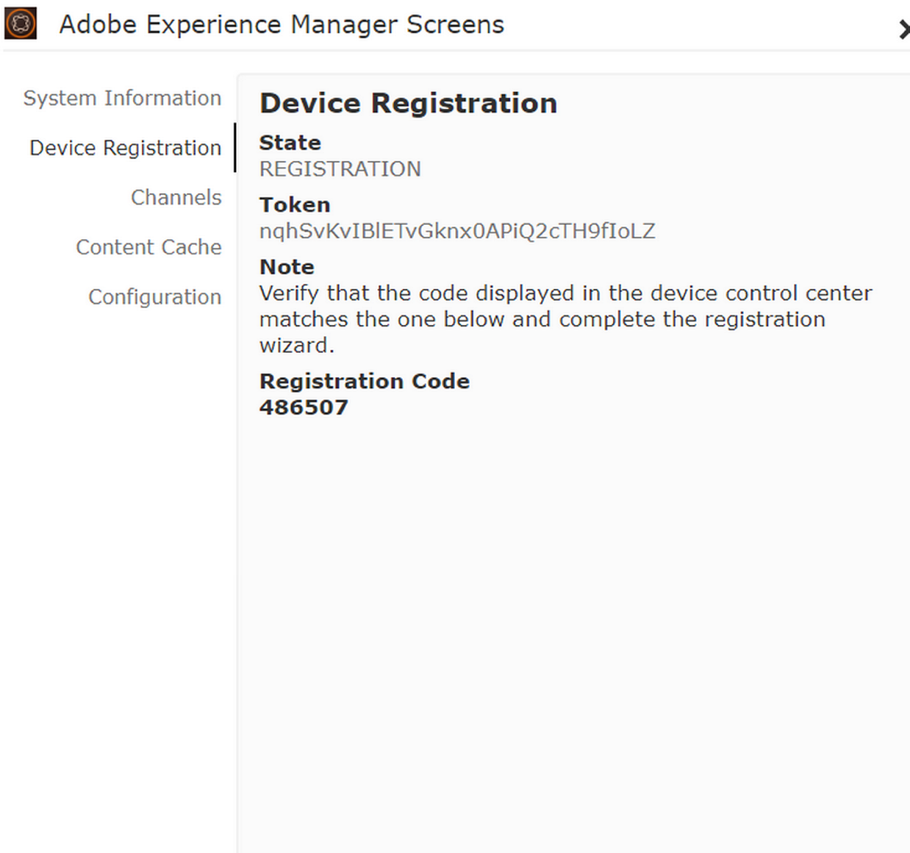

# Geräteregistrierung {#device-registration}

Auf der folgenden Seite wird der Prozess zur Geräteregistrierung in einem AEM Screens-Projekt beschrieben.

## Registrieren von Geräten {#registering-a-device}

Der Prozess zur Geräteregistrierung erfolgt auf zwei separaten Geräten:

* Das tatsächliche Gerät, das registriert werden soll, z. B. Ihre Signage-Anzeige
* Der AEM-Server, der zum Registrieren des Geräts verwendet wird

>[!NOTE]
>
>Nach dem Herunterladen des neuesten Windows-Players (*.exe*), von [AEM 6.4 Player-Downloads](https://download.macromedia.com/screens/) Führen Sie die Schritte im Player aus, um die Ad-hoc-Installation abzuschließen:
>
>1. Halten Sie die linke obere Ecke gedrückt, um das Admin-Bedienfeld zu öffnen.
>1. Navigieren Sie im linken Aktionsmenü zu **Konfiguration**, geben Sie die Standortadresse der AEM-Instanz unter **Server** ein und klicken Sie auf **Speichern**.
>1. Klicken Sie auf **Registrierung** über den Link im linken Aktionsmenü und die folgenden Schritte, um den Prozess zur Geräteregistrierung abzuschließen.
>


1. Starten Sie auf Ihrem Gerät den AEM Screens-Player. Die Registrierungs-Benutzeroberfläche wird angezeigt.

   

1. Navigieren Sie in AEM zum Ordner **Geräte** Ihres Projekts.

   >[!NOTE]
   >
   >Weitere Informationen zum Erstellen eines Projekts für Screens im AEM-Dashboard finden Sie unter [Erstellen und Verwalten von Screens-Projekten](creating-a-screens-project.md).

1. Klicken Sie auf **Geräte-Manager** in der Aktionsleiste.

   

1. Klicken Sie auf **Geräteregistrierung** rechts oben.

   

1. Klicken Sie auf das gewünschte Gerät (wie in Schritt 1) und klicken Sie auf **Gerät registrieren**.

   

1. Warten Sie in AEM darauf, dass das Gerät seinen Registrierungs-Code sendet.

   

1. Prüfen Sie den **Registrierungs-Code** auf Ihrem Gerät.

   

1. Wenn die Variable **Registrierungs-Code** auf beiden Computern identisch ist, klicken Sie auf **Bestätigen** in AEM, wie im Schritt (6) gezeigt.
1. Legen Sie den gewünschten Namen für das Gerät fest und klicken Sie auf **Registrieren**.

   

1. Klicks **Beenden** , um den Registrierungsprozess abzuschließen.

   

   >[!NOTE]
   >
   >Die **Neu registrieren** ermöglicht die Registrierung eines neuen Geräts.
   >
   >Mit **Anzeige zuweisen** können Sie das Gerät direkt einer Anzeige hinzufügen.

   Wenn Sie auf **Beenden**, weisen Sie das Gerät einer Anzeige zu.

   

   >[!NOTE]
   >
   >Weitere Informationen zum Erstellen und Verwalten einer Anzeige für Ihr Screens-Projekt finden Sie unter [Erstellen und Verwalten von Anzeigen](managing-displays.md).

### Zuweisen eines Geräts zu einer Anzeige {#assigning-device-to-a-display}

Wenn Sie das Gerät nicht einer Anzeige zugewiesen haben, führen Sie die folgenden Schritte aus, um das Gerät einer Anzeige in Ihrem AEM Screens-Projekt zuzuweisen:

1. Klicken Sie auf das Gerät und klicken Sie auf **Gerät zuweisen** in der Aktionsleiste aus.

   

1. Klicken Sie auf den Pfad der Anzeige in **Pfad zur Anzeige/Gerätekonfiguration**.

   

1. Klicks **Zuweisen** wenn Sie auf den Pfad klicken.

   

1. Klicken Sie auf **Beenden**, sobald das Gerät erfolgreich zugewiesen wurde, wie in der folgenden Abbildung dargestellt.

   

   Sie können das Anzeigen-Dashboard auch bei Auswahl anzeigen **Beenden**.

   

## Suchen eines Geräts über den Geräte-Manager {#search-device}

Wenn Sie Geräte für Ihren Player registriert haben, können Sie alle Geräte über die Benutzeroberfläche des Geräte-Managers anzeigen.

1. Navigieren Sie von Ihrem AEM Screens-Projekt aus zur Benutzeroberfläche des Geräte-Managers, z. B.: **DemoScreens** > **Geräte**.

1. Klicken Sie auf **Geräte** Ordner und klicken Sie auf **Geräte-Manager** in der Aktionsleiste aus.

   

1. Die Liste der registrierten Geräte wird angezeigt.

1. Wenn die Liste der registrierten Geräte sehr lang ist, können Sie nun über das Suchsymbol in der Aktionsleiste suchen.

   

   Oder

   Auswählen `/` (Schrägstrich) zum Aufrufen der Suchfunktion.

   


### Einschränkungen bei der Suchfunktion {#limitations}

* Der Benutzer kann jedes in der Variablen *Geräte-ID* oder *Gerätename*.

  >[!NOTE]
  >Es wird empfohlen, die Gerätenamen in mehreren Wörtern zu erstellen, z. B. *Boston Store Lobby* und nicht *BostonStoreLobby*.

* Wenn Sie Gerätenamen wie *Boston Store Lobby*, sucht es nach einem beliebigen Wort *Boston*, *store* oder *Lobby*. Wenn der Gerätename jedoch *BostonStoreLobby*, suchen Sie dann nach *Boston* zeigt keine Ergebnisse an.

* Der Platzhalter `*` wird für die Suche unterstützt. Wenn Sie alle Geräte mit Namen finden möchten, die mit *Boston*, können Sie *Boston**.

* Wenn der Gerätename *BostonStoreLobby* und die Suche nach *Boston* gibt das Ergebnis nicht zurück, indem Sie *Boston** in Ihren Suchkriterien gibt das Ergebnis zurück.

## Einschränkungen bei der Geräteregistrierung {#limitations-on-device-registration}

Systemweite Einschränkungen des Benutzerkennworts können zu Fehlern bei der Geräteregistrierung führen. Die Geräteregistrierung verwendet ein zufällig generiertes Kennwort, um den Gerätebenutzer zu erstellen.

Wenn das Kennwort durch die Variable *AuthorizableActionProvider* -Konfiguration kann das Erstellen des Gerätebenutzers fehlschlagen.

>[!NOTE]
>
>Das derzeit generierte zufällige Passwort besteht aus 36 ASCII-Zeichen im Bereich von 33 bis 122 (enthält fast alle Sonderzeichen).

```java
25.09.2016 16:54:03.140 *ERROR* [59.100.121.82 [1474844043109] POST /content/screens/svc/registration HTTP/1.1] com.adobe.cq.screens.device.registration.impl.RegistrationServlet Error during device registration
javax.jcr.nodetype.ConstraintViolationException: Password violates password constraint (^(?=.*\d).{7,9}$).
        at org.apache.jackrabbit.oak.spi.security.user.action.PasswordValidationAction.validatePassword(PasswordValidationAction.java:105)
        at org.apache.jackrabbit.oak.spi.security.user.action.PasswordValidationAction.onPasswordChange(PasswordValidationAction.java:76)
        at org.apache.jackrabbit.oak.security.user.UserManagerImpl.onPasswordChange(UserManagerImpl.java:308)
```

### Sonstige Ressourcen {#additional-resources}

Weitere Informationen zum AEM Screens-Player finden Sie unter [AEM Screens-Player](working-with-screens-player.md).
