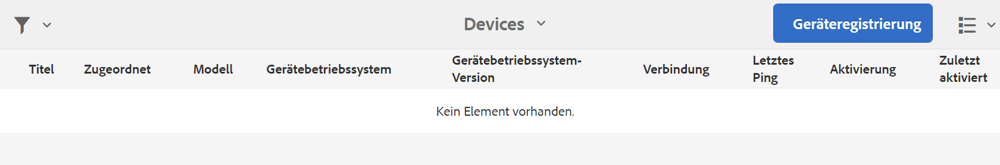

# Geräteregistrierung {#device-registration}

Auf der folgenden Seite wird der Prozess zur Geräteregistrierung in einem AEM Screens-Projekt beschrieben.

## Registrieren von Geräten {#registering-a-device}

Der Prozess zur Geräteregistrierung erfolgt auf 2 separaten Geräten:

* Das tatsächliche Gerät, das registriert werden soll, z. B. Ihre Signage-Anzeige
* Der AEM-Server, der zum Registrieren des Geräts verwendet wird

>[!NOTE]
>
>Nachdem Sie die neueste Version von Windows Player (*.exe*) von der Seite [AEM 6.4 Player-Downloads](https://download.macromedia.com/screens/) heruntergeladen haben, führen Sie die Schritte auf dem Player aus, um die AEM-hoc-Installation abzuschließen:
>
>1. Halten Sie die linke obere Ecke gedrückt, um den Admin-Bereich zu öffnen.
>1. Navigieren Sie im linken Aktionsmenü zu **Konfiguration**, geben Sie die Standortadresse der AEM-Instanz unter **Server** ein und klicken Sie auf **Speichern**.
>1. Klicken Sie im linken Aktionsmenü auf den Link **Registrierung** und führen Sie die folgenden Schritte aus, um die Geräteregistrierung abzuschließen.
>


1. Starten Sie auf Ihrem Gerät den AEM Screens-Player. Die Registrierungs-Benutzeroberfläche wird angezeigt.

   

1. Navigieren Sie in AEM zum Ordner **Geräte** Ihres Projekts.

   >[!NOTE]
   >
   >Weitere Informationen zum Erstellen eines neuen Projekts für Screens im AEM-Dashboard finden Sie unter [Erstellen und Verwalten von Screens-Projekten](creating-a-screens-project.md).

1. Tippen/klicken Sie in der Aktionsleiste auf die Schaltfläche **Geräte-Manager**.

   

1. Tippen/klicken Sie oben rechts auf die Schaltfläche **Geräteregistrierung**.

   

1. Wählen Sie das erforderliche Gerät (dasselbe wie in Schritt 1) aus und tippen/klicken Sie auf **Gerät registrieren**.

   

1. Warten Sie in AEM darauf, dass das Gerät seinen Registrierungs-Code sendet.

   

1. Prüfen Sie den **Registrierungs-Code** auf Ihrem Gerät.

   

1. Wenn der **Registrierungs-Code** auf beiden Geräten identisch ist, tippen/klicken Sie in AEM auf die Schaltfläche **Validieren**, wie in Schritt (6) gezeigt.
1. Legen Sie den gewünschten Namen für das Gerät fest und klicken Sie auf **Registrieren**.

   

1. Tippen/klicken Sie auf **Beenden**, um den Registrierungsprozess abzuschließen.

   

   >[!NOTE]
   >
   >Mit **Neu registrieren** können Sie ein neues Gerät registrieren.
   >
   >Mit **Anzeige zuweisen** können Sie das Gerät direkt einer Anzeige hinzufügen.

   Wenn Sie auf **Beenden** klicken, müssen Sie das Gerät einer Anzeige zuweisen.

   

   >[!NOTE]
   >
   >Weitere Informationen zum Erstellen und Verwalten einer Anzeige für Ihr Screens-Projekt finden Sie unter [Erstellen und Verwalten von Anzeigen](managing-displays.md).

### Zuweisen eines Geräts zu einer Anzeige {#assigning-device-to-a-display}

Wenn Sie das Gerät nicht einer Anzeige zugewiesen haben, führen Sie die folgenden Schritte aus, um das Gerät einer Anzeige in Ihrem AEM Screens-Projekt zuzuweisen:

1. Wählen Sie das Gerät aus und klicken Sie in der Aktionsleiste auf **Gerät zuweisen**.

   

1. Wählen Sie den Pfad der Anzeige unter **Anzeige-/Gerätekonfiguration** aus.

   

1. Klicken Sie auf **Zuweisen**, wenn Sie den Pfad auswählen.

   

1. Klicken Sie auf **Beenden**, sobald das Gerät erfolgreich zugewiesen wurde, wie in der folgenden Abbildung dargestellt.

   

   Außerdem können Sie das Anzeigen-Dashboard anzeigen, wenn Sie auf **Beenden** klicken.

   

## Suchen eines Geräts über den Geräte-Manager {#search-device}

Sobald Sie Geräte für Ihren Player registriert haben, können Sie alle Geräte über die Benutzeroberfläche des Geräte-Managers anzeigen.

1. Navigieren Sie von Ihrem AEM Screens-Projekt aus zur Benutzeroberfläche des Geräte-Managers, z. B.: **DemoScreens** > **Geräte**.

1. Wählen Sie den Ordner **Devices** (Geräte) aus und klicken Sie in der Aktionsleiste auf **Geräte-Manager**.

   

1. Die Liste der registrierten Geräte wird angezeigt.

1. Wenn die Liste der registrierten Geräte sehr lang ist, können Sie nun über das Suchsymbol in der Aktionsleiste suchen.

   

   Oder

   Klicken Sie auf `/` (Schrägstrich), um die Suchfunktion aufzurufen.

   


### Einschränkungen bei der Suchfunktion {#limitations}

* Benutzer können nach jedem Wort suchen, das in der *Geräte-ID* oder dem *Gerätenamen* vorkommt.

  >[!NOTE]
  >Es wird empfohlen, die Gerätenamen in mehreren Wörtern zu erstellen, z. B. *Boston Store Lobby* und nicht *BostonStoreLobby*.

* Wenn Sie Gerätenamen wie *Boston Store Lobby* erstellen, können Sie nach jedem beliebigen Wort wie *boston*, *store* oder *lobby* suchen. Wenn der Gerätename jedoch *BostonStoreLobby* lautet, werden bei der Suche nach *boston* keine Ergebnisse angezeigt.

* Der Platzhalter `*` wird für die Suche unterstützt. Wenn Sie alle Geräte mit Namen finden möchten, die mit *boston* beginnen, können Sie *boston** verwenden.

* Wenn der Gerätename *BostonStoreLobby* lautet und die Suche nach *boston* kein Ergebnis liefert, können Sie stattdessen *boston** in Ihren Suchkriterien verwenden, um das Ergebnis zu erhalten.

## Einschränkungen bei der Geräteregistrierung {#limitations-on-device-registration}

Systemweite Passwortbeschränkungen für Benutzer können zu Fehlern bei der Geräteregistrierung führen. Die Geräteregistrierung verwendet ein zufällig generiertes Kennwort, um den Gerätebenutzer zu erstellen.

Wenn das Kennwort durch die Variable *AuthorizableActionProvider* -Konfiguration kann das Erstellen des Gerätebenutzers fehlschlagen.

>[!NOTE]
>
>Das derzeit generierte zufällige Passwort besteht aus 36 ASCII-Zeichen, die zwischen 33 und 122 liegen (enthält fast alle Sonderzeichen).

```java
25.09.2016 16:54:03.140 *ERROR* [59.100.121.82 [1474844043109] POST /content/screens/svc/registration HTTP/1.1] com.adobe.cq.screens.device.registration.impl.RegistrationServlet Error during device registration
javax.jcr.nodetype.ConstraintViolationException: Password violates password constraint (^(?=.*\d).{7,9}$).
        at org.apache.jackrabbit.oak.spi.security.user.action.PasswordValidationAction.validatePassword(PasswordValidationAction.java:105)
        at org.apache.jackrabbit.oak.spi.security.user.action.PasswordValidationAction.onPasswordChange(PasswordValidationAction.java:76)
        at org.apache.jackrabbit.oak.security.user.UserManagerImpl.onPasswordChange(UserManagerImpl.java:308)
```

### Zusätzliche Ressourcen {#additional-resources}

Weitere Informationen zum AEM Screens-Player finden Sie unter [AEM Screens-Player](working-with-screens-player.md).
