# Verwenden dynamischer eingebetteter Sequenzen {#using-dynamic-embedded-sequence}

Die Verwendung dynamischer eingebetteter Sequenzen umfasst die folgenden Themen:

* **Überblick**
* **Verwenden eines dynamischen eingebetteten Erlebnisses in AEM Screens**
* **Anzeigen der Ergebnisse**
* **Einschränken von Benutzern und Ändern der ACLs**

## Überblick {#overview}

***Dynamische integrierte Sequenzen*** werden für große Projekte erstellt, die einer Hierarchie zwischen über- und untergeordnetem Element folgen, wobei auf das untergeordnete Element in einem Standortordner und nicht in einem Kanalordner verwiesen wird. Benutzer können so eine Sequenz nach ***Kanalrolle*** in einen Kanal einbetten. Damit kann der Benutzer standortspezifische Platzhalter für verschiedene Büros mithilfe einer eingebetteten Sequenz innerhalb eines Hauptkanals definieren.

Beim Zuweisen eines Kanals zu einer Anzeige haben Sie die Möglichkeit, den Pfad der Anzeige anzugeben. Alternativ können Sie die Rolle des Kanals festlegen, der nach Kontext zu einem tatsächlichen Kanal aufgelöst wird.

Um die dynamische eingebettete Sequenz zu verwenden, weisen Sie einen Kanal nach ***Kanalrolle*** zu. In „Kanalrolle“ wird der Kontext der Anzeige definiert. Die Rolle ermöglicht die Ausrichtung auf verschiedene Aktionen und ist unabhängig vom eigentlichen Kanal, der die Rolle erfüllt. In diesem Abschnitt wird ein Anwendungsfall beschrieben, der Kanäle nach Rolle definiert und wie Sie diesen Inhalt auf einen globalen Kanal anwenden können. Sie können sich die Rolle auch als ID für die Zuweisung oder als Alias für den Kanal im Kontext vorstellen.

### Vorteile der Verwendung dynamischer eingebetteter Sequenzen {#benefits-of-using-dynamic-embedded-sequences}

Wenn Sie einen Sequenzkanal in einen Speicherort statt in den Ordner &quot;Kanäle&quot;platzieren, können lokale oder regionale Autoren Inhalte bearbeiten, die für sie relevant sind. Außerdem können dadurch Kanäle weiter oben in der Hierarchie bearbeitet werden.

Verweisen auf eine *Kanal nach Rolle* ermöglicht die Erstellung einer lokalen Version eines Kanals. Dadurch werden standortspezifische Inhalte dynamisch aufgelöst und Sie können auch einen globalen Kanal erstellen, der den Inhalt für standortspezifische Kanäle verwendet.

>[!NOTE]
>
>**Eingebettete Sequenzen im Vergleich zu dynamischen eingebetteten Sequenzen**
>
>Eine dynamische eingebettete Sequenz ähnelt einer eingebetteten Sequenz, ermöglicht es dem Benutzer jedoch, einer Hierarchie zu folgen, in der Änderungen und Aktualisierungen an einem Kanal auf einen anderen in Beziehung propagiert werden. Sie folgt einer Hierarchie von über- und untergeordnetem Element und umfasst auch Assets wie Bilder oder Videos.
>
>Mit ***dynamischen eingebetteten Sequenzen*** können Sie standortspezifischen Inhalt anzeigen, während ***eingebettete Sequenzen*** nur eine allgemeine Diashow des Inhalts anzeigen. Konfigurieren Sie beim Einrichten dynamischer eingebetteter Sequenzen den Kanal außerdem mithilfe der Kanalrolle und des Kanalnamens. Weitere Informationen zur praktischen Umsetzung finden Sie in den folgenden Schritten.
>
>Weitere Informationen zur Implementierung von eingebetteten Sequenzen finden Sie unter [Eingebettete Sequenzen](embedded-sequences.md) in AEM Screens.

Das folgende Beispiel zeigt eine Lösung mit Konzentration auf die folgenden Schlüsselbegriffe:

* a ***Hauptsequenzkanal*** für die globale Sequenz.
* ***dynamische eingebettete Sequenz*** Komponenten für jeden lokal anpassbaren Teil der Sequenz.
* ***einzelne Sequenzkanäle*** an den jeweiligen Standorten mit einer *Rolle* in der Anzeige, die mit der **der Komponente für dynamische eingebettete Sequenzen *Rolle***.

>[!NOTE]
>
>Weitere Informationen zur Kanalzuweisung finden Sie unter **[Kanalzuweisung](channel-assignment.md)** in der AEM Screens-Dokumentation im Abschnitt Authoring .

## Verwenden dynamischer eingebetteter Sequenzen {#using-dynamic-embedded-sequence-2}

Im folgenden Abschnitt wird die Erstellung einer dynamischen eingebetteten Sequenz in einem AEM Screens-Kanal erläutert.

### Voraussetzungen {#prerequisites}

Bevor Sie mit der Implementierung dieser Funktion beginnen, stellen Sie sicher, dass Sie die folgenden Voraussetzungen erfüllen, um mit der Implementierung dynamischer eingebetteter Sequenzen beginnen zu können:

* Erstellen eines AEM Screens-Projekts (in diesem Beispiel ) **Demo**).
* Erstellen Sie eine **Global** -Kanal unter **Kanäle** Ordner.
* Hinzufügen von Inhalten zu Ihren **Global** Kanal (*Überprüfen **Resources.zip**für relevante Vermögenswerte*).

Die folgende Abbildung zeigt die **Demo** Projekt mit **Global** -Kanal im **Kanäle** Ordner.
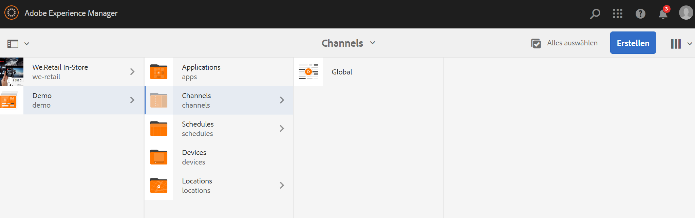

### Ressourcen {#resources}

Sie können die folgenden Ressourcen (Bilder) herunterladen und zu Assets hinzufügen und sie zur Veranschaulichung weiter als Kanalinhalt verwenden.

[Datei abrufen](assets/resources.zip)

>[!NOTE]
>
>Weitere Informationen zum Erstellen eines Projekts und zum Erstellen eines Sequenzkanals finden Sie in den folgenden Ressourcen:
>
>* **[Erstellen und Verwalten von Projekten](creating-a-screens-project.md)**
>* **[Verwalten eines Kanals](managing-channels.md)**
>

Die Implementierung einer dynamischen eingebetteten Sequenz in einem AEM Screens-Projekt umfasst drei Hauptaufgaben:

1. **Einrichten des Klassifikationsschemas des Projekts, einschließlich Kanälen, Standorten und Anzeigen**
1. **Erstellen eines Zeitplans**
1. **Zuweisen eines Zeitplans zu jeder Anzeige**

Gehen Sie wie folgt vor, um die Funktion zu implementieren:

>[!CAUTION]
>
>Achten Sie bei der Implementierung dynamischer eingebetteter Sequenzen auf die **Name** und **Titel** -Felder beim Erstellen von Kanälen unter den einzelnen Standorten. Befolgen Sie die Hinweise zur Nomenklatur sorgfältig.

1. **Erstellen Sie zwei Standortordner.**

   Navigieren Sie im AEM Screens-Projekt zu Ihrem Ordner **Standorte** und erstellen Sie zwei Standortordner: **Region A** und **Region B**.

   >[!NOTE]
   >
   >Achten Sie beim Erstellen des Ordners **Region A** darauf, den **Titel** als **Region A** einzugeben und das Feld **Name** leer zu lassen. Damit wird automatisch der Name **region-a** übernommen.
   >
   >Ähnlich verhält es sich bei der Erstellung des Ordners für den Speicherort **Region B**, wie unten dargestellt:

   

   >[!NOTE]
   >Informationen zum Erstellen eines Standorts finden Sie unter **[Erstellen und Verwalten von Standorten](managing-locations.md)**.

1. **Erstellen Sie unter jedem Standortordner zwei Standorte und einen Kanal.**

   1. Navigieren Sie zu **Demo** > **Standorte** > **Region A**.
   1. Klicks **Region A** und klicken **+ Erstellen** in der Aktionsleiste aus.
   1. Klicks **Standort** aus dem Assistenten mit **Titel** as **Store 1**. Erstellen Sie auf ähnliche Weise einen anderen Speicherort im Assistenten mit dem Titel **Store 2** mit dem **Titel** as **Store 2**. Sie können das Feld **Name** leer lassen, während Sie **Store 1** und **Store 2** erstellen.
   1. Schritt (b) wiederholen und jetzt auf **Sequenzkanal** aus dem Assistenten. Geben Sie die **Titel** as **Region A** und **Name** als **region** für diesen Kanal.

   >[!CAUTION]
   >
   >Stellen Sie beim Erstellen des Kanals sicher, dass **Region A**, geben Sie die **Titel** as **Region A** und **Name** as a **region**.

   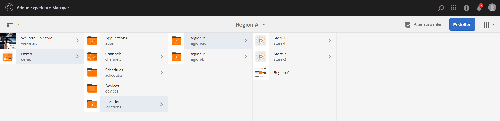

   Erstellen Sie auf ähnliche Weise zwei Standorte unter **Region B** mit den Titeln **Store 3** und **Store 4**. Erstellen Sie außerdem einen **Sequenzkanal**, für den Sie als **Titel** den Wert **Region B** und als **Name** den Wert **region** wählen.

   >[!CAUTION]
   >
   >Stellen Sie sicher, dass Sie denselben Namen für die Kanäle verwenden können, die in **Region A** und **Region B** as **region**.

   

1. **Erstellen Sie eine Anzeige und einen Kanal unter jedem Standort.**

   1. Navigieren Sie zu **Demo** > **Standorte** > **Region A** > **Store 1**.
   1. Klicks **Store 1** und klicken **+ Erstellen** in der Aktionsleiste aus.
   1. Klicks **Anzeige** im Assistenten aus und erstellen Sie **`Store1Display`**.
   1. Wiederholen Sie Schritt (b) und klicken Sie dann auf **Sequenzkanal** aus dem Assistenten. Geben Sie die **Titel** as **`Store1Channel`** und **Name** as **store**.

   >[!CAUTION]
   >
   >Bei der Erstellung eines Sequenzkanals ist es wichtig, dass der **Titel** des Kanals Ihren Anforderungen entspricht. Der **Name** sollte jedoch in allen lokalen Kanälen gleich sein.
   >In diesem Beispiel werden die Kanäle unter **Region A** und **Region B** share **Name** as **region** und die Kanäle unter **`Store 1`**, **`Store 2`**, **`Store 3`**, und **`Store 4`** share **Name** as **store**.

   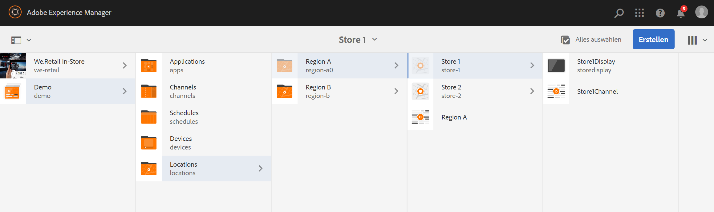

   Erstellen Sie auf ähnliche Weise eine Anzeige als **`Store2Display`** und einen Kanal **`Store2Channel`** under **`Store `2** (mit dem Namen **store**).

   >[!NOTE]
   >Stellen Sie sicher, dass Sie denselben Namen für die Kanäle verwenden können, die in **`Store 1`** und **`Store 2`** as **store**.

   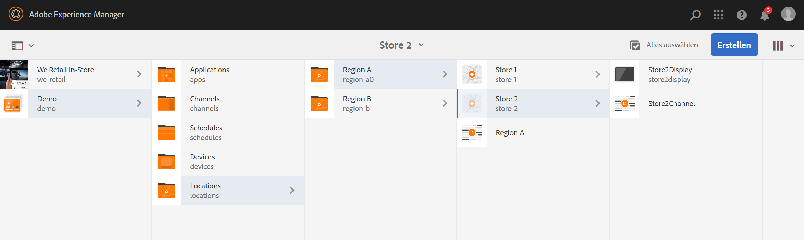

   Führen Sie die vorherigen Schritte aus, damit Sie einen Kanal erstellen und in **`Store 3`** und **`Store 4`** under **Region B**. Stellen Sie erneut sicher, dass Sie dasselbe **Name** as **store** beim Erstellen eines Kanals **`Store3Channel`** und **`Store4Channel`** bzw.

   Die folgende Abbildung zeigt die Anzeige und den Kanal in **`Store 3`**.

   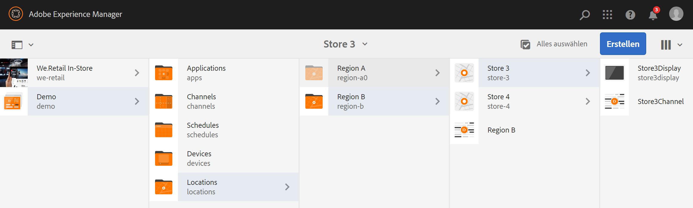

   Die folgende Abbildung zeigt die Anzeige und den Kanal in **`Store 4`**.

   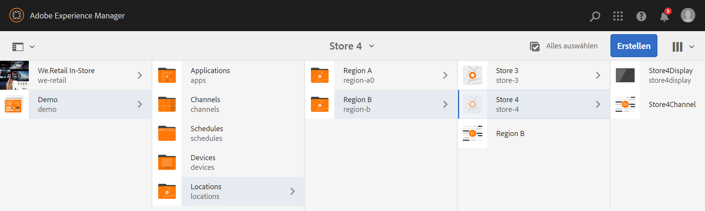

1. **Fügen Sie den Kanälen an ihren jeweiligen Standorten Inhalt hinzu.**

   Navigieren Sie zum **Demo** > **Standorte** > **Region A** > **Region A** und klicken **Bearbeiten** in der Aktionsleiste aus. Ziehen Sie die Assets, die Sie hinzufügen möchten, in Ihren Kanal.

   >[!NOTE]
   >Sie können die Datei ***Resources.zip*** im Abschnitt **Ressourcen** verwenden, um die Bilder als Assets für Ihren Kanalinhalt zu verwenden.

   

   Navigieren Sie auf ähnliche Weise zum **Demo** > **Standorte** > **Region B** > **Region B** und klicken **Bearbeiten** aus der Aktionsleiste, um die Assets per Drag-and-Drop in Ihren Kanal zu ziehen, wie unten dargestellt:

   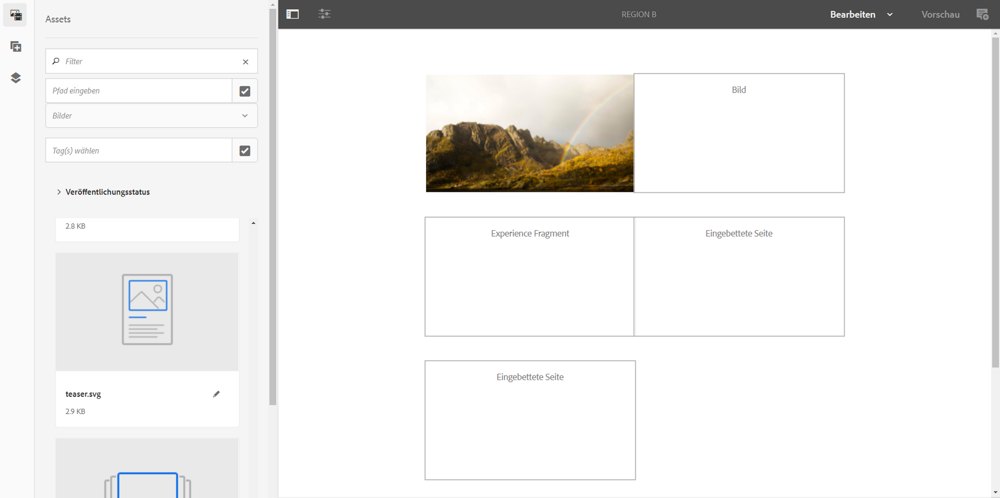

   Führen Sie die vorhergehenden Schritte und die Ressourcen aus, damit Sie Inhalte zu den folgenden Kanälen hinzufügen können:

   * **`Store1Channel`**
   * **`Store2Channel`**
   * **`Store3Channel`**
   * **`Store4Channel`**

1. **Zeitplan erstellen**

   Navigieren Sie zu und klicken Sie auf die **Zeitpläne** Ordner in Ihrem AEM Screens-Projekt. Klicken Sie anschließend auf **Erstellen** in der Aktionsleiste aus.

   Die folgende Abbildung zeigt die **AdSchedule** erstellt in der **Demo** Projekt.

   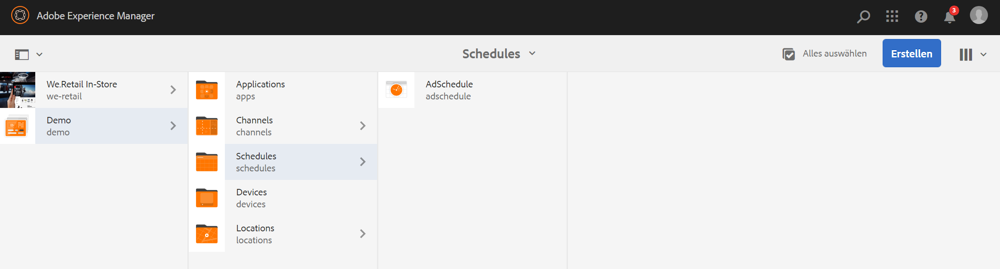

1. **Weisen Sie einem Zeitplan Kanäle zu**

   1. Navigieren Sie zu **Demo** > **Zeitpläne** > **AdSchedule** und klicken **Dashboard** in der Aktionsleiste aus.
   1. Klicks **+ Kanal zuweisen** aus dem **ZUGEWIESENE KANÄLE** -Bedienfeld, damit Sie **Kanalzuweisung** Dialogfeld.
   1. Klicks **Referenzkanal** nach Pfad.
   1. Klicken Sie auf **Kanalpfad**, genau wie **Demo** > ***Kanäle*** > ***Global***.
   1. Geben Sie die **Kanalrolle**, genau wie **GlobalAdSegment**.
   1. Klicken Sie auf **Unterstützte Ereignisse**, genau wie **Erster Ladevorgang**, **Idle Screen**, und **Benutzerinteraktion**.
   1. Klicken Sie auf **Speichern**.

   **Kanal nach Rolle für die Region zuweisen:**

   1. Klicken Sie im Bedienfeld **ZUGEWIESENE KANÄLE** auf **+ Kanal zuweisen**.
   1. Klicken Sie im Dialogfeld Kanalzuweisung auf **Referenzkanal** nach Namen.
   1. Geben Sie unter **Kanalname** den Wert **region** ein.
   1. Geben Sie als **Kanalrolle** den Wert **RegionAdSegment** ein.
   1. Klicken Sie auf **Speichern**.

   **Kanal nach Rolle für den Store zuweisen:**

   1. Klicken Sie im Bedienfeld **ZUGEWIESENE KANÄLE** auf **+ Kanal zuweisen**.
   1. Klicken Sie im Dialogfeld Kanalzuweisung auf **Referenzkanal** nach Namen.
   1. Geben Sie den **Kanalnamen** als **store** ein.
   1. Geben Sie als **Kanalrolle** den Wert **StoreAdSegment** ein.
   1. Klicken Sie auf **Speichern**.

   Die folgende Abbildung zeigt die zugewiesenen Kanäle nach Pfad und Rolle.

   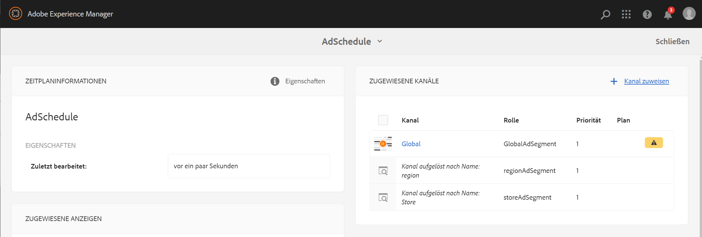

1. **Konfigurieren Sie die dynamische eingebettete Sequenz für den Kanal „Global“.**

   Navigieren Sie zum **Global** Der ursprünglich im Abschnitt **Demo** Projekt.

   Klicks **Bearbeiten** in der Aktionsleiste aus.

   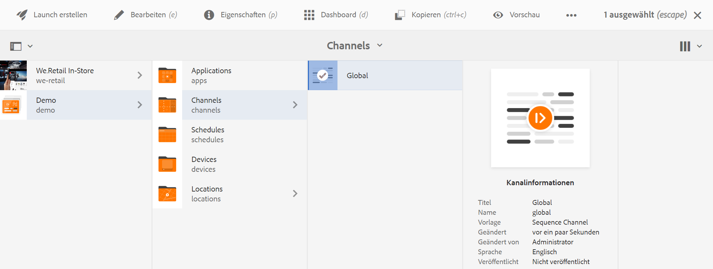

   Ziehen Sie im Editor zwei **Dynamische eingebettete Sequenz** Komponenten im Kanaleditor.

   Öffnen Sie die Eigenschaften einer der Komponenten und geben Sie die **Kanalzuordnungsrolle** als **RegionAdSegment** ein.

   Klicken Sie auf die anderen Komponenten und öffnen Sie die Eigenschaften, um die **Kanalzuordnungsrolle** as **StoreAdSegment**.

   

1. **Zuweisen eines Zeitplans zu jeder Anzeige**

   1. Navigieren Sie zu jeder Anzeige, z. B. **Demo** > **Standorte** > **Region A** >**Store 1** >**`Store1Display`**.
   1. Klicks **Dashboard** in der Aktionsleiste aus.
   1. Klicken Sie im Dashboard auf **...** aus dem **ZUGEWIESENE KANÄLE UND ZEITPLÄNE** und klicken Sie dann auf **+Zeitplan zuweisen**.
   1. Klicken Sie auf den Pfad zum Zeitplan (hier beispielsweise **Demo** > **Zeitpläne** > **AdSchedule**).
   1. Klicken Sie auf **Speichern**.

## Anzeigen der Ergebnisse {#viewing-the-results}

Wenn Sie die Einrichtung für Kanäle und die Anzeige abgeschlossen haben, starten Sie den AEM Screens-Player, um den Inhalt anzuzeigen.

>[!NOTE]
>
>Weitere Informationen zum AEM Screens Player finden Sie in den folgenden Ressourcen:
>
>* [AEM Screens-Player herunterladen](https://download.macromedia.com/screens/)
>* [Arbeiten mit dem AEM Screens-Player](working-with-screens-player.md)

Die folgende Ausgabe bestätigt Ihren Kanalinhalt im AEM Screens Player, je nach Anzeigepfad.

**Szenario 1**:

Wenn Sie den Anzeigepfad als **Demo** > **Standorte** > **Region A** > **Store 1** > **`Store1Display`**, wird der folgende Inhalt auf Ihrem AEM Screens-Player angezeigt.

**Szenario 1**:

Wenn Sie den Anzeigepfad als **Demo** > **Standorte** > **Region B** > **Store 3** > **`Store3Display`**, wird der folgende Inhalt auf Ihrem AEM Screens-Player angezeigt.

## Einschränken von Benutzern und Ändern der ACLs {#restricting-users-and-modifying-the-acls}

Sie können globale, regionale oder lokale Autoren erstellen, die für sie relevante Inhalte bearbeiten, während sie gleichzeitig von der Bearbeitung von Kanälen weiter oben in der Hierarchie ausgeschlossen sind.

Bearbeiten Sie die ACLs, damit Sie den Zugriff des Benutzers auf den Inhalt auf Grundlage seines Standorts einschränken können.

### Anwendungsbeispiel {#example-use-case}

Im folgenden Beispiel können Sie drei Benutzer für das obige Demo-Projekt erstellen.

Die Berechtigungen werden jeder Gruppe wie folgt zugewiesen:

**Gruppen**:

* **Global-Autor**: Besteht aus Benutzern, die Zugriff auf alle Standorte und Kanäle im Projekt **Demo** haben und über alle Lese-, Schreib- und Bearbeitungsberechtigungen verfügen.

* **Region-Autor**: Besteht aus Benutzern, die Lese-, Schreib- und Bearbeitungsberechtigungen für **Region A** und **Region B** besitzen.

* **Store-Autor**: Besteht aus Benutzern, die nur über Lese-, Schreib- und Bearbeitungsberechtigungen für **Store 1**, **Store 2**, **Store 3** und **Store 4** verfügen.

#### Schritte zum Erstellen von Benutzergruppen, Benutzern und Einrichten von ACLs {#steps-for-creating-user-groups-users-and-setting-up-acls}

>[!NOTE]
>
>Detaillierte Informationen zum Trennen von Projekten mithilfe von ACLs, sodass jede Person oder jedes Team ein eigenes Projekt erhält, finden Sie unter **Einrichten von ACLs**.

Gehen Sie wie folgt vor, um Gruppen und Benutzer zu erstellen und die ACLs gemäß den Berechtigungen zu ändern:

1. **Gruppen erstellen**

   1. Navigieren Sie zu **Adobe Experience Manager**.
   1. Klicks **Instrumente** > **Sicherheit** > **Gruppen**.
   1. Klicken Sie auf **Gruppe erstellen** und geben Sie **Global-Autor** in **ID** ein.
   1. Klicken Sie auf **Speichern und schließen**.

   Erstellen Sie auf ähnliche Weise zwei weitere Gruppen wie **Region-Autor** und **Store-Autor**.

   

1. **Benutzer erstellen und Gruppen Benutzer hinzufügen**

   1. Navigieren Sie zu **Adobe Experience Manager**.
   1. Klicken Sie auf **Tools** > **Sicherheit** > **Benutzer**.
   1. Klicken Sie auf **Benutzer erstellen** und geben Sie **Global-Benutzer** in **ID** ein.
   1. Eingabe **Passwort** und bestätigen Sie das Kennwort für diesen Benutzer.
   1. Klicken Sie auf **Gruppen** und geben Sie den Gruppennamen in **Gruppe auswählen** eingeben. **Global-Autor** hinzugefügt werden **Global-User** zu dieser spezifischen Gruppe.
   1. Klicken Sie auf **Speichern und schließen**.

   Erstellen Sie auf ähnliche Weise zwei weitere Benutzer wie **Region-Benutzer** und **Store-User** und fügen Sie sie zu **Region-Autor** und **Store-Autor** bzw.

   >[!NOTE]
   >Es empfiehlt sich, Benutzer einer Gruppe hinzuzufügen und dann den einzelnen Benutzergruppen Berechtigungen zuzuweisen.

   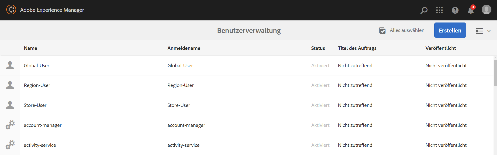

1. **Alle Gruppen zu den Mitwirkenden hinzufügen**

   1. Navigieren Sie zu **Adobe Experience Manager**.
   1. Klicks **Instrumente** > **Sicherheit** > **Gruppen**.
   1. Klicks **Mitarbeiter** aus der Liste aus und klicken Sie auf die Schaltfläche **Mitglieder** Registerkarte.
   1. Klicken Sie auf **Gruppe** wie **Global-Autor**, **Region-Autor,** und **Store-Autor** an Beitragende.
   1. Klicken Sie auf **Speichern und schließen**.

1. **Auf die Berechtigungen für jede Gruppe zugreifen**

   1. Navigieren Sie zum *Benutzeradministrator* und verwenden Sie diese Benutzeroberfläche, um die Berechtigungen für verschiedene Gruppen zu ändern.
   1. Suchen Sie nach **Global-Autor** und klicken Sie auf **Berechtigungen** wie in der folgenden Abbildung dargestellt.
   1. Ebenso können Sie auf die Berechtigungen für **Region-Autor** und **Store-Autor** zugreifen.

   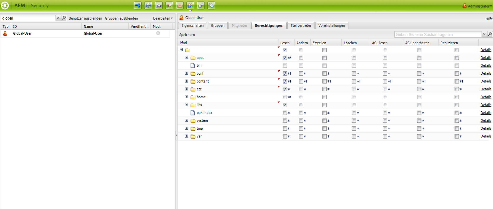

1. **Berechtigungen für jede Gruppe ändern**

   **Für Global-Autor:**

   1. Navigieren Sie zur Registerkarte **Berechtigungen**
   1. Navigieren Sie zu ***/content/screens/demo*** und aktivieren Sie alle Berechtigungen.
   1. Navigieren Sie zu ***/content/screens/demo/locations*** und aktivieren Sie alle Berechtigungen.
   1. Navigieren Sie zu ***/content/screens/demo/locations/region-a*** und aktivieren Sie alle Berechtigungen. Überprüfen Sie auf ähnliche Weise die Berechtigungen für **`region-b`**.

   In der folgenden Abbildung werden die Schritte beschrieben:
   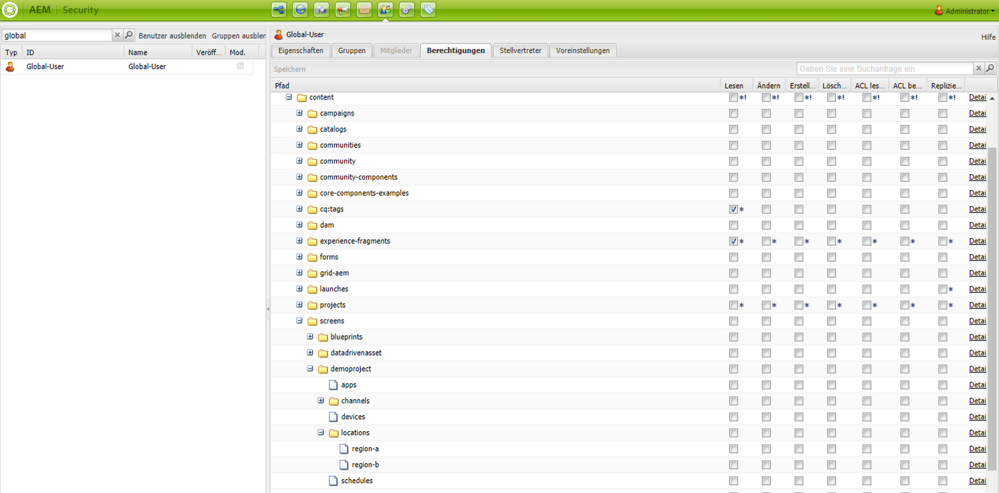

   Im Folgenden wird gezeigt, dass die Variable **Global-User** hat Zugriff auf **Globaler Kanal**. Und der Zugriff auf beide **Region A** und **Region B** mit allen vier Geschäften: **Store 1**, **Store 2**, **Store 3**, und **Store 4**.

   

   **Für Region-Autor:**

   1. Navigieren Sie zur Registerkarte **Berechtigungen**.
   1. Navigieren Sie zu ***/content/screens/demo*** und aktivieren Sie nur die **Leseberechtigungen**.
   1. Navigieren Sie zu ***/content/screens/demo/locations*** und aktivieren Sie nur die **Leseberechtigungen**.
   1. Navigieren Sie zu ***/content/screens/demo/channels*** und deaktivieren Sie die Berechtigungen **Global** -Kanal.
   1. Navigieren Sie zu ***/content/screens/demo/locations***/***region-a*** und aktivieren Sie alle Berechtigungen. Überprüfen Sie auf ähnliche Weise die Berechtigungen für **`region-b`**.

   Sehen Sie sich die folgende Abbildung an, damit Sie die Schritte verstehen können:

   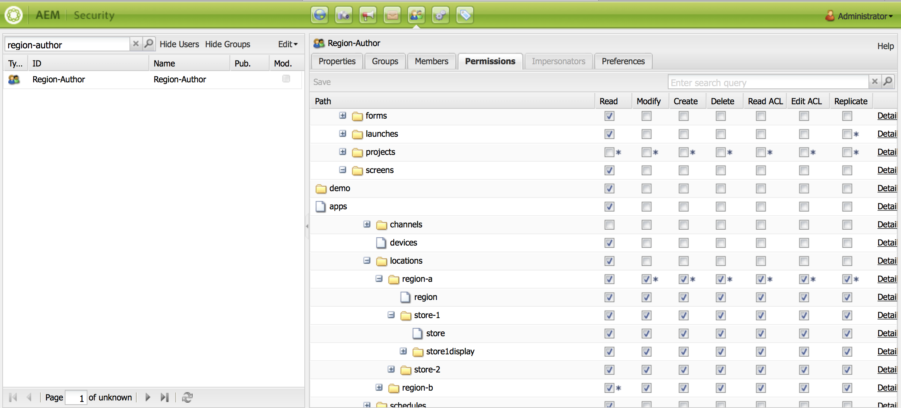

   Die folgende Abbildung zeigt, dass Region-Benutzer Zugriff auf beide **Region A** und **Region B**. Und der Zugriff auf alle vier Stores, nämlich **Store 1**, **Store 2**, **Store 3**, und **Store 4**, aber nicht auf die **Global** Kanal.

   

   **Für Store-Autor:**

   1. Navigieren Sie zur Registerkarte **Berechtigungen**.
   1. Navigieren Sie zu ***/content/screens/demo*** und aktivieren Sie nur die **Leseberechtigungen**.
   1. Navigieren Sie zu ***/content/screens/demo/locations*** und aktivieren Sie nur die **Leseberechtigungen**.
   1. Navigieren Sie zu ***/content/screens/demo/channels*** und deaktivieren Sie die Berechtigungen **Global** -Kanal.
   1. Navigieren Sie zu ***/content/screens/demo/locations/region-a*** und aktivieren Sie nur die **Leseberechtigungen**. Ebenso sollten Sie nur die **Lesen** Berechtigungen für **`region-b`**.
   1. Navigieren Sie zu ***/content/screens/demo/locations***/***region-a /store-1*** und aktivieren Sie alle Berechtigungen. Prüfen Sie auf ähnliche Weise die Berechtigungen für **store-2, store-3** und **store-4**.

   Sehen Sie sich die folgende Abbildung an, damit Sie die Schritte verstehen können:

   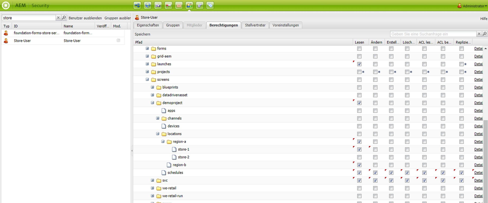

   Im Folgenden wird gezeigt, dass die Variable **Store-User** hat nur Zugriff auf **Store 1**, **Store 2**, **Store 3**, und **Store 4**. Sie verfügt jedoch nicht über Berechtigungen für den Zugriff auf die **Global** oder Region (**Region A** und **Region B**).

   

>[!NOTE]
>
>Ausführliche Informationen zum Einrichten von Berechtigungen finden Sie unter [Einrichten von ACLs](setting-up-acls.md).
