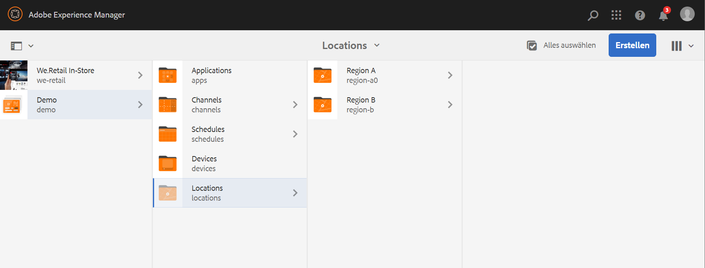

# Verwenden dynamischer eingebetteter Sequenzen {#using-dynamic-embedded-sequence}

Die Verwendung dynamischer eingebetteter Sequenzen umfasst die folgenden Themen:

* **Überblick**
* **Verwenden eines dynamischen eingebetteten Erlebnisses in AEM Screens**
* **Anzeigen der Ergebnisse**
* **Einschränken von Benutzern und Ändern der ACLs**

## Überblick {#overview}

***Dynamische eingebettete Sequenzen*** werden für große Projekte erstellt, die einer über- und untergeordneten Hierarchie folgen. Dabei wird der untergeordnete Knoten in einem Standortordner und nicht in einem Kanalordner referenziert. Benutzer können so eine Sequenz nach ***Kanalrolle*** in einen Kanal einbetten. Damit lassen sich auf Benutzerseite standortspezifische Platzhalter für verschiedene Büros mithilfe einer eingebetteten Sequenz innerhalb eines Hauptkanals definieren.

Beim Zuweisen eines Kanals zu einer Anzeige haben Sie die Möglichkeit, den Pfad der Anzeige anzugeben. Alternativ können Sie die Rolle des Kanals eingeben, die entsprechend dem Kontext zu einem tatsächlichen Kanal führt.

Um die dynamische eingebettete Sequenz zu verwenden, weisen Sie einen Kanal nach ***Kanalrolle*** zu. In „Kanalrolle“ wird der Kontext der Anzeige definiert. Die Rolle kann durch verschiedene Aktionen festgelegt werden und ist unabhängig vom eigentlichen Kanal, der der Rolle entspricht. In diesem Abschnitt wird ein Anwendungsfall beschrieben, wo Kanäle nach Rollen definiert werden. Außerdem erfahren Sie, wie Sie diesen Inhalt für einen globalen Kanal nutzen können. Sie können sich die Rolle auch als ID für die Zuweisung oder als Alias für den Kanal im jeweiligen Kontext vorstellen.

### Vorteile der Verwendung dynamischer eingebetteter Sequenzen {#benefits-of-using-dynamic-embedded-sequences}

Die Platzierung eines Sequenzkanals innerhalb eines Standorts anstelle des Kanalordners gibt lokalen oder regionalen Autorinnen und Autoren die Möglichkeit, Inhalte zu bearbeiten, die für sie relevant sind.  Außerdem können dadurch Kanäle weiter oben in der Hierarchie bearbeitet werden.

Der Verweis auf einen *Kanal nach Rolle* ermöglicht die Erstellung einer lokalen Version eines Kanals. Auf diese Weise werden standortspezifische Inhalte dynamisch aufgelöst. Außerdem können Sie einen globalen Kanal erstellen, der die Inhalte der standortspezifischen Kanäle verwendet.

>[!NOTE]
>
>**Eingebettete Sequenzen im Vergleich zu dynamischen eingebetteten Sequenzen**
>
>Eine dynamische eingebettete Sequenz ist mit einer eingebetteten Sequenz vergleichbar. Sie unterscheidet sich allerdings dahingehend, dass die Benutzerin oder der Benutzer einer Hierarchie folgen kann, bei der Änderungen/Aktualisierungen an einem Kanal auf einen anderen, in Bezug stehenden Kanal übertragen werden. Sie folgt einer über- und untergeordneten Hierarchie und umfasst zudem Assets wie Bilder und Videos.
>
>Mit ***dynamischen eingebetteten Sequenzen*** können Sie standortspezifische Inhalte anzeigen, während ***eingebettete Sequenzen*** nur eine allgemeine Diashow der Inhalte anzeigen. Außerdem müssen Sie beim Einrichten der dynamischen eingebetteten Sequenzen den Kanal mit Kanalrolle und Kanalname konfigurieren. Führen Sie zur Implementierung die folgenden Schritte aus:
>
>Weitere Infos zur Implementierung von eingebetteten Sequenzen finden Sie unter [Eingebettete Sequenzen](embedded-sequences.md) in AEM Screens.

Das folgende Beispiel zeigt eine Lösung mit Konzentration auf die folgenden Schlüsselbegriffe:

* einen ***Hauptsequenzkanal*** für die globale Sequenz.
* Komponenten einer ***dynamischen eingebetteten Sequenz*** für jeden lokal anpassbaren Teil der Sequenz,
* ***einzelne Sequenzkanäle*** an den jeweiligen Standorten mit einer *Rolle* in der Anzeige, die der *Rolle&#x200B;*** der &#x200B;** Komponente der dynamischen eingebetteten Sequenz entspricht.

>[!NOTE]
>
>Weitere Informationen zur Kanalzuweisung finden Sie unter **[Kanalzuweisung](channel-assignment.md)** im Abschnitt zur Inhaltserstellung der AEM Screens-Dokumentation.

## Verwenden dynamischer eingebetteter Sequenzen {#using-dynamic-embedded-sequence-2}

Im folgenden Abschnitt wird die Erstellung einer dynamischen eingebetteten Sequenz in einem AEM Screens-Kanal erläutert.

### Voraussetzungen {#prerequisites}

Bevor Sie mit der Implementierung dieser Funktionalität beginnen, stellen Sie sicher, dass Sie die folgenden Voraussetzungen erfüllen, um mit der Implementierung dynamischer eingebetteter Sequenzen beginnen zu können:

* Erstellen eines AEM Screens-Projekts (in diesem Beispiel **Demo**).
* Erstellen Sie einen Kanal als **Global** im Ordner **Kanäle**.
* Hinzufügen von Inhalten zu Ihrem Kanal **Global** (*Überprüfen Sie **Resources.zip**&#x200B;für relevante Assets*)

Die folgende Abbildung zeigt das Projekt **Demo** mit dem Kanal **Global** im Ordner **Kanäle**.

### Ressourcen {#resources}

Sie können die folgenden Ressourcen (Bilder) herunterladen (und zu Assets hinzufügen) und diese als Kanalinhalt für Demonstrationszwecke weiterverwenden.

[Datei abrufen](assets/resources.zip)

>[!NOTE]
>
>Weitere Informationen zum Erstellen eines Projekts und zum Erstellen eines Sequenzkanals finden Sie in den folgenden Ressourcen:
>
>* **[Erstellen und Verwalten von Projekten](creating-a-screens-project.md)**
>* **[Verwalten eines Kanals](managing-channels.md)**
>

Die Implementierung einer dynamischen eingebetteten Sequenz in einem AEM Screens-Projekt umfasst drei Hauptaufgaben:

1. **Einrichten des Klassifikationsschemas des Projekts, einschließlich Kanälen, Standorten und Anzeigen**
1. **Erstellen eines Zeitplans**
1. **Zuweisen eines Zeitplans zu jeder Anzeige**

Gehen Sie wie folgt vor, um die Funktion zu implementieren:

>[!CAUTION]
>
>Achten Sie bei der Implementierung dynamischer eingebetteter Sequenzen auf die Felder **Name** und **Titel**, während Sie Kanäle unter jedem Standort erstellen. Befolgen Sie die Hinweise zur Nomenklatur sorgfältig.

1. **Erstellen Sie zwei Standortordner.**

   Navigieren Sie im AEM Screens-Projekt zu Ihrem Ordner **Standorte** und erstellen Sie zwei Standortordner: **Region A** und **Region B**.

   >[!NOTE]
   >
   >Achten Sie beim Erstellen des Ordners **Region A** darauf, den **Titel** als **Region A** einzugeben und das Feld **Name** leer zu lassen. Damit wird automatisch der Name **region-a** übernommen.
   >
   >Ähnlich verhält es sich mit der Erstellung des Standortordners **Region B**:

   

   >[!NOTE]
   >Informationen zum Erstellen eines Standorts finden Sie unter **[Erstellen und Verwalten von Standorten](managing-locations.md)**.

1. **Erstellen Sie unter jedem Standortordner zwei Standorte und einen Kanal.**

   1. Navigieren Sie zu **Demo** > **Standorte** > **Region A**.
   1. Klicken Sie auf **Region A** und dann in der Aktionsleiste auf **+ Erstellen**.
   1. Klicken Sie im Assistenten auf **Standort** und legen Sie **Store 1** als **Titel** fest. Erstellen Sie auf ähnliche Weise einen weiteren Standort im Assistenten mit **Store 2** als **Titel**.**&#x200B;** Sie können das Feld **Name** leer lassen, während Sie **Store 1** und **Store 2** erstellen.
   1. Wiederholen Sie Schritt (b) und klicken Sie nun im Assistenten auf **Sequenz-Kanal**. Geben Sie **Region A** als **Titel** und **region** als **Namen** für diesen Kanal ein.

   >[!CAUTION]
   >
   >Wenn Sie den Kanal **Region A** erstellen, geben Sie **Region A** als **Titel** und **region** als **Namen** ein.

   

   Erstellen Sie auf ähnliche Weise zwei Standorte unter **Region B** mit den Titeln **Store 3** und **Store 4**. Erstellen Sie außerdem einen **Sequenzkanal**, für den Sie als **Titel** den Wert **Region B** und als **Name** den Wert **region** wählen.

   >[!CAUTION]
   >
   >Achten Sie darauf, dass Sie denselben Namen für die Kanäle verwenden können, die in **Region A** und **Region B** als **region** erstellt wurden.

   

1. **Erstellen Sie eine Anzeige und einen Kanal unter jedem Standort.**

   1. Navigieren Sie zu **Demo** > **Standorte** > **Region A** > **Store 1**.
   1. Klicken Sie auf **Store 1** und dann in der Aktionsleiste auf **+ Erstellen**.
   1. Klicken Sie im Assistenten auf **Anzeigen** und erstellen Sie **`Store1Display`**.
   1. Wiederholen Sie Schritt (b) und klicken Sie nun im Assistenten auf **Sequenz-Kanal**. Geben Sie unter **Titel** den Wert **`Store1Channel`** und unter **Name** den Wert **store** ein.

   >[!CAUTION]
   >
   >Bei der Erstellung eines Sequenzkanals ist es wichtig, dass der **Titel** des Kanals Ihren Anforderungen entspricht. Der **Name** sollte jedoch in allen lokalen Kanälen gleich sein.
   >In diesem Beispiel teilen die Kanäle unter **Region A** und **Region B** den **Namen** **region** und die Kanäle unter **`Store 1`**, **`Store 2`**, **`Store 3`**, und **`Store 4`** teilen den **Namen** **store**.

   

   Erstellen Sie eine Anzeige als **`Store2Display`** und einen Kanal **`Store2Channel`** unter **`Store `2** (mit dem Namen **store**).

   >[!NOTE]
   >Stellen Sie sicher, dass Sie denselben Namen für die Kanäle verwenden können, die in **`Store 1`** und **`Store 2`** als **store** erstellt wurden.

   

   Führen Sie die vorherigen Schritte aus, damit Sie einen Kanal erstellen und in **`Store 3`** und **`Store 4`** unter **Region B** anzeigen können. Auch hier ist darauf zu achten, dass Sie unter **Name** denselben Wert **store** verwenden, während Sie die Kanäle **`Store3Channel`** bzw. **`Store4Channel`** erstellen.

   Die folgende Abbildung zeigt die Anzeige und den Kanal im **`Store 3`**.

   

   Die folgende Abbildung zeigt die Anzeige und den Kanal im **`Store 4`**.

   

1. **Fügen Sie den Kanälen an ihren jeweiligen Standorten Inhalt hinzu.**

   Navigieren Sie zu **Demo** > **Standorte** > **Region A** > **Region A** und klicken Sie in der Aktionsleiste auf **Bearbeiten**. Ziehen Sie die Assets, die Sie hinzufügen möchten, in Ihren Kanal.

   >[!NOTE]
   >Sie können die Datei ***Resources.zip*** im Abschnitt **Ressourcen** verwenden, um die Bilder als Assets für Ihren Kanalinhalt zu verwenden.

   

   Navigieren Sie zu **Demo** > **Standorte** > **Region B** > **Region B** und klicken Sie in der Aktionsleiste auf **Bearbeiten**, um die Assets in Ihren Kanal zu ziehen, wie nachfolgend gezeigt:

   

   Folgen Sie den vorherigen Schritten und den Ressourcen, um Inhalte zu den folgenden Kanälen hinzuzufügen:

   * **`Store1Channel`**
   * **`Store2Channel`**
   * **`Store3Channel`**
   * **`Store4Channel`**

1. **Erstellen eines Zeitplans**

   Navigieren Sie in Ihrem AEM Screens-Projekt zum Ordner **Zeitpläne** und klicken Sie darauf. Klicken Sie dann in der Aktionsleiste auf **Erstellen**.

   Das folgende Bild zeigt den **AdSchedule**, der im Projekt **Demo** erstellt wurde.

   

1. **Weisen Sie einem Zeitplan Kanäle zu**

   1. Navigieren Sie zu **Demo** > **Zeitpläne** > **AdSchedule** und klicken Sie in der Aktionsleiste auf **Dashboard**.
   1. Klicken Sie auf **+ Kanal zuweisen** im Bedienfeld **ZUGEWIESENE KANÄLE**, damit Sie das Dialogfeld **Kanalzuweisung** öffnen können.
   1. Klicken Sie als Vorgehensweise für **Kanal referenzieren** auf die Option „Pfad“.
   1. Wählen Sie den **Kanalpfad** als **Demo** > ***Kanäle*** > ***Global***.
   1. Geben Sie die **Kanalrolle** als **GlobalAdSegment** ein.
   1. Wählen Sie **Unterstützte Ereignisse** als **Erster Ladevorgang**, **Bildschirm bei Untätigkeit** und **Benutzerinteraktion**.
   1. Klicken Sie auf **Speichern**.

   **Kanal nach Rolle für die Region zuweisen:**

   1. Klicken Sie im Bedienfeld **ZUGEWIESENE KANÄLE** auf **+ Kanal zuweisen**.
   1. Klicken Sie im Dialogfeld „Kanalzuweisung“ auf die Option **Referenzkanal** nach Namen.
   1. Geben Sie unter **Kanalname** den Wert **region** ein.
   1. Geben Sie als **Kanalrolle** den Wert **RegionAdSegment** ein.
   1. Klicken Sie auf **Speichern**.

   **Kanal nach Rolle für den Store zuweisen:**

   1. Klicken Sie im Bedienfeld **ZUGEWIESENE KANÄLE** auf **+ Kanal zuweisen**.
   1. Klicken Sie im Dialogfeld „Kanalzuweisung“ auf die Option **Referenzkanal** nach Namen.
   1. Geben Sie den **Kanalnamen** als **store** ein.
   1. Geben Sie als **Kanalrolle** den Wert **StoreAdSegment** ein.
   1. Klicken Sie auf **Speichern**.

   Die folgende Abbildung zeigt die zugewiesenen Kanäle nach Pfad und Rolle.

   

1. **Konfigurieren Sie die dynamische eingebettete Sequenz für den Kanal „Global“.**

   Navigieren Sie zum Kanal **Global**, den Sie ursprünglich im Projekt **Demo** erstellt haben.

   Klicken Sie in der Aktionsleiste auf **Erstellen**. 

   

   Ziehen Sie im Editor zwei Komponenten der **dynamischen eingebetteten Sequenz** in den Kanaleditor.

   Öffnen Sie die Eigenschaften einer der Komponenten und geben Sie die **Kanalzuordnungsrolle** als **RegionAdSegment** ein.

   Klicken Sie in gleicher Weise auf die anderen Komponenten und öffnen Sie die Eigenschaften, um die **Kanalzuordnungsrolle** als **StoreAdSegment** einzugeben.

   

1. **Zuweisen eines Zeitplans zu jeder Anzeige**

   1. Navigieren Sie zur jeweiligen Anzeige, z. B. **Demo** > **Standorte** > **Region A** > **Store 1** >**`Store1Display`**.
   1. Klicken Sie in der Aktionsleiste auf **Dashboard**.
   1. Klicken Sie im Dashboard auf **…** im Bedienfeld **ZUGEWIESENE KANÄLE UND ZEITPLÄNE** und klicken Sie dann auf **+ Zeitplan zuweisen**.
   1. Klicken Sie auf den Pfad zum Zeitplan (z. B. **Demo** > **Zeitpläne** > **AdSchedule**).
   1. Klicken Sie auf **Speichern**.

## Anzeigen der Ergebnisse {#viewing-the-results}

Wenn Sie die Einrichtung für die Kanäle und die Anzeige abgeschlossen haben, starten Sie den AEM Screens-Player, um den Inhalt anzuzeigen.

>[!NOTE]
>
>Weitere Informationen zum AEM Screens-Player finden Sie in den folgenden Ressourcen:
>
>* [Herunterladen des AEM Screens-Players](https://download.macromedia.com/screens/)
>* [Arbeiten mit dem AEM Screens-Player](working-with-screens-player.md)

Die folgende Ausgabe bestätigt Ihren Kanalinhalt im AEM Screens-Player, je nach Anzeigepfad.

**Szenario 1**:

Wenn Sie den Anzeigepfad als **Demo** > **Standorte** > **Region A** > **Store 1** > **`Store1Display`** zuweisen, wird der folgende Inhalt in Ihrem AEM Screens-Player angezeigt.

**Szenario 1**:

Wenn Sie den Anzeigepfad als **Demo** > **Standorte** > **Region B** > **Store 3** > **`Store3Display`** zuweisen, wird der folgende Inhalt im AEM Screens-Player angezeigt.

## Einschränken von Benutzern und Ändern der ACLs {#restricting-users-and-modifying-the-acls}

Sie können globale, regionale oder lokale Autorinnen und Autoren erstellen, die für sie relevante Inhalte bearbeiten, während sie gleichzeitig von der Bearbeitung von Kanälen weiter oben in der Hierarchie ausgeschlossen sind.

Bearbeiten Sie die ACLs, damit Sie den Zugriff von Benutzenden auf Inhalte je nach ihrem Standort einschränken können.

### Anwendungsbeispiel {#example-use-case}

Im folgenden Beispiel können Sie drei Benutzende für das obige Projekt „Demo“ erstellen.

Die Berechtigungen werden jeder Gruppe wie folgt zugewiesen:

**Gruppen**:

* **Global-Autor**: Besteht aus Benutzern, die Zugriff auf alle Standorte und Kanäle im Projekt **Demo** haben und über alle Lese-, Schreib- und Bearbeitungsberechtigungen verfügen.

* **Region-Autor**: Besteht aus Benutzern, die Lese-, Schreib- und Bearbeitungsberechtigungen für **Region A** und **Region B** besitzen.

* **Store-Autor**: Besteht aus Benutzern, die nur über Lese-, Schreib- und Bearbeitungsberechtigungen für **Store 1**, **Store 2**, **Store 3** und **Store 4** verfügen.

#### Schritte zum Erstellen von Benutzergruppen, Benutzenden und Einrichten von ACLs {#steps-for-creating-user-groups-users-and-setting-up-acls}

>[!NOTE]
>
>Detaillierte Informationen dazu, wie Sie Projekte mithilfe von ACLs trennen, damit jede Einzelperson oder jedes Team ein eigenes Projekt handhabt, finden Sie unter **Einrichten von ACLs**.

Führen Sie die folgenden Schritte aus, um Gruppen und Benutzende zu erstellen und die ACLs gemäß den Berechtigungen zu ändern:

1. **Gruppen erstellen**

   1. Navigieren Sie zu **Adobe Experience Manager**.
   1. Klicken Sie auf **Tools** > **Sicherheit** > **Gruppen**.
   1. Klicken Sie auf **Gruppe erstellen** und geben Sie **Global-Autor** in **ID** ein.
   1. Klicken Sie auf **Speichern und schließen**.

   Erstellen Sie auf ähnliche Weise zwei andere Gruppen, z. B **„Region** Autor“ und **Store-Autor**.

   

1. **Benutzer erstellen und Gruppen Benutzer hinzufügen**

   1. Navigieren Sie zu **Adobe Experience Manager**.
   1. Klicken Sie auf **Tools** > **Sicherheit** > **Benutzer**.
   1. Klicken Sie **Benutzer erstellen** und geben Sie dann unter **ID** &quot;**-User** ein.
   1. Geben Sie ein **Kennwort** ein und bestätigen Sie das Kennwort für dieses Benutzerprofil.
   1. Klicken Sie auf die Registerkarte **Gruppen** und geben Sie den Gruppennamen unter **Gruppe auswählen** ein. Geben Sie beispielsweise **Global-Autor** ein, um dieser Gruppe **Global-Benutzer** hinzuzufügen.
   1. Klicken Sie auf **Speichern und schließen**.

   Erstellen Sie auf ähnliche Weise zwei andere Benutzer, z. B **„Region** und **Store-User**, und fügen Sie sie **Region-Autor** und **Store-Autor** hinzu.

   >[!NOTE]
   >Es empfiehlt sich, Benutzer einer Gruppe hinzuzufügen und dann den einzelnen Benutzergruppen Berechtigungen zuzuweisen.

   

1. **Alle Gruppen zu den Mitwirkenden hinzufügen**

   1. Navigieren Sie zu **Adobe Experience Manager**.
   1. Klicken Sie auf **Tools** > **Sicherheit** > **Gruppen**.
   1. Klicken Sie in der Liste auf **Mitwirkende** und dann auf die Registerkarte **Mitglieder**.
   1. Klicken Sie auf die **Gruppe**, z. B. **Global-Autor**, **Region-Autor** oder **Store-Autor**, für die Mitwirkenden.
   1. Klicken Sie auf **Speichern und schließen**.

1. **Auf die Berechtigungen für jede Gruppe zugreifen**

   1. Navigieren Sie zur *Benutzerverwaltung* und ändern Sie mithilfe dieser Benutzeroberfläche die Berechtigungen für die verschiedenen Gruppen.
   1. Suchen Sie nach **Global-Autor** und klicken Sie auf die Registerkarte **Berechtigungen**, wie in der Abbildung unten dargestellt.
   1. Ebenso können Sie auf die Berechtigungen für **Region-Autor** und **Store-Autor** zugreifen.

   

1. **Berechtigungen für jede Gruppe ändern**

   **Für Global-Autor:**

   1. Navigieren Sie zur Registerkarte **Berechtigungen**
   1. Navigieren Sie zu ***/content/screens/demo*** und aktivieren Sie alle Berechtigungen.
   1. Navigieren Sie zu ***/content/screens/demo/locations*** und aktivieren Sie alle Berechtigungen.
   1. Navigieren Sie zu ***/content/screens/demo/locations/region-a*** und aktivieren Sie alle Berechtigungen. Überprüfen Sie auf ähnliche Weise die Berechtigungen für **`region-b`**.

   Informationen zu den nächsten Schritten finden Sie in den folgenden Abbildungen:
   

   Im Folgenden wird gezeigt, dass der **Global-User** Zugriff auf den **globalen Kanal** hat. Und Zugriff auf **Region A** und **Region B** mit allen vier Stores: **Store 1**, **Store 2**, **Store 3** und **Store 4**.

   

   **Für Region-Autor:**

   1. Navigieren Sie zur Registerkarte **Berechtigungen**.
   1. Navigieren Sie zu ***/content/screens/demo*** und aktivieren Sie nur die **Leseberechtigungen**.
   1. Navigieren Sie zu ***/content/screens/demo/locations*** und aktivieren Sie nur die **Leseberechtigungen**.
   1. Navigieren Sie zu ***/content/screens/demo/channels*** und deaktivieren Sie die Berechtigungen für den Kanal **Global**.
   1. Navigieren Sie zu ***/content/screens/demo/locations***/***region-a*** und aktivieren Sie alle Berechtigungen. Überprüfen Sie auf ähnliche Weise die Berechtigungen für **`region-b`**.

   Sehen Sie sich die folgende Abbildung an, damit Sie die Schritte verstehen können:

   

   Die folgende Abbildung zeigt, dass der Region-User Zugriff auf **Region A** und **Region B** hat. Er hat ebenfalls Zugriff auf alle vier Stores, nämlich **Store 1**, **Store 2**, **Store 3** und **Store 4**, aber nicht auf den **globalen** Kanal.

   

   **Für Store-Autor:**

   1. Navigieren Sie zur Registerkarte **Berechtigungen**.
   1. Navigieren Sie zu ***/content/screens/demo*** und aktivieren Sie nur die **Leseberechtigungen**.
   1. Navigieren Sie zu ***/content/screens/demo/locations*** und aktivieren Sie nur die **Leseberechtigungen**.
   1. Navigieren Sie zu ***/content/screens/demo/channels*** und deaktivieren Sie die Berechtigungen für den Kanal **Global**.
   1. Navigieren Sie zu ***/content/screens/demo/locations/region-a*** und aktivieren Sie nur die **Leseberechtigungen**. Prüfen Sie ebenso nur die **Leseberechtigungen** für **`region-b`**.
   1. Navigieren Sie zu ***/content/screens/demo/locations***/***region-a /store-1*** und aktivieren Sie alle Berechtigungen. Prüfen Sie auf ähnliche Weise die Berechtigungen für **store-2, store-3** und **store-4**.

   Sehen Sie sich die folgende Abbildung an, damit Sie die Schritte verstehen können:

   

   Die folgende Abbildung zeigt, dass der **Store-User** nur Zugriff auf **Store 1**, **Store 2**, **Store 3** und **Store 4** hat. Er verfügt jedoch nicht über Berechtigungen für den Zugriff auf die Kanäle **Global** oder Region (**Region A** und **Region B**).

   

>[!NOTE]
>
>Ausführliche Informationen zum Einrichten von Berechtigungen finden Sie unter [Einrichten von ACLs](setting-up-acls.md).
