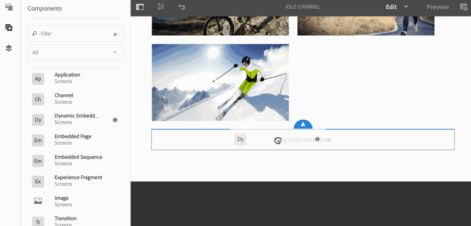

# Eingebettete Sequenzen {#embedded-sequences}

Mithilfe ***eingebetteter Sequenzen*** für Kanäle können Benutzende Komponenten im übergeordneten Kanal hinzufügen sowie Inhalte von einem anderen Kanal wiederverwenden und in den übergeordneten Kanal einbetten.

## Hinzufügen von eingebetteten Sequenzen {#adding-embedded-sequences}

Sie haben die Möglichkeit, die folgenden Komponenten zu Ihrem Sequenzkanal hinzuzufügen:

* Eingebettete Sequenz
* Dynamische eingebettete Sequenz

>[!NOTE]
>
>Weitere Informationen zum Verwenden anderer Komponenten in Ihrem Screens-Projekt finden Sie unter [Hinzufügen von Komponenten zu einem Kanal](adding-components-to-a-channel.md).

### Hinzufügen einer eingebetteten Sequenz {#adding-an-embedded-sequence}

Sie können Ihrem Kanal eine eingebettete Sequenz hinzufügen. Bei einer eingebetteten Sequenz handelt es sich um einen weiteren Kanal mit Assets wie Bildern oder Videos. Durch Hinzufügen einer eingebetteten Sequenz können Benutzer die Sequenz über den ***Kanalpfad*** in einen Kanal aufnehmen.

>[!NOTE]
>Der ***Kanalpfad ***definiert einen expliziten Verweis zum Kanal.
>Weitere Informationen zum *Kanalpfad* finden Sie in „Inhaltserstellung in Screens“ unter [Kanalzuweisung](channel-assignment.md).

Gehen Sie wie folgt vor, um Ihrem Kanal eine eingebettete Sequenz hinzuzufügen:

1. Klicken Sie auf den Kanal, in den Sie eine Seite einbetten möchten. z. B. **`We.Retail`In-Store** > **Kanäle** > **Idle Channel**.

1. Klicken Sie in der Aktionsleiste auf **Bearbeiten**. 
1. Klicken Sie im Editor-Modus in der linken Seitenleiste auf das Symbol &quot;Komponenten&quot;, damit Sie die eingebettete Seite hinzufügen können. Ziehen Sie die **eingebettete Sequenz** in den Editor.
1. Doppelklicken Sie auf die Komponente **Eingebettete Sequenz**, um den Kanal Ihrem ursprünglichen Sequenz-Kanal hinzuzufügen.
1. Klicken Sie auf **Kanalpfad** des Kanals.
1. Klicken Sie auf **Dauer (Millisekunden)** für Ihren eingebetteten Kanal im **Sequenz** Registerkarte. Standardmäßig ist die Dauer auf **-1** eingestellt. Dies bedeutet, dass der eingebettete Kanal vollständig ausgeführt wird. Wenn Benutzende eine Dauer angeben, wird die Teilsequenz zur angegebenen Zeit unterbrochen (d. h. abgetrennt).

1. Legen Sie die **gemessene Wiedergabestrategie** auf **normal** fest.

Standardmäßig ist diese auf **normal** eingestellt. Ist der Wert auf **normal** (Alle Elemente abspielen) eingestellt, wird die Teilsequenz bei jedem Zyklus der übergeordneten Sequenz vollständig ausgeführt. Der andere mögliche Wert lautet **Einzelnes Element abspielen**. Dieser Wert zeigt nur ein Element der Teilsequenz bei jeder Ausführung an. Beispielsweise das erste Element bei der ersten Schleife und das zweite Element bei der zweiten Schleife.

>[!IMPORTANT]
>
>Weisen Sie den in der eingebetteten Sequenz verwendeten Kanal derselben Anzeige zu.
>
>Führen Sie die folgenden Schritte aus, nachdem Sie Ihrem Kanal aus den vorangegangenen Schritten eine eingebettete Sequenz hinzugefügt haben:
>
>1. Navigieren Sie zur Anzeige und klicken Sie auf die Anzeige von **Standorte** Ordner.
>1. Klicken Sie in der Aktionsleiste auf **Dashboard**.
>1. Klicken Sie im Anzeigen-Dashboard auf **+ Kanäle zuweisen** aus dem **ZUGEWIESENE KANÄLE UND GEPLANTE BEREICHE** Sie können die **Dialogfeld &quot;Kanalzuweisung&quot;**.
>
>1. Klicken Sie auf den Pfad des Kanals, in dem Sie (in eingebetteter Sequenz) **Kanalpfad**.
>1. Stellen Sie sicher, dass die **Priorität** niedriger als die des Hauptkanals ist.
>
>1. Klicken Sie nicht auf **Unterstützte Ereignisse**.
>1. Klicks **Speichern** wann geschehen.
>

Im folgenden Beispiel sehen Sie, wie eine eingebettete Sequenz (**Idle Channel – Night**) einem bereits vorhandenen Kanal (**Idle Channel**) hinzugefügt wird.

### Hinzufügen einer dynamischen eingebetteten Sequenz {#adding-a-dynamic-embedded-sequence}

Sie können Ihrem Kanal eine dynamische eingebettete Sequenz hinzufügen.  Eine dynamische eingebettete Sequenz ist mit einer eingebetteten Sequenz vergleichbar. Sie unterscheidet sich allerdings dahingehend, dass Benutzende einer Hierarchie folgen können, bei der Änderungen/Aktualisierungen an einem Kanal auf einen anderen, in Bezug stehenden Kanal übertragen werden. Sie folgt einer Hierarchie und umfasst zudem Assets wie Bilder und Videos. Durch Aufnahme einer dynamischen Sequenz kann der Benutzer einen Kanal anhand der Kanalrolle hinzufügen.

>[!NOTE]
>
>Die ***Kanalrolle*** definiert den Kontext der Anzeige.
>
>Weitere Informationen zur *Kanalrolle* finden Sie in „Inhaltserstellung in Screens“ unter [Kanalzuweisung](channel-assignment.md).

Gehen Sie wie folgt vor, um Ihrem Kanal eine eingebettete Sequenz hinzuzufügen:

1. Klicken Sie auf den Kanal, in den Sie eine dynamische Sequenz einbetten möchten. z. B. **`We.Retail`In-Store** > **Kanäle** > **Idle Channel**.

1. Klicken Sie in der Aktionsleiste auf **Bearbeiten**. 
1. Klicken Sie im Editor-Modus in der linken Seitenleiste auf das Symbol &quot;Komponenten&quot;, damit Sie die dynamische eingebettete Sequenz hinzufügen können. Ziehen Sie die Komponente **Dynamische** **eingebettete Sequenz** per Drag-and-Drop in den Editor.

1. Doppelklicken Sie auf die Komponente **Dynamische** **eingebettete Sequenz**, um die Seite Ihrem Sequenzkanal hinzuzufügen.

1. Geben Sie die **Kanalzuordnungsrolle** ein.
1. Legen Sie die **gemessene Wiedergabestrategie** auf **normal** fest. Standardmäßig ist diese auf **normal** eingestellt. Ist der Wert auf **normal** (Alle Elemente abspielen) eingestellt, wird die Teilsequenz bei jedem Zyklus der übergeordneten Sequenz vollständig ausgeführt. Der andere mögliche Wert lautet **Einzelnes Element abspielen**. Dieser Wert zeigt nur ein Element der Teilsequenz bei jeder Ausführung an. Beispielsweise das erste Element bei der ersten Schleife und das zweite Element bei der zweiten Schleife.

1. Klicken Sie auf **Dauer (Millisekunden)** in **Sequenz** für Ihren eingebetteten Kanal in der Sequenz.

