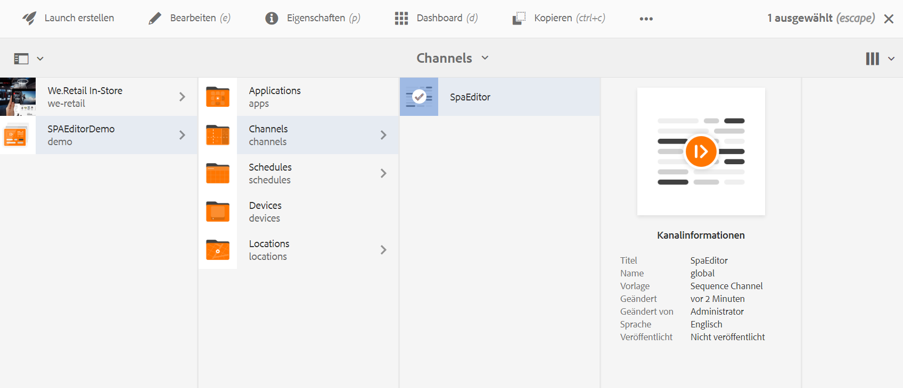
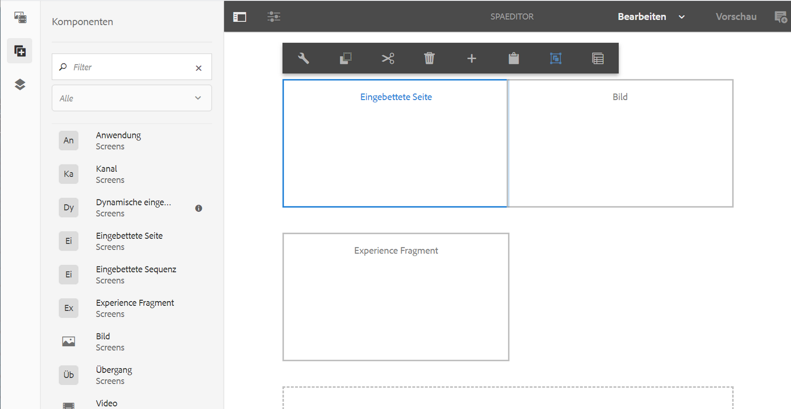

# Einbetten einer REACT-Anwendung mit dem AEM SPA Editor und Integration mit AEM Screens Analytics {#embedding-a-react-application-using-the-aem-spa-editor-and-integrating-with-aem-screens-analytics}

Sie können eine interaktive Einzelseitenanwendung mit REACT (oder Angular) einbetten. Verwenden Sie dazu den AEM SPA-Editor, der von Geschäftsexperten in AEM konfiguriert wird. Sie können auch lernen, wie Sie Ihre interaktive Anwendung mit Offline-Adobe Analytics integrieren.

## Verwenden des AEM SPA Editors {#using-the-aem-spa-editor}

Gehen Sie wie folgt vor, um den AEM SPA Editor zu verwenden:

1. Klonen Sie die AEM SPA Editor-Repo unter [https://github.com/adobe/aem-spa-project-archetype.](https://github.com/adobe/aem-spa-project-archetype)

   >[!NOTE]
   >
   >Dieser Archetyp erstellt ein Adobe Experience Manager-Projekt mit minimalen Umfang als Ausgangspunkt für Ihre eigenen SPA-Projekte. Die Eigenschaften, die bei Verwendung dieses Archetyps angegeben werden müssen, ermöglichen es Ihnen, alle Teile dieses Projekts beliebig zu benennen.

1. Gehen Sie wie folgt vor, um ein AEM Archetypprojekt SPA Editor zu erstellen:

   ```
   mvn clean install archetype:update-local-catalog
   mvn archetype:crawl
   
   mvn archetype:generate \
   -DarchetypeCatalog=internal \
   -DarchetypeGroupId=com.adobe.cq.spa.archetypes \
   -DarchetypeArtifactId=aem-spa-project-archetype \
   -DarchetypeVersion=1.0.3-SNAPSHOT \
   ```

   >[!NOTE]
   >
   >Diese Dokumentation verwendet die **GroupId** as ***com.adobe.aem.screens*** und **ArtifactId** as ***Meine SPA*** (Standardeinstellung). Sie können nach Bedarf Ihre eigenen Parameter auswählen.

1. Nachdem das Projekt erstellt wurde, verwenden Sie entweder eine IDE oder einen Editor Ihrer Wahl und importieren Sie das generierte Maven-Projekt.
1. Stellen Sie in Ihrer lokalen AEM-Instanz mit dem Befehl ***mvn clean install -PautoInstallPackage*** bereit.

### Bearbeiten von Inhalten in der REACT-App {#editing-content-in-the-react-app}

Bearbeiten von Inhalten in der REACT-App:

1. Navigieren Sie zu `https://localhost:4502/editor.html/content/mysamplespa/en/home.html` (ersetzen Sie ggf. den Hostnamen, Port und Projektnamen).
1. Sie sollten den Text bearbeiten können, der in der Anwendung „Hello World“ angezeigt wird.

### Hinzufügen der interaktiven REACT-App zu AEM Screens {#adding-the-interactive-react-app-to-aem-screens}

Gehen Sie wie folgt vor, um die interaktive REACT-App zu AEM Screens hinzuzufügen:

1. Erstellen Sie ein AEM Screens-Projekt. Siehe [Erstellen und Verwalten von Projekten](creating-a-screens-project.md) für weitere Details.
1. Erstellen Sie eine **Anwendungskanal** (vorzugsweise) (oder 1x1-Vorlage oder Mehrzonen-Kanal) im **Kanäle** Ordner Ihres AEM Screens-Projekts.

   >[!NOTE]
   >**Sequenzkanäle** für diesen Anwendungsfall nicht empfohlen werden, da sie von Natur aus mit einer Diashow-Logik im Konflikt mit der interaktiven Natur des Erlebnisses stehen.
   >Siehe [Erstellen und Verwalten von Kanälen](managing-channels.md) für weitere Details.

1. Bearbeiten Sie einen beliebigen Sequenzkanal und ziehen Sie eine eingebettete Seitenkomponente per Drag-and-Drop.

   Siehe [Hinzufügen von Komponenten zu Kanälen](adding-components-to-a-channel.md) für weitere Details.

   >[!NOTE]
   >
   >Stellen Sie sicher, dass Sie beim Zuweisen des Kanals zur Anzeige das Benutzerinteraktionsereignis hinzufügen.

1. Auswählen **Bearbeiten** in der Aktionsleiste, damit Sie die Eigenschaften des Kanals bearbeiten können.

   

1. Ziehen Sie die **Eingebettete Seite** Komponente verwenden oder die vorhandene Komponente in einem Anwendungskanal wiederverwenden und die Startseite unter der Anwendung mysamplespa auswählen, z. B. ***/content/mysamplespa/en/home***.

   

1. Weisen Sie den Kanal einer Anzeige zu.

   >[!NOTE]
   >Stellen Sie sicher, dass Sie beim Zuweisen des Kanals zur Anzeige das Benutzerinteraktionsereignis hinzufügen.

1. Registrieren Sie einen Player für dieses Projekt, und weisen Sie ihn der Anzeige zu. Jetzt sollte Ihre interaktive Anwendung in AEM Screens ausgeführt werden.

   Siehe [Geräteregistrierung](device-registration.md) für weitere Informationen zur Registrierung eines Geräts.

## Integrieren der SPA mit Adobe Analytics mit Offline-Funktionen über AEM Screens {#integrating-the-spa-with-adobe-analytics-with-offline-capability-through-aem-screens}

Gehen Sie wie folgt vor, um die SPA mit Adobe Analytics mit Offline-Funktionen über AEM Screens zu integrieren:

1. Konfigurieren Sie Adobe Analytics in AEM Screens.

   Siehe [Konfigurieren von Adobe Analytics mit AEM Screens](configuring-adobe-analytics-aem-screens.md) Weitere Informationen zum Ausführen der Sequenzierung in Adobe Analytics mit AEM Screens und zum Senden benutzerdefinierter Ereignisse mit Offline-Adobe Analytics.

1. Bearbeiten Sie Ihre React-App in der IDE/dem Editor Ihrer Wahl (insbesondere die Textkomponente oder eine andere Komponente, die Sie zum Ausgeben von Ereignissen verwenden möchten).
1. Fügen Sie beim Ereignis select oder einem anderen Ereignis, das bzw. das Sie für Ihre Komponente erfassen möchten, die Analyseinformationen mithilfe des Standarddatenmodells hinzu.

   Siehe [Konfigurieren von Adobe Analytics mit AEM Screens](configuring-adobe-analytics-aem-screens.md) für weitere Details.

1. Rufen Sie die AEM Screens Analytics-API auf, damit Sie das Ereignis offline speichern und in Bursts an Adobe Analytics senden können.

   Beispiel:

   ```
   handleClick() {
       if ((window.parent) && (window.parent.CQ) && (window.parent.CQ.screens) && (window.parent.CQ.screens.analytics))
       {
           var analyticsEvent = {};
           analyticsEvent['event.type'] = 'play'; // Type of event
    analyticsEvent['event.coll_dts'] = new Date().toISOString(); // Start of collecting the event
    analyticsEvent['event.dts_start'] = new Date().toISOString(); // Event start
    analyticsEvent['content.type'] = 'Washing machine'; // Mime Type or product category
    analyticsEvent['content.action'] = 'Path to the washing machine asset in AEM'; // Path in AEM to relevant asset
    analyticsEvent['trn.product'] = 'Washing machine Model number'; // Product being explored
    analyticsEvent['trn.amount'] = 1000; // Product pricing or other numeric value or weight
    analyticsEvent['event.dts_end'] = new Date().toISOString(); // Event end
    analyticsEvent['event.count'] = 100; // Numeric value that may count a number of clicks or keystrokes or wait time in seconds for example
    analyticsEvent['event.value'] = 'My favorite analytics event';
           analyticsEvent['trn.quantity'] = 10; // Quantity of product selection
    analyticsEvent['event.subtype'] = 'end'; // Event subtype if applicable
    window.parent.CQ.screens.analytics.sendTrackingEvent(analyticsEvent);
       }
   }
   ```

   >[!NOTE]
   >
   >Die Player-Firmware fügt den gesendeten benutzerspezifischen Analysedaten automatisch weitere Details zum Player und seiner Laufzeitumgebung hinzu. Daher müssen Sie möglicherweise Details zu Betriebssystemen und Geräten auf niedriger Ebene erfassen, sofern dies nicht erforderlich ist. Konzentrieren Sie sich auf die Geschäftsanalysedaten.
