# Notfallkanal {#emergency-channel}

## Anwendungsfall – Beschreibung {#use-case-description}

>[!IMPORTANT]
>Dieser Inhalt gilt für AEM On-Premise/AMS (AEM 6.5LTS und AEM 6.5). Informationen zu AEM as a Cloud Service Screens-Inhalten finden Sie im [AEM as a Cloud Service-Handbuch](https://experienceleague.adobe.com/en/docs/experience-manager-cloud-service/content/screens-as-cloud-service/overview/introduction).

In diesem Abschnitt wird ein Beispiel für einen Anwendungsfall beschrieben. Der Hauptaspekt liegt auf der Erstellung und Verwaltung eines Notfallkanals, den die Inhaltsautorin oder der Inhaltsautor aus einem Sequenzkanal umschalten kann, wenn es eine Vorbedingung gibt.

### Voraussetzungen {#preconditions}

Bevor Sie mit diesem Nutzungsszenario beginnen, sollten Sie sich mit den folgenden Themen vertraut machen:

* **[Erstellen und Verwalten von Kanälen](managing-channels.md)**
* **[Erstellen und Verwalten von Standorten](managing-locations.md)**
* **[Erstellen und Verwalten von Zeitplänen](managing-schedules.md)**
* **[Geräteregistrierung](device-registration.md)**

### Hauptakteure {#primary-actors}

Autoren von Inhalten

## Grundlegender Ablauf: Einrichten des Projekts {#basic-flow-setting-up-the-project}

Gehen Sie wie folgt vor, um einen Notfallkanal einzurichten:

1. Erstellen Sie ein AEM Screens-Projekt mit dem Namen **EmergencyChannel**, wie unten dargestellt.

   >[!NOTE]
   >Weitere Informationen zum Erstellen und Verwalten von Projekten in AEM Screens finden Sie unter „Erstellen eines Projekts“.

   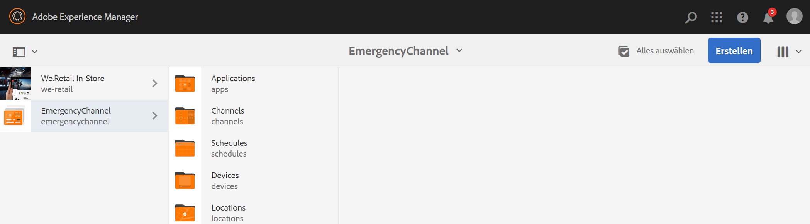

1. **Erstellen eines Sequenzkanals**

   1. Klicken Sie auf den Ordner **Kanäle** und dann auf **Erstellen**.

   1. Klicken Sie im Assistenten auf **Sequenzkanal** und erstellen Sie einen Kanal mit dem Namen **MainAdChannel**.

   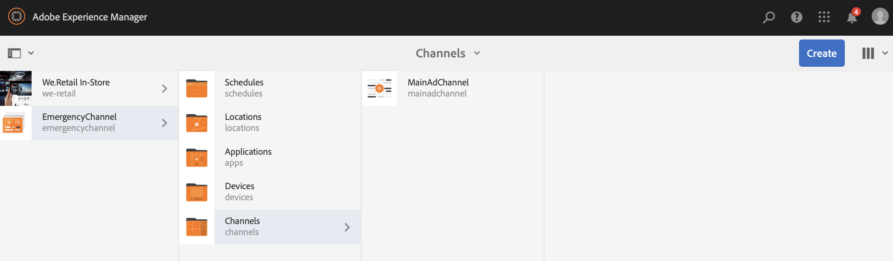

1. **Hinzufügen von Inhalten zu Sequenzkanälen**

   1. Klicken Sie auf den Kanal (**MainAdChannel**).
   1. Klicken Sie in der Aktionsleiste auf **Bearbeiten**.
   1. Ziehen Sie einige Assets per Drag-and-Drop in Ihren Kanal.

   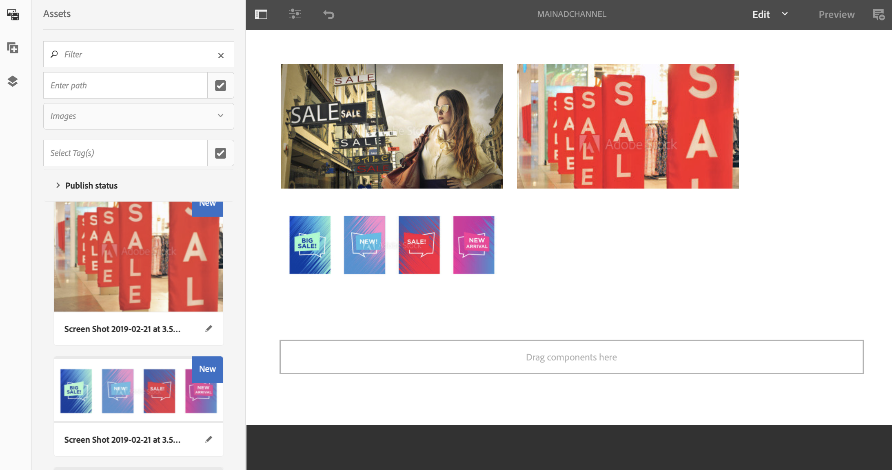

1. **Erstellen eines Notfallkanals**

   1. Klicken Sie auf den Ordner **Kanäle**.
   1. Klicken Sie auf **Erstellen**.
   1. Klicken Sie im Assistenten auf **Sequenzkanal** und erstellen Sie einen Kanal mit dem Namen **EmergencyChannel**.

   >[!NOTE]
   >
   >Normalerweise wird Ihr Notfallkanal Ihrem bereits bestehenden Produktionsprojekt hinzugefügt.

   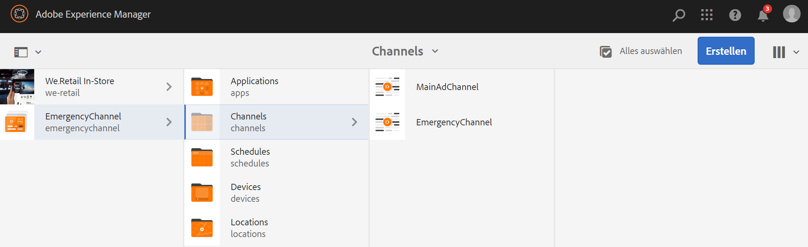

1. **Hinzufügen von Inhalten zu Notfallkanälen**

   1. Klicken Sie auf den Kanal (**Notrufkanal)**.
   1. Klicken Sie in der Aktionsleiste auf **Bearbeiten**.
   1. Ziehen Sie das Asset, das Sie im Notfall ausführen möchten, per Drag-and-Drop in Ihren Kanal.

   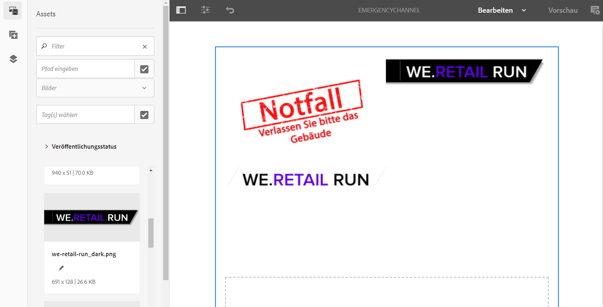

1. **Erstellen eines Standorts**

   1. Navigieren Sie zum Ordner **Standorte**.
   1. Klicken Sie in der Aktionsleiste auf **Erstellen** und erstellen Sie im Assistenten einen Standort mit dem Titel **Store**.

   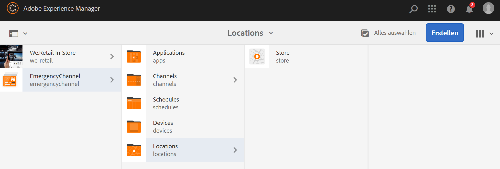

1. **Erstellen von Anzeigen für Ihren Standort**

   Navigieren Sie zu Ihrem Standort (**Store**) und klicken Sie in der Aktionsleiste auf **Erstellen**. Folgen Sie dem Assistenten und erstellen Sie zwei **Anzeigen** mit den Namen **StoreFront** und **StoreRear**.

   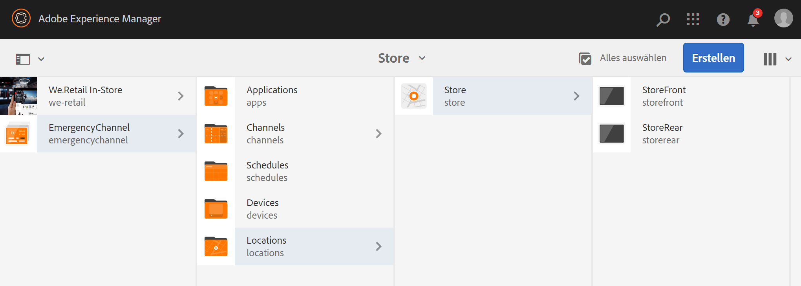

1. **Erstellen eines Zeitplans**

   1. Navigieren Sie zum Ordner **Zeitpläne**.
   1. Klicken Sie in der Aktionsleiste auf **Erstellen**.
   1. Folgen Sie den Anweisungen des Assistenten und erstellen Sie einen Zeitplan mit dem Namen **StoreSchedule**.

   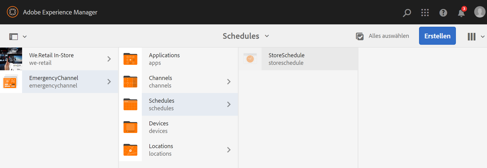

1. Weisen Sie dem Zeitplan beide Anzeigen zu und legen Sie Prioritäten fest

   1. Klicken Sie auf den Zeitplan **(StoreSchedule)** und klicken Sie in der Aktionsleiste auf **Dashboard**.

   1. Klicken Sie im Bedienfeld **ZUGEWIESENE KANÄLE** auf **+ Kanal zuweisen**.

   1. Tun Sie im Dialogfeld **Kanalzuweisung** Folgendes:

      1. Klicken Sie auf den Pfad zum **MainAdChannel**
      1. Legen Sie die **Priorität** auf „2“ fest
      1. Wählen Sie unter „Unterstützte Ereignisse“ die Optionen **Erster Ladevorgang** und **Bildschirm bei Untätigkeit**.
      1. Klicken Sie auf **Speichern**.

      Führen Sie die gleichen Schritte erneut aus, um den **EmergencyChannel** zuzuweisen und seine **Priorität** festzulegen.

   >[!NOTE]
   >
   >Die Priorität wird verwendet, um die Zuweisungen in eine Reihenfolge zu bringen, wenn es mehrere Zuweisungen gibt, die den Wiedergabekriterien entsprechen. Höhere Werte haben stets Vorrang vor niedrigeren Werten.

   

1. Klicken Sie im Bedienfeld **ZUGEWIESENE KANÄLE** auf **+ Kanal zuweisen**.

1. Tun Sie im Dialogfeld **Kanalzuweisung** Folgendes:

   1. Klicken Sie auf den Pfad zum **EmergencyChannel**
   1. Legen Sie die **Priorität** auf „1“ fest

   1. Wählen Sie unter „Unterstützte Ereignisse“ die Optionen **Erster Ladevorgang**, **Bildschirm bei Untätigkeit** und **Benutzerinteraktion**.

   1. Klicken Sie auf **Speichern**.

   

   Sie können die zugewiesenen Kanäle im Dashboard **StoreSchedule** anzeigen.

   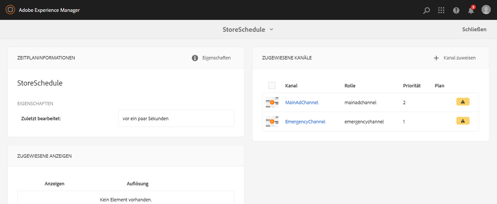

1. **Zuweisen eines Zeitplans zu jeder Anzeige**

   1. Navigieren Sie zu jeder Anzeige, z. B. **EmergencyChannel** > **Standorte** > **Store** >**StoreFront**.

   1. Klicken Sie in der Aktionsleiste auf **Dashboard**.
   1. Klicken Sie im Bedienfeld **ZUGEWIESENE KANÄLE UND ZEITPLÄNE** auf **…** und dann auf **+ Zeitplan zuweisen**.

   1. Klicken Sie auf den Pfad zum Zeitplan (hier zum Beispiel **EmergencyChannel** > **Zeitpläne** >**StoreSchedule**).

   1. Klicken Sie auf **Speichern**.

   Sie können den der Anzeige zugewiesenen Zeitplan im Dashboard **StoreSchedule** anzeigen.
   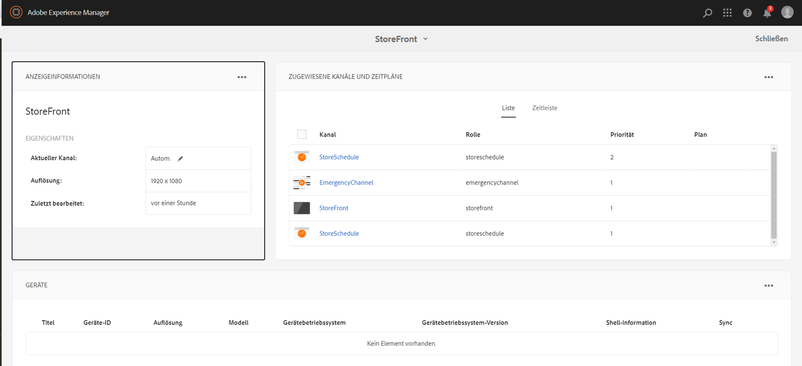

1. **Geräteregistrierung**

   Schließen Sie den Prozess zur Geräteregistrierung ab. Wenn Sie registriert sind, können Sie die folgende Ausgabe auf Ihrem AEM Screens-Player sehen.

   

## Wechseln zum Notfallkanal {#switching-to-emergency-channel}

Führen Sie im Notfall die folgenden Schritte aus:

1. Navigieren Sie zu **EmergencyChannel** > **Zeitpläne** > **StoreSchedule** und klicken Sie in der Aktionsleiste auf **Dashboard**.

   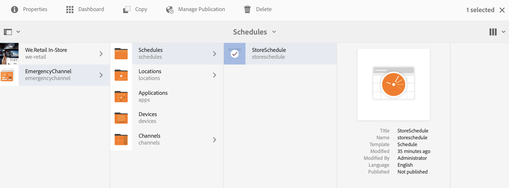

1. Klicken Sie im Dashboard **StoreSchedule** auf **EmergencyChannel** und dann auf **Zuweisung bearbeiten**.

   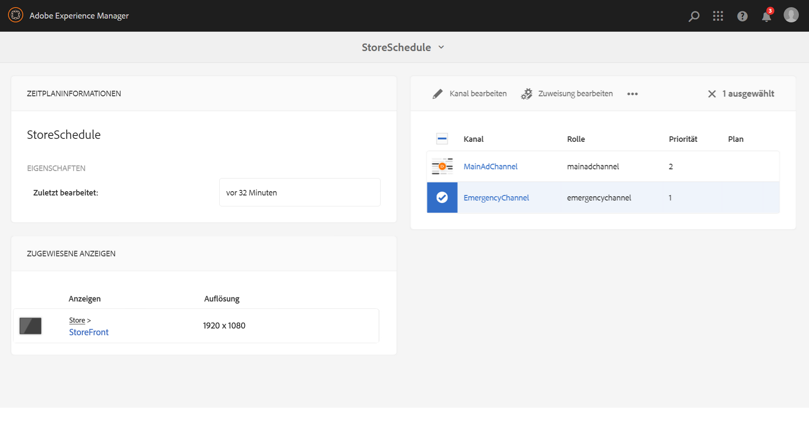

1. Aktualisieren Sie im Dialogfeld **Kanalzuweisung** die **Priorität** des **EmergencyChannel** auf **3** und klicken Sie auf **Speichern**.

   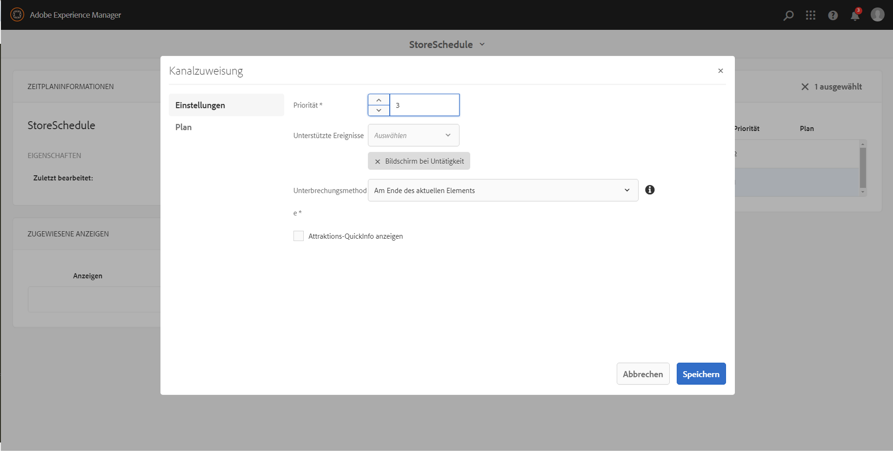

1. Wenn die Priorität des Kanals aktualisiert wird, zeigen alle AEM Screens-Player den Inhalt des **EmergencyChannel** an.

   

### Zusammenfassung {#conclusion}

Der **EmergencyChannel** zeigt seinen Inhalt so lange an, bis die Autorin bzw. der Autor des Inhalts den Prioritätswert auf 1 zurücksetzt.

Wenn die Inhaltsautorin bzw. der Inhaltsautor die Anweisung erhält, dass der Notfall behoben wurde, sollte sie bzw. er die Priorität des **MainAdChannel** aktualisieren. Hierdurch wird die normale Wiedergabe fortgesetzt.

