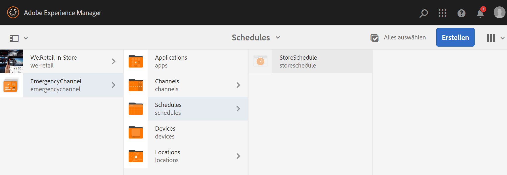

# Notfallkanal {#emergency-channel}

## Nutzungsszenario – Beschreibung {#use-case-description}

In diesem Abschnitt wird ein Nutzungsszenario beschrieben, das sich auf die Erstellung und Verwaltung eines Notfallkanals konzentriert, in den der Autor des Inhalts bei einer bestimmten Vorbedingung aus einem Sequenzkanal wechseln kann.

### Voraussetzungen {#preconditions}

Bevor Sie mit diesem Nutzungsszenario beginnen, sollten Sie sich mit den folgenden Themen vertraut machen:

* **[Erstellen und Verwalten von Kanälen](managing-channels.md)**
* **[Erstellen und Verwalten von Standorten](managing-locations.md)**
* **[Erstellen und Verwalten von Zeitplänen](managing-schedules.md)**
* **[Geräteregistrierung](device-registration.md)**

### Hauptakteure {#primary-actors}

Autoren von Inhalten

## Grundlegender Ablauf: Einrichten des Projekts {#basic-flow-setting-up-the-project}

Gehen Sie wie folgt vor, um einen Notfallkanal einzurichten:

1. Erstellen Sie ein AEM Screens-Projekt mit dem Namen **EmergencyChannel**, wie unten dargestellt.

   >[!NOTE]
   >Weitere Informationen zum Erstellen und Verwalten von Projekten in AEM Screens finden Sie unter Erstellen eines Projekts.

   

1. **Erstellen eines Sequenzkanals**

   1. Wählen Sie den Ordner **Kanäle** aus und klicken Sie auf **Erstellen**, um den Assistenten zum Erstellen eines Kanals zu öffnen.

   1. Wählen Sie im Assistenten die Option **Sequenzkanal** aus und erstellen Sie den Kanal mit dem Titel **MainAdChannel**.

   

1. **Hinzufügen von Inhalten zu Sequenzkanälen**

   1. Wählen Sie den Kanal (**MainAdChannel**) aus.
   1. Klicken Sie in der Aktionsleiste auf **Bearbeiten**, um den Editor zu öffnen. Ziehen Sie einige Assets in Ihren Kanal.

   

1. **Erstellen eines Notfallkanals**

   1. Wählen Sie den Ordner **Kanäle** aus.
   1. Klicken Sie auf **Erstellen**, um den Assistenten zum Erstellen eines Kanals zu öffnen.
   1. Wählen Sie im Assistenten die Option **Sequenzkanal** aus und erstellen Sie den Kanal mit dem Titel **EmergencyChannel**.

   >[!NOTE]
   >
   >Normalerweise wird Ihr Notfallkanal Ihrem bereits bestehenden Produktionsprojekt hinzugefügt.

   

1. **Hinzufügen von Inhalten zu Notfallkanälen**

   1. Wählen Sie den Kanal (**Notfallkanal**) aus.
   1. Klicken Sie in der Aktionsleiste auf **Bearbeiten**, um den Editor zu öffnen. Ziehen Sie das Asset, das Sie im Notfall ausführen möchten, in Ihren Kanal.

   

1. **Erstellen eines Standorts**

   1. Navigieren Sie zum Ordner **Standorte**.
   1. Klicken Sie in der Aktionsleiste auf **Erstellen** und erstellen Sie im Assistenten einen Standort mit dem Titel **Store**.

   

1. **Erstellen von Anzeigen für Ihren Standort**

   Navigieren Sie zu Ihrem Standort (**Store**) und klicken Sie in der Aktionsleiste auf **Erstellen**. Führen Sie den Assistenten aus, um zwei **Anzeigen** mit dem Titel **StoreFront** und **StoreRear** zu erstellen.

   

1. **Erstellen eines Zeitplans**

   1. Navigieren Sie zum Ordner **Zeitpläne**.
   1. Klicken Sie in der Aktionsleiste auf **Erstellen**. Führen Sie den Assistenten aus, um einen Zeitplan mit dem Titel **StoreSchedule** zu erstellen.

   

1. Weisen Sie dem Zeitplan beide Anzeigen zu und legen Sie Prioritäten fest

   1. Wählen Sie den Zeitplan **(StoreSchedule)** aus und klicken Sie in der Aktionsleiste auf **Dashboard**.

   1. Klicken Sie im Bedienfeld **ZUGEWIESENE KANÄLE** auf **+ Kanal zuweisen**.

   1. Wählen Sie im Dialogfeld **Kanalzuweisung** Folgendes aus:

      1. Wählen Sie den Pfad zum **MainAdChannel** aus
      1. Legen Sie die **Priorität** auf „2“ fest
      1. Wählen Sie unter „Unterstützte Ereignisse“ die Optionen **Erster Ladevorgang** und **Bildschirm bei Untätigkeit**.
      1. Klicken Sie auf **Speichern**.

      In ähnlicher Weise müssen Sie dieselben Schritte wiederholen, um den **EmergencyChannel** zuzuweisen und seine **Priorität** festzulegen.

   >[!NOTE]
   >
   >Mit „Priorität“ können Zuweisungen geordnet werden, falls mehrere die Wiedergabekriterien erfüllen. Höhere Werte haben stets Vorrang vor niedrigeren Werten.

   

1. Klicken Sie im Bedienfeld **ZUGEWIESENE KANÄLE** auf **+ Kanal zuweisen**.

1. Wählen Sie im Dialogfeld **Kanalzuweisung** Folgendes aus:

   1. Wählen Sie den Pfad zum **EmergencyChannel** aus
   1. Legen Sie die **Priorität** auf „1“ fest

   1. Wählen Sie unter „Unterstützte Ereignisse“ die Optionen **Erster Ladevorgang**, **Bildschirm bei Untätigkeit** und **Benutzerinteraktion**.

   1. Klicken Sie auf **Speichern**.

   

   Sie können die zugewiesenen Kanäle im Dashboard **StoreSchedule** anzeigen.

   

1. **Zuweisen eines Zeitplans zu jeder Anzeige**

   1. Navigieren Sie zur jeweiligen Anzeige, z. B. **EmergencyChannel** > **Standorte** > **Store** >**StoreFront**.

   1. Klicken Sie in der Aktionsleiste auf **Dashboard**, um das Anzeigen-Dashboard zu öffnen.
   1. Klicken Sie auf **...** im Bedienfeld **ZUGEWIESENE KANÄLE UND ZEITPLÄNE** und klicken Sie auf **+ Zeitplan zuweisen**.

   1. Wählen Sie den Pfad zum Zeitplan aus (hier beispielsweise **EmergencyChannel** > **Zeitpläne** >**StoreSchedule**).

   1. Klicken Sie auf **Speichern**.

   Sie können den der Anzeige zugewiesenen Zeitplan im Dashboard **StoreSchedule** anzeigen.
   

1. **Geräteregistrierung**

   Schließen Sie die Geräteregistrierung ab. Sobald Sie sich registriert haben, wird die folgende Ausgabe auf Ihrem AEM Screens-Player angezeigt.

   

## Wechseln zum Notfallkanal {#switching-to-emergency-channel}

Führen Sie im Notfall die folgenden Schritte aus:

1. Navigieren Sie zu **EmergencyChannel** > **Zeitpläne** > **StoreSchedule** und wählen **Dashboard** in der Aktionsleiste aus.

   

1. Wählen Sie **EmergencyChannel** aus dem Dashboard **StoreSchedule** und klicken Sie auf **Zuweisung bearbeiten**.

   

1. Aktualisieren Sie im Dialogfeld **Kanalzuweisung** die **Priorität** des **EmergencyChannel** auf **3** und klicken Sie auf **Speichern**.

   

1. Sobald die Priorität des Kanals aktualisiert wurde, zeigen alle AEM Screens-Player den Inhalt von **EmergencyChannel** an, wie unten dargestellt.

   

### Zusammenfassung {#conclusion}

Der **EmergencyChannel** zeigt seinen Inhalt weiterhin an, bis der Autor des Inhalts den Prioritätswert auf „1“ zurücksetzt.

Sobald der Autor des Inhalts die Anweisungen erhalten hat, dass der Notfall behoben wurde, sollte er die Priorität von **MainAdChannel** aktualisieren, wodurch die normale Wiedergabe fortgesetzt wird.
