# Verwenden von Experience Fragments {#using-experience-fragments}

Auf dieser Seite werden die folgenden Themen behandelt:

* **Überblick**
* **Verwenden von Experience Fragments in AEM Screens**
* **Übertragen von Änderungen auf die Seite**

## Überblick {#overview}

Ein ***Experience Fragment*** ist eine Gruppe aus einer oder mehreren Komponenten (einschließlich Inhalt und Layout), die innerhalb von Seiten referenziert werden können. Experience Fragments können beliebige Komponenten enthalten, z. B. eine oder mehrere Komponenten, die beliebige Elemente innerhalb eines Absatzsystems enthalten können, die in das gesamte Erlebnis referenziert oder von einem dritten Endpunkt angefordert werden.

## Verwenden von Experience Fragments in AEM Screens {#using-experience-fragments-in-aem-screens}

>[!NOTE]
>Das folgende Beispiel verwendet **`We.Retail`** als Demoprojekt, von dem aus das Experience Fragment von einem **Sites** zu einem AEM Screens-Projekt hinzugefügt.

Der folgende Workflow veranschaulicht beispielsweise die Verwendung von Experience Fragments aus `We.Retail` in Sites. Sie können eine Webseite auswählen und diesen Inhalt in Ihrem AEM Screens-Kanal in einem Ihrer Projekte verwenden.

### Voraussetzungen {#pre-requisites}

**Erstellen eines Demoprojekts mit einem Kanal**

***Erstellen eines Projekts***

1. Um ein Projekt zu erstellen, wählen Sie **Screens-Projekt erstellen**.
1. Geben Sie **DemoProject** als Titel ein.
1. Wählen Sie **Speichern** aus.

A **DemoProject** zu Ihrer AEM Screens hinzugefügt.

***Erstellen eines Kanals***

1. Navigieren Sie zum erstellten **DemoProject** und wählen Sie den Ordner **Kanal** aus.

1. Auswählen **Erstellen** in der Symbolleiste, damit Sie den Assistenten öffnen können.
1. Wählen Sie die **Sequenzkanal** Vorlage aus dem Assistenten und wählen Sie **Nächste**.

1. Geben Sie die **Titel** as **TestChannel** und wählen **Erstellen**.

A **TestChannel** wird zu Ihrem **DemoProject**.\

### Erstellen eines Experience Fragment {#creating-an-experience-fragment}

Gehen Sie wie folgt vor, um den Inhalt aus **`We.Retail`** auf **TestChannel** in **DemoProject**.

1. **Navigieren zu einer Sites-Seite in We.Retail**

   1. Navigieren Sie zu Sites und wählen Sie **`We.Retail`** > **Vereinigte Staaten** > **englisch** > **Ausrüstung** und wählen Sie diese Seite aus, damit Sie sie als Experience Fragment für Ihren Screens-Kanal verwenden können.

   1. Auswählen **Bearbeiten** in der Aktionsleiste, damit Sie die Seite öffnen können, die Sie als Experience Fragment für Ihren Screens-Kanal verwenden möchten.

1. **Wiederverwenden des Inhalts**

   1. Wählen Sie das Fragment aus, das Sie in Ihren Kanal aufnehmen möchten.
   1. Wählen Sie das letzte Symbol rechts aus, damit Sie die **In Experience Fragment konvertieren** Dialogfeld.

   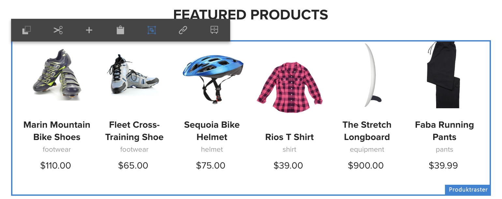

1. **Erstellen eines Experience Fragments**

   1. Wählen Sie unter **Aktion** die Option **Neues Experience Fragment erstellen** aus.

   1. Wählen Sie den **übergeordneten Pfad** aus.
   1. Wählen Sie die **Vorlage** aus. Wählen Sie hier die Vorlage **Experience Fragment - Screens-Variante** aus (Wert im Feld `/libs/settings/screens/experience-fragments/templates/experience-fragment-template-screens`).

   1. Geben Sie unter **Fragmenttitel** den Wert **ScreensFragment** ein.

   1. Um die Erstellung eines neuen Experience Fragment abzuschließen, wählen Sie das Kontrollkästchen aus.

   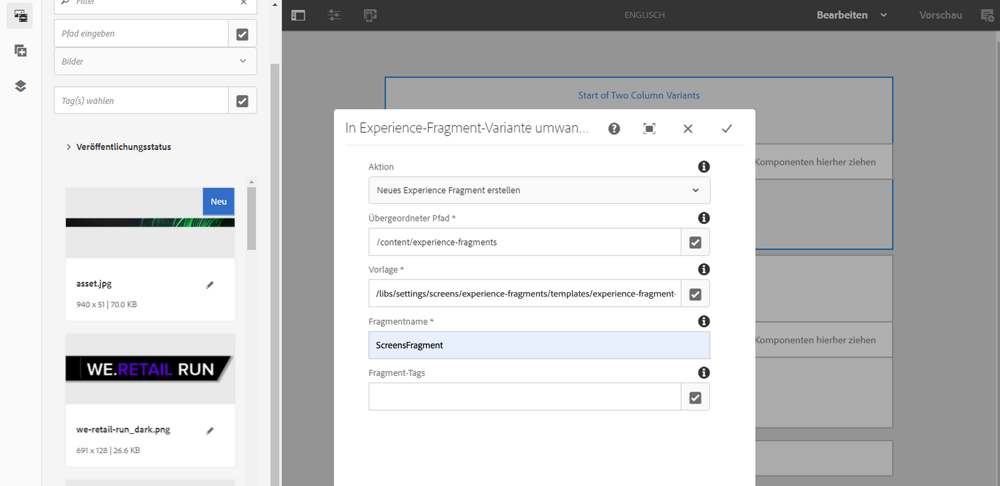

   Hinweis: Um eine einfachere Option auszuwählen, aktivieren Sie das Kontrollkästchen rechts neben dem Feld, damit Sie das Auswahldialogfeld öffnen können.

1. **Erstellen einer Live Copy des Experience Fragments**

   1. Navigieren Sie zur AEM-Homepage.
   1. Auswählen **Experience Fragments** und markieren Sie **ScreensFragment** und wählen **Variante als Live Copy**, wie in der folgenden Abbildung dargestellt:

   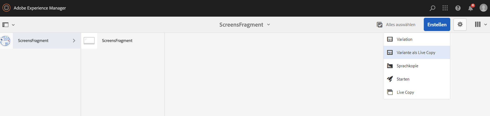

   c. Wählen Sie die **ScreensFragment** von **Erstellen einer Live Copy** Assistent und wählen Sie **Nächste**.

   d. Geben Sie unter **Titel** und unter **Namen** den Wert **Screens** ein.

   e. Wählen Sie **Erstellen** , damit Sie die Live Copy erstellen können.

   f. Wählen Sie **Fertig** , damit Sie zurück zu **ScreensFragment** Seite.

   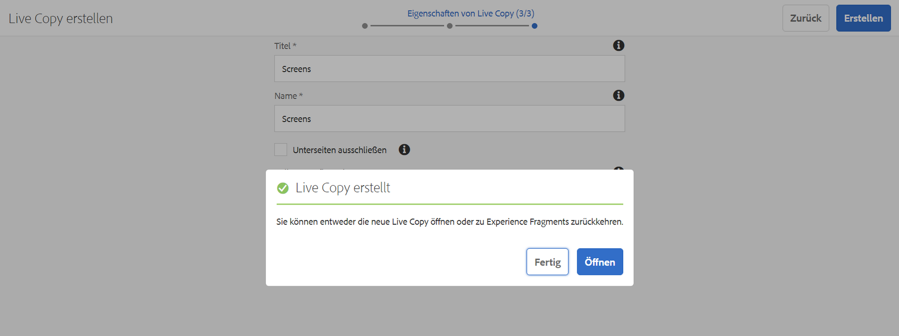

   >[!NOTE]
   >
   >Nachdem Sie ein AEM Screens-Fragment erstellt haben, können Sie die Eigenschaften des Fragments bearbeiten. Wählen Sie das Fragment aus und wählen Sie **Eigenschaften** in der Aktionsleiste aus.

   **Bearbeiten von Eigenschaften eines Screens-Fragments**

   1. Navigieren Sie zum **ScreensFragment** (die Sie in den vorherigen Schritten erstellt haben) und wählen Sie **Eigenschaften** in der Aktionsleiste aus.

   1. Wählen Sie die Registerkarte **Offline-Konfiguration** aus, wie in der Abbildung unten dargestellt.

   Sie können die **Client-seitige Bibliotheken** (Java™ und CSS) und **Statische Dateien** zu Ihrem Experience Fragment hinzu.

   Das folgende Beispiel zeigt das Hinzufügen von Client-seitigen Bibliotheken und Schriftarten als Teil statischer Dateien zu Ihrem Experience Fragment.  

1. **Verwenden des Experience Fragments als Komponente im Screens-Kanal**

   1. Navigieren Sie zum Screens-Kanal, in dem Sie das **Screens**-Fragment verwenden möchten.
   1. Wählen Sie die **TestChannel** und wählen **Bearbeiten** in der Aktionsleiste aus.

   1. Wählen Sie auf der Registerkarte Seite das Symbol Komponenten aus.
   1. Ziehen Sie das **Experience Fragment** in Ihren Kanal.

   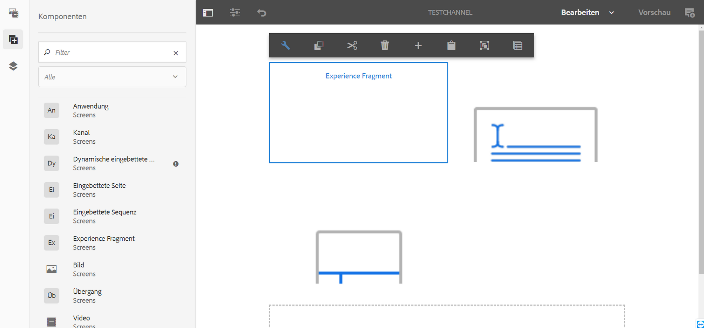

   e. Wählen Sie die **Experience Fragment** und wählen Sie das Symbol oben links (Schraubenschlüssel) aus, damit Sie die **Experience Fragment** Dialogfeld.

   f. Wählen Sie im Feld **Pfad**.die Live Copy **Screens** des Fragments aus, die Sie in *Schritt 3* erstellt haben.

   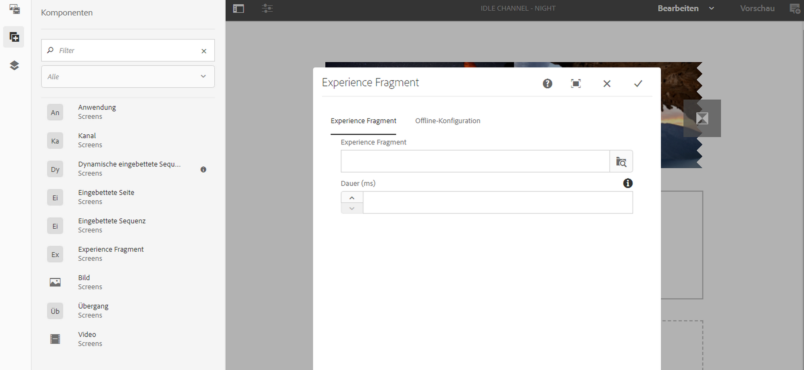

   f. Wählen Sie im Feld **Experience Fragment** die Live Copy **Screens** des Fragments aus, die Sie in *Schritt 3* erstellt haben.

   

   h. Geben Sie die Millisekunden in **Dauer** ein.

   i. Wählen Sie die **Offline-Konfiguration** aus dem **Experience Fragments** -Dialogfeld, damit Sie die clientseitigen Bibliotheken und die statischen Dateien definieren können.

   >[!NOTE]
   >
   >Um Client-seitige Bibliotheken oder statische Dateien zusätzlich zu dem hinzuzufügen, was Sie in Schritt 4 konfiguriert haben, können Sie über die **Offline-Konfiguration** im **Experience Fragment** Dialogfeld.

   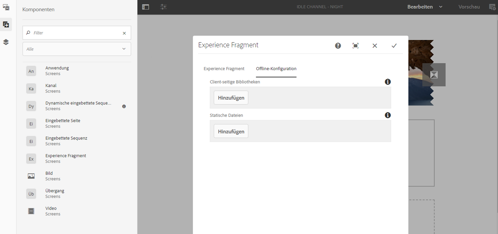

   j. Aktivieren Sie das Kontrollkästchen, damit Sie den Vorgang abschließen können.

### Validieren des Ergebnisses {#validating-the-result}

Nach Abschluss der vorherigen Schritte können Sie Ihr Experience Fragment in **ChannelOne** durch:

1. Navigieren Sie zum **TestChannel**.
1. Wählen Sie in der Aktionsleiste die **Vorschau** aus.

Anzeigen des Inhalts aus der **Sites** Seite (Live Copy des Experience Fragment) in Ihrem Kanal verwenden, wie in der folgenden Abbildung dargestellt:\
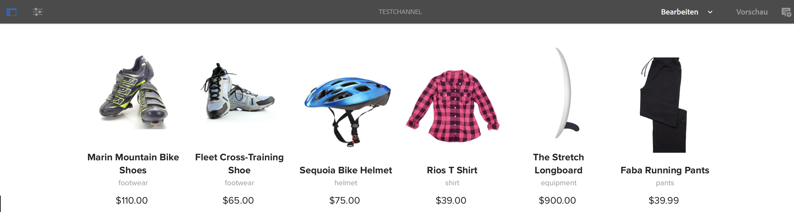

## Übertragen von Änderungen auf die Seite {#propagating-changes-from-the-master-page}

***Live Copy*** bezieht sich auf die Kopie (der Quelle), die durch Synchronisierungsaktionen aufrechterhalten wird, wie in den Rollout-Konfigurationen definiert.

Da das von Ihnen erstellte Experience Fragment eine Live Copy aus dem **Sites** und wenn Sie dieses Fragment von der primären Seite aus ändern, sehen Sie die Änderungen in Ihrem Kanal. Sie können auch das Ziel anzeigen, in dem Sie das Experience Fragment verwendet haben.

>[!NOTE]
>
>Weitere Informationen zur Live Copy finden Sie unter Wiederverwenden von Inhalten: Multisite-Manager und Live Copy .

Gehen Sie wie folgt vor, um Änderungen vom primären Kanal auf den Zielkanal zu übertragen:

1. Wählen Sie das Experience Fragment aus der **Sites** (primäre Seite) und wählen Sie das Stiftsymbol aus, damit Sie die Elemente im Experience Fragment bearbeiten können.

   

1. Wählen Sie das Experience Fragment aus und wählen Sie das Schraubenschlüsselsymbol aus, damit Sie das Dialogfeld zum Bearbeiten der Bilder öffnen können.

   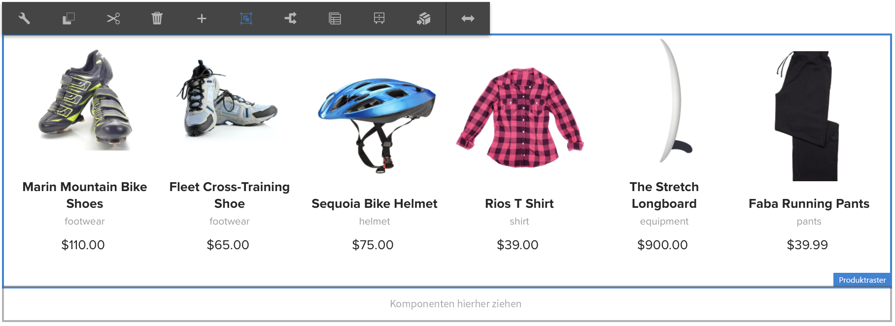

1. Das Dialogfeld **Produktraster** wird geöffnet.

   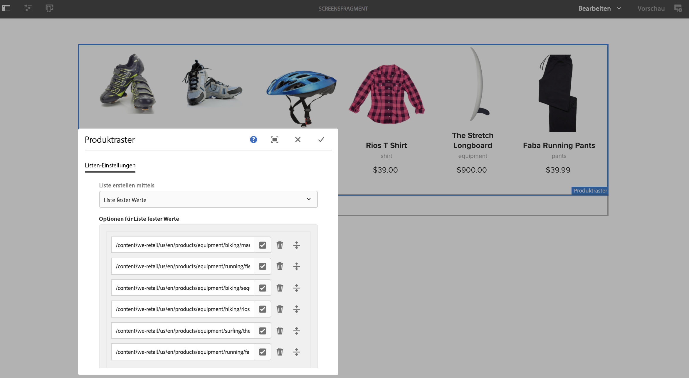

1. Sie können alle Bilder bearbeiten. Hier wird beispielsweise das erste Bild in diesem Fragment ersetzt.

   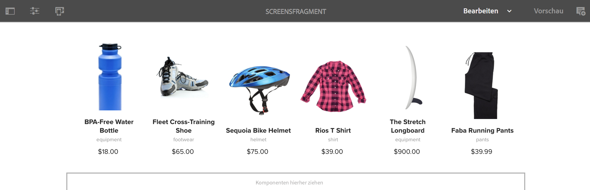

1. Wählen Sie das Experience Fragment aus und wählen Sie das Rollout -Symbol aus, damit Sie Änderungen an dem Fragment übertragen können, das in Ihrem Kanal verwendet wird.

   

1. Wählen Sie Rollout aus.

   Beachten Sie, dass die Änderungen eingeführt werden.

   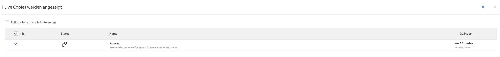

### Validieren der Änderungen {#validating-the-changes}

Gehen Sie wie folgt vor, um die Änderungen in Ihrem Kanal zu bestätigen:

1. Navigieren Sie zum **Screens** > **Kanäle** > **TestChannel**.

1. Auswählen **Vorschau** in der Aktionsleiste aus.

Die folgende Abbildung zeigt die Änderungen in Ihrem **TestChannel**:\

