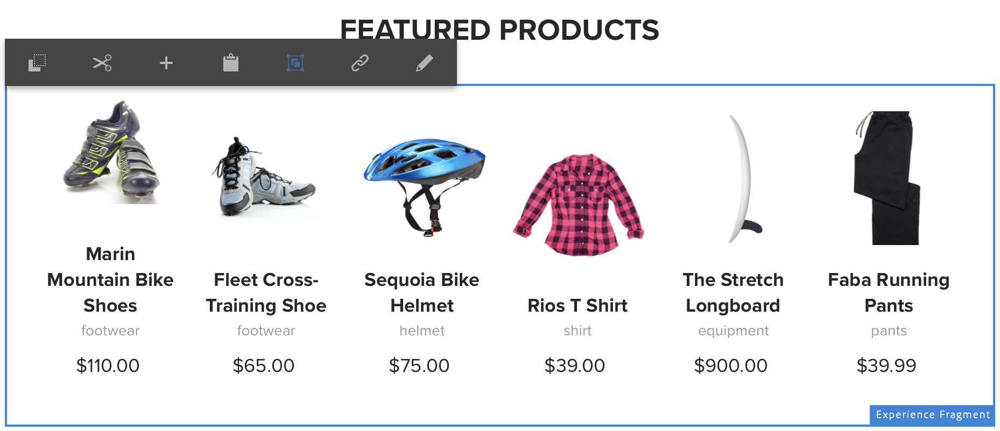

# Verwenden von Experience Fragments {#using-experience-fragments}

Auf dieser Seite werden die folgenden Themen behandelt:

* **Überblick**
* **Verwenden von Experience Fragments in AEM Screens**
* **Übertragen von Änderungen auf die Seite**

## Überblick {#overview}

Ein ***Experience Fragment*** ist eine Gruppe aus einer oder mehreren Komponenten (einschließlich Inhalt und Layout), die innerhalb von Seiten referenziert werden können. Experience Fragments können beliebige Komponenten enthalten, beispielsweise eine oder mehrere Komponenten mit beliebigen Elementen innerhalb eines Absatzsystems, das für das Gesamterlebnis referenziert oder von einem dritten Endpunkt angefordert wird.

## Verwenden von Experience Fragments in AEM Screens {#using-experience-fragments-in-aem-screens}

>[!NOTE]
>Im folgenden Beispiel wird **`We.Retail`** als Demoprojekt verwendet, bei dem das Experience Fragment von einer **Sites**-Seite auf ein AEM Screens-Projekt angewendet wird.

Der folgende Workflow veranschaulicht beispielsweise die Verwendung von Experience Fragments aus `We.Retail` in Sites. Sie können eine Web-Seite auswählen und diese Inhalte im AEM Screens-Kanal in einem Ihrer Projekte verwenden.

### Voraussetzungen {#pre-requisites}

**Erstellen eines Demoprojekts mit einem Kanal**

***Erstellen eines Projekts***

1. Um ein Projekt zu erstellen, klicken Sie auf **Screens-Projekt erstellen**.
1. Geben Sie **DemoProject** als Titel ein.
1. Klicken Sie auf **Speichern**.

AEM Screens wird ein **DemoProject** hinzugefügt.

***Erstellen eines Kanals***

1. Navigieren Sie zu dem von Ihnen erstellten **DemoProjekt** und klicken Sie auf den Ordner **Kanäle**.

1. Klicken Sie in der Aktionsleiste auf die Option **Erstellen**, um den Assistenten zu öffnen.
1. Wählen Sie im Assistenten die Vorlage **Sequenzkanal** aus und klicken Sie auf **Weiter**.

1. Geben Sie **TestChannel** als **Titel** ein und klicken Sie auf **Erstellen**.

Ein **TestChannel** wird Ihrem **DemoProject** hinzugefügt.\

### Erstellen eines Experience Fragment {#creating-an-experience-fragment}

Gehen Sie wie folgt vor, um den Inhalt von **`We.Retail`** auf Ihren **TestChannel** im **DemoProject** anzuwenden.

1. **Navigieren zu einer Sites-Seite in We.Retail**

   1. Navigieren Sie zu Sites und klicken Sie auf **`We.Retail`** > **United States** > **English** > **Equipment**. Wählen Sie dann diese Seite aus, um sie als Experience Fragment für Ihren Screens-Kanal zu verwenden.

   1. Klicken Sie in der Aktionsleiste auf die Option **Bearbeiten**, um die Seite zu öffnen, die als Experience Fragment für Ihren Screens-Kanal verwendet werden soll.

1. **Wiederverwenden von Inhalten**

   1. Klicken Sie auf das Fragment, das in den Kanal aufgenommen werden soll.
   1. Klicken Sie auf das letzte Symbol von rechts, damit Sie das Dialogfeld **In Experience Fragment konvertieren** öffnen können.

   

1. **Erstellen eines Experience Fragment**

   1. Wählen Sie unter **Aktion** die Option **Neues Experience Fragment erstellen** aus.

   1. Klicken Sie auf den **übergeordneten Pfad**.
   1. Klicken Sie auf die **Vorlage**. Wählen Sie hier die Vorlage **Experience Fragment - Screens-Variante** aus (Wert im Feld `/libs/settings/screens/experience-fragments/templates/experience-fragment-template-screens`).

   1. Geben Sie unter **Fragmenttitel** den Wert **ScreensFragment** ein.

   1. Um die Erstellung eines neuen Experience Fragments abzuschließen, klicken Sie auf das Kontrollkästchen.

   

   Um eine einfachere Option auszuwählen, aktivieren Sie das Kontrollkästchen rechts neben dem Feld, damit Sie das Auswahldialogfeld öffnen können.

1. **Erstellen einer Live Copy des Experience Fragments**

   1. Navigieren Sie zur AEM-Homepage.
   1. Klicken Sie auf **Experience Fragments**, markieren Sie das **ScreensFragment** und klicken Sie auf **Variante als Live Copy**, wie in der Abbildung unten dargestellt:

   

   c. Klicken Sie im Assistenten **Live Copy erstellen** auf das **ScreensFragment** und dann auf **Weiter**.

   d. Geben Sie unter **Titel** und unter **Namen** den Wert **Screens** ein.

   e. Klicken Sie auf **Erstellen**, um die Live Copy zu erstellen.

   f. Klicken Sie auf **Fertig**, um zurück zur Seite **ScreensFragment** zu wechseln.

   

   >[!NOTE]
   >
   >Nachdem Sie ein AEM Screens-Fragment erstellt haben, können Sie die Eigenschaften des Fragments bearbeiten. Klicken Sie auf das Fragment und dann in der Aktionsleiste auf **Eigenschaften**.

   **Bearbeiten von Eigenschaften eines Screens-Fragments**

   1. Navigieren Sie zum **ScreensFragment** (das Sie in den vorherigen Schritten erstellt haben) und klicken Sie in der Aktionsleiste auf **Eigenschaften**.

   1. Klicken Sie auf die Registerkarte **Offline-Konfiguration**, wie in der Abbildung unten dargestellt.

   Sie können Ihrem Experience Fragment die **Client-seitigen Bibliotheken** (Java™ und CSS) und **statische Dateien** hinzufügen.

   Das folgende Beispiel zeigt das Hinzufügen Client-seitiger Bibliotheken und Schriftarten als Teil statischer Dateien zu Ihrem Experience Fragment. 

1. **Verwenden des Experience Fragments als Komponente im Screens-Kanal**

   1. Navigieren Sie zum Screens-Kanal, in dem Sie das **Screens**-Fragment verwenden möchten.
   1. Klicken Sie in der Aktionsleiste auf **TestChannel** und dann auf **Bearbeiten**.

   1. Klicken Sie in der Seitenleiste auf das Komponentensymbol.
   1. Ziehen Sie das **Experience Fragment** in Ihren Kanal.

   

   e. Klicken Sie auf die Komponente **Experience Fragment** und dann auf das Schraubenschlüssel-Symbol oben links, um das Dialogfeld **Experience Fragment** zu öffnen.

   f. Klicken Sie in **Pfad** auf die Live Copy **Screens** des Fragments, das Sie in *Schritt 3* erstellt haben.

   

   f. Klicken Sie im Feld **Experience Fragment** auf die Live Copy **Screens** des Fragments, das Sie in *Schritt 3* erstellt haben.

   

   h. Geben Sie die Millisekunden in **Dauer** ein.

   i. Klicken Sie im Dialogfeld **Experience Fragments** auf die **Offline-Konfiguration**, um die Client-seitigen Bibliotheken und statischen Dateien zu definieren.

   >[!NOTE]
   >
   >Wenn Sie zusätzlich zu dem, was Sie in Schritt 4 konfiguriert haben, Client-seitige Bibliotheken oder statische Dateien hinzufügen möchten, können Sie diese im Dialogfeld **Experience Fragment** auf der Registerkarte **Offline-Konfiguration** hinzufügen.

   

   j. Aktivieren Sie das Kontrollkästchen, um den Vorgang abzuschließen.

### Validieren des Ergebnisses {#validating-the-result}

Nach Abschluss der vorherigen Schritte können Sie Ihr Experience Fragment in **ChannelOne** wie folgt validieren:

1. Navigieren Sie zum **TestChannel**.
1. Wählen Sie in der Aktionsleiste die **Vorschau** aus.

Sie sehen den Inhalt der **Sites**-Seite (Live Copy des Experience Fragments) in Ihrem Kanal, wie in der folgenden Abbildung dargestellt:\

## Übertragen von Änderungen auf die Seite {#propagating-changes-from-the-master-page}

***Live Copy*** bezieht sich auf die Kopie (der Quelle), die durch Synchronisierungsaktionen aufrechterhalten wird, wie in den Rollout-Konfigurationen definiert.

Bei dem von Ihnen erstellten Experience Fragment handelt es sich um eine Live Copy aus den **Sites**-Seiten. Wenn Sie dieses Fragment nun von der primären Seite aus ändern, können Sie die Änderungen in Ihrem Kanal sehen. Sie können auch das Ziel anzeigen, in dem Sie das Experience Fragment verwendet haben.

>[!NOTE]
>
>Weitere Informationen zum Thema Live Copy finden Sie unter „Wiederverwenden von Inhalten: Multi Site Manager und Live Copy“.

Gehen Sie wie folgt vor, um Änderungen vom primären Kanal auf den Zielkanal zu übertragen:

1. Klicken Sie auf der **Sites**-Seite (der primären Seite) auf das Experience Fragment und klicken Sie auf das Stiftsymbol, um die im Experience Fragment enthaltenen Elemente zu bearbeiten.

   

1. Klicken Sie auf das Experience Fragment und klicken Sie auf das Schraubenschlüsselsymbol, um das Dialogfeld zum Bearbeiten der Bilder zu öffnen.

   

1. Das Dialogfeld **Produktraster** wird geöffnet.

   

1. Sie können alle Bilder bearbeiten. Hier wird beispielsweise das erste Bild in diesem Fragment ersetzt.

   

1. Wählen Sie das Experience Fragment aus und klicken Sie auf das Rollout-Symbol, um Änderungen an dem Fragment zu übertragen, das in Ihrem Kanal verwendet wird.

   

1. Klicken Sie auf „Rollout“.

   Beachten Sie, dass die Änderungen eingeführt werden.

   

### Validieren der Änderungen {#validating-the-changes}

Gehen Sie wie folgt vor, um die Änderungen in Ihrem Kanal zu bestätigen:

1. Navigieren Sie zu **Screens** > **Kanäle** > **TestChannel**.

1. Klicken Sie in der Aktionsleiste auf **Vorschau**.

Die folgende Abbildung zeigt die Änderungen in Ihrem **TestChannel**:\

