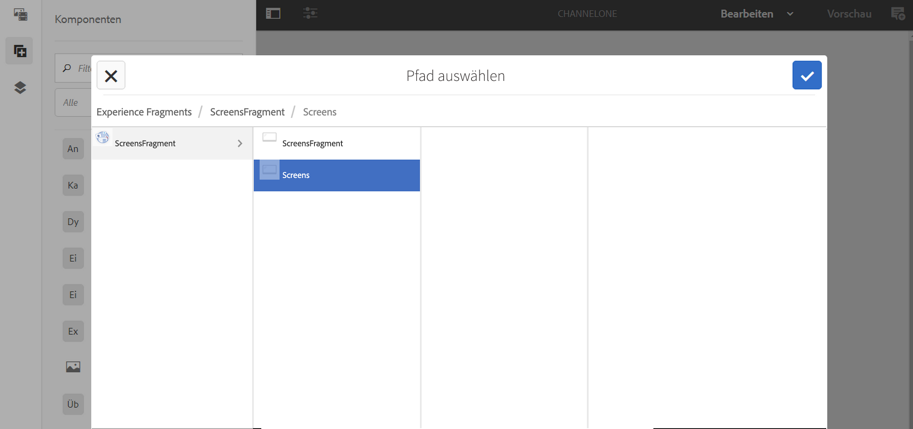

# Verwenden von Experience Fragments {#using-experience-fragments}

Auf dieser Seite werden die folgenden Themen behandelt:

* **Überblick**
* **Verwenden von Experience Fragments in AEM Screens**
* **Übertragen von Änderungen auf die Seite**

## Überblick {#overview}

Ein ***Experience Fragment*** ist eine Gruppe aus einer oder mehreren Komponenten (einschließlich Inhalt und Layout), die innerhalb von Seiten referenziert werden können. Experience Fragments können beliebige Komponenten enthalten, beispielsweise eine oder mehrere Komponenten mit beliebigen Elementen innerhalb eines Absatzsystems, das für das Gesamterlebnis referenziert oder von einem dritten Endpunkt angefordert wird.

## Verwenden von Experience Fragments in AEM Screens {#using-experience-fragments-in-aem-screens}

>[!NOTE]
>
>Im folgenden Beispiel wird **We.Retail** als Demoprojekt verwendet, bei dem das Experience Fragment von einer **Sites**-Seite in ein AEM Screens-Projekt übernommen wird.

Der folgende Workflow veranschaulicht beispielsweise die Verwendung von Experience Fragments aus Web.Retail in Sites. Sie können eine Web-Seite auswählen und diese Inhalte in Ihrem AEM Screens-Kanal in einem Ihrer Projekte nutzen.

### Voraussetzungen {#pre-requisites}

**Erstellen eines Demoprojekts mit einem Kanal**

***Erstellen eines Projekts***

1. Klicken Sie auf **Screens-Projekt erstellen**, um ein neues Projekt zu erstellen.
1. Geben Sie **DemoProject** als Titel ein.
1. Klicken Sie auf **Speichern**.

AEM Screens wird ein **DemoProject** hinzugefügt.

***Erstellen eines Kanals***

1. Navigieren Sie zum erstellten **DemoProject** und wählen Sie den Ordner **Kanal** aus.

1. Klicken Sie in der Aktionsleiste auf **Erstellen**, um den Assistenten zu öffnen.
1. Wählen Sie im Assistenten die Vorlage **Sequenzkanal** aus und klicken Sie auf **Weiter**.

1. Geben Sie **TestChannel** als **Titel** ein und klicken Sie auf **Erstellen**.

Ein **TestChannel** wird Ihrem **DemoProject** hinzugefügt.\

### Erstellen eines Experience Fragments {#creating-an-experience-fragment}

Gehen Sie wie folgt vor, um den Inhalt von **We.Retail** in Ihrem **TestChannel** in **DemoProject** zu nutzen.

1. **Navigieren zu einer Sites-Seite in We.Retail**

   1. Navigieren Sie zu „Sites“ und wählen Sie **We.Retail In-Store** -> **Kanäle** ->**Leerkanal – Nacht** und anschließend diese Seite aus, um diese als Experience Fragment für Ihren Screens-Kanal zu verwenden.

   1. Klicken Sie in der Aktionsleiste auf **Bearbeiten**, um die Seite zu öffnen, die Sie als Experience Fragment für Ihren Screens-Kanal verwenden möchten.

1. **Wiederverwenden des Inhalts**

   1. Wählen Sie das Fragment aus, das Sie in den Kanal aufnehmen möchten.
   1. Klicken Sie auf das letzte Symbol rechts, um das Dialogfeld **In Experience Fragment konvertieren** zu öffnen.

   

1. **Erstellen eines Experience Fragments**

   1. Wählen Sie unter **Aktion** die Option **Neues Experience Fragment erstellen** aus.

   1. Wählen Sie den **übergeordneten Pfad** aus.
   1. Wählen Sie die **Vorlage** aus. Wählen Sie hier die Vorlage .**Experience Fragment - Screens-Variante** aus.

   1. Geben Sie unter **Fragmenttitel** den Wert **ScreensFragment** ein.

   1. Klicken Sie auf das Häkchen, um die Erstellung eines neuen Experience Fragments abzuschließen.

   

1. **Erstellen einer Live Copy des Experience Fragments**

   1. Navigieren Sie zur AEM-Homepage.
   1. Wählen Sie **Experience Fragments** aus, markieren Sie **ScreensFragment** und klicken Sie auf **Variante als Live Copy**, wie in der folgenden Abbildung dargestellt:

   

   c. Wählen Sie im Assistenten **Live Copy erstellen** die Option „ScreensFragment“ aus und klicken Sie auf **Weiter**.

   d. Geben Sie unter **Titel** und unter **Namen** den Wert **Screens** ein.

   e. Klicken Sie auf **Erstellen**, um die Live Copy zu erstellen.

   f. Klicken Sie auf **Fertig**, um zur Seite **ScreensFragment** zurückzukehren.

   

   >[!NOTE]
   >
   >Nachdem Sie das Screens-Fragment erstellt haben, können Sie die Eigenschaften des Fragments bearbeiten. Wählen Sie das Fragment aus und klicken Sie in der Aktionsleiste auf **Eigenschaften**.

   **Bearbeiten von Eigenschaften eines Screens-Fragments**

   1. Navigieren Sie zum **ScreensFragment** (das Sie in den vorherigen Schritten erstellt haben) und klicken Sie in der Aktionsleiste auf **Eigenschaften**.

   1. Wählen Sie die Registerkarte **Offline-Konfiguration** aus, wie in der Abbildung unten dargestellt.

   Sie können Ihrem Experience Fragment die **Client-seitigen Bibliotheken** (Java und CSS) und **statischen Dateien** hinzufügen.

   Das folgende Beispiel zeigt das Hinzufügen Client-seitiger Bibliotheken und Schriften als Teil statischer Dateien zu Ihrem Experience Fragment.  

1. **Verwenden des Experience Fragments als Komponente im Screens-Kanal**

   1. Navigieren Sie zum Screens-Kanal, in dem Sie das **Screens**-Fragment verwenden möchten.
   1. Wählen Sie den **TestChannel** aus und klicken Sie in der Aktionsleiste auf **Bearbeiten**.

   1. Klicken Sie in der Seitenleiste auf das Komponentensymbol.
   1. Ziehen Sie das **Experience Fragment** in Ihren Kanal.

   

   e. Wählen Sie die Komponente **Experience Fragment** aus und klicken Sie auf das Symbol oben links (Schraubenschlüssel), um das Dialogfeld **Experience Fragment** zu öffnen.

   f. Wählen Sie im Feld **Pfad**.die Live Copy **Screens** des Fragments aus, die Sie in *Schritt 3* erstellt haben.

   

   f. Wählen Sie im Feld **Experience Fragment** die Live Copy **Screens** des Fragments aus, die Sie in *Schritt 3* erstellt haben.

   

   h. Geben Sie die Millisekunden in **Dauer** ein.

   i. Wählen Sie im Dialogfeld **Experience Fragments** die **Offline-Konfiguration** aus, um die Client-seitigen Bibliotheken und statischen Dateien zu definieren.

   >[!NOTE]
   >
   >Wenn Sie zusätzlich zu dem, was Sie in Schritt 4 konfiguriert haben, Client-seitige Bibliotheken oder statische Dateien hinzufügen möchten, können Sie diese im Dialogfeld **Experience Fragment** auf der Registerkarte **Offline-Konfiguration** hinzufügen.

   

   j. Klicken Sie auf das Häkchen, um den Vorgang abzuschließen.

### Validieren des Ergebnisses {#validating-the-result}

Nach Abschluss der vorherigen Schritte können Sie Ihr Experience Fragment in **ChannelOne** wie folgt validieren:

1. Navigieren Sie zum **TestChannel**.
1. Wählen Sie in der Aktionsleiste die **Vorschau** aus.

Sie sehen den Inhalt der **Sites**-Seite (Live Copy des Experience Fragments) in Ihrem Kanal, wie in der folgenden Abbildung dargestellt:\

## Übertragen von Änderungen auf die Seite {#propagating-changes-from-the-master-page}

***Live Copy*** bezieht sich auf die Kopie (der Quelle), die durch Synchronisierungsaktionen aufrechterhalten wird, wie in den Rollout-Konfigurationen definiert.

Da es sich bei dem von uns erstellten Experience Fragment um eine Live Copy der **Sites**-Seiten handelt, werden die Änderungen in Ihrem Kanal oder dem Ziel, in dem Sie das Experience Fragment verwendet haben, angezeigt, wenn Sie auf der Master-Seite Änderungen an diesem bestimmten Fragment vornehmen.

>[!NOTE]
>
>Weitere Informationen zum Thema Live Copy finden Sie unter „Wiederverwenden von Inhalten: Multi Site Manager und Live Copy“.

Gehen Sie wie folgt vor, um Änderungen vom Master-Kanal auf den Zielkanal zu übertragen:

1. Wählen Sie auf der **Sites**-Seite (Master) das Experience Fragment aus und klicken Sie auf das Stiftsymbol, um die im Experience Fragment enthaltenen Elemente zu bearbeiten.

   

1. Wählen Sie das Experience Fragment aus und klicken Sie auf das Schraubenschlüsselsymbol, um das Dialogfeld zum Bearbeiten der Bilder zu öffnen.

   

1. Das Dialogfeld **Produktraster** wird geöffnet.

   

1. Sie können alle Bilder bearbeiten. Hier wird beispielsweise das erste Bild in diesem Fragment ersetzt.

   

1. Wählen Sie das Experience Fragment aus und klicken Sie auf das Rollout-Symbol, um Änderungen an dem Fragment zu übertragen, das in Ihrem Kanal verwendet wird.

   

1. Klicken Sie auf „Rollout“, um die Änderungen zu bestätigen.

   Sie werden sehen, dass die Änderungen übertragen werden.

   

### Validieren der Änderungen {#validating-the-changes}

Gehen Sie wie folgt vor, um die Änderungen in Ihrem Kanal zu bestätigen:

1. Navigieren Sie zu **Screens** > **Kanäle** > **TestChannel**.

1. Klicken Sie in der Aktionsleiste auf **Vorschau**, um die Änderungen zu bestätigen.

Die folgende Abbildung zeigt die Änderungen in Ihrem **TestChannel**:\

