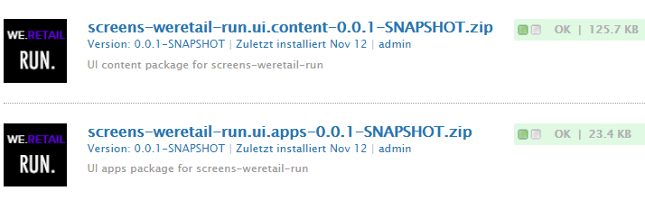
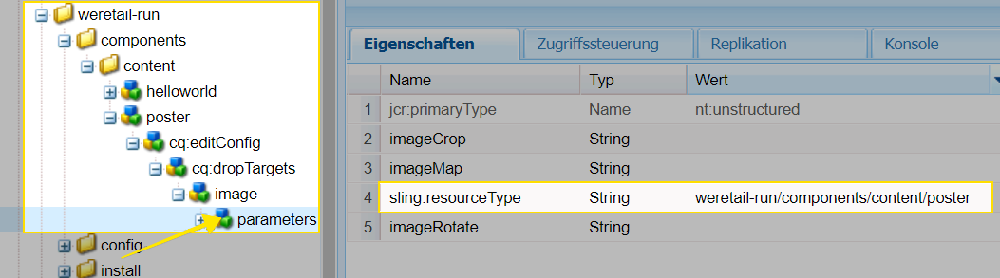
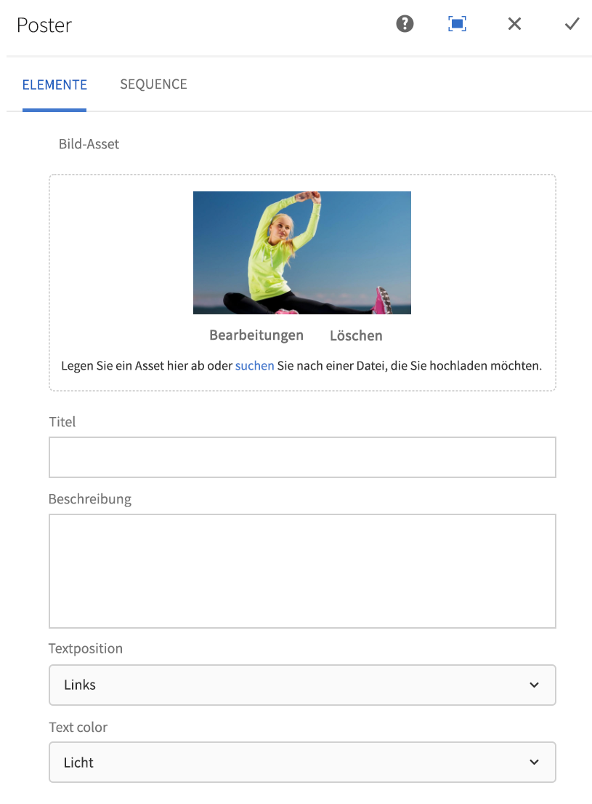
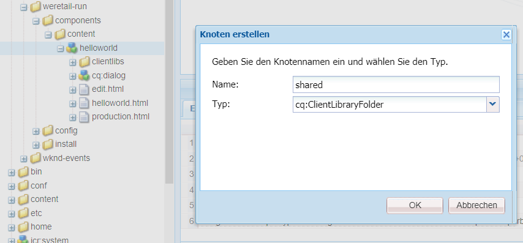
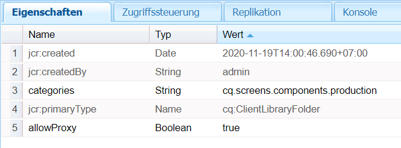
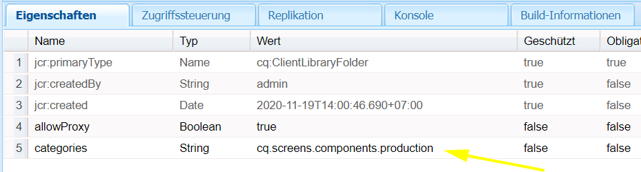
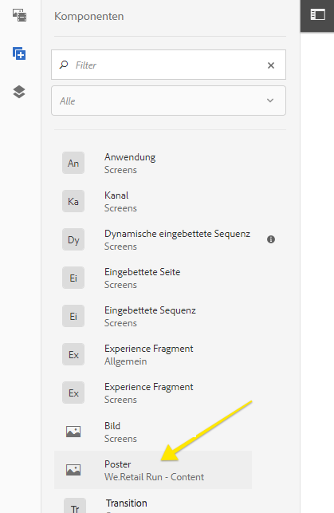
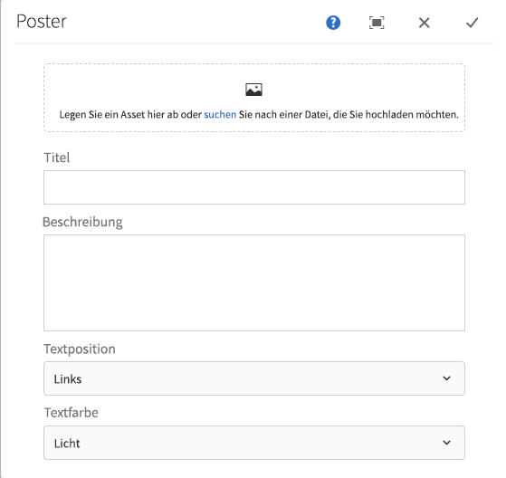

# Erweitern einer AEM Screens-Komponente

Im folgenden Tutorial werden die Schritte und Best Practices für die Erweiterung der vordefinierten AEM Screens-Komponenten erläutert. Die Bildkomponente wird erweitert und eine Überlagerung mit einem bearbeitbaren Text wird hinzugefügt.

## Überblick {#overview}

Dieses Tutorial richtet sich an Entwicklerinnen und Entwickler, die neu bei AEM Screens sind. In diesem Tutorial wird die Screens-Bildkomponente erweitert und eine Poster-Komponente erstellt. Ein Titel, eine Beschreibung und ein Logo werden auf einem Bild überlagert, um ein überzeugendes Erlebnis in einem Sequenzkanal zu schaffen.

>[!NOTE]
>
>Bevor Sie dieses Tutorial starten, sollten Sie das Tutorial [Entwickeln einer benutzerdefinierten Komponente für AEM Screens](developing-custom-component-tutorial-develop.md) absolvieren.


Die benutzerdefinierte Poster-Komponente wird durch Erweitern der Bildkomponente erstellt.

## Voraussetzungen {#prerequisites}

Um diese Anleitung abzuschließen, benötigen Sie Folgendes:

1. AEM 6.5 + das neueste Screens Feature Pack
1. [AEM Screens-Player](/help/user-guide/aem-screens-introduction.md)
1. Lokale Entwicklungsumgebung

Die Tutorial-Schritte und Screenshots werden mit CRXDE-Lite ausgeführt. [Eclipse](https://experienceleague.adobe.com/en/docs/experience-manager-65/content/implementing/developing/devtools/aem-eclipse)- oder [IntelliJ](https://experienceleague.adobe.com/en/docs/experience-manager-65/content/implementing/developing/devtools/ht-intellij)-IDEs können ebenfalls verwendet werden, um das Tutorial abzuschließen. Weitere Informationen zur Verwendung einer IDE zur Entwicklung mit AEM [finden Sie hier](https://experienceleague.adobe.com/en/docs/experience-manager-learn/getting-started-wknd-tutorial-develop/project-archetype/project-setup).

## Projekt-Setup {#project-setup}

Der Quell-Code eines Screens-Projekts wird normalerweise als Maven-Projekt mit mehreren Modulen verwaltet. Um das Tutorial zu beschleunigen, wurde ein Projekt mithilfe des [AEM-Projektarchetyps 13](https://github.com/adobe/aem-project-archetype) vorgeneriert. Weitere Informationen zum [Erstellen eines Projekts mit einem Maven-Archetyp für AEM-Projekte finden Sie hier](https://experienceleague.adobe.com/en/docs/experience-manager-learn/getting-started-wknd-tutorial-develop/project-archetype/project-setup).

1. Laden Sie die folgenden Pakete herunter und installieren Sie diese mit **CRX Package Manage** `http://localhost:4502/crx/packmgr/index.jsp)r:`

[Datei abrufen](assets/start-poster-screens-weretail-runuiapps-001-snapshot.zip)

   [Datei laden](assets/start-poster-screens-weretail-runuicontent-001-snapshot.zip)
   Wenn Sie mit Eclipse oder einer anderen IDE arbeiten, laden Sie **optional** das folgende Quellpaket herunter. Stellen Sie das Projekt mithilfe des folgenden Maven-Befehls in einer lokalen AEM-Instanz bereit:

   **`mvn -PautoInstallPackage clean install`**

   SRC-Startbildschirme `We.Retail` Projekt ausführen

[Datei abrufen](assets/start-poster-screens-weretail-run.zip)

1. In **CRX Package Manager** `http://localhost:4502/crx/packmgr/index.jsp` werden die folgenden zwei Pakete installiert:

   1. **`screens-weretail-run.ui.content-0.0.1-SNAPSHOT.zip`**
   1. **`screens-weretail-run.ui.apps-0.0.1-SNAPSHOT.zip`**

   

   AEM Screens `We.Retail Run Ui.Apps` und `Ui.Content` Pakete, die über CRX Package Manager installiert werden

## Erstellen der Poster-Komponente {#poster-cmp}

Die Poster-Komponente erweitert die vordefinierte AEM Screens-Bildkomponente. Ein Sling-Mechanismus `sling:resourceSuperType` wird verwendet, um die Kernfunktionalität der Bildkomponente zu erben, ohne dass Kopieren und Einfügen erforderlich ist. Weitere Informationen zu den Grundlagen der Sling-Anforderungsverarbeitung [finden Sie hier](https://experienceleague.adobe.com/en/docs/experience-manager-65/content/implementing/developing/introduction/the-basics).

Die Poster-Komponente wird im Vollbildmodus im Vorschau-/Produktionsmodus wiedergegeben. Im Bearbeitungsmodus ist es wichtig, die Komponente anders zu rendern, um das Authoring des Sequenzkanals zu erleichtern.

1. Erstellen Sie in **CRXDE-Lite** `http://localhost:4502/crx/de/index.jsp` (oder einer IDE Ihrer Wahl) unterhalb von `/apps/weretail-run/components/content` eine `cq:Component` namens `poster`.

   Fügen Sie der Komponente `poster` die folgenden Eigenschaften hinzu:

   ```xml
   <?xml version="1.0" encoding="UTF-8"?>
   <jcr:root xmlns:sling="https://sling.apache.org/jcr/sling/1.0" xmlns:cq="https://www.day.com/jcr/cq/1.0" xmlns:jcr="https://www.jcp.org/jcr/1.0"
       jcr:primaryType="cq:Component"
       jcr:title="Poster"
       sling:resourceSuperType="screens/core/components/content/image"
       componentGroup="We.Retail Run - Content"/>
   ```

   

   Eigenschaften für /apps/weretail-run/components/content/poster

   Durch Festlegen der `sling:resourceSuperType`Eigenschaft gleich `screens/core/components/content/image`, erbt die Poster-Komponente effektiv alle Funktionen der Bildkomponente. Entsprechende Knoten und Dateien unter `screens/core/components/content/image` kann unter dem `poster` -Komponente, um die Funktionalität zu überschreiben und zu erweitern.

1. Kopieren Sie die `cq:editConfig` Knoten unter `/libs/screens/core/components/content/image`. Fügen Sie die `cq:editConfig` unterhalb der `/apps/weretail-run/components/content/poster` -Komponente.

   Im `cq:editConfig/cq:dropTargets/image/parameters` Knoten, aktualisieren Sie die `sling:resourceType` Eigenschaft auf gleich `weretail-run/components/content/poster`.

   

   XML-Darstellung der `cq:editConfig` dargestellt:

   ```xml
   <?xml version="1.0" encoding="UTF-8"?>
   <jcr:root xmlns:sling="https://sling.apache.org/jcr/sling/1.0" xmlns:cq="https://www.day.com/jcr/cq/1.0" xmlns:jcr="https://www.jcp.org/jcr/1.0" xmlns:nt="https://www.jcp.org/jcr/nt/1.0"
       jcr:primaryType="cq:EditConfig">
       <cq:dropTargets jcr:primaryType="nt:unstructured">
           <image
               jcr:primaryType="cq:DropTargetConfig"
               accept="[image/.*]"
               groups="[media]"
               propertyName="./fileReference">
               <parameters
                   jcr:primaryType="nt:unstructured"
                   sling:resourceType="weretail-run/components/content/poster"
                   imageCrop=""
                   imageMap=""
                   imageRotate=""/>
           </image>
       </cq:dropTargets>
   </jcr:root>
   ```

1. Kopieren Sie das Dialogfeld `image` von „WCM Foundation“, um es für die Komponente `poster` zu verwenden.

   Es ist am einfachsten, von einem vorhandenen Dialogfeld aus zu starten und dann Änderungen vorzunehmen.

   1. Kopieren Sie das Dialgofeld aus `/libs/wcm/foundation/components/image/cq:dialog`
   1. Fügen Sie das Dialogfeld hier ein: `/apps/weretail-run/components/content/poster`

   

   Kopiertes Dialogfeld aus `/libs/wcm/foundation/components/image/cq:dialog` nach `/apps/weretail-run/components/content/poster`

   Die AEM Screens `image` -Komponente ist der WCM Foundation-Komponente übergeordnet `image` -Komponente. Daher erbt die Komponente `poster` die Funktionalität von beiden. Das Dialogfeld für die Poster-Komponente besteht aus einer Kombination der Dialogfelder „Screens“ und „Foundation“. Funktionen von **Sling Resource Merger** werden verwendet, um irrelevante Dialogfelder und Registerkarten auszublenden, die von den übergeordneten Komponenten übernommen werden.

1. Aktualisieren Sie die `cq:dialog` unter `/apps/weretail-run/components/content/poster` mit den folgenden in XML dargestellten Änderungen:

   ```xml
   <?xml version="1.0" encoding="UTF-8"?>
   <jcr:root xmlns:sling="https://sling.apache.org/jcr/sling/1.0" xmlns:cq="https://www.day.com/jcr/cq/1.0" xmlns:jcr="https://www.jcp.org/jcr/1.0" xmlns:nt="https://www.jcp.org/jcr/nt/1.0"
       jcr:primaryType="nt:unstructured"
       jcr:title="Poster"
       sling:resourceType="cq/gui/components/authoring/dialog">
       <content
           jcr:primaryType="nt:unstructured"
           sling:resourceType="granite/ui/components/foundation/container">
           <layout
               jcr:primaryType="nt:unstructured"
               sling:resourceType="granite/ui/components/foundation/layouts/tabs"
               type="nav"/>
           <items jcr:primaryType="nt:unstructured">
               <image
                   jcr:primaryType="nt:unstructured"
                   jcr:title="Elements"
                   sling:resourceType="granite/ui/components/foundation/section">
                   <layout
                       jcr:primaryType="nt:unstructured"
                       sling:resourceType="granite/ui/components/foundation/layouts/fixedcolumns"
                       margin="{Boolean}false"/>
                   <items jcr:primaryType="nt:unstructured">
                       <column
                           jcr:primaryType="nt:unstructured"
                           sling:resourceType="granite/ui/components/foundation/container">
                           <items
                               jcr:primaryType="nt:unstructured"
                               sling:hideChildren="[linkURL,size]">
                               <file
                                   jcr:primaryType="nt:unstructured"
                                   sling:resourceType="cq/gui/components/authoring/dialog/fileupload"
                                   autoStart="{Boolean}false"
                                   class="cq-droptarget"
                                   fieldLabel="Image asset"
                                   fileNameParameter="./fileName"
                                   fileReferenceParameter="./fileReference"
                                   mimeTypes="[image]"
                                   multiple="{Boolean}false"
                                   name="./file"
                                   title="Upload Image Asset"
                                   uploadUrl="${suffix.path}"
                                   useHTML5="{Boolean}true"/>
                               <title
                                   jcr:primaryType="nt:unstructured"
                                   sling:resourceType="granite/ui/components/foundation/form/textfield"
                                   fieldLabel="Title"
                                   name="./jcr:title"/>
                               <description
                                   jcr:primaryType="nt:unstructured"
                                   sling:resourceType="granite/ui/components/foundation/form/textarea"
                                   fieldLabel="Description"
                                   name="./jcr:description"/>
                               <position
                                   jcr:primaryType="nt:unstructured"
                                   sling:resourceType="granite/ui/components/coral/foundation/form/select"
                                   fieldLabel="Text Position"
                                   name="./textPosition">
                                   <items jcr:primaryType="nt:unstructured">
                                       <left
                                           jcr:primaryType="nt:unstructured"
                                           text="Left"
                                           value="left"/>
                                       <center
                                           jcr:primaryType="nt:unstructured"
                                           text="Center"
                                           value="center"/>
                                       <right
                                           jcr:primaryType="nt:unstructured"
                                           text="Right"
                                           value="right"/>
                                   </items>
                               </position>
                               <color
                                   jcr:primaryType="nt:unstructured"
                                   sling:resourceType="granite/ui/components/coral/foundation/form/select"
                                   fieldLabel="Text Color"
                                   name="./textColor">
                                   <items jcr:primaryType="nt:unstructured">
                                       <light
                                           jcr:primaryType="nt:unstructured"
                                           text="Light"
                                           value="light"/>
                                       <dark
                                           jcr:primaryType="nt:unstructured"
                                           text="Dark"
                                           value="dark"/>
                                   </items>
                               </color>
                           </items>
                       </column>
                   </items>
               </image>
               <accessibility
                   jcr:primaryType="nt:unstructured"
                   sling:hideResource="{Boolean}true"/>
           </items>
       </content>
   </jcr:root>
   ```

   Die Eigenschaft `sling:hideChildren`= `"[linkURL,size]`&quot; wird auf dem Knoten `items` verwendet, um sicherzustellen, dass die Felder **linkURL** und **size** aus dem Dialogfeld ausgeblendet werden. Es genügt nicht, diese Knoten aus dem Poster-Dialogfeld zu entfernen. Mit der Eigenschaft `sling:hideResource="{Boolean}true"` auf der Registerkarte „Erreichbarkeit“ wird die gesamte Registerkarte ausgeblendet.

   Dem Dialogfeld werden zwei Auswahlfelder hinzugefügt, damit Autoren die Textposition und Farbe des Titels und der Beschreibung steuern können.

   

   Poster – Struktur des endgültigen Dialogfelds

   An dieser Stelle wird eine Instanz der `poster` -Komponente hinzugefügt werden. **Idle Channel** in der`We.Retail` Projekt ausführen: `http://localhost:4502/editor.html/content/screens/we-retail-run/channels/idle-channel.edit.html`.

   

   Felder des Poster-Dialogfelds

1. Erstellen Sie unter `/apps/weretail-run/components/content/poster` eine Datei mit dem Namen `production.html.`

   Füllen Sie die Datei mit folgendem Inhalt:

   ```xml
   <!--/*
   
       /apps/weretail-run/components/content/poster/production.html
   
   */-->
   <div data-sly-use.image="image.js"
        data-duration="${properties.duration}"
        class="cmp-poster"
        style="background-image: url(${request.contextPath @ context='uri'}${image.src @ context='uri'});">
       <div class="cmp-poster__text
                   cmp-poster__text--${properties.textPosition @ context='attribute'}
                   cmp-poster__text--${properties.textColor @ context='attribute'}">
           <h1 class="cmp-poster__title">${properties.jcr:title}</h1>
            <h2 class="cmp-poster__description">${properties.jcr:description}</h2>
       </div>
    
   </div>
   ```

   Das Produktions-Markup für die Poster-Komponente wird direkt oben angezeigt. Das HTL-Skript überschreibt `screens/core/components/content/image/production.html`. `image.js` ist ein Server-seitiges Skript, das ein POJO-ähnliches Bildobjekt erstellt. Das Bildobjekt kann dann aufgerufen werden, um `src` als eingebettetes Hintergrundbild wiederzugeben.

   `The h1`- und h2-Tags werden hinzugefügt, um den Titel und die Beschreibung anhand der Komponenteneigenschaften anzuzeigen: `${properties.jcr:title}` und `${properties.jcr:description}`.

   Die `h1`- und `h2`-Tags werden von einem Div-Wrapper mit drei CSS-Klassen mit Varianten von `cmp-poster__text` umgeben. Der Wert für die Eigenschaften `textPosition` und `textColor` wird verwendet, um die CSS-Klasse zu ändern, die anhand der Dialogfeldauswahl des Autors wiedergegeben wird. Im nächsten Abschnitt werden CSS aus Client-Bibliotheken geschrieben, um diese Änderungen in der Anzeige zu aktivieren.

   Ein Logo ist auch als Überlagerung in der Komponente enthalten. In diesem Beispiel wird der Pfad zum` We.Retail` Das -Logo ist im DAM hartcodiert. Je nach Nutzungsszenario ist es möglicherweise sinnvoller, ein neues Dialogfeld zu erstellen, in dem der Logo-Pfad als dynamischer Wert eingegeben wird.

   Beachten Sie außerdem, dass die BEM-Notation (Block Element Modifier) mit der Komponente verwendet wird. BEM ist eine CSS-Kodierungskonvention, die die Erstellung wiederverwendbarer Komponenten erleichtert. BEM ist die Notation, die von den [AEM-Kernkomponenten](https://github.com/adobe/aem-core-wcm-components/wiki/CSS-coding-conventions) verwendet wird. <!-- DEAD LINK More info can be found at: [https://getbem.com/](https://getbem.com/) -->

1. Erstellen Sie unter `/apps/weretail-run/components/content/poster` eine Datei mit dem Namen `edit.html.`

   Füllen Sie die Datei mit folgendem Inhalt:

   ```xml
   <!--/*
   
       /apps/weretail-run/components/content/poster/edit.html
   
   */-->
   
   <div class="aem-Screens-editWrapper ${image.cssClass} cmp-poster" data-sly-use.image="image.js" data-emptytext="${'Poster' @ i18n, locale=request.locale}">
       
       <div class="cmp-poster__text
              cmp-poster__text--${properties.textPosition @ context='attribute'}
          cmp-poster__text--${properties.textColor @ context='attribute'}">
         <p class="cmp-poster__title">${properties.jcr:title}</p>
         <p class="cmp-poster__description">${properties.jcr:description}</p>
       </div>
   </div>
   ```

   Die **edit** Markup für die Poster-Komponente wird direkt oben angezeigt. Das HTL-Skript überschreibt `/libs/screens/core/components/content/image/edit.html`. Das Markup ähnelt dem `production.html`-Markup und zeigt den Titel und die Beschreibung über dem Bild an.

   Der `aem-Screens-editWrapper` wird hinzugefügt, damit die Komponente im Editor nicht bildschirmfüllend dargestellt wird. Das Attribut `data-emptytext` stellt sicher, dass ein Platzhalter angezeigt wird, wenn kein Bild oder Inhalt eingefügt wurde.

## Erstellen Client-seitiger Bibliotheken {#clientlibs}

Client-seitige Bibliotheken bieten einen Mechanismus zum Organisieren und Verwalten von CSS- und JavaScript-Dateien, die für eine AEM-Implementierung erforderlich sind. Weitere Informationen zur Verwendung Client-seitiger Bibliotheken [finden Sie hier](https://experienceleague.adobe.com/en/docs/experience-manager-65/content/implementing/developing/introduction/clientlibs).

AEM Screens-Komponenten werden im Bearbeitungsmodus anders als im Vorschaumodus/Produktionsmodus dargestellt. Es werden zwei Gruppen von Client-Bibliotheken erstellt, eine für den Bearbeitungsmodus und eine für die Vorschau/Produktion.

1. Erstellen Sie einen Ordner für Client-seitige Bibliotheken für die Poster-Komponente.

   Erstellen Sie unter `/apps/weretail-run/components/content/poster` einen Ordner mit dem Namen `clientlibs`.

   

1. Erstellen Sie unter dem Ordner `clientlibs` einen neuen Knoten namens `shared` vom Typ `cq:ClientLibraryFolder.`

   

1. Fügen Sie der freigegebenen Client-Bibliothek die folgenden Eigenschaften hinzu:

   * `allowProxy`   Boolean   `true`
   * `categories`   String[]   `cq.screens.components`

   

   Eigenschaften für /apps/weretail-run/components/content/poster/clientlibs/shared

   Die Eigenschaft `categories` ist eine Zeichenfolge, die die Client-Bibliothek identifiziert. Die Kategorie `cq.screens.components` wird sowohl im Bearbeitungs- als auch im Vorschau-/Produktionsmodus verwendet. Daher wird jedes in der Clientlib `shared` definierte CSS/JS in allen Modi geladen.

   Es empfiehlt sich, in einer Produktionsumgebung niemals Pfade direkt zu /apps bereitzustellen. Die Eigenschaft `allowProxy` stellt sicher, dass auf die Pfade zu Client-Bibliotheks-CSS und -JS über ein Präfix `/etc.clientlibs` verwiesen wird. Weitere Informationen über die Eigenschaft „allowProxy“ [finden Sie hier](https://experienceleague.adobe.com/en/docs/experience-manager-65/content/implementing/developing/introduction/clientlibs).

1. Erstellen Sie eine Datei mit dem Namen `css.txt` unter dem freigegebenen Ordner.

   Füllen Sie die Datei mit folgendem Inhalt:

   ```
   #base=css
   
   styles.less
   ```

1. Erstellen Sie einen Ordner mit dem Namen `css` unter dem Ordner `shared`. Fügen Sie eine Datei mit dem Namen `style.less` unter dem Ordner `css` hinzu. Die Struktur der Client-Bibliotheken sollte jetzt wie folgt aussehen:

   

   Anstatt CSS direkt zu schreiben, verwendet dieses Tutorial LESS. [LESS](https://lesscss.org/) ist ein beliebter CSS-Precompiler, der CSS-Variablen, Mixins und Funktionen unterstützt. AEM-Client-Bibliotheken unterstützen nativ die LESS-Kompilierung. Sass oder andere Pre-Compiler können verwendet werden, müssen aber außerhalb von AEM kompiliert werden.

1. Füllen Sie `/apps/weretail-run/components/content/poster/clientlibs/shared/css/styles.less` wie folgt:

   ```css
   /*
    /apps/weretail-run/components/content/poster/clientlibs/shared/css/styles.less
    Poster Component - Shared Style
   */
   
   @import url('https://fonts.googleapis.com/css?family=Fjalla+One|Open+Sans:400i');
   
   @text-light-color: #fff;
   @text-dark-color: #000;
   @title-font-family: 'Fjalla One', sans-serif;
   @description-font-family: 'Open Sans', sans-serif;
   
   .cmp-poster {
   
         &__text {
         position: absolute;
         color: @text-light-color;
         top: 0;
         text-align:center;
         width: 100%;
   
         &--left {
          text-align: left;
                margin-left: 1em;
         }
   
         &--right {
          text-align: right;
                margin-right: 1em;
         }
   
         &--dark {
          color: @text-dark-color;
         }
       }
   
       &__title {
         font-weight: bold;
            font-family: @title-font-family;
            font-size: 1.2em;
       }
   
       &__description {
     font-style: italic;
           font-family: @description-font-family;
    }
   
   }
   ```

   >[!NOTE]
   >
   >Für die Schriftfamilien werden Google Web Fonts verwendet. Web Fonts erfordern eine Internetverbindung und nicht alle AEM Screens-Implementierungen verfügen über eine zuverlässige Verbindung. Die Planung des Offline-Modus ist ein wichtiger Aspekt bei AEM Screens-Implementierungen.

1. Kopieren Sie den Client-Bibliotheksordner `shared`. Fügen Sie ihn als gleichrangiges Element ein und benennen Sie ihn in `production` um.

   

1. Aktualisieren Sie die `categories` -Eigenschaft der Produktions-Client-Bibliothek `cq.screens.components.production.`

   Die Kategorie `cq.screens.components.production` stellt sicher, dass die Stile nur im Vorschau-/Produktionsmodus geladen werden.

   

   Eigenschaften für /apps/weretail-run/components/content/poster/clientlibs/production

1. Füllen Sie `/apps/weretail-run/components/content/poster/clientlibs/production/css/styles.less` wie folgt:

   ```css
   /*
    /apps/weretail-run/components/content/poster/clientlibs/production/css/styles.less
    Poster Component - Production Style
   */
   
   .cmp-poster {
   
       background-size: cover;
    height: 100%;
    width: 100%;
    position:absolute;
   
        &__text {
   
           top: 2em;
   
           &--left {
               width: 40%;
               top: 5em;
           }
   
           &--right {
               width: 40%;
               right: 1em;
           }
       }
   
       &__title {
     font-size: 5rem;
     font-weight: 900;
     margin: 0.1rem;
    }
   
    &__description {
     font-size: 2rem;
     margin: 0.1rem;
     font-weight: 400;
   
    }
   
       &__logo {
     position: absolute;
     max-width: 200px;
     top: 1em;
     left: 0;
    }
   
   }
   ```

   Die oben genannten Stile zeigen den Titel und die Beschreibung an einer absoluten Position auf dem Bildschirm an. Der Titel wird größer als die Beschreibung angezeigt. Die BEM-Notation der Komponente macht es sehr einfach, die Formatvorlagen innerhalb der Klasse cmp-poster sorgfältig zu definieren.

Eine dritte Client-Bibliothekskategorie: `cq.screens.components.edit` kann verwendet werden, um der Komponente nur bestimmte Stile bearbeiten hinzuzufügen.

| Clientlib-Kategorie | Nutzung |
|---|---|
| `cq.screens.components` | Stile und Skripte, die sowohl im Bearbeitungs- als auch im Produktionsmodus verwendet werden |
| `cq.screens.components.edit` | Stile und Skripte, die nur im Bearbeitungsmodus verwendet werden |
| `cq.screens.components.production` | Stile und Skripte, die nur im Produktionsmodus verwendet werden |

## Hinzufügen einer Poster-Komponente zu einem Sequenzkanal {#add-sequence-channel}

Die Poster-Komponente wird in einem Sequenzkanal verwendet. Das Startpaket für dieses Tutorial enthielt einen inaktiven Kanal. Der inaktive Kanal ist vorkonfiguriert, um Komponenten der Gruppe zuzulassen **`We.Retail Run - Content`**. Die Gruppe der Poster-Komponente ist auf `We.Retail Run - Content` eingestellt und kann dem Kanal hinzugefügt werden.

1. Öffnen Sie den inaktiven Kanal über die `We.Retail` Projekt ausführen: **`http://localhost:4502/editor.html/content/screens/we-retail-run/channels/idle-channel.edit.html`**
1. Ziehen Sie eine neue Instanz der **Poster**-Komponente aus der Seitenleiste auf die Seite.

   

1. Bearbeiten Sie das Dialogfeld der Poster-Komponente, damit Sie ein Bild, einen Titel und eine Beschreibung hinzufügen können. Verwenden Sie die Optionen „Textposition“ und „Textfarbe“, um sicherzustellen, dass der Titel/die Beschreibung über dem Bild lesbar ist.

   

1. Um einige Poster-Komponenten hinzuzufügen, wiederholen Sie die oben beschriebenen Schritte. Fügen Sie Übergänge zwischen den Komponenten hinzu.

   

## Zusammenfassung {#putting-it-all-together}

Das folgende Video zeigt die fertige Komponente und wie sie einem Sequenzkanal hinzugefügt werden kann. Der Kanal wird dann einer Standortsanzeige hinzugefügt und letztendlich einem Screens-Player zugewiesen.

>[!VIDEO](https://video.tv.adobe.com/v/22414?quaity=9)

## Fertiger Code {#finished-code}

Unten finden Sie den fertigen Code aus dem Tutorial. **screens-weretail-run.ui.apps-0.0.1-SNAPSHOT.zip** und **screens-weretail-run.ui.content-0.0.1-SNAPSHOT.zip** sind kompilierte AEM-Pakete. Die **SRC-screens-weretail-run-0.0.1.zip** ist der nicht kompilierte Quellcode, der mithilfe von Maven bereitgestellt werden kann.

[Datei abrufen](assets/final-poster-screens-weretail-runuiapps-001-snapshot.zip)

[Datei abrufen](assets/final-poster-screens-weretail-runuicontent-001-snapshot.zip)

SRC Final AEM Screens `We.Retail` Projekt ausführen

[Datei abrufen](assets/src-screens-weretail-run-001.zip)
