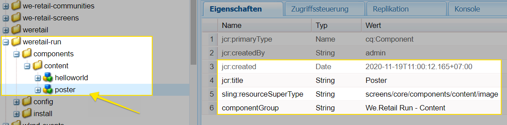

# Erweitern einer AEM Screens-Komponente {#extending-an-aem-screens-component}

In der folgenden Übung werden die Schritte und Best Practices für die Erweiterung der vordefinierten AEM Screens-Komponenten erläutert. Die Image-Komponente wird erweitert, um eine Überlagerung mit einem verlässlichen Text hinzuzufügen.

## Überblick {#overview}

Dieses Lernprogramm richtet sich an Entwickler, die neu bei AEM Screens sind. In diesem Lernprogramm wird die Komponente "Bildschirmbild"erweitert, um eine Standbildkomponente zu erstellen. Ein Titel, eine Beschreibung und ein Logo werden auf einem Bild überlagert, um ein überzeugendes Erlebnis in einem Sequenzkanal zu schaffen.

>[!NOTE]
>
>Bevor Sie dieses Lernprogramm starten, sollten Sie die Übung abschließen: [Entwickeln einer benutzerdefinierten Komponente für AEM Screens](developing-custom-component-tutorial-develop.md).


Die Komponente "Benutzerdefiniertes Standbild"wird durch Erweitern der Komponente "Bild"erstellt.

## Voraussetzungen {#prerequisites}

## Project Setup {#project-setup}

1. Herunterladen und Installieren der folgenden Pakete mithilfe der **CRX-Paketverwaltung**`http://localhost:4502/crx/packmgr/index.jsp)r:`

   [Datei abrufen](assets/start-poster-screens-weretail-runuiapps-001-snapshot.zip)

   [Datei abrufen](assets/start-poster-screens-weretail-runuicontent-001-snapshot.zip)
   **Wenn Sie mit Eclipse oder einer anderen IDE arbeiten,** laden Sie optional das folgende Quellpaket herunter. Stellen Sie das Projekt mithilfe des Maven-Befehls in einer lokalen AEM-Instanz bereit:

   **`mvn -PautoInstallPackage clean install`**

   SRC Startbildschirme Wir.Retail Ausführen Projekt

   [Datei abrufen](assets/start-poster-screens-weretail-run.zip)

1. In **CRX Package Manager** `http://localhost:4502/crx/packmgr/index.jsp` werden die folgenden zwei Pakete installiert:

   1. **screens-weretail-run.ui.content-0.0.1-SNAPSHOT.zip**
   1. **screens-weretail-run.ui.apps-0.0.1-SNAPSHOT.zip**
   

   Screens Wir.Retail Ausführen von Ui.Apps- und Ui.Content-Paketen, die über CRX Package Manager installiert werden

## Erstellen der Posterkomponente {#poster-cmp}

Die Standbildkomponente erweitert die vordefinierte Bildschirmkomponente. Ein Sling-Mechanismus `sling:resourceSuperType`wird verwendet, um die Kernfunktionalität der Image-Komponente zu erben, ohne kopiert und eingefügt werden zu müssen. Weitere Informationen zu den Grundlagen der [Sling Request Processing finden Sie hier.](https://helpx.adobe.com/experience-manager/6-5/sites/developing/using/the-basics.html#SlingRequestProcessing)

Die Standbildkomponente wird im Vollbildmodus im Vorschau-/Produktionsmodus wiedergegeben. Im Bearbeitungsmodus ist es wichtig, die Komponente anders zu rendern, um das Authoring des Sequenzkanals zu erleichtern.

1. In **CRXDE-Lite** (oder IDE der Wahl) darunter, um einen neuen `http://localhost:4502/crx/de/index.jsp` Namen zu `/apps/weretail-run/components/content`erstellen `cq:Component``poster` .

   Add the following properties to the `poster` component:

   ```xml
   <?xml version="1.0" encoding="UTF-8"?>
   <jcr:root xmlns:sling="https://sling.apache.org/jcr/sling/1.0" xmlns:cq="https://www.day.com/jcr/cq/1.0" xmlns:jcr="https://www.jcp.org/jcr/1.0"
       jcr:primaryType="cq:Component"
       jcr:title="Poster"
       sling:resourceSuperType="screens/core/components/content/image"
       componentGroup="We.Retail Run - Content"/>
   ```

   

   Eigenschaften für /apps/weretail-run/components/content/poster

   Durch Festlegen der `sling:resourceSuperType`Eigenschaft, die `screens/core/components/content/image` der Poster-Komponente entspricht, werden alle Funktionen der Image-Komponente übernommen. Entsprechende Knoten und Dateien, die sich unten befinden, `screens/core/components/content/image` können unterhalb der `poster` Komponente hinzugefügt werden, um die Funktionalität zu überschreiben und zu erweitern.

1. Kopieren Sie die `cq:editConfig` Node unter `/libs/screens/core/components/content/image.`Einfügen `cq:editConfig` unter der `/apps/weretail-run/components/content/poster` Komponente.

   Aktualisieren Sie auf dem `cq:editConfig/cq:dropTargets/image/parameters` Knoten die `sling:resourceType` Eigenschaft auf gleich `weretail-run/components/content/poster`.

   

   XML-Darstellung der unten dargestellten cq:editConfig:

   ```xml
   <?xml version="1.0" encoding="UTF-8"?>
   <jcr:root xmlns:sling="https://sling.apache.org/jcr/sling/1.0" xmlns:cq="https://www.day.com/jcr/cq/1.0" xmlns:jcr="https://www.jcp.org/jcr/1.0" xmlns:nt="https://www.jcp.org/jcr/nt/1.0"
       jcr:primaryType="cq:EditConfig">
       <cq:dropTargets jcr:primaryType="nt:unstructured">
           <image
               jcr:primaryType="cq:DropTargetConfig"
               accept="[image/.*]"
               groups="[media]"
               propertyName="./fileReference">
               <parameters
                   jcr:primaryType="nt:unstructured"
                   sling:resourceType="weretail-run/components/content/poster"
                   imageCrop=""
                   imageMap=""
                   imageRotate=""/>
           </image>
       </cq:dropTargets>
   </jcr:root>
   ```

1. WCM Foundation- `image` Dialogfeld kopieren, das für die `poster` Komponente verwendet werden soll.

   Es ist am einfachsten, von einem vorhandenen Dialog zu beginnen und dann Änderungen vorzunehmen.

   1. Dialogfeld kopieren aus: `/libs/wcm/foundation/components/image/cq:dialog`
   1. Das Dialogfeld unten einfügen `/apps/weretail-run/components/content/poster`
   

   Dialogfeld kopiert von /libs/wcm/foundation/components/image/cq:dialog nach /apps/weretail-run/components/content/poster

   Die Bildschirmkomponente `image` ist der WCM Foundation- `image` Komponente überschrieben. Daher erbt die `poster` Komponente Funktionalität von beiden. Der Dialog für die Posterkomponente besteht aus einer Kombination der Dialoge "Screens"und "Foundation". Funktionen der **Sling Resource Merger** werden verwendet, um irrelevante Dialogfelder und Registerkarten auszublenden, die von den überschriebenen Komponenten übernommen werden.

1. Aktualisieren Sie das unten stehende cq:dialog `/apps/weretail-run/components/content/poster` mit den folgenden Änderungen in XML:

   ```xml
   <?xml version="1.0" encoding="UTF-8"?>
   <jcr:root xmlns:sling="https://sling.apache.org/jcr/sling/1.0" xmlns:cq="https://www.day.com/jcr/cq/1.0" xmlns:jcr="https://www.jcp.org/jcr/1.0" xmlns:nt="https://www.jcp.org/jcr/nt/1.0"
       jcr:primaryType="nt:unstructured"
       jcr:title="Poster"
       sling:resourceType="cq/gui/components/authoring/dialog">
       <content
           jcr:primaryType="nt:unstructured"
           sling:resourceType="granite/ui/components/foundation/container">
           <layout
               jcr:primaryType="nt:unstructured"
               sling:resourceType="granite/ui/components/foundation/layouts/tabs"
               type="nav"/>
           <items jcr:primaryType="nt:unstructured">
               <image
                   jcr:primaryType="nt:unstructured"
                   jcr:title="Elements"
                   sling:resourceType="granite/ui/components/foundation/section">
                   <layout
                       jcr:primaryType="nt:unstructured"
                       sling:resourceType="granite/ui/components/foundation/layouts/fixedcolumns"
                       margin="{Boolean}false"/>
                   <items jcr:primaryType="nt:unstructured">
                       <column
                           jcr:primaryType="nt:unstructured"
                           sling:resourceType="granite/ui/components/foundation/container">
                           <items
                               jcr:primaryType="nt:unstructured"
                               sling:hideChildren="[linkURL,size]">
                               <file
                                   jcr:primaryType="nt:unstructured"
                                   sling:resourceType="cq/gui/components/authoring/dialog/fileupload"
                                   autoStart="{Boolean}false"
                                   class="cq-droptarget"
                                   fieldLabel="Image asset"
                                   fileNameParameter="./fileName"
                                   fileReferenceParameter="./fileReference"
                                   mimeTypes="[image]"
                                   multiple="{Boolean}false"
                                   name="./file"
                                   title="Upload Image Asset"
                                   uploadUrl="${suffix.path}"
                                   useHTML5="{Boolean}true"/>
                               <title
                                   jcr:primaryType="nt:unstructured"
                                   sling:resourceType="granite/ui/components/foundation/form/textfield"
                                   fieldLabel="Title"
                                   name="./jcr:title"/>
                               <description
                                   jcr:primaryType="nt:unstructured"
                                   sling:resourceType="granite/ui/components/foundation/form/textarea"
                                   fieldLabel="Description"
                                   name="./jcr:description"/>
                               <position
                                   jcr:primaryType="nt:unstructured"
                                   sling:resourceType="granite/ui/components/coral/foundation/form/select"
                                   fieldLabel="Text Position"
                                   name="./textPosition">
                                   <items jcr:primaryType="nt:unstructured">
                                       <left
                                           jcr:primaryType="nt:unstructured"
                                           text="Left"
                                           value="left"/>
                                       <center
                                           jcr:primaryType="nt:unstructured"
                                           text="Center"
                                           value="center"/>
                                       <right
                                           jcr:primaryType="nt:unstructured"
                                           text="Right"
                                           value="right"/>
                                   </items>
                               </position>
                               <color
                                   jcr:primaryType="nt:unstructured"
                                   sling:resourceType="granite/ui/components/coral/foundation/form/select"
                                   fieldLabel="Text Color"
                                   name="./textColor">
                                   <items jcr:primaryType="nt:unstructured">
                                       <light
                                           jcr:primaryType="nt:unstructured"
                                           text="Light"
                                           value="light"/>
                                       <dark
                                           jcr:primaryType="nt:unstructured"
                                           text="Dark"
                                           value="dark"/>
                                   </items>
                               </color>
                           </items>
                       </column>
                   </items>
               </image>
               <accessibility
                   jcr:primaryType="nt:unstructured"
                   sling:hideResource="{Boolean}true"/>
           </items>
       </content>
   </jcr:root>
   ```

   Die Eigenschaft `sling:hideChildren`= `"[linkURL,size]`" wird auf dem `items` Knoten verwendet, um sicherzustellen, dass die Felder **linkURL** und **size** aus dem Dialogfeld ausgeblendet werden. Das Entfernen dieser Knoten aus dem Standbild-Dialogfeld reicht nicht aus. Mit der Eigenschaft `sling:hideResource="{Boolean}true"` auf der Registerkarte "Ein-/Ausgabehilfe"wird die gesamte Registerkarte ausgeblendet.

   Dem Dialogfeld werden zwei Auswahlfelder hinzugefügt, damit die Autoren die Textposition und Farbe des Titels und der Beschreibung steuern können.

   

   Standbild - Struktur des endgültigen Dialogs

   An dieser Stelle kann eine Instanz der `poster` Komponente im Projekt "We.Retail-Ausführung"der Seite " **Leerkanal** "hinzugefügt werden: `http://localhost:4502/editor.html/content/screens/we-retail-run/channels/idle-channel.edit.html`.

   

   Standbilddialogfelder

1. Erstellen Sie eine Datei unter dem `/apps/weretail-run/components/content/poster` Namen `production.html.`

   Füllen Sie die Datei mit folgenden Elementen:

   ```xml
   <!--/*
   
       /apps/weretail-run/components/content/poster/production.html
   
   */-->
   <div data-sly-use.image="image.js"
        data-duration="${properties.duration}"
        class="cmp-poster"
        style="background-image: url(${request.contextPath @ context='uri'}${image.src @ context='uri'});">
       <div class="cmp-poster__text
                   cmp-poster__text--${properties.textPosition @ context='attribute'}
                   cmp-poster__text--${properties.textColor @ context='attribute'}">
           <h1 class="cmp-poster__title">${properties.jcr:title}</h1>
            <h2 class="cmp-poster__description">${properties.jcr:description}</h2>
       </div>
    
   </div>
   ```

   Oben ist das Produktions-Markup für die Poster-Komponente. Das HTL-Skript setzt die Regeln außer Kraft `screens/core/components/content/image/production.html`. Das `image.js` ist ein serverseitiges Skript, das ein POJO-ähnliches Bildobjekt erstellt. Das Image-Objekt kann dann aufgerufen werden, um das Bild `src` als eingebettetes Hintergrundbild im Stil des Stils wiederzugeben.

   `The h1` und h2-Tags hinzugefügt werden, werden der Titel und die Beschreibung basierend auf den Komponenteneigenschaften angezeigt: `${properties.jcr:title}` und `${properties.jcr:description}`.

   Umgeben der Tags `h1` und `h2` ist ein div-Wrapper mit drei CSS-Klassen mit Variationen von " `cmp-poster__text`". Der Wert für die `textPosition` und `textColor` -Eigenschaften wird verwendet, um die CSS-Klasse zu ändern, die basierend auf der Dialogfeldauswahl des Autors wiedergegeben wird. Im nächsten Abschnitt werden CSS aus Client-Bibliotheken geschrieben, um diese Änderungen in der Anzeige zu aktivieren.

   Ein Logo ist auch als Überlagerung in der Komponente enthalten. In diesem Beispiel ist der Pfad zum We.Retail-Logo im DAM fest codiert. Je nach Anwendungsfall kann es sinnvoll sein, ein neues Dialogfeld zu erstellen, um den Logopfad zu einem dynamisch ausgefüllten Wert zu machen.

   Beachten Sie außerdem, dass die BEM-Notation (Block Element Modifier) mit der Komponente verwendet wird. BEM ist eine CSS-Kodierungskonvention, die die Erstellung wiederverwendbarer Komponenten erleichtert. BEM ist die von [AEM-Kernkomponenten](https://github.com/Adobe-Marketing-Cloud/aem-core-wcm-components/wiki/CSS-coding-conventions)verwendete Notation. Weitere Informationen finden Sie unter: [https://getbem.com/](https://getbem.com/)

1. Erstellen Sie eine Datei unter dem `/apps/weretail-run/components/content/poster` Namen `edit.html.`

   Füllen Sie die Datei mit folgenden Elementen:

   ```xml
   <!--/*
   
       /apps/weretail-run/components/content/poster/edit.html
   
   */-->
   
   <div class="aem-Screens-editWrapper ${image.cssClass} cmp-poster" data-sly-use.image="image.js" data-emptytext="${'Poster' @ i18n, locale=request.locale}">
       
       <div class="cmp-poster__text
              cmp-poster__text--${properties.textPosition @ context='attribute'}
          cmp-poster__text--${properties.textColor @ context='attribute'}">
         <p class="cmp-poster__title">${properties.jcr:title}</p>
         <p class="cmp-poster__description">${properties.jcr:description}</p>
       </div>
   </div>
   ```

   Oben ist das **Bearbeiten** -Markup für die Standbildkomponente. Das HTL-Skript setzt die Regeln außer Kraft `/libs/screens/core/components/content/image/edit.html`. Das Markup ähnelt dem `production.html` Markup und zeigt den Titel und die Beschreibung über dem Bild an.

   Der `aem-Screens-editWrapper`wird hinzugefügt, damit die Komponente nicht im Vollbildmodus im Editor angezeigt wird. Das `data-emptytext` Attribut stellt sicher, dass ein Platzhalter angezeigt wird, wenn kein Bild oder kein Inhalt gefüllt wurde.

## Clientseitige Bibliotheken erstellen {#clientlibs}

Clientseitige Bibliotheken bieten einen Mechanismus zum Organisieren und Verwalten von CSS- und JavaScript-Dateien, die für eine AEM-Implementierung erforderlich sind. Weitere Informationen zur Verwendung [clientseitiger Bibliotheken finden Sie hier.](https://helpx.adobe.com/experience-manager/6-5/sites/developing/using/clientlibs.html)

AEM Screens-Komponenten werden im Bearbeitungsmodus anders als im Vorschaumodus/Produktionsmodus dargestellt. Es werden zwei Gruppen von Client-Bibliotheken erstellt, eine für den Bearbeitungsmodus und eine für Vorschau/Produktion.

1. Erstellen Sie einen Ordner für clientseitige Bibliotheken für die Poster-Komponente.

   Erstellen `/apps/weretail-run/components/content/poster,`Sie anschließend einen neuen Ordner mit dem Namen `clientlibs`.

   

1. Erstellen Sie unter dem `clientlibs` Ordner einen neuen Knoten `shared` vom Typ `cq:ClientLibraryFolder.`

   

1. Fügen Sie der freigegebenen Client-Bibliothek die folgenden Eigenschaften hinzu:

   * `allowProxy` | Boolesch | `true`
   * `categories` | Zeichenfolge[] | `cq.screens.components`
   

   Eigenschaften für /apps/weretail-run/components/content/poster/clientlibs/shared

   Die `categories` Eigenschaft ist eine Zeichenfolge, die die Client-Bibliothek identifiziert. Die `cq.screens.components` Kategorie wird sowohl im Bearbeitungs- als auch im Vorschaumodus/Produktionsmodus verwendet. Daher wird jedes in clientlib definierte CSS/JS in allen Modi geladen. `shared`

   Es empfiehlt sich, in einer Produktionsumgebung niemals Pfade direkt zu /apps bereitzustellen. Die `allowProxy` Eigenschaft stellt sicher, dass auf die Client-Bibliothek CSS und JS über ein Präfix von `/etc.clientlibs`verwiesen wird. More information about the [allowProxy property can be found here.](https://helpx.adobe.com/experience-manager/6-5/sites/developing/using/clientlibs.html#main-pars_title_8ced)

1. Erstellen Sie eine Datei mit dem Namen `css.txt` unter dem freigegebenen Ordner.

   Füllen Sie die Datei mit folgenden Elementen:

   ```
   #base=css
   
   styles.less
   ```

1. Erstellen Sie einen Ordner `css` unter dem `shared` Ordner. Fügen Sie eine Datei mit dem Namen `style.less` unter dem `css` Ordner hinzu. Die Struktur der Client-Bibliotheken sollte nun wie folgt aussehen:

   

   Anstatt CSS direkt zu schreiben, verwendet dieses Tutorial LESS. [LESS](https://lesscss.org/) ist ein beliebter CSS-Prä-Compiler, der CSS-Variablen, Mixins und Funktionen unterstützt. AEM-Client-Bibliotheken unterstützen nativ die LESS-Kompilierung. Sass oder andere Vorkompilatoren können verwendet werden, müssen aber außerhalb von AEM kompiliert werden.

1. Populate `/apps/weretail-run/components/content/poster/clientlibs/shared/css/styles.less` with the following:

   ```css
   /*
    /apps/weretail-run/components/content/poster/clientlibs/shared/css/styles.less
    Poster Component - Shared Style
   */
   
   @import url('https://fonts.googleapis.com/css?family=Fjalla+One|Open+Sans:400i');
   
   @text-light-color: #fff;
   @text-dark-color: #000;
   @title-font-family: 'Fjalla One', sans-serif;
   @description-font-family: 'Open Sans', sans-serif;
   
   .cmp-poster {
   
         &__text {
         position: absolute;
         color: @text-light-color;
         top: 0;
         text-align:center;
         width: 100%;
   
         &--left {
          text-align: left;
                margin-left: 1em;
         }
   
         &--right {
          text-align: right;
                margin-right: 1em;
         }
   
         &--dark {
          color: @text-dark-color;
         }
       }
   
       &__title {
         font-weight: bold;
            font-family: @title-font-family;
            font-size: 1.2em;
       }
   
       &__description {
     font-style: italic;
           font-family: @description-font-family;
    }
   
   }
   ```

   >[!NOTE]
   >
   >Google-Webschriftarten werden für die Schriftfamilie verwendet. Webschriftarten erfordern Internetverbindung und nicht alle Bildschirmimplementierungen werden eine zuverlässige Verbindung herstellen. Die Planung für den Offlinemodus ist ein wichtiger Aspekt bei Screens-Bereitstellungen.

1. Kopieren Sie den `shared` Clientbibliotheksordner. Fügen Sie es als Geschwisterelement ein und benennen Sie es in um `production`.

   

1. Die `categories` Eigenschaft der Produktions-ClientLibrary aktualisieren, die `cq.screens.components.production.`

   Die `cq.screens.components.production` Kategorie stellt sicher, dass die Stile nur geladen werden, wenn sie sich im Vorschaumodus/Produktionsmodus befinden.

   

   Eigenschaften für /apps/weretail-run/components/content/poster/clientlibs/production

1. Populate `/apps/weretail-run/components/content/poster/clientlibs/production/css/styles.less` with the following:

   ```css
   /*
    /apps/weretail-run/components/content/poster/clientlibs/production/css/styles.less
    Poster Component - Production Style
   */
   
   .cmp-poster {
   
       background-size: cover;
    height: 100%;
    width: 100%;
    position:absolute;
   
        &__text {
   
           top: 2em;
   
           &--left {
               width: 40%;
               top: 5em;
           }
   
           &--right {
               width: 40%;
               right: 1em;
           }
       }
   
       &__title {
     font-size: 5rem;
     font-weight: 900;
     margin: 0.1rem;
    }
   
    &__description {
     font-size: 2rem;
     margin: 0.1rem;
     font-weight: 400;
   
    }
   
       &__logo {
     position: absolute;
     max-width: 200px;
     top: 1em;
     left: 0;
    }
   
   }
   ```

   Die oben genannten Stile zeigen den Titel und die Beschreibung an einer absoluten Position auf dem Bildschirm an. Der Titel wird deutlich größer als die Beschreibung angezeigt. Die BEM-Notation der Komponente macht es sehr einfach, die Stile innerhalb der cmp-poster-Klasse sorgfältig zu definieren.

Eine dritte clientlibrary-Kategorie: Sie `cq.screens.components.edit` könnten dazu verwendet werden, der Komponente nur bestimmte Stile zum Bearbeiten hinzuzufügen.

| Clientlib-Kategorie | Nutzung |
|---|---|
| `cq.screens.components` | Stile und Skripten, die sowohl im Bearbeitungs- als auch im Produktionsmodus verwendet werden |
| `cq.screens.components.edit` | Stile und Skripten, die nur im Bearbeitungsmodus verwendet werden |
| `cq.screens.components.production` | Stile und Skripten, die nur im Produktionsmodus verwendet werden |

## Hinzufügen einer Standbildkomponente zu einem Sequenzkanal {#add-sequence-channel}

Die Standbildkomponente ist für die Verwendung in einem Sequenzkanal vorgesehen. Das Startpaket für dieses Lernprogramm enthielt einen Leerkanal. Der Leerkanal ist vorkonfiguriert, um Komponenten der Gruppe **Wir.Einzelhandel - Content** zuzulassen. Die Gruppe der Standbildkomponente ist auf festgelegt `We.Retail Run - Content` und kann dem Kanal hinzugefügt werden.

1. Öffnen Sie den Leerkanal im Projekt We.Retail Ausführen: **`http://localhost:4502/editor.html/content/screens/we-retail-run/channels/idle-channel.edit.html`**
1. Ziehen Sie per Drag &amp; Drop eine neue Instanz der **Standbildkomponente** aus der Seitenleiste auf die Seite.

   

1. Bearbeiten Sie das Dialogfeld der Standkomponente, um ein Bild, einen Titel, eine Beschreibung hinzuzufügen. Verwenden Sie die Optionen "Textposition"und "Textfarbe", um sicherzustellen, dass der Titel/die Beschreibung über dem Bild lesbar ist.

   

1. Wiederholen Sie die oben genannten Schritte, um einige Poster-Komponenten hinzuzufügen. Fügen Sie Übergänge zwischen den Komponenten hinzu.

   

## Alles zusammenbringen {#putting-it-all-together}

Das folgende Video zeigt die fertige Komponente und wie sie einem Sequenzkanal hinzugefügt werden kann. Der Kanal wird dann zu einer Ortsanzeige hinzugefügt und letztendlich einem Bildschirmplayer zugewiesen.

>[!VIDEO](https://video.tv.adobe.com/v/22414?quaity=9&captions=ger)

## Fertigcode {#finished-code}

Unten finden Sie den fertigen Code aus dem Tutorial. Die **Pakete screens-weretail-run.ui.apps-0.0.1-SNAPSHOT.zip** und **screens-weretail-run.ui.content-0.0.1-SNAPSHOT.zip** sind kompilierte AEM-Pakete. Der **SRC-screens-weretail-run-0.0.1.zip **ist der nicht kompilierte Quellcode, der mithilfe von Maven bereitgestellt werden kann.

[Datei abrufen](assets/final-poster-screens-weretail-runuiapps-001-snapshot.zip)

[Datei abrufen](assets/final-poster-screens-weretail-runuicontent-001-snapshot.zip)

SRC Abschließende Bildschirme Wir.Retail Ausführen Projekt

[Datei abrufen](assets/src-screens-weretail-run-001.zip)
