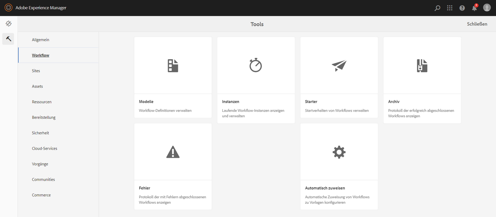
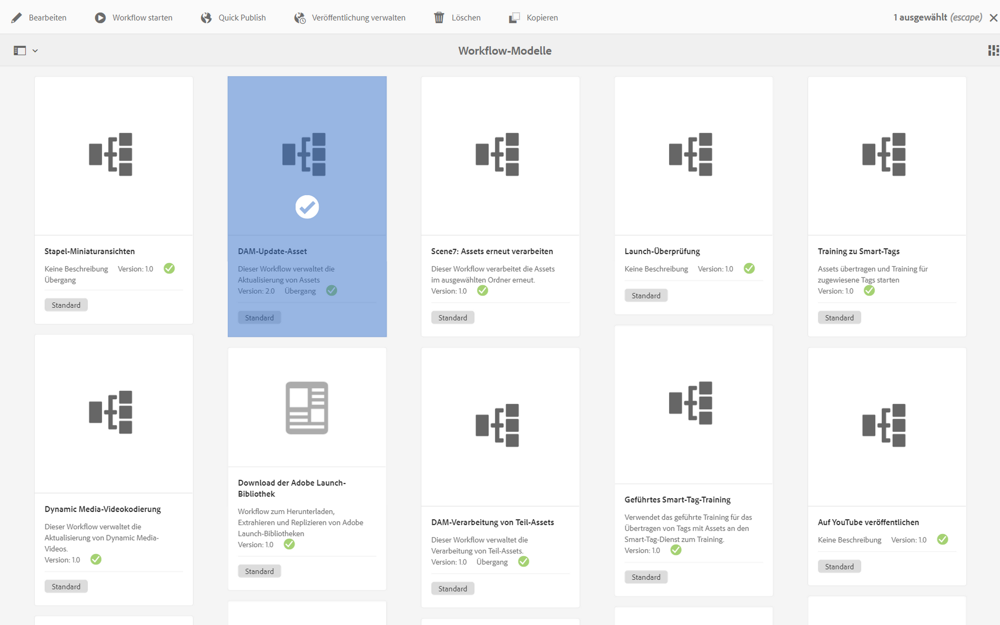
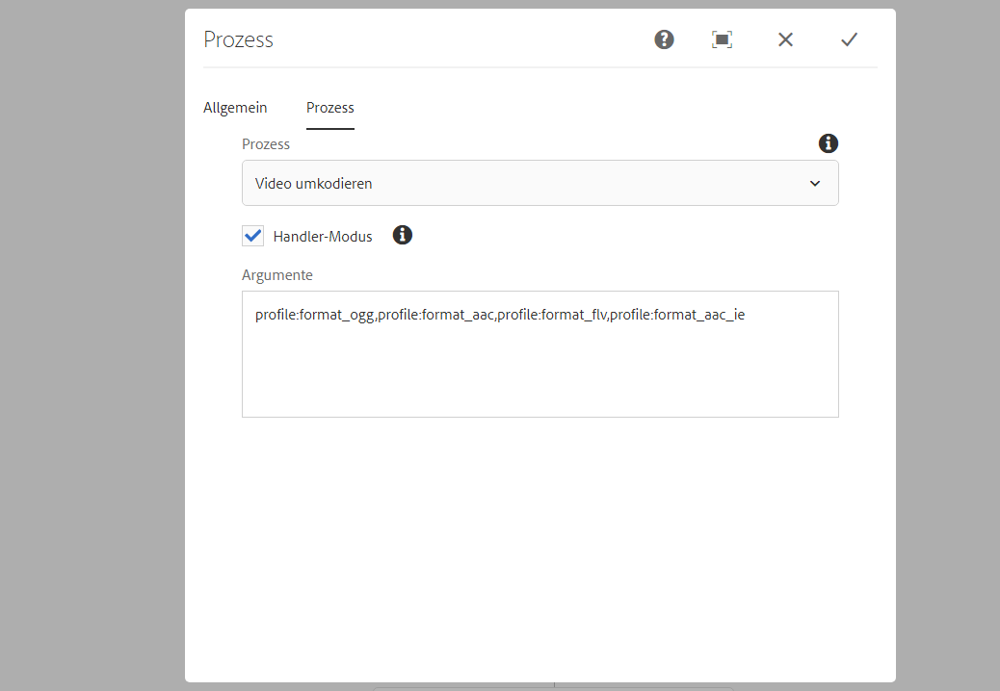
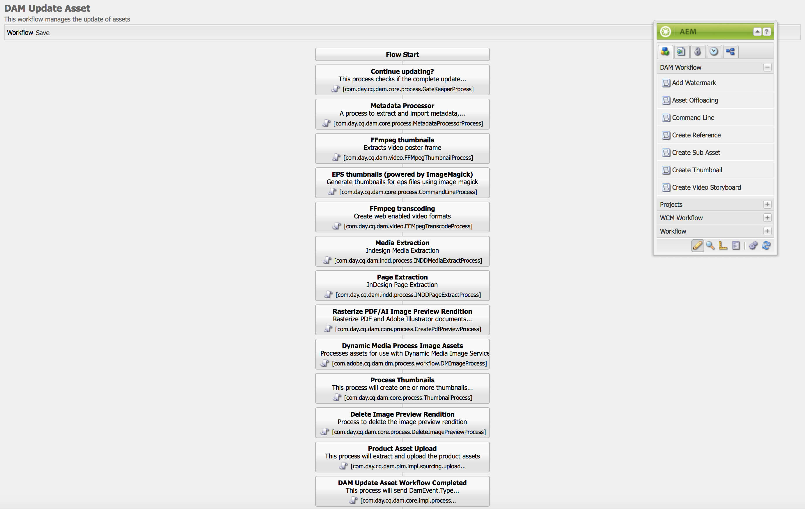
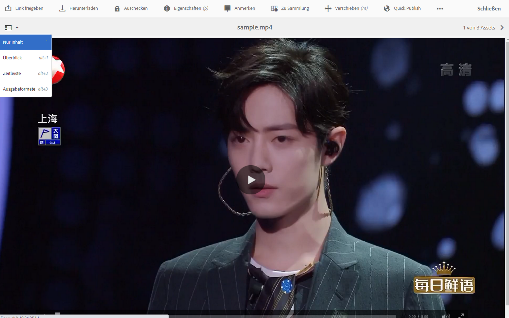
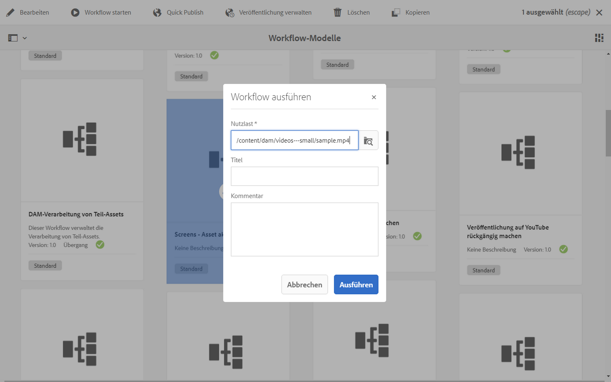
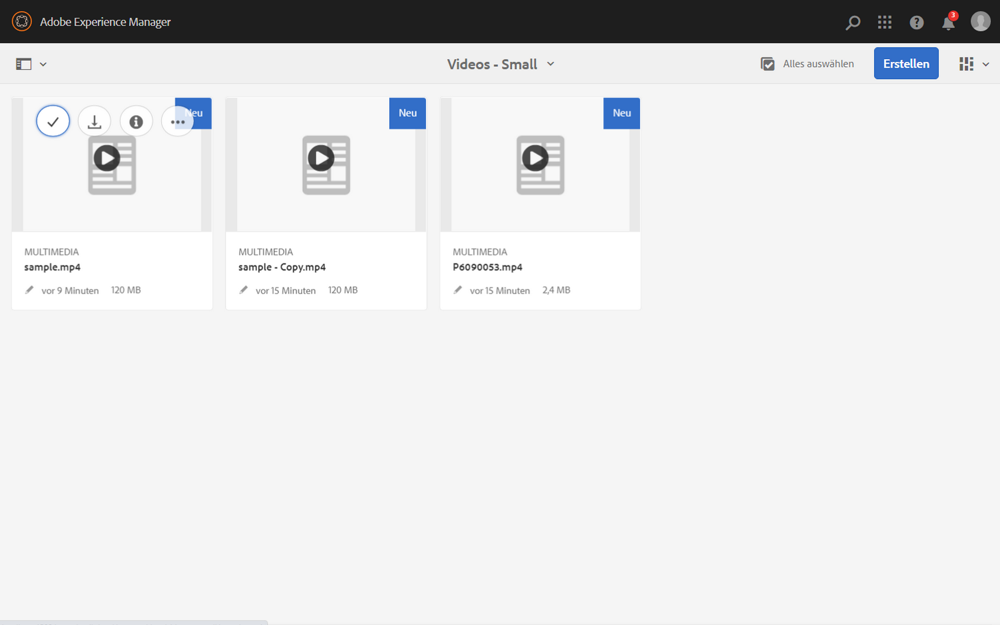

# Videoausgabedarstellungen {#video-renditions}

Es ist möglich, manuelle und automatische Full HD-Ausgabedarstellungen zu generieren. Im folgenden Abschnitt wird der Workflow zum Hinzufügen von Ausgabedarstellungen zu Assets beschrieben.

## Automatisches Generieren von Full HD-Ausgabeformaten {#automatically-generating-full-hd-renditions}

>[!NOTE]
>
>Falls die AEM Screens-Videoausgabedarstellungen auf Ihrem Gerät nicht optimal wiedergegeben werden, wenden Sie sich an den Hardware-Anbieter, um sich über die Spezifikationen für das Video zu informieren. Auf diese Weise erhalten Sie die beste Leistung auf dem Gerät. Sie können damit Ihr eigenes benutzerdefiniertes Videoprofil erstellen, in dem Sie die entsprechenden Parameter für FFMPEG zur Generierung Ihrer Ausgabedarstellung angeben. Gehen Sie dann wie folgt vor, um Ihr benutzerdefiniertes Videoprofil zur Profilliste hinzuzufügen.
>
>Weitere Informationen zur Fehlerbehebung bei der Wiedergabe von Videos in Ihrem Kanal finden Sie unter [Fehlerbehebung bei Videos](troubleshoot-videos.md).

Führen Sie die folgenden Schritte aus, um automatisch Full-HD-Ausgabedarstellungen zu generieren:

1. Klicken Sie auf den Adobe Experience Manager-Link (oben links) und dann auf das Hammersymbol, um auf **Workflow** klicken zu können.

   Klicken Sie auf **Modelle**.

   

1. Klicken Sie in der Workflow-Modellverwaltung auf das Modell **DAM-Update-Asset** und klicken Sie dann in der Aktionsleiste auf **Bearbeiten**.

   

1. Doppelklicken Sie im Fenster **DAM-Update-Asset** auf den Schritt **FFmpeg-Transkodierung**.

   

1. Klicken Sie auf die Registerkarte **Prozess**.
1. Geben Sie die vollständigen HD-Profile wie folgt in die Liste unter **Argumente** ein:
   ***`,profile:fullhd-bp,profile:fullhd-hp`***
1. Klicken Sie auf **OK**.

   

1. Klicken Sie oben links im Bildschirm **DAM-Update-Asset** auf **Speichern**.

   

1. Navigieren Sie zu **Assets** und laden Sie ein neues Video hoch. Klicken Sie auf das Video und öffnen Sie die Seitenleiste „Ausgabedarstellungen“. Beachten Sie die beiden Full HD-Videos.

   

1. Öffnen Sie über die Seitenleiste die Option **Wiedergaben**.

   

1. Sie werden zwei neue Full HD-Ausgabedarstellungen bemerken.

   

## Manuelles Generieren von Full HD-Wiedergaben {#manually-generating-full-hd-renditions}

Gehen Sie wie folgt vor, um manuell Full HD-Ausgabedarstellungen zu generieren:

1. Klicken Sie auf den Adobe Experience Manager-Link (oben links) und klicken Sie auf das Hammersymbol, um auf Tools und dann auf **Workflow** zu klicken.

   Klicken Sie auf **Modelle**.

   

1. Klicken Sie in der Workflow-Modellverwaltung auf das Modell **Screens – Asset aktualisieren** und klicken Sie dann auf **Workflow starten**, wodurch sich das Dialogfeld **Workflow ausführen** öffnet.

   

1. Klicken Sie auf das gewünschte Video in der **Payload** und dann auf **Ausführen**.

   

1. Navigieren Sie zu **Assets**, führen Sie einen Drilldown zum gewünschten Asset durch und klicken Sie darauf.

   

1. Öffnen Sie die Seitenleiste **Ausgabedarstellungen**. Beachten Sie die neuen Full HD-Ausgabedarstellungen.

   
